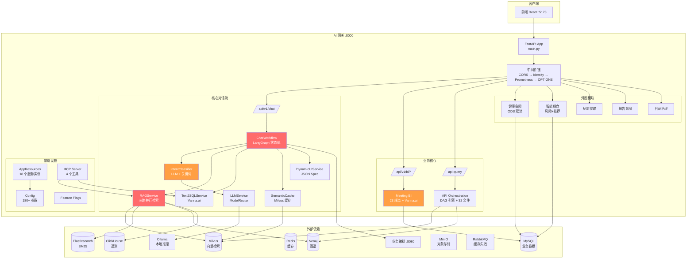
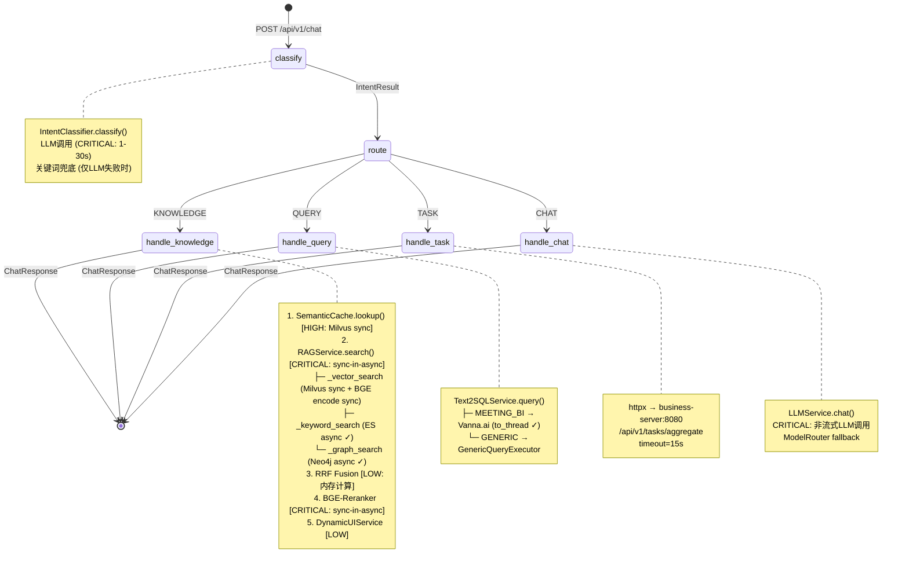
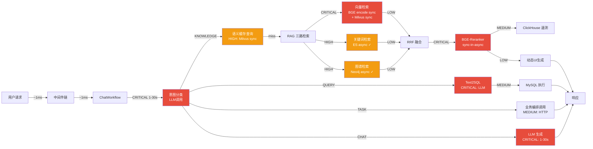
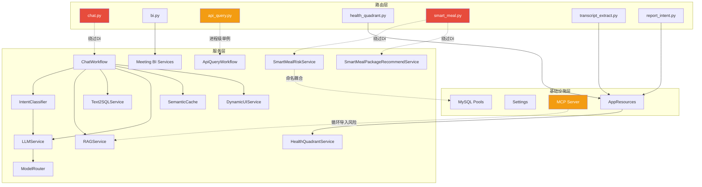

# AI 网关架构评审报告

> **评审范围**: `ai-gateway/` 全量 194 个 Python 文件  
> **评审日期**: 2026-04-28  
> **当前分支**: V2.0  
> **评审驱动**: AI 对话端到端执行效率问题（无 profiling 数据，基于静态分析）

---

## 1. 执行摘要

AI 网关基于 **FastAPI + LangChain 0.3 + LangGraph 0.2** 构建，承载 40+ API 端点，覆盖核心对话流、会议 BI、API 编排、健康象限、智能餐食等 6+ 业务域。整体架构设计合理，模块职责清晰，但存在 **系统性的 sync-in-async 阻塞问题**，这是当前性能瓶颈的根因。

### 整体评分

| 维度 | 评分 | 等级 |
|------|------|------|
| 性能 | **4/10** | 显著不足 |
| 可维护性 | 6/10 | 基本可用 |
| 可观测性 | 6/10 | 基本可用 |
| 可测试性 | 6/10 | 基本可用 |
| 可扩展性 | 6/10 | 基本可用 |
| 安全性 | **5/10** | 显著不足 |

### Top-5 最紧急改进项

| 优先级 | 问题 | 影响 | 复杂度 |
|--------|------|------|--------|
| **P0** | RAG 管线 sync-in-async 阻塞（embedding + reranker + Milvus） | 每个 knowledge 请求阻塞事件循环 200-700ms | 中 |
| **P0** | 意图分类 LLM 调用无缓存/快路径 | 每次请求强制 1-30s 串行等待 | 低 |
| **P0** | 配置安全隐患（密码明文 + CORS 全开放） | 生产安全风险 | 低 |
| **P1** | ChatWorkflow 绕过 AppResources DI（BGE-M3 模型可能加载 3 份） | 2-6GB 内存浪费 | 中 |
| **P1** | Meeting BI 20 个 sync def 端点阻塞线程池 | 并发场景线程池耗尽 | 中 |

---

## 2. 架构总览

### 2.1 整体架构图



### 2.2 核心对话流程图（ChatWorkflow 状态机）



### 2.3 请求全链路数据流（含延迟风险标注）



### 2.4 模块依赖图



> 红色 = 绕过 DI 体系（直接实例化），橙色 = 耦合风险

---

## 3. 模块分析

### 3.1 核心对话流（ChatWorkflow）

| 属性 | 值 |
|------|-----|
| 核心文件 | `chat_workflow.py`, `intent_classifier.py`, `rag_service.py`, `model_router.py` 等 18 个 |
| 架构模式 | LangGraph 状态机：classify → {knowledge\|query\|task\|chat} → END |
| 关键发现 | **5 处 CRITICAL sync-in-async 阻塞**；意图分类无缓存；DI 绕过导致模型多次加载 |

**关键问题**:
1. `rag_service.py:124` — `embedder.encode()` 同步调用，阻塞事件循环 50-200ms
2. `rag_service.py:279` — `reranker.compute_score()` 同步调用，阻塞 100-500ms
3. `rag_service.py:126` — `collection.search()` PyMilvus 同步 API，阻塞网络 I/O
4. `semantic_cache.py:115` — 同上，embedding 同步调用
5. `chat.py:12` — 模块级 `ChatWorkflow()` 绕过 AppResources，BGE-M3 可能加载 3 份（RAG + SemanticCache + AppResources 各一份）
6. 三路"并行"检索（`asyncio.gather`）中 vector 路径实际为同步，**真实情况是串行执行**

### 3.2 会议 BI

| 属性 | 值 |
|------|-----|
| 核心文件 | `app/bi/meeting_bi/` 全部（12 个），`app/api/routes/bi.py` |
| 架构模式 | 垂直切片：ai/db/services/schemas 四层 |
| 关键发现 | 20 个 sync def 端点阻塞线程池；SQL 超时参数语义错误；三套 MySQL 连接池共存 |

**关键问题**:
1. `bi.py` 全部 GET 路由为 `sync def`，占用线程池线程（默认 40 线程），与 Vanna LLM 竞争
2. `query_executor.py:164` — `timeout=settings.meeting_bi_max_rows or 30`，将"最大行数"误用为"超时秒数"
3. `query_executor.py:27` — 跨模块引用私有方法 `GenericQueryExecutor._sanitize_sql()`
4. `chart_store.py:34` — 每次调用创建新 Redis 连接，未复用连接池
5. `context_store.py:38` — 每次操作 O(n) 全量扫描过期会话

### 3.3 API 编排

| 属性 | 值 |
|------|-----|
| 核心文件 | `api_query_workflow.py`（2276 行）、`api_query_execution_graph.py`（1327 行）、`api_catalog/`（30 文件） |
| 架构模式 | LangGraph 8 节点工作流 + 动态 DAG 内层执行图 |
| 关键发现 | 架构成熟度最高；双层超时保护；状态分层设计清晰 |

**亮点**: DAG 引擎具备步骤级 + 图级双层超时保护（`api_query_execution_graph.py:218,776`），合成失败结果不崩穿整图，白名单验证 + 环检测 + 绑定语法校验。API Catalog 30 文件按功能域清晰分组，不构成过度拆分。

**问题**: `api_query.py:64-73` 进程级单例与 FastAPI lifespan 脱耦；`api_query_state.py:173` user_token 明文存储。

### 3.4 基础设施层

| 属性 | 值 |
|------|-----|
| 核心文件 | `main.py`, `app/core/`（7 个）, `app/mcp_server/`（3 个）, `tests/`（59 个） |
| 关键发现 | lifespan 全串行初始化；配置安全隐患；MCP 循环导入风险 |

**关键问题**:
1. `main.py:165-235` — Milvus/ES 验证 + 4 个 warmup 全串行，可用 `asyncio.gather` 节省 2-5s
2. `config.py:22` — ODS 密码硬编码默认值；11 个敏感字段均为普通 `str`（未用 `SecretStr`）
3. `main.py:346` — `CORS allow_origins=["*"]` 生产安全风险
4. `tools.py:29` — MCP `_get_rag_service()` 反向 import `app.main.app`，循环导入风险
5. `main.py:467` — Prometheus 标签使用原始 URL 路径，动态参数导致高基数指标爆炸

### 3.5 外围业务模块

| 属性 | 值 |
|------|-----|
| 核心文件 | 健康象限（6 个）、智能餐食（4 个）、纪要提取（2 个）、报告意图（2 个）等共 21 个 |
| 关键发现 | 与核心对话流完全解耦；智能餐食绕过 DI；`_normalize_text()` 重复 5 处 |

**关键问题**:
1. `smart_meal.py:26-27` — 模块级直接实例化，创建 4 个额外连接池，shutdown 时不被关闭
2. `_normalize_text()` 在 5 个文件中各自定义，返回类型不一致（`str | None` vs `str`）
3. `health_quadrant_treatment_repository.py:12` — 表名 `function_medicine_ai_mapping_copy1` 含 copy1 后缀
4. `customer_profile_fixed_service.py:337-346` — 16 个分区接口串行调用，可改并发

**亮点**: 外围模块与核心对话流零耦合（Grep 验证无交叉引用），具备独立微服务拆分条件。健康象限全链路分阶段计时日志（30+ 处）是最佳可观测性实践。

---

## 4. 六维度评分

### 4.1 评分表

| 维度 | 评分 | 权重 | 核心理由 |
|------|------|------|---------|
| **性能** | **4/10** | 最高 | 5 处 CRITICAL sync-in-async 阻塞事件循环；意图分类无缓存（每请求 1-30s LLM）；三路"并行"检索实际串行；20 个 sync def 端点阻塞线程池；lifespan 全串行启动 |
| **可维护性** | **6/10** | 高 | LangGraph 状态机结构清晰；DI 模式良好但 3 处绕过；`api_query_workflow.py` 单文件 2276 行；`config.py` 199 行单类膨胀；`_normalize_text()` 5 处重复 |
| **安全性** | **5/10** | 高 | 11 个敏感字段无 SecretStr；CORS 全开放；MCP tools 无鉴权；ODS 密码硬编码默认值；SQL 注入防护到位（白名单 + 参数化）；JWT 验签可选（无 secret 时返回未验签 claims） |
| **可测试性** | **6/10** | 中 | 59 个测试文件约 160 个用例；服务层构造函数注入可 mock；但 MCP tools 零测试、cache_invalidation 零测试；`chat.py` 模块级硬实例化难以替换；无集成测试 |
| **可观测性** | **6/10** | 中 | Prometheus 双指标 + 双通道日志 + LangSmith 追踪；但无 OpenTelemetry 集成；高基数 endpoint 标签；核心对话流无 Prometheus 指标；纪要提取缺 trace_id 透传 |
| **可扩展性** | **6/10** | 中 | 外围模块完全解耦可独立部署；LangGraph 支持新意图节点扩展；但 AppResources 管理 18 个实例趋向 God Object；config 单类膨胀限制分域配置 |

### 4.2 雷达图数据

```
性能:        4
可维护性:    6
安全性:      5
可测试性:    6
可观测性:    6
可扩展性:    6
```

---

## 5. 性能瓶颈深度分析

### 5.1 调用链延迟风险分级

以 KNOWLEDGE 意图（最复杂路径）为例：

| 步骤 | 风险等级 | I/O 类型 | 问题描述 | 文件:行号 |
|------|---------|---------|---------|----------|
| 1. 意图分类 | **CRITICAL** | LLM 推理 | 每请求必经，1-30s，无缓存/快路径 | `intent_classifier.py:105` |
| 2. 语义缓存查询 | **HIGH** | sync Milvus + sync BGE | embedding 同步阻塞 + Milvus 同步 API | `semantic_cache.py:115,138` |
| 3a. 向量检索 | **CRITICAL** | sync BGE + sync Milvus | embedding.encode 同步 + collection.search 同步，破坏 asyncio.gather 并行 | `rag_service.py:124,126` |
| 3b. 关键词检索 | **HIGH** | async ES | ES AsyncClient 正确异步 ✓ | `rag_service.py:145` |
| 3c. 图谱检索 | **HIGH** | async Neo4j | Neo4j AsyncDriver 正确异步 ✓ | `rag_service.py:175` |
| 4. RRF 融合 | LOW | 内存计算 | 纯 CPU，<1ms | `rag_service.py:202` |
| 5. BGE-Reranker | **CRITICAL** | sync CPU 推理 | compute_score 同步阻塞，100-500ms | `rag_service.py:279` |
| 6. ClickHouse 遥测 | MEDIUM | async DB 写入 | 在主路径上 await，正常写入增加延迟 | `rag_service.py:303` |
| 7. 动态 UI 生成 | LOW | 内存计算 | JSON Spec 构建 | `dynamic_ui_service.py:85` |

### 5.2 sync-in-async 反模式全景

这是当前性能问题的**根因**。以下同步调用直接在 async 函数中执行，阻塞 asyncio 事件循环：

| 位置 | 同步调用 | 阻塞时长 | 影响范围 |
|------|---------|---------|---------|
| `rag_service.py:124` | `embedder.encode([query])` | 50-200ms | 所有 KNOWLEDGE 请求 |
| `rag_service.py:126` | `collection.search()` | 100-500ms | 所有 KNOWLEDGE 请求 |
| `rag_service.py:279` | `reranker.compute_score(pairs)` | 100-500ms | 所有 KNOWLEDGE 请求 |
| `semantic_cache.py:115` | `embedder.encode([text])` | 50-200ms | 所有 KNOWLEDGE 请求（缓存开启时） |
| `semantic_cache.py:138` | `collection.search()` | 100-500ms | 所有 KNOWLEDGE 请求（缓存开启时） |

**正面参考**: `generic_query_executor.py:90` 正确使用了 `asyncio.to_thread(vn.ask, question)`。

**修复方案**: 统一使用 `asyncio.to_thread()` 包装所有同步 CPU/IO 调用：
```python
# Before (blocking)
results = embedder.encode([query])

# After (non-blocking)
results = await asyncio.to_thread(embedder.encode, [query])
```

### 5.3 连接池利用分析

当前系统存在 **连接池碎片化** 问题：

| 连接池 | 位置 | 最大连接数 | 管理方 |
|--------|------|-----------|--------|
| AppResources business_pool | `resources.py:80` | 配置化 | AppResources lifecycle ✓ |
| Meeting BI sync session | `session.py:11` | 30 | SQLAlchemy ✓ |
| Meeting BI async pool | `async_session.py:61` | 5 | aiomysql ✓ |
| Vanna 内部连接 | `vanna_client.py` 内部 | 不受控 | 无管理 ⚠ |
| HealthQuadrant ODS pool | `health_quadrant_mysql_pools.py:23` | 配置化 | AppResources lifecycle ✓ |
| SmartMeal ODS pool ×2 | `smart_meal_risk_service.py:82` | 3 each | **无管理** ⚠ |
| SmartMeal Business pool ×2 | 同上 | 3 each | **无管理** ⚠ |
| MCP Text2SQL pool | `tools.py:41` | 独立创建 | **无管理** ⚠ |

总计 **9+ 个独立连接池**，其中 5 个不在 AppResources 生命周期管理中。

---

## 6. 每维度 Top-3 改进建议

### 6.1 性能（当前 4/10）

| 优先级 | 建议 | 文件 | 复杂度 | 预期收益 |
|--------|------|------|--------|---------|
| **P0** | 用 `asyncio.to_thread()` 包装 RAG 管线所有同步调用（embedder.encode, collection.search, reranker.compute_score） | `rag_service.py:124,126,279`; `semantic_cache.py:115,138` | 低 | 解除事件循环阻塞，恢复真正并行检索，KNOWLEDGE 请求延迟降低 40-60% |
| **P0** | 意图分类增加关键词优先快路径 + 结果缓存（相似问题命中缓存时跳过 LLM） | `intent_classifier.py:73-130` | 中 | 高频/重复问题延迟从 1-30s 降至 <10ms |
| **P1** | Meeting BI 固定端点改为 async def + aiomysql | `bi.py` 全部 GET 路由; `services/*.py` | 中 | 释放线程池容量，消除与 Vanna LLM 的线程竞争 |

### 6.2 安全性（当前 5/10）

| 优先级 | 建议 | 文件 | 复杂度 | 预期收益 |
|--------|------|------|--------|---------|
| **P0** | 11 个敏感字段改用 `pydantic.SecretStr`，删除硬编码默认密码 | `config.py:20-23` 及全部 password/api_key 字段 | 低 | 防止密码泄漏到日志/repr |
| **P0** | CORS `allow_origins` 从 `["*"]` 改为白名单 | `main.py:346` | 低 | 消除跨域安全风险 |
| **P1** | MCP Server 增加鉴权中间件（至少 API Key 验证） | `mcp_server/server.py` | 中 | 防止未授权工具调用 |

### 6.3 可维护性（当前 6/10）

| 优先级 | 建议 | 文件 | 复杂度 | 预期收益 |
|--------|------|------|--------|---------|
| **P1** | 统一 DI 模式：`chat.py`、`smart_meal.py`、`api_query.py` 改为通过 AppResources 注入 | `chat.py:12`; `smart_meal.py:26-27`; `api_query.py:64-73` | 中 | 消除模型重复加载（节省 2-6GB 内存）、统一连接池生命周期 |
| **P1** | 提取 `_normalize_text()` 到 `app/utils/text_utils.py` | 5 个文件中的重复定义 | 低 | 消除重复代码，统一返回类型 |
| **P2** | 拆分 `config.py` 为分域配置类（CoreConfig, RAGConfig, MeetingBIConfig 等） | `config.py`（199 行，180+ 参数） | 中 | 降低配置复杂度，支持分模块加载 |

### 6.4 可测试性（当前 6/10）

| 优先级 | 建议 | 文件 | 复杂度 | 预期收益 |
|--------|------|------|--------|---------|
| **P1** | 补充 MCP tools 单元测试和 cache_invalidation 测试 | `tests/` | 中 | 覆盖当前零测试模块 |
| **P1** | 添加 lifespan 集成测试（验证完整启动/关闭流程） | `tests/` | 高 | 防止资源泄漏回归 |
| **P2** | 解耦 `chat.py` 模块级硬实例化，改为 FastAPI Depends 注入 | `chat.py:12` | 低 | 支持测试时替换 mock |

### 6.5 可观测性（当前 6/10）

| 优先级 | 建议 | 文件 | 复杂度 | 预期收益 |
|--------|------|------|--------|---------|
| **P1** | Prometheus endpoint 标签改用路由模板（`request.scope.get("route")`）替代原始 URL | `main.py:467` | 低 | 消除高基数指标爆炸 |
| **P1** | 核心对话流增加 Prometheus 指标（意图分类耗时、RAG 检索耗时、LLM 调用耗时） | `chat_workflow.py`, `rag_service.py` | 中 | 支持性能监控和告警 |
| **P2** | 集成 OpenTelemetry 分布式追踪（替代分散的 logger.warning） | 全局 | 高 | 端到端链路可视化 |

### 6.6 可扩展性（当前 6/10）

| 优先级 | 建议 | 文件 | 复杂度 | 预期收益 |
|--------|------|------|--------|---------|
| **P1** | lifespan 初始化改为 `asyncio.gather` 并行（Milvus/ES 验证并行、4 个 warmup 并行） | `main.py:165-235` | 低 | 启动时间减少 40-60% |
| **P2** | AppResources 引入注册式服务发现，替代显式 18 服务枚举 | `resources.py:31-166` | 高 | 降低新增服务的修改成本 |
| **P2** | 治疗知识库表名从 `copy1` 重命名为语义化名称 | `health_quadrant_treatment_repository.py:12` | 低 | 消除技术债务信号 |

---

## 7. 性能 Profiling 方案建议

当前性能分析基于静态代码审查。要精确定位瓶颈，建议按以下方案执行 profiling：

### 7.1 推荐工具

| 工具 | 用途 | 安装 |
|------|------|------|
| **py-spy** | CPU 采样分析，零侵入 | `pip install py-spy` |
| **OpenTelemetry** | 分布式链路追踪 | `pip install opentelemetry-api opentelemetry-sdk opentelemetry-instrumentation-fastapi` |
| **FastAPI middleware timing** | 请求级耗时分解 | 自定义中间件 |
| **asyncio debug mode** | 检测阻塞事件循环的调用 | `PYTHONASYNCIODEBUG=1` |

### 7.2 关键埋点位置

```python
# 1. 意图分类耗时
# intent_classifier.py:73 - classify() 入口
start = time.perf_counter()
result = await self.classify(message, context)
logger.info(f"intent_classify_ms={int((time.perf_counter()-start)*1000)}")

# 2. RAG 各阶段耗时
# rag_service.py:89 - search() 入口
# 分别记录: embedding, vector_search, keyword_search, graph_search, fusion, rerank

# 3. LLM 调用耗时
# model_router.py:84 - chat() 入口

# 4. 事件循环阻塞检测
# main.py 启动时
import asyncio
asyncio.get_event_loop().slow_callback_duration = 0.1  # 100ms 阈值
```

### 7.3 基准测试方案

```bash
# 1. 安装 locust
pip install locust

# 2. 创建 locustfile.py 覆盖四种意图
# - KNOWLEDGE: "公司的请假政策是什么？"
# - QUERY: "上个月的销售额是多少？"
# - TASK: "我的待办有哪些？"
# - CHAT: "你好"

# 3. 运行基准测试
locust -f locustfile.py --host=http://localhost:8000 \
  --users 10 --spawn-rate 2 --run-time 5m

# 4. 对比修复前后的 p50/p95/p99 延迟
```

### 7.4 优先验证项

1. **验证 sync-in-async 假设**: 用 `PYTHONASYNCIODEBUG=1` 启动，确认 `embedder.encode` 和 `reranker.compute_score` 是否触发 slow callback 警告
2. **验证三路并行假设**: 在 `rag_service.py:97` 前后打点，确认 `asyncio.gather` 的三路返回时间是否接近最慢路径（如果是串行，总时间 ≈ 三路之和）
3. **验证意图分类占比**: 记录 classify → 后续处理的耗时比例，确认意图分类是否占总延迟 50%+

---

## 8. 总结与下一步

### 8.1 架构优势

- **LangGraph 状态机** 设计使对话流清晰可扩展
- **API 编排 DAG 引擎** 架构成熟度高，双层超时 + 确定性验证
- **外围模块完全解耦**，具备微服务拆分条件
- **统一的 ModelRouter** 多后端容错路由
- **SQL 注入防护** 白名单 + 参数化到位

### 8.2 核心风险

- **性能**: sync-in-async 阻塞是系统性问题，影响所有 KNOWLEDGE 请求
- **安全**: 配置层敏感信息暴露风险，CORS/MCP 无防护
- **DI 一致性**: 3 处路由层绕过 AppResources，导致资源重复创建和泄漏

### 8.3 建议行动计划

| 阶段 | 时间框架 | 内容 |
|------|---------|------|
| **紧急修复** | 1 周内 | P0 项：sync-in-async 修复（`asyncio.to_thread`）、意图分类快路径、密码安全、CORS 白名单 |
| **短期优化** | 2-4 周 | P1 项：DI 统一、Meeting BI async 化、Prometheus 修复、连接池整合、核心指标埋点 |
| **中期改进** | 1-2 月 | P2 项：OpenTelemetry 集成、配置拆分、AppResources 重构、集成测试补充 |
| **持续监控** | 长期 | 性能基准测试自动化、Grafana 仪表盘、告警规则配置 |

---

> **评审方法**: 4 路并行静态代码分析（核心对话流/业务核心/基础设施/外围模块），基于共享评分 Rubric 集中校准评分。  
> **局限性**: 基于静态分析，延迟为风险分级而非实测数据。建议按第 7 节方案执行 profiling 验证。
