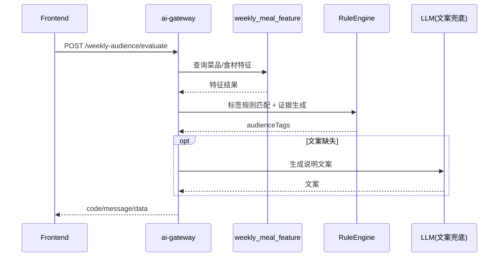
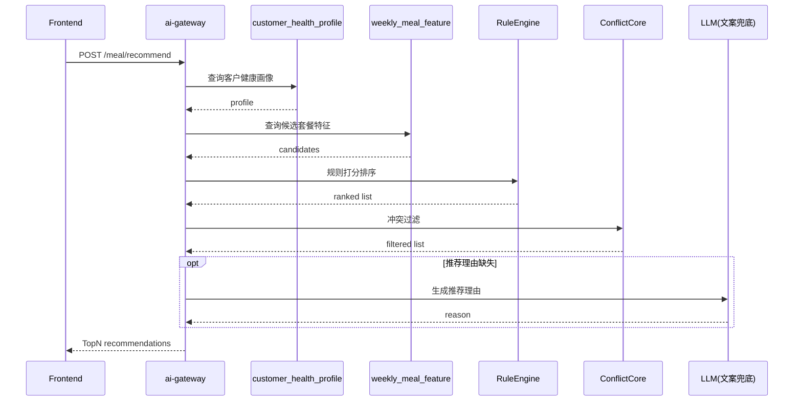
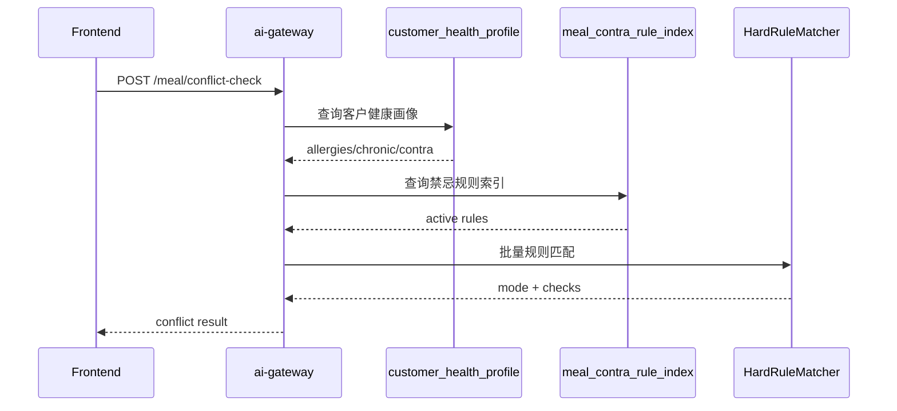

# 营养餐三接口技术方案（V1）

## 1. 目标与范围

### 1.1 目标
- 在 `ai-gateway` 提供 3 个统一协议接口，支撑：
  1. 按周餐食计算“适用人群标签”
  2. 基于客户画像与标签推荐营养餐（TopN）
  3. 校验营养餐是否与客户禁忌症冲突

### 1.2 范围
- 本文只覆盖：
  - request/response 契约
  - 数据流时序
  - 异常码与降级策略
- 不覆盖：
  - 新增物理表设计（当前已存在 `customer_health_profile`、`weekly_meal_feature`、`meal_contra_rule_index`）

### 1.3 设计原则
- 规则优先，LLM 仅兜底文案，不参与安全结论。
- 禁忌冲突判定严格硬规则。
- 统一响应壳：`code/message/data`。
- 客户身份只传 `customer_id`，不传身份证明文。

---

## 2. 统一接口约定

### 2.1 Base Path
- `/api/v1/nutrition`

### 2.2 Method
- 全部 `POST`

### 2.3 响应壳
```json
{
  "code": 0,
  "message": "ok",
  "data": {}
}
```

### 2.4 Header 约定
- `X-Trace-Id`：可选，链路追踪。
- `X-User-Id`：建议必传，用于审计日志。

### 2.5 术语约定
- `mealSlot`：`breakfast | lunch | dinner | snack`。
- `mode`（仅接口3）：`NORMAL | FAIL_CLOSED`。

---

## 3. 接口一：按周餐食计算适用人群

### 3.1 路由
- `POST /api/v1/nutrition/weekly-audience/evaluate`

### 3.2 Request 契约
```json
{
  "weekStartDate": "2026-03-16",
  "weekEndDate": "2026-03-22",
  "weekMeals": [
    {
      "date": "2026-03-16",
      "mealSlot": "lunch",
      "dishes": [
        {"dishId": "D1001", "dishName": "清蒸鳕鱼"},
        {"dishId": "D1002", "dishName": "黑米粥"}
      ]
    }
  ]
}
```

### 3.3 Response 契约
```json
{
  "code": 0,
  "message": "ok",
  "data": {
    "audienceTags": [
      {
        "tagCode": "sugar_control",
        "tagName": "控糖",
        "score": 0.93,
        "evidences": [
          {
            "ruleId": "R_SUGAR_001",
            "ruleName": "低GI主食组合",
            "hitType": "dish",
            "hitId": "D1002",
            "hitName": "黑米粥"
          }
        ]
      }
    ],
    "degraded": false
  }
}
```

### 3.4 规则要点
- 标签必须有证据链：`ruleId + 命中对象（菜品/食材）`。
- `score` 为规则聚合分，不由 LLM 产出。

---

## 4. 接口二：营养餐推荐（TopN）

### 4.1 路由
- `POST /api/v1/nutrition/meal/recommend`

### 4.2 Request 契约
```json
{
  "customerId": "C123456",
  "mealDate": "2026-03-20",
  "mealSlot": "dinner",
  "topN": 5,
  "customerTags": ["控糖", "低盐", "清淡"],
  "excludeMealIds": ["M0009"]
}
```

### 4.3 Response 契约
```json
{
  "code": 0,
  "message": "ok",
  "data": {
    "recommendations": [
      {
        "mealId": "M2001",
        "mealName": "心血管专研餐",
        "score": 92.4,
        "matchedTags": ["控糖", "低盐"],
        "recommendReason": "匹配控糖与低盐标签，适合晚餐场景",
        "reasonSource": "rule",
        "nutritionSnapshot": {
          "kcal": 650,
          "proteinG": 25,
          "carbG": 80,
          "fatG": 21
        }
      }
    ],
    "degraded": false
  }
}
```

### 4.4 规则要点
- 先匹配客户画像与标签，再对候选套餐打分排序。
- 进入返回前必须走冲突过滤（复用接口三核心规则引擎）。
- `recommendReason` 缺失时允许 LLM 兜底文案，`reasonSource=llm_fallback`。

---

## 5. 接口三：套餐禁忌冲突判定

### 5.1 路由
- `POST /api/v1/nutrition/meal/conflict-check`

### 5.2 Request 契约
```json
{
  "customerId": "C123456",
  "candidateMeals": [
    {"mealId": "M2001", "mealName": "心血管专研餐"},
    {"mealId": "M2002", "mealName": "控糖抗炎调养餐"}
  ]
}
```

### 5.3 Response 契约
```json
{
  "code": 0,
  "message": "ok",
  "data": {
    "customerId": "C123456",
    "mode": "NORMAL",
    "allSafe": false,
    "checks": [
      {
        "mealId": "M2002",
        "mealName": "控糖抗炎调养餐",
        "isConflict": true,
        "conflictLevel": "high",
        "conflicts": [
          {
            "ruleId": "R_ALLERGY_018",
            "ruleName": "甲壳类过敏禁用",
            "matchedTerm": "虾",
            "sourceField": "allergy_history"
          }
        ]
      }
    ]
  }
}
```

### 5.4 `mode` 定义（固定两值）
- `NORMAL`
  - 规则判定链路完整可用，结果可执行。
- `FAIL_CLOSED`
  - 关键依赖不可用，触发安全保护，从严拦截。
  - 不允许自动放行候选套餐。

---

## 6. 数据流时序

### 6.1 接口一时序


### 6.2 接口二时序


### 6.3 接口三时序


---

## 7. 异常码与降级策略

## 7.1 错误码
- 复用现有码段：
  - `1000` 请求参数错误
  - `1001` 参数校验失败
  - `1002` 资源不存在
  - `3002` LLM 调用失败
  - `7000` 外部系统调用失败
  - `7001` 外部系统调用超时
  - `1999` 系统内部错误
- 建议新增业务码（6xxx）：
  - `6001` `RULE_CONFIG_MISSING`
  - `6002` `NO_RECOMMENDATION`
  - `6003` `SAFETY_GUARD_TRIGGERED`
  - `6004` `PARTIAL_RESULT`

### 7.2 降级矩阵
- 接口一（可降级）
  - `weekly_meal_feature` 不可用：用请求体 `weekMeals` 最小规则计算，返回 `6004 + degraded=true`。
  - 无法最小计算：返回 `7001/7000`。
- 接口二（可降级）
  - `customer_health_profile` 缺失：降级为标签驱动推荐，返回 `6004`。
  - LLM 失败：只影响 `recommendReason`，主结果仍可返回 `code=0`。
  - 无安全可推荐：返回 `6002`。
- 接口三（不可放宽）
  - 任一关键依赖不可用：`mode=FAIL_CLOSED` 且 `code=6003`，默认不放行。

---

## 8. 可观测性与验收

### 8.1 可观测性
- 全链路日志必须带：`trace_id`、`customer_id`、`rule_id`、`mode`。
- 关键指标：
  - 每接口 P95/P99 延迟
  - `FAIL_CLOSED` 占比
  - 规则命中率与无推荐率

### 8.2 验收标准
- 接口三在依赖异常时必须进入 `FAIL_CLOSED`，不得默认放行。
- 接口一输出标签必须带命中证据。
- 接口二返回的 TopN 必须已经过冲突过滤。
- 所有返回结果可追溯到规则命中（至少含 `ruleId`）。

