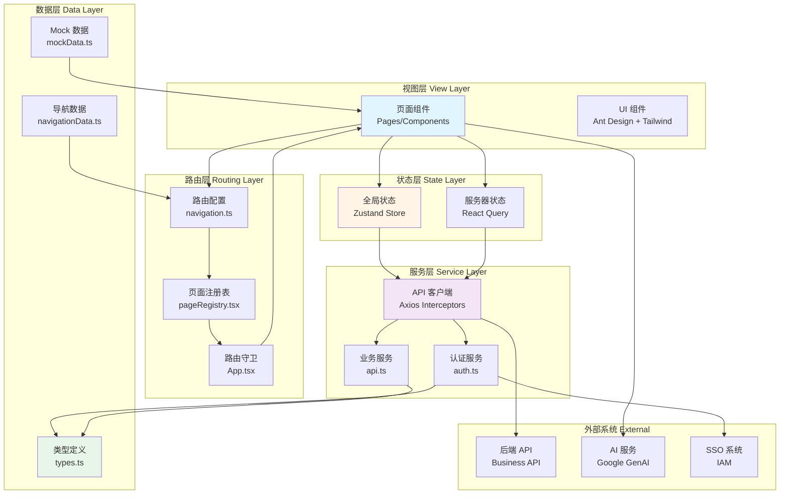
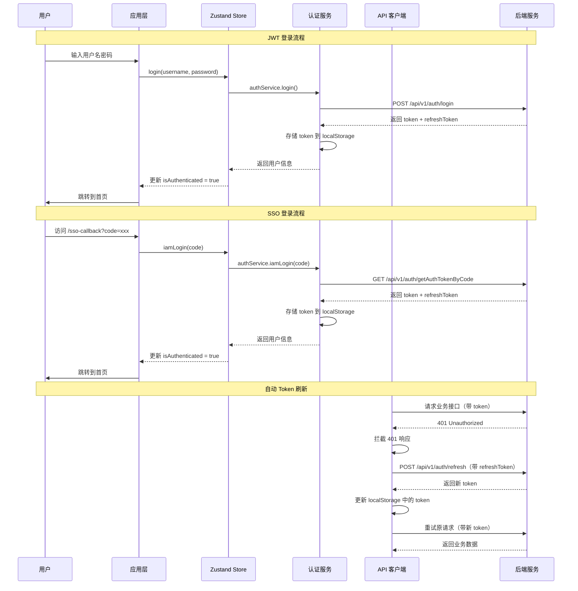

欢迎来到 **AI Business Platform（AI 业务平台）** 前端项目。本文档将为您提供一个全面的技术概览，帮助您快速理解项目的核心架构、技术选型和业务定位。这是一个面向健康管理行业的企业级 AI 业务平台，集成了多个智能工作台、数据分析和业务管理功能。

Sources: [package.json](package.json#L1-L5)

## 项目背景与定位

AI Business Platform 是一个现代化的企业级前端应用，专为健康管理行业的数字化转型而设计。平台通过 **AI 驱动的智能工作台**，将传统的医疗、顾问、护理等业务流程智能化，提升服务效率和客户体验。项目采用 **React 19 + TypeScript** 技术栈，基于 **Vite** 构建工具，实现了高性能、可维护的前端架构。

项目的核心价值在于：**统一的 AI 业务入口**、**类型安全的开发体验**、**模块化的功能设计**，以及**企业级的认证与权限管理**。无论是快速原型开发还是生产环境部署，该平台都提供了完整的技术解决方案。

Sources: [README.md](README.md#L1-L21), [package.json](package.json#L1-L5)

## 核心技术栈概览

项目采用了业界领先的前端技术栈，确保了开发效率、性能表现和可维护性。以下是核心技术组件的详细说明：

| 技术分类 | 技术选型 | 版本 | 用途说明 |
|---------|---------|------|---------|
| **核心框架** | React | 19.0.0 | 声明式 UI 框架，提供组件化开发能力 |
| **开发语言** | TypeScript | 5.8.2 | 类型安全的 JavaScript 超集，增强代码可维护性 |
| **构建工具** | Vite | 6.2.0 | 下一代前端构建工具，提供极速的开发体验 |
| **路由管理** | React Router DOM | 6.30.1 | 声明式路由库，支持懒加载和路由守卫 |
| **UI 组件库** | Ant Design | 6.3.4 | 企业级 UI 设计语言和 React 组件库 |
| **样式方案** | Tailwind CSS | 4.1.14 | 实用优先的 CSS 框架，支持暗色模式 |
| **状态管理** | Zustand | 4.5.0 | 轻量级状态管理库，简化全局状态操作 |
| **数据缓存** | React Query | 5.95.2 | 强大的数据同步和缓存工具 |
| **HTTP 客户端** | Axios | 1.7.0 | 基于 Promise 的 HTTP 客户端，支持拦截器 |
| **图表可视化** | ECharts | 6.0.0 | 功能强大的数据可视化图表库 |
| **AI 集成** | Google GenAI | 1.29.0 | Google 生成式 AI SDK，支持智能对话 |
| **图标库** | Lucide React | 0.546.0 | 精美的开源图标库，支持 Tree-shaking |

这套技术栈的选型遵循了 **"成熟稳定、生态丰富、性能优先"** 的原则。React 19 和 TypeScript 提供了强大的类型推断和开发体验；Vite 确保了毫秒级的热更新；Zustand 和 React Query 则简化了状态管理和数据流控制。

Sources: [package.json](package.json#L12-L48)

## 架构总览

项目采用了 **分层架构 + 模块化设计**，通过清晰的职责划分和依赖管理，实现了高内聚、低耦合的代码结构。以下架构图展示了各层的交互关系和数据流向：



**架构核心特点**：

1. **视图层**：采用 React 组件化开发，结合 Ant Design 和 Tailwind CSS 实现响应式 UI。所有页面组件通过懒加载（React.lazy）实现按需加载，优化首屏性能。

2. **路由层**：基于 `navigation.ts` 和 `pageRegistry.tsx` 实现类型安全的路由管理。路由配置与导航数据源统一管理，支持动态路由和路由守卫。

3. **状态层**：使用 Zustand 管理全局认证状态（token、用户信息），使用 React Query 管理服务器状态和数据缓存，实现客户端状态与服务器状态的分离。

4. **服务层**：Axios 客户端封装了自动 Token 注入、401 自动刷新和全局错误处理。认证服务支持 JWT 和 SSO（IAM）两种登录方式。

5. **数据层**：TypeScript 类型定义确保类型安全，Mock 数据支持本地开发，导航数据源统一管理页面元信息。

Sources: [src/main.tsx](src/main.tsx#L1-L23), [src/App.tsx](src/App.tsx#L1-L50), [src/navigation.ts](src/navigation.ts#L1-L68)

## 功能模块概览

平台集成了丰富的业务功能模块，覆盖健康管理行业的核心业务场景。以下是已实现和规划中的功能模块清单：

### 已实现的核心模块

| 模块名称 | 路由路径 | 功能描述 | 实现状态 |
|---------|---------|---------|---------|
| **AI 业务工作台** | `/` | 首页仪表盘，展示任务、风险、公告等综合信息 | ✅ 已实现 |
| **功能广场** | `/function-square` | AI 智能驾驶舱入口，展示所有功能模块 | ✅ 已实现 |
| **顾问 AI 工作台** | `/consultant-ai` | 顾问专属 AI 助手，支持客户管理和方案推荐 | ✅ 已实现 |
| **医疗 AI 工作台** | `/medical-ai` | 医生专属 AI 助手，支持诊断辅助和病历分析 | ✅ 已实现 |
| **护士 AI 工作台** | `/nurse-ai` | 护士专属 AI 助手，支持护理计划和执行跟踪 | ✅ 已实现 |
| **健康管家 AI** | `/health-butler` | 健康管家 AI 助手，支持健康管理和客户关怀 | ✅ 已实现 |
| **会议 BI 分析** | `/meeting-bi` | 会议数据可视化分析，支持经营决策 | ✅ 已实现 |
| **AI 辅助诊断** | `/ai-diagnosis` | 基于 AI 的辅助诊断功能 | ✅ 已实现 |
| **UI Builder** | `/ui-builder` | JSON 驱动的可视化页面构建器 | ✅ 已实现 |

### 规划中的功能模块

| 模块名称 | 路由路径 | 规划功能 | 实现状态 |
|---------|---------|---------|---------|
| **预约管理 AI** | `/appointment-ai` | 预约排班、到院状态跟踪与自动提醒 | 🚧 规划中 |
| **发药管理 AI** | `/dispensing-ai` | 发药流程、医嘱核对与药品发放记录 | 🚧 规划中 |
| **成交管理 AI** | `/deal-management` | 客户成交跟进、方案转化与阶段复盘 | 🚧 规划中 |
| **消耗管理 AI** | `/consumption-management` | 耗材消耗、库存联动与异常预警 | 🚧 规划中 |
| **客户云仓** | `/client-cloud` | 客户云仓库存、出入库记录与库存查询 | 🚧 规划中 |
| **数据门户** | `/data-portal` | 经营数据、客户数据与服务数据的统一门户 | 🚧 规划中 |
| **AI 辅助决策** | `/ai-decision` | 辅助决策、方案比对与风险提示 | 🚧 规划中 |
| **AI 辅助康复** | `/ai-rehab` | 康复计划生成、执行跟踪与阶段评估 | 🚧 规划中 |

这些模块的设计遵循了 **"业务场景驱动 + AI 赋能"** 的原则，每个模块都针对特定的业务角色和场景进行了优化。通过统一的导航系统和页面注册机制，新模块可以快速集成到平台中。

Sources: [src/data/navigationData.ts](src/data/navigationData.ts#L35-L133)

## 项目目录结构

以下是核心源码目录的结构说明，帮助您快速定位关键文件：

```
src/
├── main.tsx                 # 应用渲染入口
├── App.tsx                  # 应用主组件（路由守卫、认证逻辑）
├── navigation.ts            # 路由工具函数（路径映射、页面查询）
├── pageRegistry.tsx         # 页面注册表（懒加载映射）
├── types.ts                 # 全局类型定义
├── constants.ts             # 常量配置
│
├── components/              # 业务组件目录
│   ├── DashboardView.tsx       # 首页仪表盘
│   ├── FunctionSquareView.tsx  # 功能广场
│   ├── MedicalAIWorkbench.tsx  # 医疗 AI 工作台
│   ├── ConsultantAIWorkbench.tsx # 顾问 AI 工作台
│   ├── NurseAIWorkbench.tsx    # 护士 AI 工作台
│   ├── HealthButlerView.tsx    # 健康管家 AI
│   ├── MeetingBiView.tsx       # 会议 BI 分析
│   ├── AIDiagnosisView.tsx     # AI 辅助诊断
│   ├── Sidebar.tsx             # 侧边栏导航
│   ├── Header.tsx              # 顶部导航栏
│   └── Modals.tsx              # 模态框组件
│
├── pages/                   # 页面目录
│   ├── SsoCallback.tsx         # SSO 回调页面
│   └── ui-builder/             # UI Builder 页面
│
├── services/                # 服务层
│   ├── api.ts                  # Axios 客户端封装
│   └── auth.ts                 # 认证服务
│
├── stores/                  # 状态管理
│   └── useAppStore.ts          # 全局状态仓库（Zustand）
│
├── data/                    # 数据源
│   ├── mockData.ts             # Mock 数据
│   └── navigationData.ts       # 导航配置数据源
│
└── lib/                     # 工具库
    └── exportUtils.ts          # 导出工具函数
```

**目录设计原则**：

- **按职责分层**：components（视图）、services（服务）、stores（状态）、data（数据）各司其职
- **功能模块化**：每个 AI 工作台都是独立的组件，便于维护和扩展
- **类型集中管理**：`types.ts` 集中定义所有业务类型，确保类型安全
- **配置与代码分离**：导航配置、常量配置独立管理，便于调整

Sources: [src/navigation.ts](src/navigation.ts#L1-L68), [src/pageRegistry.tsx](src/pageRegistry.tsx#L1-L50)

## 认证与权限架构

平台实现了企业级的认证与权限管理体系，支持 **JWT 认证** 和 **SSO 单点登录** 两种方式，并具备自动 Token 刷新机制。



**认证机制核心特点**：

1. **双 Token 机制**：使用 `token`（访问令牌）和 `refreshToken`（刷新令牌）分离，提升安全性
2. **自动刷新**：Axios 拦截器自动捕获 401 响应，使用 refreshToken 获取新 token，并重试原请求
3. **会话恢复**：应用启动时自动检查 token 有效性，通过 `/api/v1/auth/info` 恢复用户信息
4. **全局登出**：Token 失效时通过全局事件 `auth:logout` 通知所有组件，统一清理状态

Sources: [src/stores/useAppStore.ts](src/stores/useAppStore.ts#L1-L76), [src/services/auth.ts](src/services/auth.ts#L1-L80), [src/services/api.ts](src/services/api.ts#L1-L122)

## 快速开始指南

作为初级开发者，建议您按照以下路径逐步深入了解项目：

### 1. 环境配置与运行
首先阅读 **[环境配置与本地运行](2-huan-jing-pei-zhi-yu-ben-di-yun-xing)**，了解如何安装依赖、配置环境变量和启动开发服务器。这是上手项目的第一步。

### 2. 项目结构导航
接着阅读 **[项目结构导航](3-xiang-mu-jie-gou-dao-hang)**，深入理解目录组织方式和各模块的职责划分，帮助您快速定位代码。

### 3. 技术栈深入
然后阅读 **[技术栈与核心依赖](4-ji-zhu-zhan-yu-he-xin-yi-lai)**，了解每个技术选型的原因和使用方式，建立完整的技术认知。

### 4. 架构深度解析
掌握基础后，进入 **架构深度解析** 章节，依次学习：
- **[JWT 认证与会话恢复机制](5-jwt-ren-zheng-yu-hui-hua-hui-fu-ji-zhi)**：理解认证流程
- **[类型安全的路由架构](8-lei-xing-an-quan-de-lu-you-jia-gou)**：掌握路由设计
- **[Axios 客户端封装与拦截器](11-axios-ke-hu-duan-feng-zhuang-yu-lan-jie-qi)**：学习 API 层设计

### 5. 业务模块开发
最后进入 **核心业务模块** 章节，选择感兴趣的模块进行深入学习，例如：
- **[医疗 AI 工作台](14-yi-liao-ai-gong-zuo-tai)**：了解 AI 工作台的实现模式
- **[会议 BI 分析系统](21-hui-yi-bi-fen-xi-xi-tong)**：学习数据可视化和图表集成

**学习建议**：建议先运行项目，观察实际效果，再对照文档阅读源码。每个页面都有完整的代码引用，帮助您快速定位关键实现。

Sources: [README.md](README.md#L11-L21), [package.json](package.json#L6-L11)

## 下一步行动

现在您已经对 AI Business Platform 有了全面的了解。接下来，请按照以下步骤开始您的开发之旅：

1. **克隆项目**：从代码仓库克隆项目到本地
2. **安装依赖**：运行 `npm install` 安装所有依赖包
3. **配置环境**：参考 `.env.example` 配置必要的环境变量
4. **启动开发服务器**：运行 `npm run dev` 启动本地开发环境
5. **访问应用**：在浏览器中打开 `http://localhost:3000` 查看效果

如果您在配置过程中遇到问题，请参考 **[环境配置与本地运行](2-huan-jing-pei-zhi-yu-ben-di-yun-xing)** 获取详细的故障排查指南。

**祝您学习愉快！** 🚀