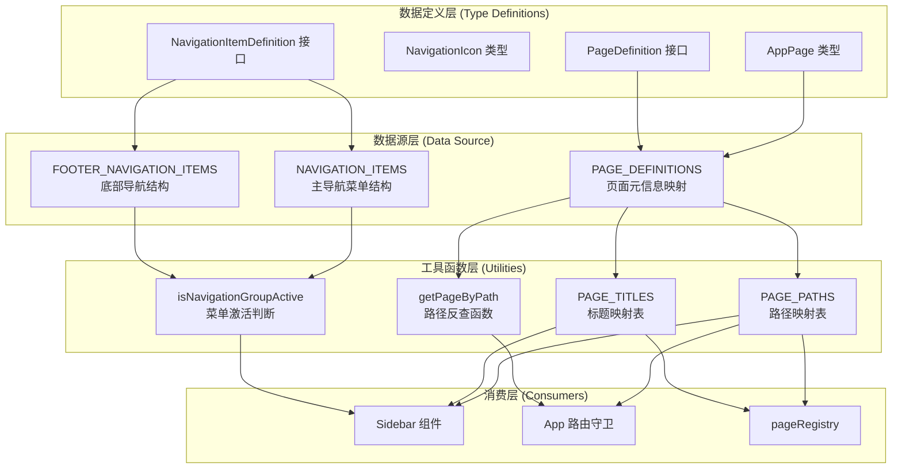

动态导航数据源是整个路由与导航系统的**中央配置枢纽**，采用**单一数据源** 原则统一管理所有页面元信息、菜单结构与占位文案。该模块将页面路径、标题、实现状态、图标映射等配置集中化，使路由层、侧边栏组件、页面注册表共享同一份配置数据，避免配置分散导致的维护负担与同步错误。

## 核心架构设计

动态导航数据源的架构遵循**配置与逻辑分离**原则，通过三层结构实现导航管理的解耦与复用：**数据定义层**提供类型安全的配置接口，**数据源层**集中存储页面与菜单的实际配置，**工具函数层**基于数据源派生查询方法与计算属性。这种设计使得新增页面时只需修改数据源配置，路由、菜单、面包屑等功能自动同步更新。



Sources: [navigationData.ts](src/data/navigationData.ts#L1-L190), [navigation.ts](src/navigation.ts#L1-L68)

## 数据结构详解

### 页面标识类型系统

导航数据源使用 TypeScript 类型系统确保配置的类型安全。**AppPage 联合类型**枚举了所有合法的页面标识符，任何引用页面的代码都必须使用这些预定义标识，编译器会在类型检查阶段拦截拼写错误或未定义页面的引用。这种设计将运行时错误前移至编译期，显著降低维护成本。

```typescript
export type AppPage =
  | 'login'           // 登录页
  | 'dashboard'       // 首页工作台
  | 'function-square' // 功能广场
  | 'consultant-ai'   // 顾问AI工作台
  | 'medical-ai'      // 医疗AI工作台
  // ... 更多页面标识
```

**PageDefinition 接口**定义了单个页面的完整元信息结构，包括路径、标题、实现状态与占位描述。`implemented` 字段用于区分已实现页面与规划中页面，`placeholderDescription` 为规划页面提供友好的占位文案，指导用户该页面未来的功能定位。

Sources: [navigationData.ts](src/data/navigationData.ts#L1-L50)

### 页面元信息映射表

**PAGE_DEFINITIONS** 是整个导航系统的核心数据源，以 Record 类型将页面标识符映射到完整的页面定义对象。每个页面条目包含路径、中文标题、实现状态与可选的占位描述，为路由生成、面包屑显示、占位页面渲染提供统一数据支撑。这种集中化配置使得新增页面只需添加一条记录，所有依赖该数据的模块自动获得新页面信息。

| 页面标识 | 路径 | 标题 | 实现状态 | 占位描述 |
|---------|------|------|---------|---------|
| dashboard | `/` | AI业务工作台 | ✅ 已实现 | - |
| consultant-ai | `/consultant-ai` | 我的AI工作台 | ✅ 已实现 | - |
| appointment-ai | `/appointment-ai` | 预约管理AI | ❌ 规划中 | 预约排班、到院状态跟踪与自动提醒 |
| ai-decision | `/ai-decision` | AI辅助决策 | ❌ 规划中 | 辅助决策、方案比对与风险提示 |

Sources: [navigationData.ts](src/data/navigationData.ts#L51-L132)

### 导航菜单树形结构

**NAVIGATION_ITEMS** 定义主导航栏的树形菜单结构，**NavigationItemDefinition** 接口支持嵌套的子菜单配置。`children` 字段为数组类型，包含子页面的标识符列表，侧边栏组件递归渲染时通过该字段构建多级菜单。`icon` 字段使用 **NavigationIcon** 类型约束图标名称，配合侧边栏的图标映射表转换为实际的 React 组件。

```typescript
export const NAVIGATION_ITEMS: NavigationItemDefinition[] = [
  {
    page: 'dashboard',
    label: '首页',
    icon: 'home',
  },
  {
    page: 'function-square',
    label: 'AI智能驾驶舱',
    icon: 'layout-dashboard',
    children: [
      'consultant-ai',
      'medical-ai',
      'nurse-ai',
      // ... 12个子页面
    ],
  },
  // ... 更多导航组
];
```

**FOOTER_NAVIGATION_ITEMS** 单独定义底部导航区域，结构与主导航相同但渲染位置不同。`badge` 字段支持显示未读计数徽章，例如通知公告页面显示待处理消息数量。这种分离设计使得导航布局更灵活，主菜单与辅助菜单可以独立配置与扩展。

Sources: [navigationData.ts](src/data/navigationData.ts#L133-L190)

## 工具函数与派生数据

### 路径与标题映射表

**navigation.ts** 模块从原始配置派生出多个便捷查询对象，避免消费者重复编写映射逻辑。**PAGE_PATHS** 通过 `Object.fromEntries` 将 PAGE_DEFINITIONS 转换为 `{页面标识: 路径}` 的映射表，使得导航跳转代码更简洁：`navigate(PAGE_PATHS['consultant-ai'])` 而非硬编码字符串 `/consultant-ai`。**PAGE_TITLES** 提供类似的标题映射，用于面包屑、页面标题、占位页面等场景。

```typescript
export const PAGE_PATHS = Object.fromEntries(
  Object.entries(PAGE_DEFINITIONS).map(([page, definition]) => 
    [page, definition.path]
  )
) as Record<keyof typeof PAGE_DEFINITIONS, string>;

// 使用示例
navigate(PAGE_PATHS['medical-ai']); // 类型安全的路径引用
```

**IMPLEMENTED_PAGES** 过滤出所有已实现页面的标识符数组，用于路由守卫判断或批量注册已实现路由。**PLACEHOLDER_PAGE_DESCRIPTIONS** 提取所有包含占位描述的页面映射，供占位页面组件按页面标识查询对应描述文案。这些派生数据通过纯函数计算生成，保证与原始配置的同步性。

Sources: [navigation.ts](src/navigation.ts#L19-L46)

### 路径反查与激活判断

**getPageByPath** 函数实现路径到页面标识的反向查询，内部构建 `Map<string, AppPage>` 数据结构以提供 O(1) 时间复杂度的查询性能。该函数在路由变化时被 App 组件调用，将当前 URL 路径转换为当前页面标识，用于侧边栏高亮、页面标题更新等场景。

```typescript
const PATH_TO_PAGE = new Map<string, keyof typeof PAGE_DEFINITIONS>(
  Object.entries(PAGE_DEFINITIONS).map(([page, definition]) => 
    [definition.path, page as keyof typeof PAGE_DEFINITIONS]
  )
);

export function getPageByPath(pathname: string): keyof typeof PAGE_DEFINITIONS | null {
  return PATH_TO_PAGE.get(pathname) ?? null;
}
```

**isNavigationGroupActive** 函数判断导航组是否应该显示激活状态，核心逻辑是检查当前页面是否等于导航组自身页面，或是否包含在导航组的 `children` 列表中。该函数处理树形菜单的激活态传播：当用户访问子页面时，父导航组自动高亮，提供清晰的导航位置反馈。

Sources: [navigation.ts](src/navigation.ts#L48-L68)

## 侧边栏集成实现

### 图标映射与组件渲染

**Sidebar 组件**消费导航数据源渲染左侧菜单，内部维护 **ICON_MAP** 将 NavigationIcon 类型字符串映射到 Lucide React 图标组件。这种间接映射设计解耦了配置层与视图层：导航配置使用语义化的图标名称（如 `'home'`），侧边栏负责将其转换为实际的 React 组件实例，便于未来更换图标库或支持动态图标加载。

```typescript
const ICON_MAP: Record<NavigationIcon, LucideIcon> = {
  home: Home,
  'layout-dashboard': LayoutDashboard,
  sparkles: Sparkles,
  search: Search,
  bell: Bell,
  settings: Settings,
};

// 渲染导航项时动态获取图标组件
const icon = item.icon ? ICON_MAP[item.icon] : undefined;
```

**renderNavigationItem** 函数递归处理导航树结构，检测 `children` 字段判断是否渲染子菜单。子菜单项通过 `PAGE_TITLES[childPage]` 获取显示标题，避免在导航配置中重复定义子项的 label。激活状态通过 `isNavigationGroupActive(currentPage, item.page)` 计算，当前页面匹配导航组自身或其任意子页面时返回 true。

Sources: [Sidebar.tsx](src/components/Sidebar.tsx#L26-L50), [Sidebar.tsx](src/components/Sidebar.tsx#L150-L185)

### 导航跳转与状态同步

侧边栏通过 **goToPage** 回调函数处理导航点击，内部调用 React Router 的 `navigate(PAGE_PATHS[page])` 实现页面跳转。该函数使用 `useCallback` 包装避免不必要的重渲染，依赖项仅包含 navigate 函数。这种设计将导航逻辑与 UI 渲染分离，侧边栏组件只需关心如何渲染菜单项，不需要了解路由的具体实现。

```typescript
const goToPage = React.useCallback((page: AppPage) => {
  navigate(PAGE_PATHS[page]);
}, [navigate]);

// 导航项点击处理器
<NavItem
  active={currentPage === item.page}
  onClick={() => goToPage(item.page)}
/>
```

**currentPage** 由 App 组件通过 `getPageByPath(location.pathname)` 计算得出，作为 props 传递给 Sidebar。当 URL 变化时，React Router 的 `useLocation` Hook 触发 App 组件重渲染，重新计算当前页面标识并传递给 Sidebar，Sidebar 根据新的 currentPage 更新菜单激活状态。这种单向数据流确保导航状态与路由的实时同步。

Sources: [Sidebar.tsx](src/components/Sidebar.tsx#L91-L94), [App.tsx](src/App.tsx#L90-L91)

## 页面注册表集成

### 已实现页面映射

**pageRegistry.tsx** 模块使用导航数据源的 `isImplementedPage` 函数判断页面是否应该加载真实组件，`PAGE_TITLES` 与 `PLACEHOLDER_PAGE_DESCRIPTIONS` 为未实现页面提供占位内容。**PAGE_RENDERERS** 映射表将已实现的页面标识符关联到具体的渲染函数，渲染函数返回懒加载的 React 组件实例，实现代码分割与按需加载。

```typescript
const PAGE_RENDERERS: Partial<Record<AppPage, PageRenderer>> = {
  dashboard: ({ dashboard }) => <DashboardView {...dashboard} />,
  'function-square': ({ navigateToPage }) => (
    <FunctionSquareView setCurrentPage={navigateToPage} />
  ),
  'medical-ai': () => <MedicalAIWorkbench />,
  // ... 更多已实现页面
};
```

**renderFallbackPage** 函数处理两种异常情况：页面未实现时渲染 PlaceholderPage 组件并显示占位描述，页面已实现但未注册渲染器时显示配置错误提示。这种容错设计确保即使配置遗漏也不会导致白屏，而是显示友好的占位界面或错误信息，引导开发者补充配置。

Sources: [pageRegistry.tsx](src/pageRegistry.tsx#L92-L118)

### 懒加载与代码分割

页面注册表使用 React 的 `lazy` 函数动态导入组件，配合 `Suspense` 组件显示加载中状态。**PageLoadingFallback** 组件提供骨架屏动画，在组件加载期间展示占位布局，提升用户感知性能。懒加载策略显著减少首屏 JavaScript 包体积，用户访问特定页面时才下载对应的组件代码。

```typescript
const DashboardView = lazy(async () => {
  const module = await import('./components/DashboardView');
  return { default: module.DashboardView };
});

// 渲染时包裹 Suspense
return (
  <Suspense fallback={<PageLoadingFallback />}>
    {renderer(context)}
  </Suspense>
);
```

这种架构将导航配置、路由映射、组件加载解耦为三个独立层次：导航数据源定义页面元信息，页面注册表定义页面到组件的映射，路由层定义 URL 到页面的映射。新增页面时依次修改三处配置即可完成集成，各层职责清晰，维护成本低。

Sources: [pageRegistry.tsx](src/pageRegistry.tsx#L23-L67), [pageRegistry.tsx](src/pageRegistry.tsx#L120-L128)

## 扩展与维护模式

### 新增页面流程

添加新页面到系统需要遵循标准化的配置流程，确保导航数据源、页面注册表、路由守卫三者的同步更新。首先在 **navigationData.ts** 的 `AppPage` 类型中添加新页面标识符，然后在 `PAGE_DEFINITIONS` 中添加页面元信息配置，包括路径、标题、实现状态与可选的占位描述。

```typescript
// 步骤1: 扩展 AppPage 类型
export type AppPage = 
  | 'existing-page'
  | 'new-feature'; // 新增标识符

// 步骤2: 添加页面定义
export const PAGE_DEFINITIONS: Record<AppPage, PageDefinition> = {
  // ... 现有页面
  'new-feature': {
    path: '/new-feature',
    title: '新功能页面',
    implemented: false,
    placeholderDescription: '这里将实现新功能的核心能力。',
  },
};
```

若页面需要出现在导航菜单中，在 `NAVIGATION_ITEMS` 或 `FOOTER_NAVIGATION_ITEMS` 中添加对应的 NavigationItemDefinition。页面实现后，在 **pageRegistry.tsx** 的 `PAGE_RENDERERS` 映射表中注册渲染函数，将页面标识符关联到懒加载的组件。整个流程无需修改工具函数或消费层代码，派生数据自动同步更新。

Sources: [navigationData.ts](src/data/navigationData.ts#L1-L20), [pageRegistry.tsx](src/pageRegistry.tsx#L92-L107)

### 配置验证与类型安全

TypeScript 编译器在构建阶段自动验证导航配置的类型正确性，例如 `PAGE_DEFINITIONS` 必须包含 `AppPage` 类型中所有标识符的定义，`NAVIGATION_ITEMS` 的 `children` 数组只能包含合法的页面标识符。这种编译期检查防止了配置遗漏与拼写错误，将潜在的运行时错误转化为构建失败。

```typescript
// 类型系统自动检测以下错误：
// 1. 页面标识符拼写错误
const page: AppPage = 'consultant-aii'; // ❌ 编译错误

// 2. PAGE_DEFINITIONS 缺少必需字段
PAGE_DEFINITIONS['new-page'] = {
  path: '/new-page',
  // ❌ 编译错误：缺少 title 和 implemented 字段
};

// 3. 导航配置引用未定义页面
NAVIGATION_ITEMS.push({
  page: 'undefined-page', // ❌ 编译错误
  label: '未定义页面',
});
```

**isKnownPath** 与 **isImplementedPage** 等工具函数提供运行时验证能力，路由守卫使用这些函数判断路径合法性并执行重定向。未知路径自动跳转到首页，未实现页面渲染占位组件，确保用户体验的连续性与友好性。这种多层验证机制构建了健壮的导航容错体系。

Sources: [navigation.ts](src/navigation.ts#L56-L68), [App.tsx](src/App.tsx#L100-L112)

## 相关文档推荐

- **[类型安全的路由架构](8-lei-xing-an-quan-de-lu-you-jia-gou)**：了解导航数据源如何与 React Router 集成，实现类型安全的路由跳转与守卫
- **[页面注册表与懒加载策略](9-ye-mian-zhu-ce-biao-yu-lan-jia-zai-ce-lue)**：深入理解页面标识符到 React 组件的映射机制与代码分割策略
- **[组件目录结构与命名约定](22-zu-jian-mu-lu-jie-gou-yu-ming-ming-yue-ding)**：掌握组件文件的标准化组织方式，便于导航配置引用