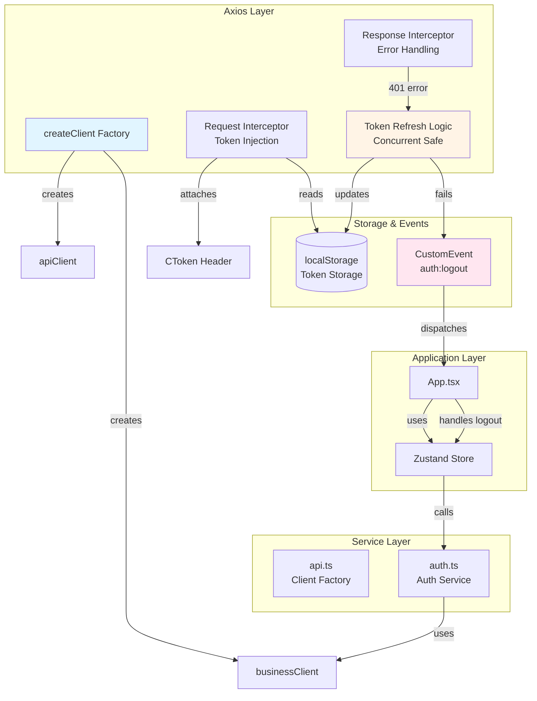
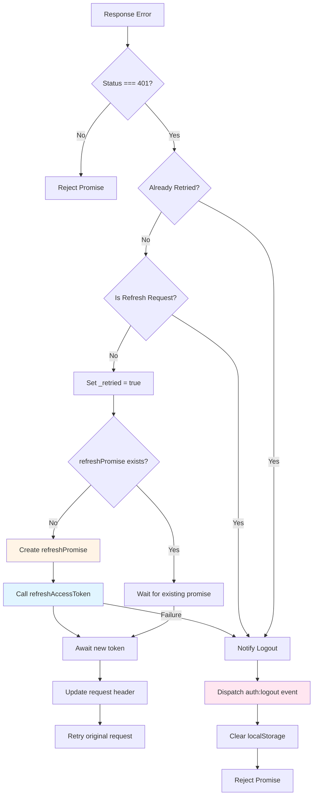

本项目采用了 **工厂模式 + 拦截器链** 的架构来封装 Axios 客户端,实现了统一的认证注入、自动 Token 刷新、错误处理和应用层解耦。该设计通过两个独立的客户端实例(`apiClient` 和 `businessClient`)分别处理 AI 网关请求和业务编排层请求,并在响应拦截器中实现了并发安全的 Token 刷新机制,通过自定义事件系统将认证失效通知解耦至应用层。整个接口层的设计遵循 **关注点分离** 原则,服务层不依赖 UI 组件,通过 `window.dispatchEvent` 广播认证状态变更,使架构具备良好的可测试性和可维护性。

## 架构设计概览

本系统的 Axios 封装采用了三层架构设计:**客户端工厂层** 负责创建配置化的 Axios 实例并注册拦截器链,**拦截器层** 实现请求注入、响应处理和 Token 刷新逻辑,**事件广播层** 将认证失效信号解耦传递至应用层。这种设计确保了接口层的独立性和可复用性,同时通过共享 Promise 机制避免了多个并发请求同时触发 Token 刷新的竞态条件。



Sources: [api.ts](src/services/api.ts#L1-L122), [auth.ts](src/services/auth.ts#L1-L109), [App.tsx](src/App.tsx#L92-L102)

## 客户端工厂模式

`createClient` 函数是整个接口层的核心工厂,它接收 `baseURL` 和可选的 `timeout` 参数,返回一个预配置的 Axios 实例。工厂函数内部创建了两个关键的拦截器:**请求拦截器** 负责在请求发出前从 localStorage 读取 Token 并注入到自定义请求头,**响应拦截器** 负责捕获 401 错误并触发自动刷新流程。这种工厂模式的优势在于可以为不同的业务域创建独立的客户端实例,每个实例拥有自己的超时配置和拦截器链,同时共享相同的 Token 管理逻辑。

工厂函数的实现采用了 **闭包捕获** 技术,将 `baseURL` 保存在闭包中供 Token 刷新逻辑使用,避免了全局变量的污染。创建的客户端实例配置了默认的 `Content-Type: application/json` 头,确保所有请求都遵循统一的数据格式。项目当前创建了两个客户端实例:`apiClient` 用于 AI 网关相关请求(30 秒超时),`businessClient` 用于业务编排层请求如登录、用户信息获取等(15 秒超时),这种分离策略使得不同业务域的超时策略可以独立调整。

| 客户端实例 | 用途 | 超时时间 | 环境变量 | 典型场景 |
|---------|------|---------|---------|---------|
| `apiClient` | AI 网关请求 | 30,000ms | `VITE_API_BASE_URL` | 顾问 AI 工作台、JSON 渲染器数据获取 |
| `businessClient` | 业务编排层请求 | 15,000ms | `VITE_BUSINESS_API_URL` | 登录认证、用户信息获取、UI Builder API |

Sources: [api.ts](src/services/api.ts#L65-L122), [.env.example](.env.example#L11-L17)

## 请求拦截器:Token 注入机制

请求拦截器通过 `attachToken` 函数实现,该函数在每个请求发出前被调用,其核心职责是从 localStorage 读取当前 Token 并注入到请求头中。项目采用了自定义请求头 `CToken` 而非标准的 `Authorization: Bearer` 格式,这是为了适配后端的认证中间件设计。同时注入的还有 `DeviceId: pc` 和 `X-User-Id: 2` 两个固定头部,用于标识设备类型和用户身份,这些头部信息在后端用于审计日志和权限校验。

拦截器的实现采用了 **防御性编程** 策略,首先检查 Token 是否存在,只有当 Token 有效时才进行头部注入,这种设计确保了未登录状态下的请求不会携带无效的认证信息。注入的 Token 来源是 `localStorage.getItem('ai_platform_token')`,该键名在登录成功后被设置,在 Token 刷新后被更新,在登出后被清除。整个 Token 生命周期管理完全由服务层控制,组件层无需关心 Token 的存储和注入细节,只需调用 `authService.login` 或 `authService.logout` 即可。

```typescript
// 请求拦截器核心逻辑
function attachToken(config: InternalAxiosRequestConfig) {
  const token = getToken(); // 从 localStorage 读取
  if (token) {
    config.headers.CToken = `${token}`;     // 自定义认证头
    config.headers.DeviceId = `pc`;         // 设备标识
    config.headers['X-User-Id'] = `2`;      // 用户标识
  }
  return config;
}

// 在客户端创建时注册拦截器
client.interceptors.request.use(attachToken);
```

Sources: [api.ts](src/services/api.ts#L30-L39), [api.ts](src/services/api.ts#L74)

## 响应拦截器:自动 Token 刷新与并发控制

响应拦截器是整个认证体系中最复杂的部分,它需要处理 **401 未授权错误**、**Token 刷新**、**请求重试** 和 **并发控制** 四个核心问题。当拦截器捕获到 401 错误时,首先检查原始请求是否已经重试过(通过 `_retried` 标志位),如果已重试则直接触发登出流程,避免无限循环。然后检查当前请求是否就是 Token 刷新请求本身(`/api/v1/auth/refreshAuthToken`),如果是则直接触发登出,因为刷新 Token 失败意味着用户需要重新登录。

并发控制通过模块级变量 `refreshPromise` 实现,这是一个精妙的设计:当第一个 401 错误触发 Token 刷新时,会创建一个 Promise 并赋值给 `refreshPromise`,后续所有捕获到 401 的请求都会等待这个共享的 Promise 完成而不是发起新的刷新请求。这确保了即使有 10 个并发请求同时返回 401,也只会触发一次 Token 刷新请求,避免了刷新接口的 DDoS 攻击。刷新成功后,所有等待的请求都会使用新 Token 重新发起,实现了 **无感知的 Token 续期** 体验。



Sources: [api.ts](src/services/api.ts#L75-L109)

## Token 刷新流程与存储策略

Token 刷新通过 `refreshAccessToken` 函数实现,该函数创建一个独立的 Axios 请求(不使用已配置的客户端,避免拦截器循环),调用 `/api/v1/auth/refresh` 接口并传入存储的 Refresh Token。请求成功后,新的 Token 会立即更新到 localStorage,覆盖旧的 Token,同时返回给调用方用于重试原始请求。这种设计确保了 Token 的 **原子性更新**,即使用户在刷新过程中发起新请求,也能获取到最新的 Token。

项目采用双 Token 机制:`ai_platform_token` 用于常规请求认证,`ai_platform_refresh_token` 用于刷新 Token。登录成功后,两个 Token 同时被存储到 localStorage,其中 Access Token 的有效期较短(通常几小时),Refresh Token 的有效期较长(通常几天或几周)。当 Access Token 过期时,前端通过 Refresh Token 自动获取新的 Access Token,用户无感知。如果 Refresh Token 也过期,则触发登出流程,用户需要重新登录。这种双 Token 机制在安全性和用户体验之间取得了平衡。

| Token 类型 | 存储键名 | 用途 | 有效期 | 刷新条件 |
|-----------|---------|------|--------|---------|
| Access Token | `ai_platform_token` | API 请求认证 | 短期(小时级) | 401 错误时自动刷新 |
| Refresh Token | `ai_platform_refresh_token` | 刷新 Access Token | 长期(天/周级) | 过期后需重新登录 |

Sources: [api.ts](src/services/api.ts#L8-L9), [api.ts](src/services/api.ts#L41-L61), [auth.ts](src/services/auth.ts#L42-L46)

## 全局事件系统:认证失效的解耦通信

当 Token 刷新失败或检测到需要强制登出的场景时,拦截器不会直接调用 `useAppStore.getState().logout()` 或操作 React 组件,而是通过 `window.dispatchEvent(new CustomEvent('auth:logout'))` 发送一个全局事件。这种设计的核心优势在于 **依赖倒置**:服务层(`api.ts`)不需要依赖应用层(App.tsx 或 Zustand Store),保持了模块的独立性和可测试性。应用层只需要在合适的生命周期(如 App 组件的 `useEffect`)中监听这个事件,并执行登出逻辑。

在 `App.tsx` 中,事件监听器在组件挂载时注册,在组件卸载时清理,符合 React 的副作用管理规范。监听器内部调用 `logout()` 方法清除 Zustand Store 中的认证状态,由于 `logout` 方法已经包含了清除 localStorage 的逻辑,因此事件处理函数本身非常简洁。这种 **发布-订阅模式** 使得未来扩展认证失效的处理逻辑变得容易,例如可以在其他组件中监听 `auth:logout` 事件来执行清理工作、埋点上报等,而无需修改服务层代码。

```typescript
// 服务层:发布认证失效事件
function notifyAuthLogout() {
  clearAuthStorage();
  window.dispatchEvent(new CustomEvent('auth:logout'));
}

// 应用层:订阅认证失效事件
useEffect(() => {
  const handleAuthLogout = () => {
    logout(); // 清除 Zustand 状态
  };
  
  window.addEventListener('auth:logout', handleAuthLogout);
  return () => {
    window.removeEventListener('auth:logout', handleAuthLogout);
  };
}, [logout]);
```

Sources: [api.ts](src/services/api.ts#L24-L28), [App.tsx](src/App.tsx#L92-L102)

## 客户端使用模式

在实际开发中,业务代码应该根据请求的业务域选择合适的客户端实例。对于认证相关(登录、登出、获取用户信息)、任务管理、审计日志等业务编排层接口,使用 `businessClient`;对于 AI 对话、健康分析、BI 数据等 AI 网关接口,使用 `apiClient`。两个客户端实例都已经在 `api.ts` 中创建并导出,业务代码直接导入使用即可,无需关心拦截器的实现细节。

典型的使用模式是:在服务层(如 `auth.ts`)或组件中导入客户端,调用对应的 HTTP 方法(`get`、`post`、`put`、`delete`),并使用 TypeScript 泛型指定响应数据的类型。由于拦截器已经处理了 Token 注入和错误重试,业务代码只需要关注业务逻辑本身。对于需要自定义配置的请求(如超时时间、请求头),可以传入 Axios 的配置对象作为第三个参数,这些配置会与客户端的默认配置合并。

```typescript
// ✅ 推荐用法:在服务层封装 API 调用
import { businessClient } from './api';

export const authService = {
  async login(username: string, password: string) {
    const response = await businessClient.post<LoginResponse>(
      '/api/v1/auth/login',
      { username, password }
    );
    // 登录成功后持久化 Token
    localStorage.setItem('ai_platform_token', response.data.token);
    return response.data;
  }
};

// ✅ 推荐用法:在组件中直接使用客户端
import { apiClient } from '@/services/api';

async function fetchAiData() {
  const response = await apiClient.get('/api/v1/consultant/reports');
  return response.data;
}

// ❌ 避免用法:不要创建新的 Axios 实例
const myClient = axios.create({ baseURL: '...' }); // 绕过了拦截器
```

Sources: [auth.ts](src/services/auth.ts#L35-L48), [registry.tsx](src/components/consultant-ai-workbench/json-render/registry.tsx#L38-L69), [api.ts](src/pages/ui-builder/api.ts#L1-L89)

## 环境配置与代理策略

客户端的 Base URL 通过环境变量配置,支持多环境部署。在 `.env` 文件中,`VITE_API_BASE_URL` 指定 AI 网关的基础 URL,`VITE_BUSINESS_API_URL` 指定业务编排层的基础 URL。如果业务 API 的环境变量为空,则使用相对路径,依赖 Vite 的开发服务器代理。`vite.config.ts` 中配置了两个代理规则:`/api/v1` 代理到业务编排层接口(认证、任务、审计等),`/api` 代理到 AI 网关其余接口(对话、健康、BI 等)。

`getBaseUrl` 工具函数处理了环境变量和代理的兼容性:如果环境变量存在且非空,直接使用环境变量的值;否则返回 `import.meta.env.BASE_URL`,这个值在开发环境是 `/`,在生产环境是 `/ai-platform/`(由 `vite.config.ts` 的 `base` 配置决定)。函数还会移除 URL 末尾的斜杠,确保 Base URL 的格式统一。这种设计使得同一套代码可以在开发环境(使用代理)、测试环境(使用相对路径)和生产环境(使用绝对 URL)之间无缝切换。

| 环境变量 | 开发环境默认值 | 生产环境示例 | 用途 |
|---------|--------------|------------|------|
| `VITE_API_BASE_URL` | `http://172.23.15.59:9080/ai-platform` | `https://api.example.com/ai-platform` | AI 网关接口 |
| `VITE_BUSINESS_API_URL` | `""` (使用代理) | `https://business.example.com` | 业务编排层接口 |
| `APP_URL` | `http://localhost:5173` | `https://app.example.com` | 应用部署 URL |

Sources: [api.ts](src/services/api.ts#L114-L121), [vite.config.ts](vite.config.ts#L8-L35), [.env.example](.env.example#L11-L17)

## 错误处理最佳实践

拦截器已经处理了 401 错误的自动刷新和重试,业务代码需要处理的是其他类型的错误(如 400 Bad Request、403 Forbidden、404 Not Found、500 Internal Server Error)。推荐的做法是在服务层封装 API 调用时,使用 `try-catch` 捕获错误,并根据 `error.response?.status` 或 `error.code` 进行分类处理。对于业务逻辑错误(如参数校验失败),可以抛出自定义错误或返回 `null`;对于网络错误或服务器错误,可以选择重试或提示用户。

由于 Axios 的错误对象包含了丰富的信息(`config`、`response`、`code` 等),建议在开发环境将错误信息记录到控制台,方便调试。在生产环境,可以将错误上报到监控系统(如 Sentry),并结合用户上下文(如当前页面、用户 ID)进行问题定位。对于需要向用户展示的错误,应该使用友好的提示文案而非技术术语,并尽可能提供解决方案或操作建议。

```typescript
// ✅ 推荐的错误处理模式
async function fetchData() {
  try {
    const response = await apiClient.get('/api/v1/data');
    return response.data;
  } catch (error) {
    if (axios.isAxiosError(error)) {
      if (error.response?.status === 403) {
        // 权限不足,提示用户
        message.error('您没有权限访问该资源');
        return null;
      }
      if (error.response?.status === 404) {
        // 资源不存在,返回默认值
        return [];
      }
      // 其他错误,记录日志并上报
      console.error('API Error:', error.config?.url, error.message);
      throw error; // 重新抛出,由调用方处理
    }
    throw error;
  }
}
```

Sources: [api.ts](src/services/api.ts#L75-L109)

## 扩展阅读与相关主题

本文档聚焦于 Axios 客户端的封装与拦截器实现,Token 自动刷新的详细机制请参考 [自动 Token 刷新机制](12-zi-dong-token-shua-xin-ji-zhi)。关于 API 请求如何通过 Vite 代理转发到后端服务,请参考 [API 代理配置](13-api-dai-li-pei-zhi)。Token 的生成、验证和会话恢复机制在 [JWT 认证与会话恢复机制](5-jwt-ren-zheng-yu-hui-hua-hui-fu-ji-zhi) 中有详细说明。认证状态如何通过 Zustand 管理并在组件间共享,请参考 [Zustand 全局状态管理](7-zustand-quan-ju-zhuang-tai-guan-li)。