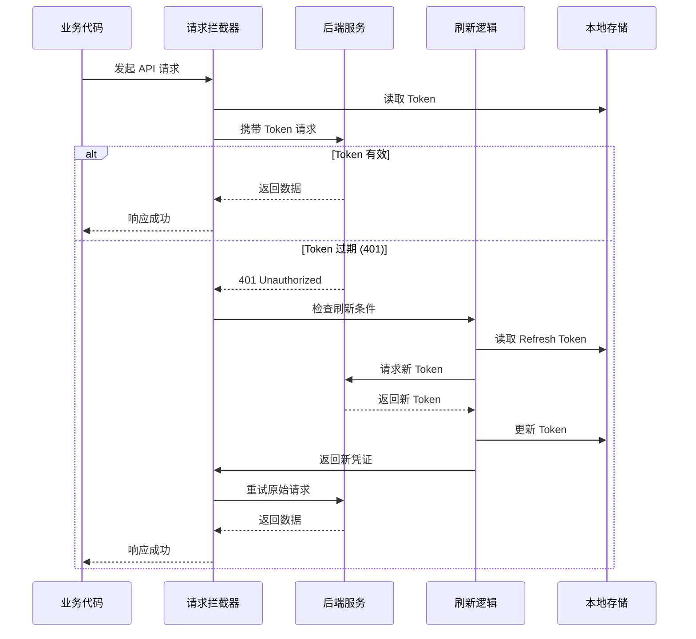

现代 Web 应用中，**JWT Token** 的过期与刷新是认证体系的关键挑战。本平台实现了基于 **Axios 拦截器**的自动刷新机制，在 Token 失效时自动获取新凭证并重试请求，对业务代码完全透明。该机制采用**单例 Promise 模式**避免并发刷新，通过**自定义事件**解耦服务层与应用层，确保在高并发场景下的稳定性和可维护性。

## 架构概览

自动 Token 刷新机制的核心在于**拦截器模式**与**状态管理**的结合。当任何 API 请求因 Token 过期返回 401 状态码时，系统会自动触发刷新流程，更新本地存储的凭证，然后重试原始请求。整个过程对调用方完全无感知，业务代码无需关心 Token 的生命周期管理。



上述流程展示了**完整的 Token 刷新生命周期**。关键设计点在于：请求拦截器自动注入 `CToken` 头，响应拦截器捕获 401 错误并触发刷新，刷新成功后使用新 Token 重试原始请求。整个机制封装在 `createClient` 工厂函数中，支持创建多个独立的 Axios 实例。

Sources: [api.ts](src/services/api.ts#L1-L122)

## 核心实现机制

### 请求拦截器：自动注入凭证

每个通过 `createClient` 创建的 Axios 实例都会注册请求拦截器，在请求发出前自动从 `localStorage` 读取 Token 并注入到请求头中。这种设计避免了在每个业务调用中手动传递认证信息的繁琐，确保了**认证逻辑的集中化管理**。

```typescript
function attachToken(config: InternalAxiosRequestConfig) {
  const token = getToken();
  if (token) {
    config.headers.CToken = `${token}`;
    config.headers.DeviceId = `pc`;
    config.headers['X-User-Id'] = `2`;
  }
  return config;
}

client.interceptors.request.use(attachToken);
```

拦截器不仅注入 `CToken`，还添加了 `DeviceId` 和 `X-User-Id` 等业务自定义头，这些信息用于后端的请求追踪和权限校验。通过**拦截器统一注入**，避免了业务代码的重复逻辑，也便于后续扩展（如添加签名、时间戳等）。

Sources: [api.ts](src/services/api.ts#L30-L74)

### 响应拦截器：401 处理与重试逻辑

响应拦截器是自动刷新机制的核心，它捕获所有 401 错误并判断是否可以刷新。关键判断包括：检查原始请求是否已重试过（`_retried` 标记），以及当前请求是否本身就是刷新 Token 的请求（避免无限循环）。

```typescript
client.interceptors.response.use(
  (response) => response,
  async (error: AxiosError) => {
    const originalRequest = error.config as
      | (InternalAxiosRequestConfig & { _retried?: boolean })
      | undefined;

    // 非 401 错误直接拒绝
    if (!originalRequest || error.response?.status !== 401) {
      return Promise.reject(error);
    }

    // 刷新请求本身失败或已重试过，触发登出
    if (originalRequest._retried || originalRequest.url?.includes('/api/v1/auth/refreshAuthToken')) {
      notifyAuthLogout();
      return Promise.reject(error);
    }

    // 标记为已重试，防止无限循环
    originalRequest._retried = true;

    // 执行刷新并重试
    try {
      const newToken = await refreshPromise;
      originalRequest.headers.CToken = `${newToken}`;
      return client(originalRequest);
    } catch {
      notifyAuthLogout();
      return Promise.reject(error);
    }
  },
);
```

这段代码展示了**多重防护机制**：首先过滤非 401 错误，然后通过 `_retried` 标记防止同一请求反复刷新，最后检查 URL 避免刷新请求本身触发刷新。只有通过所有检查的请求才会进入刷新流程，刷新成功后使用新 Token 重试原始请求。

Sources: [api.ts](src/services/api.ts#L75-L109)

### Token 刷新流程

刷新 Token 的核心逻辑在 `refreshAccessToken` 函数中实现，它使用 `axios` 原生实例（避免拦截器循环）调用后端的刷新接口，并将新 Token 存储到 `localStorage`。

```typescript
async function refreshAccessToken(baseURL: string) {
  const refreshToken = getRefreshToken();
  if (!refreshToken) {
    throw new Error('no refresh token');
  }

  const response = await axios.post<{ token: string; expiresIn: number }>(
    `${baseURL}/api/v1/auth/refresh`,
    null,
    {
      headers: {
        CToken: `${refreshToken}`,
        DeviceId: `pc`,
        'X-User-Id': `2`,
      },
    },
  );

  localStorage.setItem(TOKEN_KEY, response.data.token);
  return response.data.token;
}
```

注意这里使用 `axios.post` 而非 `client.post`，因为后者会触发拦截器，可能导致循环依赖。刷新请求使用 `refreshToken` 作为 `CToken`，这是后端设计的双 Token 机制：**Access Token 用于日常请求，Refresh Token 专门用于获取新的 Access Token**，两者分离提高了安全性。

Sources: [api.ts](src/services/api.ts#L41-L61)

## 并发控制策略

### 单例 Promise 模式

在高并发场景下，多个请求可能同时因 Token 过期返回 401，如果不加控制会触发多次刷新请求，既浪费资源又可能引发竞态条件。本系统通过**单例 Promise 模式**解决此问题：使用全局变量 `refreshPromise` 存储当前刷新操作的 Promise，所有并发请求共享同一个 Promise。

```typescript
let refreshPromise: Promise<string> | null = null;

// 在拦截器中
if (!refreshPromise) {
  refreshPromise = refreshAccessToken(baseURL).finally(() => {
    refreshPromise = null;
  });
}

const newToken = await refreshPromise;
```

这段代码的逻辑是：第一个触发刷新的请求创建 `refreshPromise` 并发起刷新请求，后续所有并发 401 请求检测到 `refreshPromise` 已存在，直接 `await` 同一个 Promise，等待刷新完成后一起重试。刷新完成（无论成功失败）后，`finally` 块将 `refreshPromise` 置为 `null`，为下次刷新做准备。

### 请求队列的隐式管理

不同于显式维护请求队列的方案，单例 Promise 模式通过 **JavaScript 事件循环**自然形成了请求队列。所有等待刷新的请求都会在 `await refreshPromise` 处暂停，刷新完成后自动继续执行，无需手动管理队列的添加、移除和触发逻辑。这种设计**简洁且高效**，代码量少，也降低了出错概率。

| 策略 | 实现复杂度 | 内存占用 | 并发控制 | 失败处理 |
|------|----------|---------|---------|---------|
| 单例 Promise | 低 | 极低 | 自动队列 | 统一失败 |
| 显式队列 | 中 | 中等 | 手动管理 | 需遍历清理 |
| 互斥锁 | 高 | 低 | 需超时处理 | 需手动释放 |

Sources: [api.ts](src/services/api.ts#L63-L109)

## 失败处理与事件机制

### 刷新失败的降级策略

当刷新 Token 失败时（如 Refresh Token 也过期），系统会触发**登出流程**，清除本地存储的所有认证信息，并通过自定义事件通知应用层。这种设计遵循了**关注点分离原则**：服务层不直接操作 UI（如跳转登录页），而是通过事件广播状态变化，由应用层决定如何响应。

```typescript
function notifyAuthLogout() {
  clearAuthStorage();
  window.dispatchEvent(new CustomEvent('auth:logout'));
}
```

`notifyAuthLogout` 函数在两个场景下被调用：刷新请求本身返回 401（说明 Refresh Token 也失效），或者刷新请求抛出异常（网络错误等）。清除本地存储后，通过 `window.dispatchEvent` 发送全局事件，任何监听该事件的组件都能收到通知。

### 应用层的统一监听

应用主组件 `App.tsx` 在挂载时注册 `auth:logout` 事件监听器，收到事件后调用 Zustand store 的 `logout` 方法，更新全局状态为未认证，触发重新渲染并跳转到登录页。

```typescript
useEffect(() => {
  const handleAuthLogout = () => {
    logout();
  };

  window.addEventListener('auth:logout', handleAuthLogout);
  return () => {
    window.removeEventListener('auth:logout', handleAuthLogout);
  };
}, [logout]);
```

这种**事件驱动架构**的优势在于解耦：服务层（`api.ts`）不需要依赖 React 或 Zustand，应用层也不需要在每个组件中重复处理认证失败逻辑。事件监听器在组件卸载时自动移除，避免内存泄漏。此外，这种设计也便于扩展：如果有多个模块需要响应登出事件，只需添加监听器即可，无需修改服务层代码。

Sources: [api.ts](src/services/api.ts#L24-L28), [App.tsx](src/App.tsx#L92-L102)

## 多客户端配置

### 工厂函数设计

平台提供了 `createClient` 工厂函数，支持创建多个配置独立的 Axios 实例。这种设计适应了微服务架构下**多后端并存**的场景：不同服务可能部署在不同域名，需要不同的超时配置，但共享相同的认证机制。

```typescript
export function createClient(baseURL: string, timeout = 15_000): AxiosInstance {
  const client = axios.create({
    baseURL,
    timeout,
    headers: {
      'Content-Type': 'application/json',
    },
  });

  client.interceptors.request.use(attachToken);
  client.interceptors.response.use(
    (response) => response,
    async (error: AxiosError) => { /* ... */ },
  );

  return client;
}
```

工厂函数内部创建了 Axios 实例，注册了请求和响应拦截器，并返回配置好的客户端。每个客户端有独立的 `baseURL` 和 `timeout`，但拦截器逻辑完全相同，确保了**认证行为的一致性**。

### 预配置客户端实例

平台预创建了两个客户端实例，分别用于不同的业务场景：

```typescript
export const apiClient = createClient(getBaseUrl(import.meta.env.VITE_API_BASE_URL), 30_000);
export const businessClient = createClient(getBaseUrl(import.meta.env.VITE_BUSINESS_API_URL), 15_000);
```

| 客户端 | 用途 | 超时时间 | 环境变量 |
|--------|------|---------|---------|
| apiClient | 核心业务接口 | 30 秒 | VITE_API_BASE_URL |
| businessClient | 认证与权限接口 | 15 秒 | VITE_BUSINESS_API_URL |

`getBaseUrl` 辅助函数处理环境变量的读取和路径标准化，确保即使环境变量未配置也能回退到默认值。这种设计让**多环境部署**变得简单：开发、测试、生产环境只需修改 `.env` 文件，无需改动代码。

Sources: [api.ts](src/services/api.ts#L65-L122)

## 认证服务的协作

### Token 生命周期管理

`auth.ts` 提供了 Token 的**高层抽象**，包括登录时存储 Token、登出时清理 Token、以及通过 JWT 解码验证 Token 有效性。这些方法与 `api.ts` 中的拦截器协同工作，形成完整的认证闭环。

```typescript
export const authService = {
  async login(username: string, password: string): Promise<LoginResponse> {
    const response = await businessClient.post<LoginResponse>('/api/v1/auth/login', {
      username,
      password,
    });

    const loginData = response.data;
    localStorage.setItem(TOKEN_KEY, loginData.token);
    if (loginData.refreshToken) {
      localStorage.setItem(REFRESH_TOKEN_KEY, loginData.refreshToken);
    }

    return loginData;
  },

  logout() {
    localStorage.removeItem(TOKEN_KEY);
    localStorage.removeItem(REFRESH_TOKEN_KEY);
  },

  isTokenValid() {
    const token = this.getToken();
    if (!token) return false;

    try {
      const decoded = jwtDecode<JwtPayload>(token);
      return decoded.exp * 1000 > Date.now();
    } catch {
      return false;
    }
  },
};
```

登录成功后，`authService.login` 将 `token` 和 `refreshToken` 存储到 `localStorage`，这些值随后被 `api.ts` 的拦截器读取并注入到请求头中。`isTokenValid` 方法通过 JWT 解码检查过期时间，用于应用启动时的会话恢复判断，避免使用已过期的 Token 发起无效请求。

Sources: [auth.ts](src/services/auth.ts#L34-L108)

### 会话恢复与状态同步

Zustand store 中的 `restoreSession` 方法在应用启动时调用，检查本地存储的 Token 是否有效，有效则通过 `/api/v1/auth/info` 接口获取最新的用户信息，确保内存状态与服务端一致。

```typescript
restoreSession: async () => {
  if (!authService.isTokenValid()) {
    authService.logout();
    set({ token: null, user: null, isAuthenticated: false });
    return;
  }

  try {
    const user = await authService.getMe();
    set({
      token: authService.getToken(),
      user,
      isAuthenticated: true,
    });
  } catch {
    authService.logout();
    set({ token: null, user: null, isAuthenticated: false });
  }
}
```

这段代码展示了**防御性编程**实践：首先检查 Token 有效性，避免发起注定失败的请求；然后通过 try-catch 捕获网络错误或认证失败，确保任何异常都能正确清理状态。会话恢复失败时，用户会被重定向到登录页，由 `App.tsx` 中的路由守卫逻辑处理。

Sources: [useAppStore.ts](src/stores/useAppStore.ts#L47-L75)

## 最佳实践与扩展建议

### 自定义 Header 的扩展

当前实现中，`attachToken` 拦截器硬编码了 `DeviceId` 和 `X-User-Id`。在生产环境中，建议将这些值改为动态获取，例如从 User Agent 解析设备信息，或从 JWT Token 中提取用户 ID，避免维护两处数据源。

```typescript
function attachToken(config: InternalAxiosRequestConfig) {
  const token = getToken();
  if (token) {
    config.headers.CToken = `${token}`;
    // 从 Token 中解析用户信息，而非硬编码
    const decoded = jwtDecode<JwtPayload>(token);
    config.headers['X-User-Id'] = decoded.sub;
  }
  return config;
}
```

### 刷新策略的优化

当前实现在每次 401 时都尝试刷新，如果后端能提供 Token 过期时间，可以**主动刷新**：在请求发出前检查 Token 是否即将过期（如剩余有效期少于 5 分钟），提前刷新避免 401 响应带来的延迟。这种策略能提升用户体验，但需要权衡刷新频率与安全性。

### 错误处理的增强

建议在 `notifyAuthLogout` 中添加错误日志上报，记录刷新失败的原因和时间，便于排查问题。同时可以考虑在事件中携带失败详情，让应用层能够展示更友好的错误提示，而非直接跳转登录页。

Sources: [api.ts](src/services/api.ts#L30-L39)

---

本平台的自动 Token 刷新机制通过**拦截器模式**和**单例 Promise**实现了对业务代码透明的认证续期，通过**自定义事件**解耦了服务层与应用层，是一套经过实践验证的高可用认证方案。建议结合 [Axios 客户端封装与拦截器](11-axios-ke-hu-duan-feng-zhuang-yu-lan-jie-qi) 和 [JWT 认证与会话恢复机制](5-jwt-ren-zheng-yu-hui-hua-hui-fu-ji-zhi) 章节深入理解完整的认证体系。