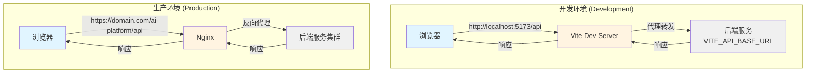

本文档详细阐述 AI Business Platform 前端项目中 API 代理的设计原理、配置策略和实现机制。代理配置是连接前端应用与后端服务的关键桥梁，通过环境感知的智能路由策略，实现开发环境零跨域请求、生产环境统一路径管理的架构目标。

## 架构设计原理

API 代理配置采用**环境双轨制**设计模式，在开发环境和生产环境采用截然不同的请求路由策略。开发环境利用 Vite Dev Server 的代理能力，将前端请求透明转发至后端服务，彻底规避浏览器的同源策略限制；生产环境则通过 Nginx 的 location 匹配和反向代理，实现静态资源与 API 请求的统一入口管理。这种设计确保了代码在两种环境下无需修改即可平滑运行，同时保持了部署架构的灵活性。



## Vite 代理配置详解

Vite 配置文件中的代理规则采用**路径前缀匹配**策略，通过两级代理规则实现对不同业务域的精准路由。`/api/v1` 前缀专门处理业务编排层接口（包括认证、任务管理、知识库、审计等核心业务），而 `/api` 前缀则覆盖 AI 网关的其他接口（如聊天、健康检查、BI 分析等）。这种分层设计使得后端可以根据业务特性独立部署和扩展，前端则通过统一的代理入口无感知地访问各类服务。

代理目标地址通过环境变量 `VITE_API_BASE_URL` 动态注入，配置系统提供了完善的降级机制：优先读取环境变量，若未配置则自动使用默认地址 `http://172.23.15.59:9080/ai-platform`。`changeOrigin: true` 配置项至关重要，它会在代理请求时将 HTTP 头中的 origin 字段修改为目标 URL 的 origin，确保后端服务能够正确识别请求来源，避免 CORS 预检失败。

```typescript
server: {
  hmr: process.env.DISABLE_HMR !== 'true',
  proxy: {
    // 业务编排层接口 => {
      target: apiUrl,
      changeOrigin: true,
    },
    // AI网关其余接口 => {
      target: apiUrl,
      changeOrigin: true,
    },
  },
}
```

Sources: [vite.config.ts](vite.config.ts#L22-L36)

## 环境变量配置策略

环境变量体系采用**分层配置**模式，通过三个关键变量实现对不同 API 端点的精细控制。`VITE_API_BASE_URL` 作为主配置项，定义 AI 网关和通用 API 的基础地址；`VITE_BUSINESS_API_URL` 专门指向业务编排层服务，在微服务架构下可实现业务逻辑与 AI 能力的独立部署；`GEMINI_API_KEY` 则用于 Google GenAI 集成，由 AI Studio 运行时自动注入。

| 环境变量 | 用途说明 | 开发环境示例 | 生产环境示例 |
|---------|---------|------------|------------|
| `VITE_API_BASE_URL` | AI 网关与通用 API 基础地址 | `http://172.23.15.59:9080/ai-platform` | `https://api.example.com/ai-platform` |
| `VITE_BUSINESS_API_URL` | 业务编排层 API 地址 | 可为空（走代理） | `https://business.example.com` |
| `GEMINI_API_KEY` | Google GenAI API 密钥 | `MY_GEMINI_API_KEY` | 由 AI Studio 自动注入 |

开发环境下的最佳实践是将 `VITE_BUSINESS_API_URL` 留空，让所有业务 API 请求通过 Vite 代理转发，这样可以充分利用代理的 hot reload 能力，在后端服务地址变更时无需重启开发服务器。生产环境则必须配置完整的绝对地址，因为 Vite 代理仅存在于开发服务器中，构建后的静态文件无法使用代理功能。

Sources: [.env.example](.env.example#L11-L17)

## API 客户端智能路由

API 服务层通过 `getBaseUrl` 函数实现了**环境自适应**的 baseURL 选择逻辑。该函数首先检查环境变量是否显式配置，若已配置则直接使用；否则降级至 Vite 的 `BASE_URL` 元数据（开发环境为 `/`，生产环境为 `/ai-platform/`）。这种设计确保了即使开发者未配置任何环境变量，应用仍能通过相对路径正确发起请求——开发环境走代理，生产环境走同源路径。

```typescript
const getBaseUrl = (envUrl?: string) => {
  if (envUrl?.trim()) return envUrl.trim();
  const base = import.meta.env.BASE_URL || '';
  return base.endsWith('/') ? base.slice(0, -1) : base;
};

export const apiClient = createClient(getBaseUrl(import.meta.env.VITE_API_BASE_URL), 30_000);
export const businessClient = createClient(getBaseUrl(import.meta.env.VITE_BUSINESS_API_URL), 15_000);
```

系统创建了两个独立的 Axios 客户端实例，分别针对不同的业务场景优化超时配置。`apiClient` 设置 30 秒超时，适配 AI 推理、数据分析等计算密集型操作；`businessClient` 设置 15 秒超时，适用于常规业务接口的快速响应要求。两个客户端共享相同的拦截器逻辑（Token 注入、自动刷新），但通过不同的 baseURL 实现请求的物理隔离。

Sources: [src/services/api.ts](src/services/api.ts#L114-L121)

## Legacy 模块的特殊处理

Legacy 会议 BI 模块采用了**多级回退**的环境变量解析策略，以兼容旧版配置并支持独立部署场景。该模块优先读取 `VITE_MEETING_BI_API_URL`（模块专用配置），若未定义则尝试 `VITE_BUSINESS_API_URL`（业务层通用配置），最后回退至 `VITE_API_BASE_URL`（全局默认配置）。这种链式降级机制确保了新模块可以独立配置，同时保持与现有配置体系的兼容性。

开发模式下的路径选择逻辑体现了**代理优先**的设计原则。当 `import.meta.env.DEV` 为 true 时，`apiBasePath` 强制返回空字符串，使得所有 fetch 请求使用相对路径（如 `/api/v1/meetings`），这些请求会被 Vite 代理拦截并转发；生产模式下则使用完整的配置地址或基于 `BASE_URL` 构建的路径，确保请求能够到达正确的后端服务。

```typescript
// 开发模式下使用空字符串，让请求走 Vite 代理；生产模式下才使用配置的绝对地址。
export const apiBasePath = import.meta.env.DEV
  ? ''
  : (configuredApiBase || (normalizedBasePath ? `${normalizedBasePath}/api` : '/api'))
```

Sources: [src/legacy-meeting-bi/utils/base-path.ts](src/legacy-meeting-bi/utils/base-path.ts#L12-L15)

## 生产环境 Nginx 配置

生产环境的 Nginx 配置采用**单入口路径重写**策略，将所有请求统一收敛至 `/ai-platform` 路径下。根路径 `/` 通过 302 重定向自动跳转至 `/ai-platform/`，提供更友好的访问体验。`location /ai-platform` 块通过 `alias` 指令将请求映射至容器内的静态文件目录，`try_files` 指令实现了 SPA 应用的标准回退逻辑：优先尝试精确匹配文件，若不存在则返回 `index.html`，由前端路由接管。

```nginx
location = / {
    return 302 /ai-platform/;
}

location /ai-platform {
    alias   /usr/share/nginx/html/;
    index  index.html index.htm;
    try_files $uri $uri/ /ai-platform/index.html;
}
```

`absolute_redirect off` 配置项阻止 Nginx 在重定向响应中使用绝对 URL，这对于部署在反向代理或负载均衡器后的应用至关重要。当外部访问通过 HTTPS 时，该配置确保重定向地址保持客户端原始协议，避免混合内容警告。API 请求在生产环境中通常由上游的 API Gateway 或负载均衡器处理，Nginx 仅负责静态资源服务，这种职责分离架构提升了系统的可维护性和扩展性。

Sources: [default.conf](default.conf#L8-L16)

## 配置最佳实践

**开发环境快速启动**：克隆项目后创建 `.env` 文件，配置 `VITE_API_BASE_URL` 指向可用的后端服务地址（如内网测试服务器或本地 mock 服务）。如果后端服务部署在同一局域网，直接使用内网 IP 即可；若需访问公网服务，确保网络连通性并配置正确的协议（http/https）。`VITE_BUSINESS_API_URL` 建议留空，让业务接口通过代理统一转发，简化配置管理。

**多环境配置管理**：建议创建 `.env.development`、`.env.staging`、`.env.production` 三个环境文件，分别对应本地开发、测试环境和生产环境。Vite 会根据 `mode` 参数自动加载对应文件（`vite --mode staging` 加载 `.env.staging`）。生产环境配置应使用完整的 HTTPS 地址，并确保域名已配置正确的 CORS 策略和 SSL 证书。敏感信息如 `GEMINI_API_KEY` 不应提交至版本控制，可通过 CI/CD 流程或容器编排平台的安全配置注入。

**故障排查指南**：若开发环境出现 CORS 错误，首先检查 `vite.config.ts` 中的代理规则是否正确匹配请求路径，使用浏览器开发者工具的 Network 面板查看请求是否被代理（代理请求的 Response Headers 中会包含 `x-proxy-by: vite`）。若代理未生效，确认请求 URL 使用相对路径（如 `/api/v1/users`）而非绝对路径。生产环境 404 错误通常由 Nginx 配置或后端服务不可用导致，检查 `try_files` 指令是否正确配置，并验证后端服务的健康状态。