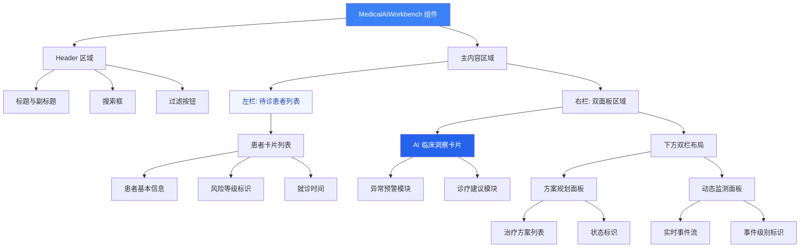

医疗 AI 工作台是面向临床医生的智能辅助诊疗界面，通过集成患者管理、AI 临床洞察、方案规划和实时监测四大核心模块，为医疗专业人员提供决策支持和工作流程优化。该组件采用现代化的玻璃态设计语言，结合 Framer Motion 动画库打造流畅的交互体验，是 AI 业务平台中针对医疗场景的垂直化解决方案。

## 架构设计与组件结构

医疗 AI 工作台采用**函数式组件 + 静态数据源**的架构模式，通过响应式网格布局实现三栏结构的信息展示。组件定义位于 `src/components/MedicalAIWorkbench.tsx`，整体架构遵循单一职责原则，将 UI 渲染与业务逻辑分离，数据源通过组件内部常量 `PATIENTS` 进行管理，为后续对接真实 API 预留了清晰的集成路径。

组件的技术栈选择体现了现代前端开发的最佳实践：React 提供声明式 UI 框架，Framer Motion 处理动画交互，Tailwind CSS 实现原子化样式，lucide-react 提供一致的图标系统。这种组合既保证了开发效率，又确保了性能优化的灵活性，特别是在代码分割和懒加载策略上与平台整体架构保持一致。



Sources: [MedicalAIWorkbench.tsx](src/components/MedicalAIWorkbench.tsx#L1-L198)

## 核心功能模块深度解析

### 患者管理模块

患者管理模块位于界面的左栏，通过卡片式布局展示待诊患者的关键信息。每个患者卡片包含四个维度的数据：基础信息（姓名、性别、年龄）、临床状态（诊断描述）、风险评估（高/中/低三级分类）和时间维度（上次就诊日期）。风险等级采用语义化色彩编码：高风险使用红色背景（`bg-red-100 text-red-600`），中风险使用橙色（`bg-orange-100 text-orange-600`），低风险使用绿色（`bg-green-100 text-green-600`），这种视觉设计能够在瞬间传递关键决策信息。

卡片交互采用 Framer Motion 的 `whileHover` 属性实现 1.02 倍缩放效果，配合 Tailwind 的 `hover:border-brand/30` 和 `hover:bg-brand/5` 类名，在鼠标悬停时提供微妙的视觉反馈。ChevronRight 图标通过 `group-hover:translate-x-1` 实现向右平移动画，暗示卡片可点击进入详情页面。这种渐进增强的交互设计在不支持 JavaScript 的环境下仍能保持基础可访问性。

数据源通过 `PATIENTS` 常量定义，包含四条模拟患者记录，每条记录包含 `id`、`name`、`age`、`gender`、`condition`、`risk`、`lastVisit` 七个字段。这种静态数据结构为后续 API 集成提供了清晰的类型契约，开发团队只需将常量替换为状态变量和 API 调用即可实现动态数据加载。

Sources: [MedicalAIWorkbench.tsx](src/components/MedicalAIWorkbench.tsx#L19-L92)

### AI 临床洞察系统

AI 临床洞察系统是工作台的核心差异化功能，采用品牌色渐变背景（`from-brand to-brand-hover`）配合玻璃态效果（`bg-white/20 backdrop-blur-md`）打造视觉焦点区域。该模块分为两个信息块：异常预警和诊疗建议，每个信息块通过图标（AlertCircle、Stethoscope）和色彩差异化（橙色、蓝色）建立视觉层次。

异常预警模块展示基于患者历史数据的 AI 分析结果，例如"张晓彤近期血压波动较大，建议关注其用药依从性"，这类提示语采用临床决策支持的典型表达方式，包含**观察发现**（血压波动）、**干预建议**（关注依从性）和**预期行动**（调整方案）三段式结构。诊疗建议模块则针对特定患者的并发症风险提供预防性检查建议，体现了预防医学的理念。

"生成报告"按钮采用 `bg-white/20 hover:bg-white/30` 的半透明设计，在保持视觉统一性的同时提供交互反馈。按钮的 `backdrop-blur-md` 属性与整体玻璃态设计语言保持一致，这种设计手法在现代 Dashboard 界面中越来越流行，能够在保持信息密度的同时降低视觉疲劳。

Sources: [MedicalAIWorkbench.tsx](src/components/MedicalAIWorkbench.tsx#L94-L133)

### 方案规划与动态监测

方案规划面板采用列表式布局展示治疗方案的三个状态：待审核（橙色）、已下达（绿色）、草稿（灰色）。每个方案项包含标题、日期和状态标识，通过 `text-[10px]` 的小字号和 `rounded-3xl` 的圆角设计保持视觉轻盈感。状态色彩遵循交通灯隐喻，让医护人员能够快速识别需要优先处理的项目。

动态监测面板采用时间线设计，通过不同颜色的圆点（红色、品牌色、灰色）标识事件紧急程度。心率异常提醒使用红色圆点配合 `ring-4 ring-red-100` 的光晕效果，强调事件的紧迫性；检查报告同步使用品牌色，表示常规信息更新；随访提醒使用灰色，表示计划性任务。这种视觉编码系统符合医疗行业的警报分级标准。

两个面板均使用 `bg-white/60 backdrop-blur-xl` 的玻璃态背景，配合 `border-white/80` 的边框处理，创造出层次分明的卡片效果。`shadow-sm` 提供微妙的阴影，增强界面深度感，同时避免过度装饰影响信息可读性。

Sources: [MedicalAIWorkbench.tsx](src/components/MedicalAIWorkbench.tsx#L135-L193)

## 技术实现与样式系统

### 响应式布局策略

组件采用 Tailwind CSS 的响应式网格系统，通过 `grid-cols-1 xl:grid-cols-3` 和 `xl:col-span-1`、`xl:col-span-2` 类名实现自适应布局。在桌面端（xl 断点以上），左栏占据 1/3 宽度展示患者列表，右栏占据 2/3 宽度展示 AI 洞察和双面板内容；在移动端，所有模块垂直堆叠，保证小屏设备的可用性。

右栏内部进一步使用 `grid-cols-1 md:grid-cols-2` 实现方案规划和动态监测的并排布局，在中屏设备上自动切换为双栏模式。这种嵌套的响应式设计确保了在各种屏幕尺寸下的最优信息密度，体现了移动优先的设计理念。

### 品牌色彩系统

组件大量使用 CSS 变量定义的品牌色系，包括 `text-brand`（主品牌色）、`bg-brand/10`（10% 透明度的品牌色背景）、`border-brand/30`（30% 透明度的品牌色边框）等变体。根据 `src/index.css` 的定义，品牌色为 `#3B82F6`（蓝色），品牌色悬停态为 `#2563EB`，这种色彩选择符合医疗行业对专业、可信、科技感的视觉期待。

玻璃态效果通过 `backdrop-blur-xl`（12px 模糊半径）和半透明背景色实现，在保持内容可读性的同时创造出现代感的视觉层次。边框使用 `border-white/80` 确保卡片之间的视觉分离，同时不破坏整体的轻盈感。

Sources: [MedicalAIWorkbench.tsx](src/components/MedicalAIWorkbench.tsx#L28-L196) [index.css](src/index.css#L4-L7)

## 路由集成与懒加载机制

医疗 AI 工作台通过平台的统一路由系统进行注册，路径为 `/medical-ai`，页面标识符为 `medical-ai`。在 `src/pageRegistry.tsx` 中，组件通过 React 的 `lazy` 函数实现代码分割：

```typescript
const MedicalAIWorkbench = lazy(async () => {
  const module = await import('./components/MedicalAIWorkbench');
  return { default: module.MedicalAIWorkbench };
});
```

这种动态导入策略确保医疗 AI 工作台的代码不会包含在初始加载包中，只有当用户导航到该页面时才会下载对应的 JavaScript 资源。配合 `Suspense` 组件和 `PageLoadingFallback` 骨架屏，提供流畅的页面切换体验。

在 `PAGE_RENDERERS` 映射表中，医疗 AI 工作台的渲染器定义为：

```typescript
'medical-ai': () => <MedicalAIWorkbench />,
```

由于该组件不需要访问 Dashboard 的上下文状态（如任务管理、聊天记录等），渲染器函数不接收任何参数，保持了组件的独立性和可测试性。

Sources: [pageRegistry.tsx](src/pageRegistry.tsx#L65-L68) [pageRegistry.tsx](src/pageRegistry.tsx#L105)

## 导航定位与信息架构

在平台的导航系统中，医疗 AI 工作台属于"AI 智能驾驶舱"菜单组的子项，与顾问 AI 工作台、护士 AI 工作台、健康管家 AI 等模块并列。这种分组方式体现了平台的功能架构：将面向不同角色（医生、护士、顾问、健康管家）的 AI 工作台统一组织在智能驾驶舱概念下，便于用户根据自身角色快速定位所需功能。

导航数据定义在 `src/data/navigationData.ts` 中，医疗 AI 工作台的页面定义为：

```typescript
'medical-ai': { 
  path: '/medical-ai', 
  title: '医疗AI工作台', 
  implemented: true 
}
```

`implemented: true` 标识表示该页面已完成开发，不会显示占位符内容。这种元数据驱动的方式使得平台能够灵活管理页面的上线状态，支持灰度发布和功能开关。

Sources: [navigationData.ts](src/data/navigationData.ts#L9) [navigationData.ts](src/data/navigationData.ts#L56) [navigationData.ts](src/data/navigationData.ts#L144-L157)

## 与其他 AI 工作台的对比分析

平台当前实现了四个 AI 工作台组件，每个组件针对不同的业务场景和用户角色进行定制化设计。通过对比分析可以理解医疗 AI 工作台在设计决策上的独特性：

| 维度 | 医疗 AI 工作台 | 顾问 AI 工作台 | 护士 AI 工作台 | 健康管家 AI |
|------|----------------|----------------|----------------|-------------|
| **目标用户** | 临床医生 | 健康顾问 | 护理人员 | 健康管家 |
| **核心场景** | 诊疗决策支持 | 客户方案规划 | 护理任务执行 | 健康管理服务 |
| **数据重点** | 患者诊断、风险 | 客户档案、方案 | 护理任务、体征 | 健康数据、计划 |
| **交互复杂度** | 中等（卡片浏览） | 高（AI 对话 + JSON Render） | 中等（任务管理） | 中等（数据展示） |
| **技术特点** | 静态数据 + 动画 | JSON Render + 状态管理 | 实时监测 + 预警 | 数据可视化 |
| **视觉风格** | 玻璃态 + 品牌色 | 分栏布局 + 侧边栏 | 警报色彩 + 图标 | 卡片网格 + 图表 |

医疗 AI 工作台的设计选择体现了临床场景的特殊需求：**信息密度与决策效率的平衡**。相比于顾问 AI 工作台的复杂对话交互，医疗场景更强调快速浏览和关键信息提取，因此采用卡片式布局和色彩编码系统。相比于护士 AI 工作台的实时监测重点，医疗场景更关注诊断推理和方案规划，因此 AI 洞察模块占据视觉中心位置。

Sources: [MedicalAIWorkbench.tsx](src/components/MedicalAIWorkbench.tsx#L1-L198) [NurseAIWorkbench.tsx](src/components/NurseAIWorkbench.tsx#L1-L100) [ConsultantAIWorkbench.tsx](src/components/ConsultantAIWorkbench.tsx#L1-L100)

## 扩展方向与技术债务

当前实现使用静态数据源，后续需要对接真实的患者管理 API 和 AI 分析服务。建议的数据流改造方向包括：引入 React Query 进行数据缓存和自动刷新，使用 Zustand 管理跨组件的患者选择状态，通过 WebSocket 实现动态监测面板的实时更新。

搜索和过滤功能目前仅为 UI 占位，需要实现完整的查询逻辑。可以考虑引入 Fuse.js 等模糊搜索库处理患者姓名和 ID 的检索，过滤按钮可以扩展为多维度筛选面板（按风险等级、就诊时间、诊断类型等）。

AI 临床洞察模块当前展示的是静态文本，未来需要对接真实的医疗 AI 服务。考虑到医疗场景的合规性要求，建议在 AI 建议中增加置信度指标、参考文献链接和医生确认机制，确保 AI 辅助决策的透明性和可追溯性。

## 延伸阅读

要深入理解医疗 AI 工作台在整个平台架构中的定位，建议按以下顺序阅读相关文档：

- **[顾问 AI 工作台](15-gu-wen-ai-gong-zuo-tai)**：对比学习 JSON Render 技术在 AI 工作台中的应用
- **[护士 AI 工作台](16-hu-shi-ai-gong-zuo-tai)**：了解护理场景的实时监测与预警机制
- **[AI 辅助诊断](20-ai-fu-zhu-zhen-duan)**：探索 AI 诊断功能的独立实现
- **[页面注册表与懒加载策略](9-ye-mian-zhu-ce-biao-yu-lan-jia-zai-ce-lue)**：掌握路由系统的底层实现
- **[Tailwind CSS 配置](25-tailwind-css-pei-zhi)**：学习品牌色彩系统和响应式设计规范