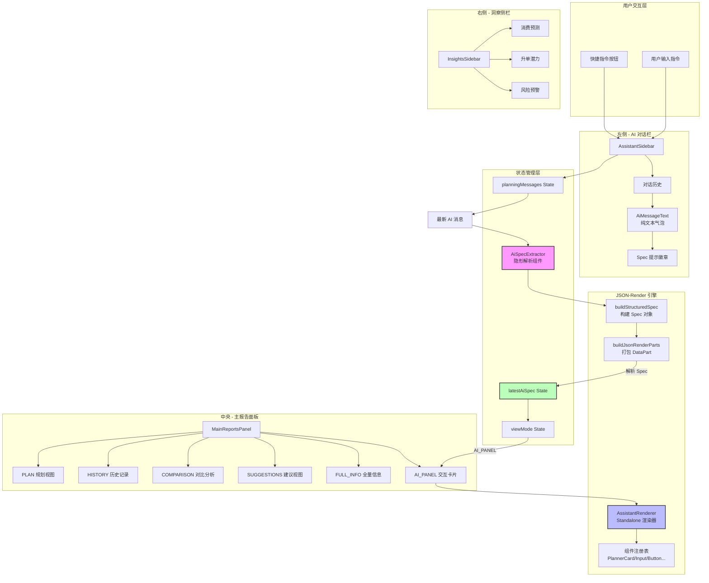

**顾问 AI 工作台**是面向健康顾问的智能化辅助系统，通过三栏式布局整合 AI 对话、客户数据可视化和智能洞察分析。系统核心创新在于采用 **JSON-Render 声明式 UI 引擎**，使 AI 能够动态生成结构化的交互卡片，实现从"文本回复"到"可操作界面"的跨越式升级。

## 架构总览

工作台采用**状态驱动的三栏布局**，左侧 AI 助手通过自然语言对话接收指令，中央面板根据指令类型动态切换六种视图模式，右侧实时展示 AI 分析的消费预测、升单潜力和风险预警。整个系统的神经中枢是 **Spec 提取与渲染机制**：AI 响应中可嵌入结构化 Spec 对象，父组件通过 `AiSpecExtractor` 子组件提取 Spec 并自动切换到 `AI_PANEL` 模式，在中央主面板渲染交互卡片，实现对话与操作的闭环。



Sources: [ConsultantAIWorkbench.tsx](src/components/ConsultantAIWorkbench.tsx#L1-L137), [types.ts](src/components/consultant-ai-workbench/types.ts#L1-L19)

## 核心设计模式：Spec 提取与渲染分离

传统 AI 对话系统的局限在于只能返回纯文本，用户需要手动执行后续操作。本工作台通过 **Spec 提取器模式**突破这一限制：`AiSpecExtractor` 作为隐形逻辑组件，监听最新 AI 消息并解析其中的结构化 Spec 对象，一旦检测到 Spec 立即触发父组件状态更新，同时自动切换视图模式到 `AI_PANEL`，将交互卡片渲染到中央主面板而非对话气泡中，实现"说即所得"的体验升级。

### 双向数据流设计

系统维护两个核心状态：`planningMessages` 数组存储对话历史，`latestAiSpec` 存储最新解析的 Spec 对象。当用户发送指令后，`handleSendPlanningMessage` 将用户消息追加到数组，模拟 AI 响应后追加 AI 消息。`AiSpecExtractor` 通过 `useMemo` 逆序查找最新 AI 消息，调用 `buildJsonRenderParts` 解析 Spec，通过 `onSpec` 回调将 Spec 提升至父组件状态，触发 `MainReportsPanel` 重新渲染。

```typescript
// 隐形解析组件：只在组件内调用 Hook，通过回调提升状态
function AiSpecExtractor({ content, onSpec }: { content: string; onSpec: (spec: Spec | null) => void }) {
  const parts = useMemo(() => buildJsonRenderParts(content), [content]);
  const { spec } = useJsonRenderMessage(parts);
  
  // Spec 变化时上报父组件
  useMemo(() => {
    onSpec(spec ?? null);
  }, [spec]);
  
  return null; // 纯逻辑组件，不渲染 DOM
}

// 父组件中提取最新 AI 消息并解析
const latestAiMessage = useMemo(
  () => [...planningMessages].reverse().find((m) => m.role === 'ai'),
  [planningMessages],
);

// Spec 提取成功后自动切换视图
const handleSpecExtracted = (spec: Spec | null) => {
  if (spec) {
    setLatestAiSpec(spec);
    setViewMode('AI_PANEL'); // 自动切换到 AI 交互卡片视图
  }
};
```

Sources: [ConsultantAIWorkbench.tsx](src/components/ConsultantAIWorkbench.tsx#L22-L94)

## JSON-Render 声明式 UI 系统

**JSON-Render** 是本系统的核心技术亮点，它定义了一套 JSON 格式的 UI 描述规范，AI 只需返回符合规范的 Spec 对象，前端即可自动渲染出包含状态管理、事件处理、条件渲染的完整交互界面。这种设计使 AI 从"文本生成器"进化为"界面生成器"，大幅提升业务场景的实用性。

### Spec 对象结构

Spec 对象包含四个核心字段：`root` 指定根元素 ID，`state` 定义全局状态仓库（类似 React 的 useState），`elements` 声明所有 UI 元素及其属性、子元素、事件监听器、可见性规则。每个元素的 `type` 字段对应组件注册表中的组件名，`props` 传递静态属性，`children` 定义子元素 ID 数组，`on` 声明事件动作映射，`visible` 设置条件渲染规则。

```typescript
// Spec 对象示例：健康规划卡片
{
  root: 'planner-card',
  
  // 状态仓库：JSON Pointer 路径访问
  state: {
    plan: {
      nextGoal: '每周 3 次中低强度有氧',
      confirmed: false,
      exerciseType: '',
    },
  },
  
  // UI 元素定义表
  elements: {
    'planner-card': {
      type: 'PlannerCard',
      props: { title: '1+X 结构化健康规划', subtitle: '支持状态绑定与动作触发' },
      children: ['metric-1', 'exercise-select', 'goal-input', 'apply-btn', 'success-notice'],
    },
    
    // 双向绑定输入框：$bindState 连接 state 路径
    'goal-input': {
      type: 'PlannerInput',
      props: {
        label: '下月核心目标',
        value: { $bindState: '/plan/nextGoal' }, // 读写自动同步到 state.plan.nextGoal
        placeholder: '例如：每晚 11 点前入睡',
      },
    },
    
    // 动作按钮：press 事件触发 saveToServer 自定义动作
    'apply-btn': {
      type: 'PlannerButton',
      props: { label: '一键写入客户跟踪建议' },
      on: {
        press: {
          action: 'saveToServer',
          params: {
            statePath: '/plan/confirmed',
            goal: { $bindState: '/plan/nextGoal' }
          },
        },
      },
    },
    
    // 条件渲染：confirmed 为 true 时显示
    'success-notice': {
      type: 'PlannerNotice',
      props: { text: '已写入客户建议并标记为本轮追踪重点。', tone: 'success' },
      visible: { $state: '/plan/confirmed' },
    },
  },
}
```

### Standalone Mode 渲染器

系统采用 **Standalone Mode** 封装渲染器，相比传统的 Provider Mode，使用者无需手动嵌套 `StateProvider`、`ActionProvider`、`VisibilityProvider` 等多层 Provider，只需传入 `spec`、`state`、`onAction` 三个参数即可。`createRenderer` API 返回的 `AssistantRenderer` 组件内部已处理好所有状态管理和事件路由逻辑，自定义动作（如 `saveToServer`）统一通过 `onAction` 回调处理。

```typescript
// Standalone Mode：单组件封装所有 Provider
export const AssistantRenderer = createRenderer(assistantCatalog, {
  // PlannerInput 组件：通过 useBoundProp 实现双向绑定
  PlannerInput: ({ element, bindings }) => {
    const { label, placeholder } = element.props;
    const [boundValue, setBoundValue] = useBoundProp<string>(
      element.props.value,
      bindings?.value, // 框架解析 $bindState 对应的 state 路径
    );
    
    return (
      <label className="block rounded-xl border border-slate-200 bg-white px-3 py-2">
        <span className="block text-[11px] font-semibold text-slate-500">{label}</span>
        <input
          value={boundValue ?? ''}
          onChange={(e) => setBoundValue(e.target.value)} // 自动同步回 Spec state
          placeholder={placeholder ?? ''}
          className="mt-1 w-full border-0 bg-transparent text-xs text-slate-700 focus:outline-none"
        />
      </label>
    );
  },
  
  // PlannerButton 组件：emit 触发动作，业务逻辑在 onAction 中处理
  PlannerButton: ({ element, emit }) => (
    <button
      type="button"
      onClick={() => emit('press')} // 框架路由到 on.press 声明的 action
      className="w-full rounded-xl bg-brand px-3 py-2 text-xs font-bold text-white"
    >
      {element.props.label}
    </button>
  ),
});

// 使用方式：父组件统一处理自定义动作
<AssistantRenderer
  spec={aiSpec}
  state={initialState}
  onAction={async (actionName, params) => {
    if (actionName === 'saveToServer') {
      await apiClient.post('/api/v1/consultant/plan/save', { goal: params.goal });
    }
  }}
/>
```

Sources: [spec.ts](src/components/consultant-ai-workbench/json-render/spec.ts#L1-L223), [registry.tsx](src/components/consultant-ai-workbench/json-render/registry.tsx#L1-L341)

## 六视图模式动态切换系统

中央主面板 `MainReportsPanel` 是工作台的信息展示核心，根据 `viewMode` 状态动态渲染六种业务视图：`PLAN` 显示健康规划、`HISTORY` 展示治疗记录时间线、`COMPARISON` 呈现指标对比图表、`SUGGESTIONS` 列出追踪建议、`FULL_INFO` 汇总客户全量档案、`AI_PANEL` 渲染 JSON-Render 交互卡片。视图切换通过 Framer Motion 的 `AnimatePresence` 实现平滑过渡，每个视图都有独立的进入和退出动画。

### 视图切换触发机制

视图切换由 AI 响应智能驱动，`getAiResponse` 函数通过关键词匹配判断用户意图，返回对应的 `viewMode` 和 `showNewPlan` 标志。例如用户输入包含"记录"或"半年"时，自动切换到 `HISTORY` 模式展示治疗记录；输入"对比"或"结果"时切换到 `COMPARISON` 模式显示指标对比图表。当 AI 响应包含 Spec 对象时，`AiSpecExtractor` 会自动将 `viewMode` 切换到 `AI_PANEL`。

```typescript
// AI 响应路由：根据关键词智能切换视图
export function getAiResponse(input: string): { response: string; viewMode?: WorkbenchViewMode; showNewPlan?: boolean } {
  if (input.includes('整理') || input.includes('信息')) {
    return {
      response: '✨ 已为您整理好客户【张三】的全量信息。',
      viewMode: 'FULL_INFO', // 切换到全量信息视图
      showNewPlan: false,
    };
  }
  
  if (input.includes('记录') || input.includes('半年')) {
    return {
      response: '✨ 已调取【张三】近半年的治疗记录。共计 12 次治疗。',
      viewMode: 'HISTORY', // 切换到历史记录视图
      showNewPlan: false,
    };
  }
  
  if (input.includes('对比') || input.includes('结果')) {
    return {
      response: '✨ 治疗结果对比分析已完成。气虚体质改善明显。',
      viewMode: 'COMPARISON', // 切换到对比分析视图
      showNewPlan: false,
    };
  }
  
  return { response: '正在为您处理指令...' };
}
```

### 视图组件实现模式

每个视图都是独立的 React 组件，通过 `motion.div` 包裹实现动画效果。`AnimatePresence` 的 `mode="wait"` 确保旧视图完全退出后才渲染新视图，避免动画冲突。视图内部根据业务需求组合使用 Ant Design 的 `Table` 组件、Lucide 图标库、自定义卡片组件等，数据源来自 `data.ts` 中的 Mock 数据或 API 调用。

```typescript
// MainReportsPanel：根据 viewMode 条件渲染不同视图
export function MainReportsPanel({ viewMode, showNewPlan, historyItems, suggestionItems, aiSpec }: Props) {
  return (
    <div className="col-span-6 flex flex-col space-y-6 overflow-y-auto pr-2 custom-scrollbar">
      <AnimatePresence mode="wait">
        {/* AI_PANEL 模式：渲染 JSON-Render 交互卡片 */}
        {viewMode === 'AI_PANEL' && aiSpec && (
          <motion.div
            key="ai_panel"
            initial={{ opacity: 0, y: 16 }}
            animate={{ opacity: 1, y: 0 }}
            exit={{ opacity: 0, y: -16 }}
            transition={{ duration: 0.25 }}
          >
            <AssistantRenderer spec={aiSpec} state={initialState} onAction={handleAction} />
          </motion.div>
        )}
        
        {/* HISTORY 模式：展示治疗记录时间线 */}
        {viewMode === 'HISTORY' && (
          <motion.div
            key="history"
            initial={{ opacity: 0, x: 20 }}
            animate={{ opacity: 1, x: 0 }}
            exit={{ opacity: 0, x: -20 }}
          >
            {/* 历史记录列表 */}
          </motion.div>
        )}
      </AnimatePresence>
    </div>
  );
}
```

Sources: [MainReportsPanel.tsx](src/components/consultant-ai-workbench/MainReportsPanel.tsx#L1-L400), [chat.ts](src/components/consultant-ai-workbench/chat.ts#L1-L57)

## AI 对话侧边栏实现细节

左侧 `AssistantSidebar` 是用户与 AI 交互的主要入口，集成了对话历史展示、快捷指令按钮、消息输入框三大功能模块。核心设计原则是**职责分离**：AI 消息气泡只显示纯文本内容，Spec 对象解析后自动在主面板渲染交互卡片，气泡内仅显示"结构化卡片已展示在主面板"的提示徽章，避免界面臃肿。

### AiMessageText 组件：文本与 Spec 分离渲染

`AiMessageText` 组件负责解析 AI 消息内容，调用 `buildJsonRenderParts` 将消息拆分为文本部分和 Spec 部分，通过 `useJsonRenderMessage` Hook 提取纯文本和 Spec 存在标志。文本部分按换行符分段渲染为多个 `<p>` 标签，检测到 Spec 时显示带 Sparkles 图标的提示徽章，引导用户查看主面板的交互卡片。

```typescript
// AiMessageText：AI 气泡内容组件（纯文本展示）
function AiMessageText({ content }: { content: string }) {
  const parts = useMemo(() => buildJsonRenderParts(content), [content]);
  const { text, hasSpec } = useJsonRenderMessage(parts);
  
  return (
    <>
      {/* 纯文本内容：按换行符分段 */}
      {text.split('\n').map((line, index) => (
        <p key={`ai-line-${index}`} className={index > 0 ? 'mt-2' : ''}>
          {line}
        </p>
      ))}
      
      {/* Spec 提示徽章：引导用户查看主面板 */}
      {hasSpec && (
        <div className="mt-3 flex items-center space-x-1.5 px-2 py-1.5 bg-brand/10 rounded-xl border border-brand/15">
          <Sparkles className="w-3 h-3 text-brand flex-shrink-0" />
          <span className="text-[10px] font-bold text-brand">结构化卡片已展示在主面板</span>
        </div>
      )}
    </>
  );
}
```

### 快捷指令系统

`quickPromptActions` 数组定义了四条常用指令，渲染为一键触发的按钮列表。用户点击按钮后直接调用 `onSendMessage` 回调发送预设文本，无需手动输入。这种设计降低了用户的学习成本，同时展示了系统的核心能力边界：整理信息、查看记录、对比结果、生成建议。

```typescript
// 快捷指令配置
export const quickPromptActions = [
  '整理张三的所有信息',
  '查看张三近半年治疗记录',
  '对比张三治疗结果',
  '生成健康追踪建议',
] as const;

// 渲染为按钮列表
{quickPromptActions.map((prompt) => (
  <button
    key={prompt}
    onClick={() => onSendMessage(prompt)}
    className="w-full py-3 bg-slate-50 text-slate-600 text-xs font-bold rounded-3xl"
  >
    <span>{prompt}</span>
    <ChevronRight className="w-3 h-3 opacity-0 group-hover:opacity-100 transition-all" />
  </button>
))}
```

Sources: [AssistantSidebar.tsx](src/components/consultant-ai-workbench/AssistantSidebar.tsx#L1-L177), [data.ts](src/components/consultant-ai-workbench/data.ts#L1-L30)

## 右侧洞察侧栏：AI 分析引擎

右侧 `InsightsSidebar` 是 AI 智能分析的展示窗口，包含三大核心模块：**消耗预测**通过时间线可视化未来 6 个月的消费路径，**升单潜力**基于客户画像和通话记录分析推荐高匹配度产品，**风险预警**监控客户活跃度异常并生成挽留话术建议。三个模块相互协同，为顾问提供全景式的客户洞察。

### 消耗预测时间线

消耗预测模块采用垂直时间线设计，通过 `before` 伪元素绘制连接线，每个时间节点用不同颜色的圆点标识阶段特征（品牌色表示启动期、紫色表示密集期、绿色表示巩固期）。节点信息包含阶段名称、服务内容、预计消耗金额，通过透明度渐变区分已发生和未发生的事件。

### 升单潜力评分系统

升单潜力模块通过三列网格展示关键指标：升单潜力等级（高/中/低）、转化概率百分比、预估金额。底部推荐卡片显示 AI 匹配度最高的产品（如"中医调理金卡"），并提供"生成话术"按钮一键生成销售脚本。匹配度计算基于客户历史消费、健康画像、通话意向分析等多维度数据。

### 风险预警监控机制

风险预警模块采用红黄绿三级颜色编码系统，列表项通过不同颜色的圆点标识风险等级（红色高风险、橙色中风险、黄色低风险）。底部 AI 建议区域使用红色背景强调紧迫性，提示顾问立即主动回访并使用关怀型话术挽留客户。风险评分基于消耗停滞天数、满意度分析、同期群对比等算法计算。

Sources: [InsightsSidebar.tsx](src/components/consultant-ai-workbench/InsightsSidebar.tsx#L1-L96)

## 组件注册表与字典加载机制

JSON-Render 的组件注册表定义了所有可用的 UI 组件类型，每个组件接收标准化的 `ComponentRenderProps` 参数（包含 `element`、`children`、`emit`、`bindings` 等）。系统内置基础组件如 `PlannerCard`（容器）、`PlannerMetric`（指标展示）、`PlannerInput`（输入框）、`PlannerButton`（按钮）、`PlannerNotice`（提示条），并支持扩展 `PlannerSelect`（字典下拉框）、`PlannerTable`（分页表格）等高级组件。

### 字典缓存与动态加载

`PlannerSelect` 组件通过 `dictCode` 属性声明字典编码，组件内部调用 `fetchDictOptions` 函数从后端接口 `/api/v1/system/dict/data/type/{dictCode}` 加载选项列表。模块级 `dictCache` Map 缓存已加载的字典数据，确保同一 `dictCode` 在整个会话中只请求一次接口，优化性能并减少服务器压力。

```typescript
// 字典缓存：模块级 Map，按 dictCode 缓存选项列表
const dictCache = new Map<string, DictOption[]>();

// 字典加载函数：带缓存和错误处理
async function fetchDictOptions(dictCode: string): Promise<DictOption[]> {
  if (dictCache.has(dictCode)) {
    return dictCache.get(dictCode)!; // 命中缓存直接返回
  }
  
  try {
    const res = await apiClient.get<{
      data: Array<{ dictLabel: string; dictValue: string }>;
    }>(`/api/v1/system/dict/data/type/${dictCode}`);
    
    const options: DictOption[] = (res.data.data ?? []).map((item) => ({
      label: item.dictLabel,
      value: item.dictValue,
    }));
    
    dictCache.set(dictCode, options); // 写入缓存
    return options;
  } catch (err) {
    console.error(`[PlannerSelect] 字典加载失败 (${dictCode}):`, err);
    return [];
  }
}
```

### PlannerTable 分页表格组件

`PlannerTable` 组件封装了 Ant Design 的 `Table` 组件，通过 `api` 属性声明数据源接口地址，`columns` 属性定义列配置（`dataIndex` 映射后端字段名，`title` 设置列标题）。组件内部自动处理分页逻辑，`currentPage` 属性通过 `$bindState` 绑定到 Spec state 的某个路径，实现翻页状态的持久化和跨组件同步。

```typescript
// PlannerTable 组件：Spec 中声明式配置
'customer-table': {
  type: 'PlannerTable',
  props: {
    title: '近期检查列表 (演示用地址)',
    api: '/api/v1/customers/records', // 后端分页接口
    columns: [
      { dataIndex: 'examDate', title: '体检日期' },
      { dataIndex: 'hospital', title: '就诊机构' },
      { dataIndex: 'result', title: '异常项' },
    ],
    currentPage: { $bindState: '/plan/tableCurrentPage' } // 翻页状态绑定
  }
}
```

Sources: [registry.tsx](src/components/consultant-ai-workbench/json-render/registry.tsx#L42-L341), [spec.ts](src/components/consultant-ai-workbench/json-render/spec.ts#L78-L95)

## 数据流与状态管理策略

工作台采用**单向数据流**架构，所有状态集中在 `ConsultantAIWorkbench` 父组件管理，子组件通过 props 接收数据和回调函数。核心状态包括 `planningMessages`（对话历史数组）、`latestAiSpec`（最新 Spec 对象）、`viewMode`（当前视图模式）、`aiName`（AI 助手名称）、`isGeneratingPlan`（加载状态标志）等，通过 `useState` Hook 管理。

### 状态提升与回调模式

子组件不直接修改父组件状态，而是通过回调函数通知父组件。例如 `AssistantSidebar` 接收 `onSendMessage` 回调，用户点击发送按钮时调用该回调并传入消息文本，父组件的 `handleSendPlanningMessage` 函数负责更新 `planningMessages` 数组、清空输入框、触发 AI 响应。这种模式确保状态变更逻辑集中在一处，便于调试和维护。

```typescript
// 父组件：状态管理与回调定义
export function ConsultantAIWorkbench() {
  const [planningMessages, setPlanningMessages] = useState<PlanningMessage[]>([]);
  const [latestAiSpec, setLatestAiSpec] = useState<Spec | null>(null);
  const [viewMode, setViewMode] = useState<WorkbenchViewMode>('PLAN');
  
  // 发送消息回调：更新对话历史并触发 AI 响应
  const handleSendPlanningMessage = (text?: string) => {
    const input = text || planningChatMessage;
    if (!input.trim()) return;
    
    setPlanningMessages((prev) => [...prev, createPlanningMessage('user', input)]);
    setPlanningChatMessage('');
    setIsGeneratingPlan(true);
    
    // 模拟 AI 响应延迟
    setTimeout(() => {
      const result = getAiResponse(input);
      if (result.viewMode) setViewMode(result.viewMode);
      setPlanningMessages((prev) => [...prev, createPlanningMessage('ai', result.response)]);
      setIsGeneratingPlan(false);
    }, 1500);
  };
  
  // Spec 提取回调：接收子组件解析的 Spec 并更新状态
  const handleSpecExtracted = (spec: Spec | null) => {
    if (spec) {
      setLatestAiSpec(spec);
      setViewMode('AI_PANEL');
    }
  };
  
  return (
    <>
      {latestAiMessage && (
        <AiSpecExtractor content={latestAiMessage.content} onSpec={handleSpecExtracted} />
      )}
      <AssistantSidebar
        planningMessages={planningMessages}
        onSendMessage={handleSendPlanningMessage}
      />
      <MainReportsPanel viewMode={viewMode} aiSpec={latestAiSpec} />
    </>
  );
}
```

### 消息 ID 生成与去重

`createPlanningMessage` 工厂函数通过模块级计数器 `planningMessageCounter` 生成唯一 ID，格式为 `planning-message-{counter}`。这种设计确保每条消息都有稳定且唯一的标识符，避免 React 渲染时的 key 冲突问题，同时便于后续扩展消息更新、删除等功能。

Sources: [ConsultantAIWorkbench.tsx](src/components/ConsultantAIWorkbench.tsx#L35-L94), [chat.ts](src/components/consultant-ai-workbench/chat.ts#L1-L12)

## 开发实践与扩展指南

### 如何添加新的视图模式

扩展视图模式需三步：首先在 `types.ts` 中扩展 `WorkbenchViewMode` 类型定义，其次在 `MainReportsPanel` 中添加对应的条件渲染分支并设计 UI 组件，最后在 `chat.ts` 的 `getAiResponse` 函数中添加关键词匹配逻辑返回新的 `viewMode` 值。确保新视图使用 `motion.div` 包裹并设置唯一的 `key` 属性，以配合 `AnimatePresence` 实现动画效果。

### 如何注册自定义 JSON-Render 组件

在 `registry.tsx` 的 `createRenderer` 第二个参数中添加新组件定义，组件函数接收 `ComponentRenderProps<P>` 参数，通过 `element.props` 访问 Spec 中声明的属性，通过 `useBoundProp` Hook 实现双向绑定，通过 `emit` 函数触发事件。组件内部完全无状态，所有状态管理由框架的 StateStore 处理，确保组件可测试性和可复用性。

```typescript
// 自定义组件示例：评分组件
export const AssistantRenderer = createRenderer(assistantCatalog, {
  // ... 其他组件
  
  PlannerRating: ({ element, bindings }) => {
    const { label, maxStars = 5 } = element.props;
    const [rating, setRating] = useBoundProp<number>(element.props.value, bindings?.value);
    
    return (
      <div className="flex items-center space-x-2">
        <span className="text-xs text-slate-500">{label}</span>
        <div className="flex space-x-1">
          {Array.from({ length: maxStars }).map((_, index) => (
            <button
              key={index}
              type="button"
              onClick={() => setRating(index + 1)}
              className={index < (rating ?? 0) ? 'text-yellow-400' : 'text-slate-300'}
            >
              ★
            </button>
          ))}
        </div>
      </div>
    );
  },
});
```

### 如何接入真实 AI 服务

当前系统使用 `getAiResponse` 模拟 AI 响应，生产环境需替换为真实 AI API 调用。建议在 `services/api.ts` 中封装 AI 对话接口，返回格式保持 `{ response: string; viewMode?: WorkbenchViewMode; spec?: Spec }` 结构。AI 服务需支持流式响应（SSE 或 WebSocket），前端逐字显示回复内容，Spec 对象在流式结束后解析。注意处理网络错误、超时重试、Token 过期等异常情况。

Sources: [types.ts](src/components/consultant-ai-workbench/types.ts#L9), [chat.ts](src/components/consultant-ai-workbench/chat.ts#L14-L56)

## 相关模块导航

本工作台是 **AI 工作台系列** 的核心模块之一，与其他工作台共享相似的设计理念但聚焦不同业务场景。[医疗 AI 工作台](14-yi-liao-ai-gong-zuo-tai) 侧重临床诊断辅助，[护士 AI 工作台](16-hu-shi-ai-gong-zuo-tai) 聚焦护理流程优化，[健康管家 AI](17-jian-kang-guan-jia-ai) 面向 C 端用户的日常健康管理。技术实现上，本工作台的 JSON-Render 引擎可参考 [UI Builder 可视化构建器](35-ui-builder-ke-shi-hua-gou-jian-qi) 的拖拽式界面设计，API 集成参考 [Axios 客户端封装与拦截器](11-axios-ke-hu-duan-feng-zhuang-yu-lan-jie-qi) 的最佳实践。