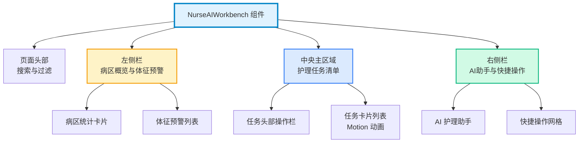

**护士 AI 工作台**是医疗业务平台中专门为护理人员设计的智能协作界面，通过实时监控病区状态、智能预警患者体征、可视化任务管理以及 AI 辅助决策，构建了护理工作的数字化神经中枢。该组件采用**四栏响应式布局**，将病区概览、任务执行、AI 助手与快捷操作有机整合，实现了从被动响应到主动预防的护理模式升级。作为 AI 工作台系列的重要组成部分，护士工作台与[医疗 AI 工作台](14-yi-liao-ai-gong-zuo-tai)、[顾问 AI 工作台](15-gu-wen-ai-gong-zuo-tai)共同构成了多角色协同的智能医疗生态系统。

Sources: [NurseAIWorkbench.tsx](src/components/NurseAIWorkbench.tsx#L1-L21), [navigationData.ts](src/data/navigationData.ts#L57-L58)

## 架构设计与组件结构

护士 AI 工作台采用**单一组件自治模式**，所有数据结构和业务逻辑封装在组件内部，通过 React 函数组件与 Framer Motion 动画库实现高性能渲染。组件整体遵循**垂直分层、水平分栏**的布局策略，在桌面端（xl 断点以上）呈现 1-2-1 的四栏结构，移动端则自动堆叠为单栏流式布局。这种设计既保证了信息密度，又兼顾了不同设备的使用场景。核心架构由三个层次构成：**数据层**（内联 Mock 数据）、**展示层**（四个功能区块）、**交互层**（动画与事件响应）。



**组件依赖关系**显示护士工作台集成了三个核心技术栈：`lucide-react` 提供医疗场景图标系统（Activity、Thermometer、Heart 等），`motion/react` 实现任务卡片的悬停动画效果，Tailwind CSS 通过 `backdrop-blur-xl` 和 `bg-white/60` 构建 Glass Morphism 视觉风格。组件通过 `export function NurseAIWorkbench()` 暴露公开接口，在 [pageRegistry.tsx](src/pageRegistry.tsx#L70-L73) 中通过动态 import 实现路由级懒加载，优化首屏性能。

Sources: [NurseAIWorkbench.tsx](src/components/NurseAIWorkbench.tsx#L35-L58), [pageRegistry.tsx](src/pageRegistry.tsx#L70-L73)

## 核心功能模块详解

### 病区概览与统计面板

病区概览采用 **2×2 网格卡片**设计，通过四个关键指标实时反映病区运营状态：**在院人数**（32 人）显示当前病床占用率，**待办任务**（12 项）标记未完成护理工作量，**一级护理**（5 人）和**病危/重**（2 人）则突出高风险患者群体。每个统计项使用不同的颜色语义（brand 蓝色、橙色、红色）进行视觉分级，字体采用 10px 小号标签配合 24px 加粗数字的双层排版，符合医疗仪表盘的信息层级规范。

Sources: [NurseAIWorkbench.tsx](src/components/NurseAIWorkbench.tsx#L62-L80)

### 体征预警系统

体征预警模块实现了**被动监控到主动预警**的转变，通过 `VITAL_ALERTS` 数据结构定义了标准化预警格式：患者姓名、床号、体征类型（心率/体温）、实测值、时间戳和预警级别。当前实现包含两个典型场景：**心率预警**（李建国 112 bpm）使用红色 Heart 图标标识警告级别，**体温预警**（王芳 38.5℃）使用橙色 Thermometer 图标标识注意级别。预警卡片采用 `bg-orange-50` 浅橙背景配合 `border-orange-100` 边框，在视觉上与普通信息形成明显区分，引导护士优先关注异常体征。

Sources: [NurseAIWorkbench.tsx](src/components/NurseAIWorkbench.tsx#L30-L33), [NurseAIWorkbench.tsx](src/components/NurseAIWorkbench.tsx#L83-L105)

### 护理任务清单与执行流程

任务清单是工作台的核心交互区域，采用**垂直滚动列表**承载 `WARD_TASKS` 数组中的护理任务数据。每个任务卡片包含六维信息：**床位编号**（01/05/08/12）作为视觉锚点使用大号字体展示，**患者姓名**与**任务类型**（静脉输液/生命体征测量/伤口换药/口服药发放）构成主要描述，**执行时间**和**状态**（进行中/待执行）提供时序上下文，**优先级标签**（高/中/低）通过红/灰底色实现快速识别。卡片通过 `motion.div` 的 `whileHover={{ x: 4 }}` 动画，在悬停时向右平移 4 像素并切换边框颜色为品牌色，提供即时的交互反馈。

**任务数据结构对比表**：

| 字段 | 类型 | 说明 | 示例值 |
|------|------|------|--------|
| id | string | 任务唯一标识 | '1' |
| patient | string | 患者姓名 | '张晓彤' |
| bed | string | 床位编号 | '01' |
| task | string | 护理任务类型 | '静脉输液' |
| time | string | 计划执行时间 | '10:30' |
| status | '进行中' \| '待执行' | 任务执行状态 | '进行中' |
| priority | '高' \| '中' \| '低' | 任务优先级 | '高' |

Sources: [NurseAIWorkbench.tsx](src/components/NurseAIWorkbench.tsx#L23-L28), [NurseAIWorkbench.tsx](src/components/NurseAIWorkbench.tsx#L109-L156)

### AI 护理助手与智能提醒

AI 助手模块以**品牌色渐变卡片**（`bg-brand` 配合 `shadow-brand/20`）呈现，与其他白色/半透明模块形成视觉对比，强调其智能化属性。当前实现展示了一个典型场景：**输液进度智能提醒**（"01床张晓彤的输液余量约为15%，预计15分钟后结束"），通过自然语言形式提供前瞻性提示。助手模块包含"查看详情"按钮，为未来接入对话式 AI 交互预留扩展点。该设计遵循了**渐进式披露**原则：先通过摘要信息吸引注意，再通过按钮引导深度交互。

Sources: [NurseAIWorkbench.tsx](src/components/NurseAIWorkbench.tsx#L162-L177)

### 快捷操作网格

快捷操作区域采用 **2×2 网格布局**，集成了四个高频护理功能：**交接班**（CheckCircle2 图标，蓝色）、**批量体温**（Thermometer 图标，橙色）、**输液巡视**（Droplets 图标，品牌蓝）、**宣教推送**（User 图标，紫色）。每个操作按钮通过 `flex flex-col` 实现图标上置、文字下置的垂直布局，使用 10px 字号标签配合 20px 图标，符合移动端触控友好的设计规范。按钮悬停时背景切换为 `bg-slate-50`，提供轻量级视觉反馈。

Sources: [NurseAIWorkbench.tsx](src/components/NurseAIWorkbench.tsx#L180-L195)

## 数据流与状态管理

护士工作台采用**静态数据注入模式**，所有业务数据通过组件顶层的常量数组定义：

```typescript
const WARD_TASKS = [
  { id: '1', patient: '张晓彤', bed: '01', task: '静脉输液', time: '10:30', status: '进行中', priority: '高' },
  // ... 其他任务
];

const VITAL_ALERTS = [
  { patient: '李建国', bed: '05', type: '心率', value: '112 bpm', time: '3分钟前', level: '警告' },
  // ... 其他预警
];
```

这种设计在当前阶段简化了组件复杂度，避免了外部状态管理依赖。未来接入真实数据时，可通过以下方式演进：将 `WARD_TASKS` 和 `VITAL_ALERTS` 迁移至 [Zustand 全局状态管理](7-zustand-quan-ju-zhuang-tai-guan-li) store，或通过 [Axios 客户端封装](11-axios-ke-hu-duan-feng-zhuang-yu-lan-jie-qi) 从后端 API 获取实时数据。组件内部未使用 `useState` 或 `useEffect`，保持了纯函数组件的特性，所有交互依赖 CSS `:hover` 伪类和 Framer Motion 的声明式动画。

Sources: [NurseAIWorkbench.tsx](src/components/NurseAIWorkbench.tsx#L23-L33)

## 响应式设计与布局策略

组件使用 Tailwind CSS 的**移动优先断点系统**，核心布局代码 `grid grid-cols-1 xl:grid-cols-4` 实现了两种视图模式：移动端（<1280px）采用单列垂直堆叠，桌面端（≥1280px）切换为四列水平布局。列宽比例通过 `xl:col-span-1`、`xl:col-span-2` 精确控制，左侧栏和右侧栏各占 1 列，中央任务区占据 2 列，形成**1:2:1 的黄金比例**分布。这种设计确保了任务清单作为核心功能区获得最大的视觉权重，同时保留了辅助信息的可见性。

**布局断点行为对比**：

| 屏幕尺寸 | 断点 | 布局结构 | 列宽分配 | 滚动行为 |
|---------|------|---------|---------|---------|
| < 1280px | 默认 | 单列堆叠 | 全宽 | 整页垂直滚动 |
| ≥ 1280px | xl | 四列网格 | 1:2:1 | 任务区独立滚动 |

Sources: [NurseAIWorkbench.tsx](src/components/NurseAIWorkbench.tsx#L59-L61), [NurseAIWorkbench.tsx](src/components/NurseAIWorkbench.tsx#L122)

## 路由集成与导航配置

护士工作台在路由系统中注册为 **`'nurse-ai'` 页面类型**，在 [navigationData.ts](src/data/navigationData.ts#L10) 的 `AppPage` 联合类型中定义。页面配置包含三个关键属性：`path: '/nurse-ai'` 定义 URL 路径，`title: '护士AI工作台'` 设置页面标题，`implemented: true` 标记为已实现状态。在导航菜单结构中，护士工作台隶属于 **"AI智能驾驶舱"** 分组（[navigationData.ts](src/data/navigationData.ts#L142-L157)），与医疗 AI、顾问 AI、健康管家等模块平级排列，位于菜单的第二个一级菜单项下。

Sources: [navigationData.ts](src/data/navigationData.ts#L10), [navigationData.ts](src/data/navigationData.ts#L57-L58), [navigationData.ts](src/data/navigationData.ts#L147)

## 懒加载与性能优化

护士工作台通过**路由级代码分割**优化首屏加载性能，在 [pageRegistry.tsx](src/pageRegistry.tsx#L70-L73) 中使用 React.lazy 配合动态 import 实现：

```typescript
const NurseAIWorkbench = lazy(async () => {
  const module = await import('./components/NurseAIWorkbench');
  return { default: module.NurseAIWorkbench };
});
```

该策略将 NurseAIWorkbench 组件及其依赖（lucide-react 图标、motion 动画库）打包为独立的 chunk（构建产物中的 `NurseAIWorkbench-xsfDcyfn.js`），仅在用户访问 `/nurse-ai` 路径时才加载。页面渲染器通过 `PAGE_RENDERERS['nurse-ai']` 映射到组件实例，配合 `PageLoadingFallback` 骨架屏提供加载状态反馈。这种按需加载机制显著减少了初始包体积，特别适用于包含大量图标和动画的医疗业务模块。

Sources: [pageRegistry.tsx](src/pageRegistry.tsx#L70-L73), [pageRegistry.tsx](src/pageRegistry.tsx#L106)

## 设计模式与视觉规范

护士工作台遵循**Glass Morphism（玻璃拟态）**设计语言，核心视觉特征包括：`bg-white/60` 定义 60% 不透明度的白色背景，`backdrop-blur-xl` 应用 24px 模糊半径的背景模糊效果，`border-white/80` 添加 80% 不透明度的白色边框。这种半透明模糊风格营造了层次感和现代感，同时保持了与底层内容的视觉联系。颜色语义体系使用 **Tailwind 调色板**：品牌色（brand/blue-500）用于主要操作和高亮，橙色（orange-500）标识注意级预警，红色（red-500）标记高优先级和危险状态，灰色（slate-400/600）承载辅助信息和次要文本。

**颜色语义对照表**：

| 颜色变量 | Tailwind 类 | 应用场景 | 语义含义 |
|---------|------------|---------|---------|
| 品牌蓝 | text-brand, bg-brand | AI助手、进行中状态 | 主要/活跃 |
| 橙色 | text-orange-500, bg-orange-50 | 一级护理、注意级预警 | 警示/关注 |
| 红色 | text-red-500, bg-red-50 | 病危/重、高优先级 | 危险/紧急 |
| 灰色 | text-slate-400/600 | 辅助文本、次要信息 | 中性/默认 |

Sources: [NurseAIWorkbench.tsx](src/components/NurseAIWorkbench.tsx#L63-L65), [NurseAIWorkbench.tsx](src/components/NurseAIWorkbench.tsx#L130-L143)

## 扩展方向与技术演进

当前实现为护士工作台的 **MVP（最小可行产品）阶段**，未来可从以下维度进行能力扩展：**数据层**接入 WebSocket 实现体征预警的实时推送，集成 [API 代理配置](13-api-dai-li-pei-zhi) 连接后端护理信息系统；**交互层**增加扫码执行功能的条形码/二维码识别，实现任务状态的双向同步；**智能化层**通过 [Google GenAI 集成](37-google-genai-ji-cheng) 赋能 AI 助手的对话式交互能力，提供护理建议、用药提醒等主动服务；**可视化层**引入图表库（如 Recharts）展示体征趋势图、任务完成率统计等数据洞察。这些扩展点已在组件结构中预留了接口，如"扫码执行"按钮和"查看详情"入口。

Sources: [NurseAIWorkbench.tsx](src/components/NurseAIWorkbench.tsx#L116-L118), [NurseAIWorkbench.tsx](src/components/NurseAIWorkbench.tsx#L173-L175)

## 相关文档与学习路径

护士 AI 工作台作为医疗业务平台的核心模块，建议结合以下文档深入理解系统架构：[项目结构导航](3-xiang-mu-jie-gou-dao-hang) 了解组件目录组织规范，[类型安全的路由架构](8-lei-xing-an-quan-de-lu-you-jia-gou) 掌握页面注册与懒加载机制，[Tailwind CSS 配置](25-tailwind-css-pei-zhi) 学习响应式布局与颜色系统定制。对于业务场景拓展，可参考[医疗 AI 工作台](14-yi-liao-ai-gong-zuo-tai)的患者管理设计模式和[健康管家 AI](17-jian-kang-guan-jia-ai)的健康数据可视化方案。如需接入真实数据源，请阅读[Axios 客户端封装与拦截器](11-axios-ke-hu-duan-feng-zhuang-yu-lan-jie-qi)和[React Query 数据缓存](29-react-query-shu-ju-huan-cun)了解最佳实践。