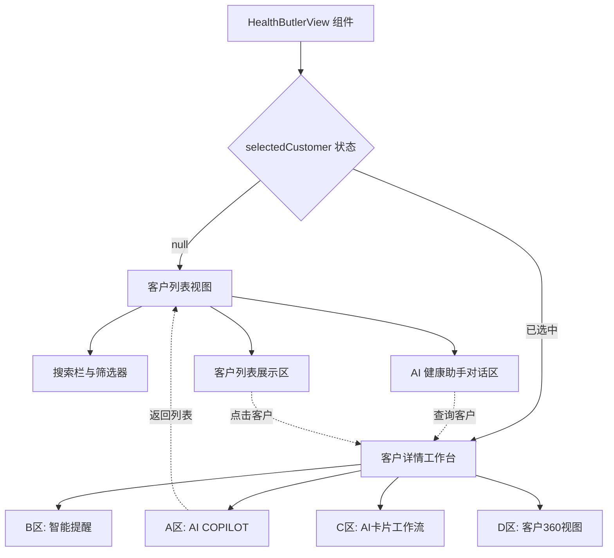

健康管家 AI 是面向健康管理师的综合工作台，通过 AI 辅助能力实现客户健康数据的全景式管理、智能随访编排和个性化服务推荐。该模块采用双视图架构设计，在客户列表视图与客户详情工作台之间无缝切换，为健康管家提供从宏观队列管理到微观个体跟踪的完整操作链路。系统集成了实时健康指标监测、智能提醒推送、AI 辅助决策和客户 360 视图等核心能力，形成以客户为中心的健康管理闭环。

## 架构设计与视图模式

健康管家 AI 采用**双视图模式**架构，根据是否选中具体客户呈现不同的界面布局。这种设计将"队列级管理"与"个体级服务"分离，使健康管家能够在宏观层面快速定位目标客户，在微观层面深入执行具体服务任务。

视图切换通过 `selectedCustomer` 状态控制，该状态为 `null` 时展示客户列表视图（含全局 AI 助手），当用户通过搜索或列表点击选中客户后，界面转换为四区域工作台布局，专注于单个客户的深度服务。这种状态驱动的视图切换确保了界面逻辑的清晰性和可预测性。

Sources: [HealthButlerView.tsx](src/components/HealthButlerView.tsx#L56-L65)

### 客户列表视图架构

客户列表视图采用三段式横向布局，将全局搜索与筛选、AI 交互、客户队列管理三大核心能力并置呈现。顶部搜索栏支持关键词查询和主题标签筛选（全部、术后修复、慢病管理、高风险），同时集成 ERP 数据同步按钮，确保客户信息的实时性和准确性。左侧 AI 健康助手占据 4 列宽度，提供自然语言交互入口，支持直接查询客户健康状态或执行管理指令。右侧客户列表占据 8 列宽度，以卡片式表格展示客户基本信息、当前状态、健康指标和风险等级，每条记录支持点击进入详情工作台。

Sources: [HealthButlerView.tsx](src/components/HealthButlerView.tsx#L101-L332)

### 客户详情工作台架构

客户详情工作台采用四区域等宽网格布局（每区 3 列），围绕单个客户的健康管理需求提供全方位工具支持。A 区 AI COPILOT 作为智能助手入口，根据当前客户上下文生成话术、解读报告和总结内容。B 区智能提醒聚合今日待办、随访计划、预警通知和系统消息，按优先级和时效性组织任务队列。C 区 AI 卡片工作流提供工作简报、随访编排、套餐消耗规划和客户洞察四大决策支持模块，基于数据分析输出行动建议。D 区客户 360 视图整合健康档案、服务旅程和消费套餐三大维度的时间序列数据，形成客户全生命周期的可视化展示。

Sources: [HealthButlerView.tsx](src/components/HealthButlerView.tsx#L334-L746)

## 核心功能模块

### AI 健康助手交互系统

AI 健康助手是该模块的交互核心，通过类型安全的消息系统实现用户与 AI 的对话式协作。系统定义了 `ButlerMessage` 联合类型，支持普通文本消息和仪表板消息两种形态。普通消息承载用户提问和 AI 回复的文本内容，仪表板消息则附加客户数据对象，在对话中直接渲染可交互的客户健康看板卡片。这种设计允许 AI 在回答查询时同步呈现结构化数据，例如查询"张晓彤健康状态"时，AI 不仅返回文字说明，还展示包含血压、消耗进度、风险指数的实时数据卡片，用户可直接点击"添加至工作台"按钮进入详情视图。

消息发送流程通过 `handleSendMessage` 函数统一处理，支持顶部搜索栏和底部输入框两种入口。函数首先将用户消息追加至消息列表，然后通过 `setTimeout` 模拟异步 AI 响应。当前实现采用规则匹配策略，当输入包含"张晓彤"和"查询"或"健康状态"关键词时，返回带仪表板的客户数据消息，否则返回通用确认消息。这种架构为后续接入真实 AI 服务预留了扩展空间，只需替换模拟逻辑为 API 调用即可实现智能对话能力。

Sources: [HealthButlerView.tsx](src/components/HealthButlerView.tsx#L18-L99)

### 客户数据模型与健康指标

系统通过 `MOCK_CUSTOMERS` 常量定义客户数据结构，每个客户对象包含身份信息、健康状态标签、实时生理指标和风险评估四大维度。身份维度包括 `id`、`name`、`avatar` 和 `theme`（健康主题），用于界面展示和个性化标识。健康状态维度包括 `status`（当前状态描述）和 `tags`（多维度标签数组），支持术后修复、慢病管理、情绪监测等场景化分类。实时生理指标维度包括 `bp`（当前血压）、`lastBp`（上次血压）、`lipid`（血脂 LDL 值）和 `weight`（体重），为健康评估提供量化依据。风险评估维度包括 `risk`（风险描述或指数）、`consumption`（套餐消耗百分比）和 `lastVisit`（最近回访日期），综合反映客户的服务状态和健康趋势。

这些数据在客户列表视图中以紧凑的表格行展示，在客户详情工作台的 D 区则以时间序列和可视化图表形式深度呈现。血压指标采用"当前值 (上次值)"对比格式，血脂指标通过箭头标识异常波动，风险指数根据数值自动应用红色或绿色高亮，形成直观的健康状态信号。

Sources: [HealthButlerView.tsx](src/components/HealthButlerView.tsx#L11-L16)

### 智能提醒与任务管理

B 区智能提醒模块通过标签页切换机制聚合四类任务信息：今日待办、随访计划、预警通知和系统消息。每条提醒以独立卡片形式展示，包含任务标题、AI 建议内容、优先级标签和预计耗时。优先级分为紧急（红色）、重要（蓝色）和普通（灰色）三级，通过颜色编码和文字标注双重传达。任务卡片支持悬停交互，触发阴影加深和轻微上浮动画，引导用户点击查看详情或执行操作。

系统当前采用静态数据演示提醒逻辑，例如"VIP 张晓彤套餐 7 天后到期"标记为紧急优先级，AI 建议本周安排 2 次营养调理以避免浪费。"09:30 呼叫张晓彤 D14"随访任务标记为重要优先级并显示超时状态，提醒健康管家及时触达。这种基于优先级和时效性的任务组织方式，帮助健康管家在繁杂的日常工作中快速定位关键行动项。

Sources: [HealthButlerView.tsx](src/components/HealthButlerView.tsx#L473-L527)

### AI 辅助决策支持

C 区 AI 卡片工作流提供四大决策支持模块，通过数据分析和规则引擎输出行动建议。**AI 工作简报**聚合今日工作重点、KPI 完成率和风险客户数量，预估当日工作耗时并提示关键时间节点（如 18:00 前完成随访可自动生成周报）。**AI 随访编排**基于客户优先级和触达渠道推荐本周随访计划，显示成功率预测和执行建议（如语音+企微、视频等）。**套餐消耗规划**识别到期风险套餐并自动编排执行计划，通过进度条可视化本周执行进度（如 18/30 完成，60%）。**AI 客户洞察**结合运营索引识别高流失概率客户，输出针对性激活建议并提供"一键转为激活计划"快捷操作。

这四大模块形成从宏观规划到微观执行的完整决策链路，帮助健康管家在数据驱动下优化时间分配和服务策略。每个卡片都提供明确的行动按钮（如"同步至 B 区"、"下载报告"），将分析结果转化为可执行的任务项。

Sources: [HealthButlerView.tsx](src/components/HealthButlerView.tsx#L529-L628)

### 客户 360 视图与服务旅程

D 区客户 360 视图整合健康档案、服务旅程和消费套餐三大维度的时间序列数据，形成客户全生命周期的可视化展示。**健康档案**模块以列表形式展示核心生理指标（血压、血脂、体重），每项指标都标注当前值和对比基准，例如"血压 132/86 (上次 138/92)"清晰呈现改善趋势。**服务旅程**模块采用垂直时间轴设计，以圆点节点和连接线展示关键服务事件（最近回访完成、健康报告上传、待执行计划），不同状态通过填充和描边样式区分（已完成、进行中、待执行）。**消费 & 套餐**模块展示套餐消耗进度条和剩余天数，AI 根据消耗率和健康主题自动生成服务建议（如"本周安排 2 次术后修复、1 次心理疏导"）。

这种三维度整合视图使健康管家能够在单一界面内掌握客户的健康状况、服务历史和消费状态，避免在多个系统间切换带来的认知负担和信息碎片化。

Sources: [HealthButlerView.tsx](src/components/HealthButlerView.tsx#L630-L723)

## 技术实现细节

### 状态管理与组件通信

HealthButlerView 组件采用 React Hooks 管理三个核心状态：`selectedCustomer` 控制视图模式切换，`chatInput` 绑定用户输入，`messages` 维护对话历史。组件初始化时通过 `useState` 创建包含欢迎消息的消息数组，确保用户进入页面时立即看到 AI 助手的引导文案。`handleSendMessage` 函数通过闭包访问当前消息列表和输入状态，实现用户消息追加、输入框清空和 AI 响应模拟的完整流程。

消息唯一标识通过模块级计数器 `butlerMessageCounter` 生成，配合 `createButlerMessage` 工厂函数确保每条消息拥有稳定的 ID。这种设计避免了在消息数组变化时因索引或时间戳不稳定导致的 React 渲染问题，符合 React 列表渲染的最佳实践。

Sources: [HealthButlerView.tsx](src/components/HealthButlerView.tsx#L56-L99)

### 类型系统与消息多态

系统通过 TypeScript 联合类型实现消息的多态设计。`ButlerMessage` 类型定义了两种消息形态：普通消息包含 `id`、`role` 和 `content` 字段，仪表板消息额外包含 `type: 'dashboard'` 和 `customer` 字段。通过 `type` 字段作为判别式（discriminant），TypeScript 编译器能够在条件判断后自动收窄类型，确保访问 `customer` 字段时的类型安全。这种设计避免了使用可选字段和类型断言，提高了代码的可维护性和运行时安全性。

`ButlerMessagePayload` 类型复用相同的联合结构，但不包含 `id` 字段，专用于 `createButlerMessage` 函数的输入参数。这种输入输出类型的分离，确保了消息创建过程的封装性，外部代码无需关心 ID 生成逻辑。

Sources: [HealthButlerView.tsx](src/components/HealthButlerView.tsx#L18-L54)

### 动画与交互设计

组件使用 Framer Motion 库实现两类动画效果：客户列表项的交错入场动画和任务卡片的悬停交互。客户列表通过 `motion.button` 组件的 `initial`、`animate` 和 `transition` 属性配置，每项动画延迟通过索引计算（`delay: idx * 0.04`），形成自上而下的瀑布流入场效果。任务卡片通过 CSS 类实现悬停状态变化，包括阴影加深（`hover:shadow-xl`）、轻微上浮（`hover:-translate-y-1`）和主题色文字变化（`group-hover:text-brand`），通过 `transition-all` 实现平滑过渡。

视图切换通过 Tailwind CSS 的 `animate-in` 工具类实现淡入和缩放组合动画，客户列表视图使用 `fade-in zoom-in-95`，详情工作台使用 `fade-in slide-in-from-bottom-4`，两种不同的入场动效帮助用户感知界面模式的变化。

Sources: [HealthButlerView.tsx](src/components/HealthButlerView.tsx#L103-L106)

### 路由注册与懒加载

HealthButlerView 组件在 [pageRegistry.tsx](src/pageRegistry.tsx#L55-L58) 中通过 React.lazy 实现懒加载注册，确保该模块代码仅在用户访问 `/health-butler` 路径时才被加载，减小首屏包体积。页面注册表通过 `PAGE_RENDERERS` 映射将 `'health-butler'` 页面标识符映射到组件渲染函数，该函数返回包裹在 Suspense 中的 HealthButlerView 实例。Suspense 的 fallback 属性配置为 `PageLoadingFallback` 组件，展示骨架屏占位符，在模块加载完成前提供视觉反馈。

路由元信息在 [navigationData.ts](src/data/navigationData.ts#L58) 中定义，包括路径 `/health-butler`、标题 `健康管家AI` 和实现状态 `implemented: true`。该页面被归类在"AI智能驾驶舱"导航组下，与医疗 AI 工作台、护士 AI 工作台等模块并列展示。

Sources: [pageRegistry.tsx](src/pageRegistry.tsx#L55-L58) [navigationData.ts](src/data/navigationData.ts#L58)

## 界面布局与样式规范

### 客户列表视图布局

客户列表视图采用 12 列网格系统，左侧 AI 健康助手占据 4 列（`col-span-4`），右侧客户列表占据 8 列（`col-span-8`）。AI 助手区域包含三个垂直分区：头部（标题、状态指示器）、消息列表（可滚动区域）和输入区（快捷提问按钮、输入框、发送按钮）。客户列表区域包含表头行、数据行列表和分页控件三个部分，数据行采用 12 列子网格分配内容：客户基本信息 4 列、当前状态 3 列、健康指标 & 风险 3 列、操作按钮 2 列。

所有卡片容器统一使用 `bg-white/60 backdrop-blur-xl` 实现毛玻璃效果，边框采用 `border-white/80` 保持与背景的协调性。圆角统一使用 `rounded-3xl`（24px），阴影采用 `shadow-sm` 轻微投影，营造轻盈现代的视觉风格。

Sources: [HealthButlerView.tsx](src/components/HealthButlerView.tsx#L141-L329)

### 客户详情工作台布局

详情工作台采用四区域等宽布局，每个区域占据 3 列（`col-span-3`），垂直方向通过 `space-y-4` 或 `space-y-6` 控制内部元素间距。A 区 AI COPILOT 包含客户信息头部、对话消息列表和多行输入区，输入区支持文本输入和报告上传两种操作。B 区智能提醒采用标签页切换设计，当前激活标签使用 `bg-brand text-white` 高亮，非激活标签使用 `bg-white border border-slate-100` 保持低调。C 区 AI 卡片工作流采用垂直卡片堆叠，每张卡片包含标题、描述文本、数据可视化和行动按钮，卡片间距通过 `space-y-6` 控制。D 区客户 360 视图采用分区设计，健康档案、服务旅程和消费套餐三大模块通过标题和分隔线明确区分，服务旅程使用时间轴组件可视化历史事件。

Sources: [HealthButlerView.tsx](src/components/HealthButlerView.tsx#L354-L723)

### 配色方案与视觉层次

系统采用品牌色（brand）和语义色构建视觉层次。品牌色用于主要按钮、激活状态、进度条和强调文字，通过 Tailwind 的 `bg-brand`、`text-brand`、`border-brand` 等工具类应用。语义色包括红色（紧急/高风险）、蓝色（重要/信息）、橙色（警告/中等风险）、绿色（正常/低风险），通过 `text-red-500`、`bg-blue-50` 等类实现状态可视化。中性色系从 `slate-50` 到 `slate-900` 构建九级灰度，用于背景、边框、次要文字等非强调元素。

视觉层次通过字号、字重和颜色深浅三层维度建立。标题使用 `text-xl` 或 `text-2xl` 配合 `font-bold`，描述文本使用 `text-xs` 或 `text-sm` 配合 `font-medium` 或 `font-bold`。次要信息（如时间戳、标签）使用 `text-slate-400` 降低视觉权重，重要数据（如 KPI 完成率、风险指数）使用 `text-slate-900` 或品牌色提升关注度。

Sources: [HealthButlerView.tsx](src/components/HealthButlerView.tsx#L269-L304)

## 扩展与集成方向

### 真实 AI 服务接入

当前系统采用规则匹配和 `setTimeout` 模拟 AI 响应，为接入真实 AI 服务预留了清晰扩展点。`handleSendMessage` 函数中的 AI 响应逻辑可替换为异步 API 调用，通过 `services/api.ts` 中的 Axios 客户端发送请求至后端 AI 服务。响应数据应遵循 `ButlerMessagePayload` 类型定义，支持普通文本和仪表板两种消息形态。后端 AI 服务可基于客户数据、历史对话和业务规则生成智能回复，并通过自然语言理解技术识别用户意图（查询客户、执行操作、请求建议等），返回结构化的行动指令或数据可视化配置。

Sources: [HealthButlerView.tsx](src/components/HealthButlerView.tsx#L74-L99)

### ERP 数据同步与实时更新

顶部搜索栏的"同步 ERP 客户数据"按钮当前为静态展示，可扩展为触发真实数据同步流程的入口。点击按钮后调用 ERP 集成 API，拉取最新客户信息、健康指标和服务记录，更新 `MOCK_CUSTOMERS` 数据源（实际应替换为 React Query 缓存或全局状态）。同步状态可通过按钮图标旋转动画（`animate-spin`）和禁用状态（`disabled`）提供视觉反馈，同步完成后通过 Toast 通知提示用户数据已更新。

实时数据更新可通过 WebSocket 连接实现，后端在客户健康指标变化、套餐消耗进度更新或服务状态变更时推送事件，前端监听事件并更新对应客户的数据展示。这种推送模式避免了轮询带来的性能开销，确保健康管家始终基于最新数据做出决策。

Sources: [HealthButlerView.tsx](src/components/HealthButlerView.tsx#L130-L137)

### 多渠道触达集成

B 区智能提醒和 C 区随访编排模块多次提及"语音+企微"、"视频"等多渠道触达方式，当前为静态文本展示。系统可扩展集成电话呼叫、企业微信消息、视频会议等渠道 API，在任务卡片中添加一键触达按钮。点击按钮后调用对应渠道 SDK，自动拨打电话、发送模板消息或创建视频会议室，并在系统中记录触达日志和客户反馈。这种集成将任务管理从"提醒"升级为"执行"，减少健康管家在多个工具间切换的操作成本。

Sources: [HealthButlerView.tsx](src/components/HealthButlerView.tsx#L473-L527)

## 相关文档

- **医疗 AI 工作台**：了解其他 AI 工作台的设计模式和功能对比，参见[医疗 AI 工作台](14-yi-liao-ai-gong-zuo-tai)
- **护士 AI 工作台**：探索护士视角的健康管理工作台实现，参见[护士 AI 工作台](16-hu-shi-ai-gong-zuo-tai)
- **页面注册表与懒加载策略**：深入理解路由注册和代码分割机制，参见[页面注册表与懒加载策略](9-ye-mian-zhu-ce-biao-yu-lan-jia-zai-ce-lue)
- **动态导航数据源**：了解导航结构和页面元信息配置，参见[动态导航数据源](10-dong-tai-dao-hang-shu-ju-yuan)
- **Axios 客户端封装与拦截器**：为 AI 服务接入准备 API 调用基础设施，参见[Axios 客户端封装与拦截器](11-axios-ke-hu-duan-feng-zhuang-yu-lan-jie-qi)