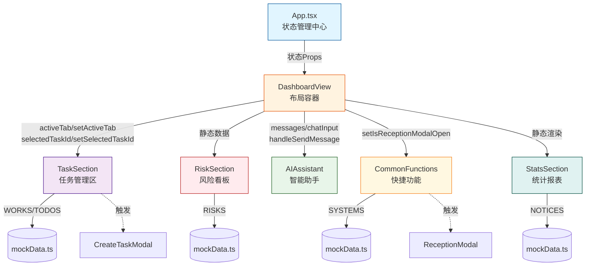

仪表盘（DashboardView）作为平台的首页核心视图，承担着业务概览展示、任务流转管理、风险预警监控和 AI 辅助决策的四重职责。该模块采用**组件化分层架构**，将复杂业务场景拆解为五个独立但协作的功能区域：TaskSection（任务管理）、RiskSection（风险看板）、StatsSection（统计报表）、CommonFunctions（快捷功能）和 AIAssistant（智能助手），通过 Props 驱动的状态共享机制实现跨组件通信，为用户提供一站式的业务运营全景视图。

## 架构设计与组件协作

DashboardView 作为容器组件，采用**组合模式（Composition Pattern）**编排五个业务子组件，遵循单一职责原则：每个子组件专注单一业务领域，容器组件仅负责布局编排和状态传递。这种设计使得各功能模块可独立开发、测试和维护，同时通过 Props 接口实现松耦合协作。组件间的数据流向采用**单向数据流**范式，所有状态由父组件 App.tsx 统一管理，通过回调函数向下传递状态变更能力，确保数据流的可追溯性和可预测性。



**核心设计特征**体现在三个维度：首先是**布局响应式**，采用 Tailwind CSS 的 Grid 系统（`grid-cols-1 xl:grid-cols-4`），根据视口宽度自动调整组件排列，在桌面端呈现多列布局，移动端自动降级为单列堆叠；其次是**视觉一致性**，所有卡片容器统一使用 `bg-white/40 backdrop-blur-xl border-white/60` 的玻璃态（Glass Morphism）样式，配合 `rounded-3xl` 圆角和微妙阴影，营造现代感与层次感；最后是**交互反馈**，任务卡片支持选中态视觉增强（`scale-105 rotate-1 ring-1`），悬停时触发平移动画（`hover:-translate-y-1`），为用户提供即时的操作确认感。

Sources: [DashboardView.tsx](src/components/DashboardView.tsx#L1-L75)

## 任务管理核心逻辑

TaskSection 组件实现了**双模式任务视图**，通过 `activeTab` 状态在"我的工作"（Work）和"待办事项"（Todo）之间切换，数据源分别来自 mockData.ts 中的 WORKS 和 TODOS 数组。组件采用**受控组件模式**，所有交互状态（activeTab、selectedTaskId）由父组件通过 Props 传入，状态变更通过回调函数（setActiveTab、setSelectedTaskId）向上冒泡，确保父组件能够感知并响应子组件的用户操作。这种状态提升（Lifting State Up）策略使得 TaskSection 与其他组件（如 AI 助手）能够共享选中任务的上下文，为跨组件协作奠定基础。

任务卡片采用**渐进式信息展示**架构：顶部展示任务标题和时间范围，中部通过浅色背景区域（`bg-slate-50/50`）突出任务描述，底部通过进度条（Progress Bar）和执行人头像（Assignees）展示任务状态。进度条使用**三段式颜色编码**：进度 >80% 显示品牌蓝色（`bg-brand`），40%-80% 显示橙色（`bg-orange-400`），<40% 显示红色（`bg-red-400`），通过视觉隐喻快速传达任务紧急程度。卡片选中态通过 CSS Transform 实现 3D 提升效果（`scale-105 rotate-1`），配合 z-index 层级调整（`z-20`），使选中卡片在视觉上"浮起"于其他卡片之上。

| 功能特性 | 实现方式 | 用户价值 |
|---------|---------|---------|
| Tab 切换 | `activeTab` 状态控制数据源切换 | 快速在长期工作和临时待办间切换 |
| 任务选中 | `selectedTaskId` + 视觉增强反馈 | 明确当前操作焦点，支持后续操作 |
| 排序/筛选 | 按钮预留交互入口（待实现） | 支持按优先级、时间等维度组织任务 |
| 新建任务 | 触发 `setIsCreateModalOpen(true)` | 统一的任务创建入口 |
| 执行人展示 | `-space-x-2` 头像堆叠布局 | 快速识别任务协作人员 |
| 评论/附件计数 | MessageSquareText/Paperclip 图标 + 数字 | 评估任务沟通成本和复杂度 |

**新建任务按钮**采用**虚线边框占位符**设计（`border-2 border-dashed`），通过视觉差异化引导用户点击，悬停时边框颜色过渡为品牌色（`hover:border-brand/40`），配合图标放大动画（`group-hover:scale-110`），提供清晰的交互暗示。这种设计模式遵循了**菲茨定律（Fitts's Law）**，通过增大可点击区域和视觉反馈降低用户操作认知负担。

Sources: [TaskSection.tsx](src/components/TaskSection.tsx#L1-L144)  
Sources: [mockData.ts](src/data/mockData.ts#L18-L142)

## 风险预警与通知系统

RiskSection 组件实现了**四级风险分类体系**，通过 `theme` 属性（red/blue/green/yellow）映射不同严重程度的业务事件：红色（red）代表紧急异常需立即处理（如数据库连接失败），蓝色（blue）表示信息通知需确认（如新政策发布），绿色（green）标记已完成事项（如支付成功），黄色（yellow）预警潜在风险（如资源不足）。每个风险项通过**渐变色背景层**（`bg-gradient-to-r from-{color}-50/50`）强化视觉分类，配合左侧图标区域的差异化配色，实现快速风险等级识别。

风险卡片采用**绝对定位背景层 + 相对定位内容层**的双层结构：底层渐变背景通过 `absolute left-0 top-0 bottom-0 w-32` 实现左侧色带效果，不干扰内容布局；内容层通过 `relative z-10` 确保文字和图标在背景之上渲染。这种分层设计避免了复杂的边框或背景色嵌套，保持了 DOM 结构的简洁性。已完成的风险项通过 `opacity-60 grayscale` 样式降级显示，视觉上与未处理项形成对比，引导用户优先关注待处理风险。

StatsSection 组件整合了**AI 效能统计**和**通知公告**两大信息板块。统计区通过 StatCard 子组件展示四个核心指标：今日处理项数、SOP 达标率、AI 节省时长、跨系统调用次数，每个指标卡片包含数值、单位、趋势三要素，趋势向上时显示 TrendingUp 图标并使用品牌色（`text-brand`）强调。通知公告区展示 NOTICES 数据，每条通知包含**AI 摘要功能**，通过浅蓝色背景区块（`bg-brand-light/50`）和 Sparkles 图标标识 AI 生成内容，未读通知通过红色圆点（`bg-[#FF5F57]`）和发光阴影（`shadow-[0_0_5px_rgba(255,95,87,0.5)]`）吸引注意力。

| 数据源 | 字段结构 | 渲染组件 | 交互能力 |
|--------|---------|---------|---------|
| WORKS/TODOS | id, title, system, sla, progress, assignees | TaskSection | 选中、新建、Tab 切换 |
| RISKS | id, title, theme, description, link, completed | RiskSection | 关闭、链接跳转 |
| NOTICES | id, title, date, aiSummary, read | StatsSection | 标记已读、查看全部 |
| SYSTEMS | id, name, icon, count, color | CommonFunctions | 打开对应业务模块 |

**通知的 AI 摘要**特性展示了平台智能化方向：每条公告自动生成 3 点核心内容摘要，通过结构化呈现（"核心三点：1. ... 2. ... 3. ..."）降低用户阅读长文本的认知成本。这种设计体现了**渐进式披露（Progressive Disclosure）**原则，用户可通过摘要快速判断通知相关性，再决定是否查看完整内容。

Sources: [RiskSection.tsx](src/components/RiskSection.tsx#L1-L67)  
Sources: [StatsSection.tsx](src/components/StatsSection.tsx#L1-L95)  
Sources: [mockData.ts](src/data/mockData.ts#L144-L245)

## AI 助手与快捷功能集成

AIAssistant 组件实现了**双模式聊天界面**：嵌入式面板（Embedded Panel）和悬浮窗口（Floating Window）。嵌入式面板固定在仪表盘布局中，高度固定为 600px，通过 `flex flex-col` 实现消息区域自适应和输入框固定底部的布局；悬浮窗口通过 `fixed bottom-8 right-8 z-50` 定位在屏幕右下角，使用 Framer Motion 的 AnimatePresence 实现淡入淡出动画（`opacity: 0 → 1, y: 20 → 0`），点击关闭按钮时触发退出动画。两种模式共享相同的状态（messages、chatInput）和消息处理逻辑（handleSendMessage），通过条件渲染实现 UI 切换。

**推荐问题机制**通过 `suggestedPrompts` 数组预定义四个典型业务场景：客户云仓库存查询、约车调度查询、效能报告生成、政策文件检索。每个推荐问题包含文本内容（text）和业务标签（tag），用户点击后直接触发 `handleSendMessage(prompt.text)`，无需手动输入。这种设计降低了 AI 助手的使用门槛，同时通过标签分类（"客户云仓"、"约车调度"）帮助用户理解 AI 能力边界。消息渲染逻辑（`renderMessageContent`）通过内容前缀识别特殊格式：以 emoji 开头的行（📊、🚗）渲染为粗体标题，包含 `[点击` 的行渲染为可操作按钮。

CommonFunctions 组件实现了**业务系统快捷入口网格**，通过 5 列网格布局（`grid-cols-5`）展示 8 个业务模块图标。首个系统（"到院接待"）通过条件样式（`isActive`）突出显示：使用渐变背景（`bg-gradient-to-b from-brand to-brand-hover`）、更大尺寸（`w-[88px]`）、增强阴影（`shadow-[0_12px_30px_-8px_rgba(59,130,246,0.6)]`），引导用户优先访问高频功能。每个系统图标右上角显示待处理计数（`count > 0`），通过红色渐变徽章（`from-[#D54941] to-red-500`）和白色边框（`border-2 border-white`）确保数字在复杂背景下的可读性。

```typescript
// AI 消息处理流程（简化版）
const handleSendMessage = (overrideText?: string) => {
  const query = overrideText ?? chatInput;
  if (!query.trim()) return;
  
  // 1. 添加用户消息
  setMessages(prev => [...prev, createAppMessage('user', query)]);
  setChatInput('');
  
  // 2. 模拟 AI 响应（实际项目中应替换为真实 API 调用）
  setTimeout(() => {
    let response = '已为您汇总相关数据。';
    if (query.includes('王先生') && query.includes('库存')) {
      response = '📊 **数据简报**\n王先生（ID: VIP-8821）在客户云仓当前剩余：...';
    }
    setMessages(prev => [...prev, createAppMessage('ai', response)]);
  }, 1000);
};
```

**快捷功能的点击路由**通过条件判断实现模块分发：点击"到院接待"图标时触发 `setIsReceptionModalOpen(true)`，打开接待信息录入弹窗；其他模块的点击逻辑待后续扩展。这种设计预留了**命令模式（Command Pattern）**的扩展空间：每个系统图标可关联独立的命令处理器，通过统一的 onClick 入口分发，未来可扩展为配置驱动的动态路由系统。

Sources: [AIAssistant.tsx](src/components/AIAssistant.tsx#L1-L252)  
Sources: [CommonFunctions.tsx](src/components/CommonFunctions.tsx#L1-L65)

## 状态管理与数据流

仪表盘的**全局状态**由 App.tsx 集中管理，通过 Zustand store（useAppStore）实现跨组件状态共享。核心状态包括：activeTab（当前任务 Tab）、selectedTaskId（选中任务 ID）、messages（AI 聊天记录）、chatInput（聊天输入框内容）、isAIOpen（悬浮助手开关）、isReceptionModalOpen（接待弹窗开关）、isCreateModalOpen（新建任务弹窗开关）。这些状态通过 Props 向下传递给 DashboardView，再由 DashboardView 分发给各个子组件，形成**单向数据流**：状态向下流动，事件向上冒泡。

**消息状态管理**采用**不可变更新模式**：通过 `setMessages(prev => [...prev, newMessage])` 追加新消息，避免直接修改原数组。每条消息通过 `createAppMessage` 工厂函数生成，包含唯一 ID（`msg-${messageIdCounter}`）、角色（ai/user）、内容三要素，ID 自增计数器（`messageIdCounter`）确保 React 列表渲染的 key 唯一性。消息列表渲染时跳过首条消息（`messages.slice(1)`），因为首条消息是 AI 欢迎语，固定显示在聊天输入框上方，不参与滚动区域渲染。

**弹窗状态协调**体现了组件间的协作模式：TaskSection 中的"新建任务"按钮触发 `setIsCreateModalOpen(true)`，CommonFunctions 中的"到院接待"图标触发 `setIsReceptionModalOpen(true)`，两个弹窗组件（CreateTaskModal、ReceptionModal）在 App.tsx 中渲染，通过 Props 控制显示状态。这种**状态提升 + 条件渲染**的模式避免了在子组件中维护弹窗 DOM，使得弹窗可复用于其他页面（如直接从侧边栏触发），同时父组件可监听弹窗关闭事件执行后续逻辑（如刷新任务列表）。

| 状态名称 | 类型 | 管理组件 | 影响范围 |
|---------|------|---------|---------|
| activeTab | 'work' \| 'todo' \| 'risk' | App.tsx | TaskSection 数据源切换 |
| selectedTaskId | number \| null | App.tsx | TaskSection 卡片选中态 |
| messages | DashboardMessage[] | App.tsx | AIAssistant 消息列表 |
| chatInput | string | App.tsx | AIAssistant 输入框 |
| isAIOpen | boolean | App.tsx | AIAssistant 悬浮窗口显示 |
| isReceptionModalOpen | boolean | App.tsx | ReceptionModal 弹窗显示 |
| isCreateModalOpen | boolean | App.tsx | CreateTaskModal 弹窗显示 |

**会话恢复机制**通过 useEffect 钩子实现：组件挂载时检查本地是否存在 token，若存在但内存态未恢复（`!isAuthenticated`），则调用 `restoreSession()` 从后端拉取用户信息并恢复登录态。这种设计确保用户刷新页面后无需重新登录，同时通过 `isAuthBootstrapping` 状态显示加载提示，避免在会话恢复期间渲染未授权内容。会话恢复失败时，axios 拦截器会触发 `auth:logout` 事件，App.tsx 监听该事件并执行 `logout()` 清理状态，自动重定向到登录页。

Sources: [App.tsx](src/App.tsx#L1-L253)  
Sources: [types.ts](src/types.ts#L1-L80)

## 扩展与定制指南

**添加新任务类型**需要扩展 mockData.ts 中的数据结构和 TaskSection 的渲染逻辑：首先在 types.ts 中定义新的接口（如 `interface UrgentTask extends Todo`），然后在 mockData.ts 中添加数据源（如 `export const URGENT_TASKS: UrgentTask[] = [...]`），最后在 TaskSection 中增加第三个 Tab（"紧急任务"），通过条件判断选择对应数据源（`const currentTasks = activeTab === 'urgent' ? URGENT_TASKS : ...`）。这种**数据驱动 UI** 的模式使得新增业务类型无需修改组件核心逻辑，仅需扩展数据层和条件分支。

**自定义风险主题**需要修改 RiskSection 的主题映射逻辑：当前支持 red/blue/green/yellow 四种主题，通过 `risk.theme` 属性动态生成样式类名。若需添加新主题（如 purple），需在三个位置同步修改：渐变背景层（`from-purple-50/50`）、图标容器背景（`bg-purple-50`）、图标颜色（`text-purple-500`），并在 mockData.ts 的 RISKS 数据中添加对应 `theme: 'purple'` 的测试数据。建议将主题配置抽取为常量对象（如 `THEME_STYLES = { red: {...}, purple: {...} }`），通过对象查找替代 switch-case，提高代码可维护性。

**接入真实 AI 服务**需要替换 handleSendMessage 中的模拟响应逻辑：将 `setTimeout` 替换为 axios 调用后端 AI 接口，传递用户查询（query）和上下文信息（如 selectedTaskId 对应的任务详情），接收流式或完整响应后更新 messages 状态。若后端支持流式输出（Server-Sent Events），需使用 EventSource 或 WebSocket 建立长连接，通过 `setMessages(prev => updateLastMessage(prev, chunk))` 逐步更新最后一条 AI 消息的内容，实现打字机效果。建议将 AI 调用逻辑封装为独立 Hook（如 `useAIChat`），分离业务逻辑与 UI 渲染。

**性能优化建议**针对大数据量场景：当任务列表超过 50 项时，建议引入虚拟滚动（Virtual Scrolling）库（如 react-window），仅渲染可视区域内的任务卡片，避免 DOM 节点过多导致卡顿；通知公告区域可通过分页或懒加载（Lazy Load）减少初始渲染负担；AI 消息列表可通过 `React.memo` 包裹消息组件，避免无关状态变更触发全量重渲染。对于频繁更新的统计指标（如实时处理项数），建议使用 WebSocket 推送更新，避免轮询请求造成的性能浪费。

Sources: [mockData.ts](src/data/mockData.ts#L1-L245)  
Sources: [types.ts](src/types.ts#L1-L80)

---

**延伸阅读**：
- 了解任务创建弹窗的实现细节，请参考 [模态框与交互组件](24-mo-tai-kuang-yu-jiao-hu-zu-jian)
- 探索更多 AI 工作台的业务场景，请查看 [医疗 AI 工作台](14-yi-liao-ai-gong-zuo-tai) 和 [顾问 AI 工作台](15-gu-wen-ai-gong-zuo-tai)
- 深入理解全局状态管理模式，请阅读 [Zustand 全局状态管理](7-zustand-quan-ju-zhuang-tai-guan-li)