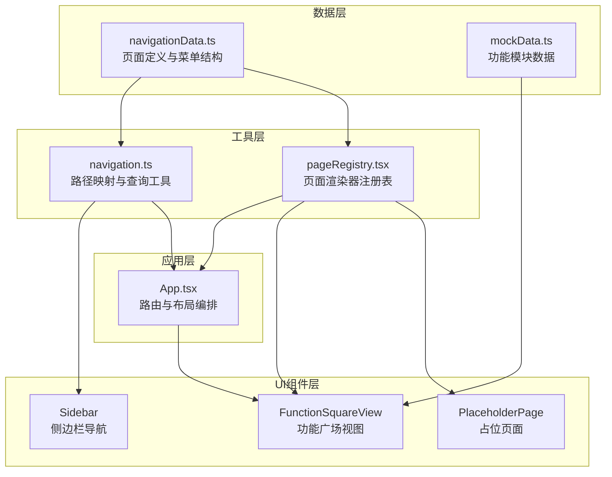

**功能广场**是 AI Business Platform 的核心导航枢纽，通过模块化的功能卡片布局和层级化导航结构，为用户提供清晰的功能发现路径和智能推荐体验。该系统采用**数据驱动的导航架构**，将路由定义、菜单结构、页面元信息统一管理，确保了导航系统的一致性与可维护性。

## 架构设计概览

功能广场与导航系统遵循**单一数据源原则**，通过 `navigationData.ts` 集中定义所有页面元数据和导航结构，再由工具函数派生出路径映射、标题映射和页面状态查询接口。这种设计使得路由系统、侧边栏组件、面包屑导航等都能从同一数据源获取信息，避免了多源数据同步的复杂性。



从架构图可见，**navigationData.ts 作为核心数据源**同时供给导航工具层和页面注册表，而 FunctionSquareView 则从 mockData 获取功能模块数据，实现了导航元数据与业务数据的解耦。Sources: [navigationData.ts](src/data/navigationData.ts#L1-L190), [navigation.ts](src/navigation.ts#L1-L68), [pageRegistry.tsx](src/pageRegistry.tsx#L1-L139)

## 导航数据源设计

### 页面定义与类型系统

导航系统的类型安全建立在三个核心类型之上：`AppPage` 定义了所有合法的页面标识符，`PageDefinition` 描述单个页面的路径、标题、实现状态和占位描述，`NavigationItemDefinition` 则定义了导航菜单项的结构，支持图标、徽章和子菜单层级。

```typescript
// 页面标识符联合类型，确保类型安全
export type AppPage =
  | 'login' | 'dashboard' | 'function-square' | 'ui-builder'
  | 'meeting-bi' | 'consultant-ai' | 'medical-ai' | 'nurse-ai'
  | 'health-butler' | 'appointment-ai' | 'dispensing-ai'
  | 'deal-management' | 'consumption-management' | 'client-cloud'
  | 'data-portal' | 'meeting-management' | 'ai-diagnosis'
  | 'ai-decision' | 'ai-rehab' | 'customer-search'
  | 'notices' | 'settings';

// 页面元信息结构
export interface PageDefinition {
  path: string;              // URL 路径
  title: string;             // 页面标题
  implemented: boolean;      // 是否已实现
  placeholderDescription?: string;  // 占位页面的描述文案
}
```

`PAGE_DEFINITIONS` 对象以 `AppPage` 为键，存储了所有页面的完整定义。对于未实现的页面（如 `appointment-ai`、`dispensing-ai` 等），通过 `placeholderDescription` 字段提供业务描述，使得占位页面能够向用户传达功能规划。Sources: [navigationData.ts](src/data/navigationData.ts#L2-L48)

### 导航菜单层级结构

导航菜单分为**主导航**（NAVIGATION_ITEMS）和**底部导航**（FOOTER_NAVIGATION_ITEMS）两部分。每个导航项通过 `children` 字段定义子菜单，形成层级结构。例如，"AI智能驾驶舱" 作为一个父级菜单，包含了顾问 AI、医疗 AI、护士 AI、健康管家等 12 个子页面。

| 导航项 | 图标 | 子页面数量 | 说明 |
|--------|------|------------|------|
| 首页 | home | 0 | 仪表盘入口 |
| AI智能驾驶舱 | layout-dashboard | 12 | 包含各类 AI 工作台 |
| 特色服务 | sparkles | 3 | AI 辅助诊断、决策、康复 |
| 客户查询 | search | 0 | 客户档案检索 |
| 通知公告 | bell | 0 | 带 3 个未读徽章 |
| 工作台设置 | settings | 0 | 个性化配置 |

这种层级结构在 Sidebar 组件中被渲染为可折叠的菜单树，通过 `isNavigationGroupActive` 函数判断当前激活的导航组，确保父子菜单的联动高亮。Sources: [navigationData.ts](src/data/navigationData.ts#L134-L189), [navigation.ts](src/navigation.ts#L57-L67)

## 功能广场视图实现

### 三段式内容布局

FunctionSquareView 采用**垂直分区的三段式布局**，通过视觉层次引导用户注意力：顶部是带搜索框的 Hero 区域，中部是最新功能和 AI 推荐两个平行的功能网格，底部是全部功能的完整列表。每个分区使用不同的卡片尺寸和排列密度，形成渐进式的信息呈现。

```typescript
// 三段式布局结构
<div className="space-y-10 pb-12">
  {/* 1. Hero 搜索区 - 全宽背景 + 居中搜索框 */}
  <section className="relative py-16 px-8 rounded-[32px]">
    <div className="max-w-3xl mx-auto text-center">
      <h2>探索解决方案 🧐 激发团队灵感</h2>
      <input placeholder="搜索功能、应用或解决方案..." />
    </div>
  </section>

  {/* 2. 最新上新 - 4 列大卡片网格 */}
  <section>
    <div className="grid grid-cols-1 md:grid-cols-2 lg:grid-cols-4 gap-6">
      {FUNCTION_MODULES.latest.map(item => ...)}
    </div>
  </section>

  {/* 3. AI 推荐 - 3 列紧凑卡片网格 */}
  <section>
    <div className="grid grid-cols-1 md:grid-cols-2 lg:grid-cols-3 gap-6">
      {FUNCTION_MODULES.recommended.map(item => ...)}
    </div>
  </section>

  {/* 4. 全部功能 - 3 列紧凑卡片网格 */}
  <section>
    <div className="grid grid-cols-1 md:grid-cols-2 lg:grid-cols-3 gap-6">
      {FUNCTION_MODULES.all.map(item => ...)}
    </div>
  </section>
</div>
```

**最新上新**区域使用 4 列布局的大卡片（高 160px），卡片顶部展示封面图，底部展示标题和描述，通过 `motion.button` 实现点击跳转（目前仅 AI 辅助诊断实现了点击跳转逻辑）。**AI 推荐功能**和**全部功能**区域采用更紧凑的横向布局，左侧为 48x48 的图标，右侧为标题和描述的单行文本。Sources: [FunctionSquareView.tsx](src/components/FunctionSquareView.tsx#L14-L151)

### 功能模块数据结构

功能模块数据定义在 `FUNCTION_MODULES` 对象中，分为三个数组：`latest`（最新上新，4 个）、`recommended`（AI 推荐，6 个）、`all`（全部功能，11 个）。每个模块包含 `id`、`title`、`desc`、`icon`（图片 URL）、`tag`（分类标签）五个字段。

| 数据集 | 数量 | 布局方式 | 卡片尺寸 | 典型标签 |
|--------|------|----------|----------|----------|
| latest | 4 | 4 列网格 | 大卡片（含封面图） | 智能医疗、临床决策、运营管理 |
| recommended | 6 | 3 列网格 | 紧凑横向卡片 | 患者管理、用药安全、提效工具 |
| all | 11 | 3 列网格 | 紧凑横向卡片 | 管理、临床、服务、药事、经营 |

数据使用 Unsplash 图片作为功能图标，通过 `auto=format&fit=crop&q=80` 参数优化加载性能。标签（tag）在 UI 中以徽章形式展示，`latest` 区域使用半透明黑色徽章（`bg-black/50`），`recommended` 使用品牌色徽章（`bg-brand/10`），`all` 使用灰色徽章（`bg-slate-100`）。Sources: [mockData.ts](src/data/mockData.ts#L216-L244)

### 动画与交互设计

功能广场使用 **motion/react**（原 Framer Motion）实现入场动画。每个功能卡片通过 `initial`、`animate`、`transition` 三个属性定义动画行为：最新功能采用垂直上移淡入（`y: 20`），AI 推荐采用水平左移淡入（`x: -20`），全部功能采用缩放淡入（`scale: 0.95`）。`delay` 参数基于索引递增，形成瀑布流入场效果。

```typescript
// 最新功能：垂直上移动画
<motion.button
  initial={{ opacity: 0, y: 20 }}
  animate={{ opacity: 1, y: 0 }}
  transition={{ delay: idx * 0.1 }}
>

// AI 推荐：水平左移动画
<motion.div
  initial={{ opacity: 0, x: -20 }}
  animate={{ opacity: 1, x: 0 }}
  transition={{ delay: idx * 0.05 }}
>

// 全部功能：缩放动画
<motion.div
  initial={{ opacity: 0, scale: 0.95 }}
  animate={{ opacity: 1, scale: 1 }}
  transition={{ delay: idx * 0.05 }}
>
```

交互层面，卡片通过 `group` 类实现 hover 状态的子元素联动：封面图在 hover 时放大 5%（`group-hover:scale-105`），标题文字变为品牌色（`group-hover:text-brand`），卡片阴影从 `shadow-sm` 升级到 `shadow-xl`，营造浮动反馈。Sources: [FunctionSquareView.tsx](src/components/FunctionSquareView.tsx#L48-L149)

## 导航工具函数体系

### 路径与标题映射

`navigation.ts` 从 `PAGE_DEFINITIONS` 派生出两个核心映射对象：`PAGE_PATHS` 将页面标识符映射到 URL 路径，`PAGE_TITLES` 将页面标识符映射到标题文本。这两个映射通过 `Object.fromEntries` 和 `Object.entries` 动态生成，确保与数据源同步。

```typescript
// 路径映射：{ dashboard: '/', 'function-square': '/function-square', ... }
export const PAGE_PATHS = Object.fromEntries(
  Object.entries(PAGE_DEFINITIONS).map(([page, definition]) => 
    [page, definition.path]
  )
) as Record<keyof typeof PAGE_DEFINITIONS, string>;

// 标题映射：{ dashboard: 'AI业务工作台', 'function-square': '功能广场', ... }
export const PAGE_TITLES = Object.fromEntries(
  Object.entries(PAGE_DEFINITIONS).map(([page, definition]) => 
    [page, definition.title]
  )
) as Record<keyof typeof PAGE_DEFINITIONS, string>;
```

`IMPLEMENTED_PAGES` 数组过滤出所有 `implemented: true` 的页面标识符，用于路由守卫判断。`PLACEHOLDER_PAGE_DESCRIPTIONS` 则提取未实现页面的描述文案，供占位页面使用。Sources: [navigation.ts](src/navigation.ts#L21-L37)

### 路径解析与状态查询

导航系统提供三个核心查询函数：`getPageByPath` 根据路径返回页面标识符，`isKnownPath` 判断路径是否合法，`isImplementedPage` 判断页面是否已实现。这三个函数通过 `PATH_TO_PAGE` Map 实现高效查找。

```typescript
// 路径到页面的反向映射，支持 O(1) 查找
const PATH_TO_PAGE = new Map<string, keyof typeof PAGE_DEFINITIONS>(
  Object.entries(PAGE_DEFINITIONS).map(([page, definition]) => 
    [definition.path, page as keyof typeof PAGE_DEFINITIONS]
  )
);

// 根据路径获取页面标识符
export function getPageByPath(pathname: string): keyof typeof PAGE_DEFINITIONS | null {
  return PATH_TO_PAGE.get(pathname) ?? null;
}

// 判断导航组是否激活（支持父子联动）
export function isNavigationGroupActive(
  currentPage: keyof typeof PAGE_DEFINITIONS,
  page: keyof typeof PAGE_DEFINITIONS,
): boolean {
  const item = NAVIGATION_GROUPS.find((navigationItem) => navigationItem.page === page);
  if (!item) {
    return currentPage === page;
  }
  return item.page === currentPage || item.children?.includes(currentPage) === true;
}
```

`isNavigationGroupActive` 函数是侧边栏高亮逻辑的核心，当用户访问子页面时，父级菜单也会高亮显示，提升导航的上下文感知。Sources: [navigation.ts](src/navigation.ts#L39-L67)

## 页面注册与懒加载机制

### 组件映射表设计

`pageRegistry.tsx` 维护了一个 `PAGE_RENDERERS` 映射表，将页面标识符映射到渲染函数。每个渲染函数接收 `RouteRenderContext` 上下文，返回 React 组件。对于功能广场，渲染函数从上下文中提取 `navigateToPage` 回调，传递给 `FunctionSquareView`。

```typescript
type PageRenderer = (context: RouteRenderContext) => React.ReactNode;

const PAGE_RENDERERS: Partial<Record<AppPage, PageRenderer>> = {
  dashboard: ({ dashboard }) => <DashboardView {...dashboard} />,
  'function-square': ({ navigateToPage }) => (
    <FunctionSquareView setCurrentPage={navigateToPage} />
  ),
  'ui-builder': () => <UiBuilderPage />,
  'meeting-bi': () => <MeetingBiView />,
  'health-butler': () => <HealthButlerView />,
  'ai-diagnosis': () => <AIDiagnosisView />,
  'medical-ai': () => <MedicalAIWorkbench />,
  'nurse-ai': () => <NurseAIWorkbench />,
  'consultant-ai': () => <ConsultantAIWorkbench />,
};
```

所有页面组件通过 `React.lazy` 实现懒加载，将代码分割到独立的 chunk 文件。例如，`FunctionSquareView` 的加载器会在用户首次访问 `/function-square` 时才下载对应的 JavaScript 模块，显著减少首屏加载体积。Sources: [pageRegistry.tsx](src/pageRegistry.tsx#L40-L108)

### 降级渲染策略

`renderAppPage` 函数实现了两级降级策略：如果页面在 `PAGE_RENDERERS` 中有注册，使用 Suspense 包裹渲染器并显示加载骨架屏；如果页面未注册但 `implemented: true`，显示"页面未注册"的错误占位；如果页面 `implemented: false`，显示业务描述的占位页面。

```typescript
export function renderAppPage(page: AppPage, context: RouteRenderContext): React.ReactNode {
  const renderer = PAGE_RENDERERS[page];
  if (!renderer) {
    return renderFallbackPage(page);  // 降级到占位页面
  }
  return (
    <Suspense fallback={<PageLoadingFallback />}>
      {renderer(context)}
    </Suspense>
  );
}

function renderFallbackPage(page: AppPage): React.ReactNode {
  if (!isImplementedPage(page)) {
    return (
      <PlaceholderPage
        title={PAGE_TITLES[page]}
        description={PLACEHOLDER_PAGE_DESCRIPTIONS[page] ?? 
          '该页面的视觉容器和路由已就绪，后续可以直接补充真实业务逻辑。'}
      />
    );
  }
  return <PlaceholderPage title={PAGE_TITLES.dashboard} 
    description={`当前页面尚未注册到页面映射中，请检查 ${PAGE_PATHS[page]} 的页面注册配置。`} />;
}
```

`PageLoadingFallback` 组件显示骨架屏动画，通过 `animate-pulse` 类实现呼吸效果，避免白屏等待。Sources: [pageRegistry.tsx](src/pageRegistry.tsx#L110-L138)

## 侧边栏导航集成

### 图标映射与渲染

Sidebar 组件通过 `ICON_MAP` 对象将 `NavigationIcon` 类型（字符串字面量）映射到 Lucide React 的图标组件，实现类型安全的图标引用。导航项的 `icon` 字段是可选的，缺失时渲染为纯文本菜单项。

```typescript
const ICON_MAP: Record<NavigationIcon, LucideIcon> = {
  home: Home,
  'layout-dashboard': LayoutDashboard,
  sparkles: Sparkles,
  search: Search,
  bell: Bell,
  settings: Settings,
};
```

`renderNavigationItem` 函数处理两种导航项：有子菜单的项渲染为可展开的树形结构，无子菜单的项渲染为单级菜单。子菜单通过 `ml-9` 缩进和左侧竖线（`w-[1px]`）形成视觉层级。Sources: [Sidebar.tsx](src/components/Sidebar.tsx#L32-L179)

### 导航跳转实现

Sidebar 通过 React Router 的 `useNavigate` hook 获取导航函数，封装为 `goToPage` 回调。点击菜单项时，调用 `navigate(PAGE_PATHS[page])` 进行路由跳转，确保 URL 与页面状态同步。

```typescript
const navigate = useNavigate();

const goToPage = React.useCallback((page: AppPage) => {
  navigate(PAGE_PATHS[page]);
}, [navigate]);
```

侧边栏支持**折叠/展开**状态切换，通过 `isCollapsed` 状态控制宽度（`w-20` vs `w-72`）。折叠时，子菜单项自动隐藏，图标居中显示，通过 `justify-center` 类实现布局调整。Sources: [Sidebar.tsx](src/components/Sidebar.tsx#L116-L179)

## 扩展开发指南

### 添加新功能模块

要在功能广场添加新功能模块，需完成三步：首先在 `mockData.ts` 的 `FUNCTION_MODULES` 对应数组中添加模块数据（包含 id、title、desc、icon、tag）；其次在 `navigationData.ts` 中添加页面定义（如果需要独立页面）；最后在 `FunctionSquareView` 中添加点击跳转逻辑。

```typescript
// 1. 添加功能模块数据（mockData.ts）
export const FUNCTION_MODULES = {
  latest: [
    { id: 21, title: '新功能', desc: '功能描述', 
      icon: 'https://images.unsplash.com/...', tag: '分类' },
    // ...
  ]
};

// 2. 添加页面定义（navigationData.ts）
export const PAGE_DEFINITIONS: Record<AppPage, PageDefinition> = {
  'new-feature': { 
    path: '/new-feature', 
    title: '新功能', 
    implemented: false,
    placeholderDescription: '这里会承接新功能的业务逻辑。'
  },
  // ...
};

// 3. 添加跳转逻辑（FunctionSquareView.tsx）
onClick={() => item.title === '新功能' && setCurrentPage('new-feature')}
```

如果功能需要实现完整页面，还需在 `pageRegistry.tsx` 中注册渲染器并创建对应的视图组件。Sources: [mockData.ts](src/data/mockData.ts#L216-L244), [navigationData.ts](src/data/navigationData.ts#L49-L132)

### 添加新导航菜单项

新增导航菜单项需要修改 `navigationData.ts` 的 `NAVIGATION_ITEMS` 或 `FOOTER_NAVIGATION_ITEMS` 数组。如果菜单项有子页面，通过 `children` 字段定义；如果需要徽章（如未读数量），通过 `badge` 字段指定。

```typescript
// 添加带子菜单的导航项
export const NAVIGATION_ITEMS: NavigationItemDefinition[] = [
  {
    page: 'new-category',
    label: '新分类',
    icon: 'sparkles',
    children: ['sub-page-1', 'sub-page-2'],
  },
  // ...
];

// 添加带徽章的底部导航项
export const FOOTER_NAVIGATION_ITEMS: NavigationItemDefinition[] = [
  {
    page: 'notifications',
    label: '通知中心',
    icon: 'bell',
    badge: 5,  // 未读数量
  },
  // ...
];
```

新增导航项后，侧边栏会自动渲染，无需修改 Sidebar 组件代码。Sources: [navigationData.ts](src/data/navigationData.ts#L134-L189)

## 设计模式总结

功能广场与导航系统体现了四个核心设计模式：**单一数据源模式**（Single Source of Truth）确保导航元数据的一致性，**依赖倒置模式**（Dependency Inversion）通过 `navigationData.ts` 抽象层解耦 UI 与路由实现，**策略模式**（Strategy Pattern）在 `pageRegistry` 中为不同页面提供可替换的渲染策略，**工厂模式**（Factory Pattern）通过 `renderAppPage` 函数动态创建页面组件。

这种架构设计带来了三个关键优势：**类型安全**（TypeScript 类型系统覆盖从数据定义到组件渲染的全链路），**可扩展性**（新增页面只需修改数据源和注册表，无需改动核心逻辑），**性能优化**（懒加载和代码分割减少首屏负担）。开发者可以基于这套模式快速扩展功能广场的模块库，或为新的业务场景定制导航结构。