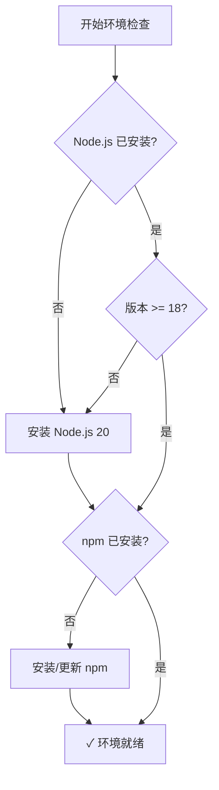
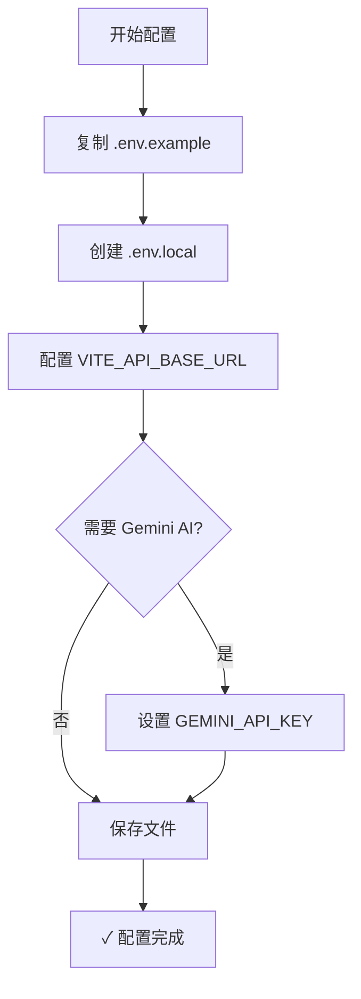
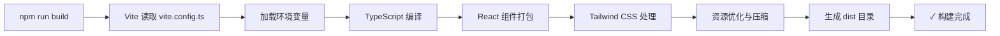
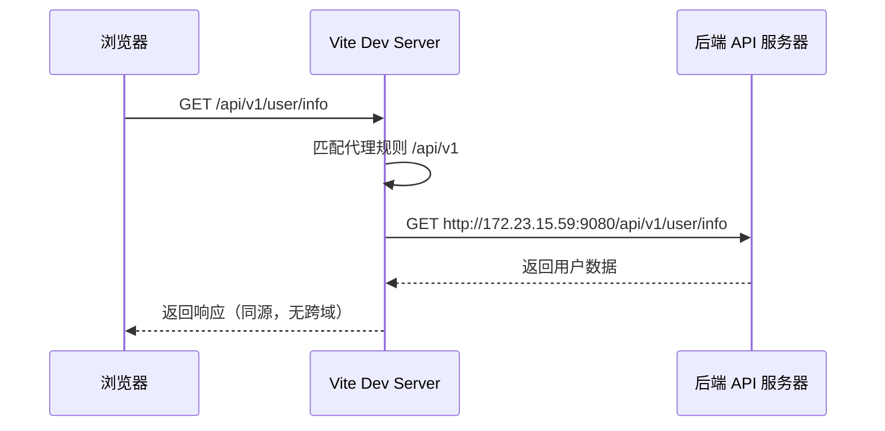
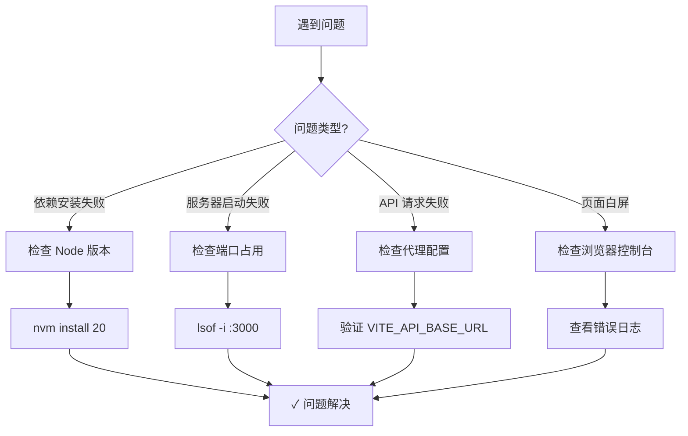

本文档面向初学者开发者，详细说明 AI Business Platform 前端项目的环境配置与本地运行流程。通过系统化的步骤指引，您将能够快速搭建完整的开发环境，并成功启动本地开发服务器。

## 环境要求与前置条件

在开始配置之前，请确保您的开发环境满足以下核心要求。项目基于 **Node.js 20** 运行时构建，采用 Vite 6 作为构建工具，因此 Node.js 版本的选择至关重要。生产环境使用 Node 20-alpine 镜像进行构建，建议本地开发环境保持一致以避免潜在的兼容性问题。

| 工具/环境 | 最低版本要求 | 推荐版本 | 验证命令 |
|---------|------------|---------|---------|
| Node.js | 18.x | 20.x | `node --version` |
| npm | 9.x | 10.x | `npm --version` |
| Git | 2.x | 最新稳定版 | `git --version` |
| 操作系统 | - | macOS/Linux/Windows | - |

Sources: [Dockerfile](Dockerfile#L2-L2), [package.json](package.json#L1-L51)

### 开发环境验证流程



请打开终端执行版本验证命令，确认输出结果符合要求。如果您的 Node.js 版本过低，推荐使用 nvm (Node Version Manager) 进行多版本管理，这样可以避免全局版本切换带来的冲突。

Sources: [Dockerfile](Dockerfile#L2-L2)

## 项目依赖安装

依赖安装是项目启动的首要步骤。本项目采用 npm 作为包管理器，package.json 中定义了完整的依赖树。项目使用 React 19 作为核心框架，配合 Vite 6 实现极速的模块热替换 (HMR) 体验。依赖分为生产依赖 和开发依赖 两大类，包括但不限于：Ant Design UI 组件库、Tailwind CSS 样式框架、Axios HTTP 客户端、Zustand 状态管理库等关键模块。

在项目根目录下执行以下命令完成依赖安装：

```bash
# 进入前端项目目录
cd frontend

# 安装所有依赖项
npm install
```

安装过程将持续 1-3 分钟，具体时长取决于网络状况和本地缓存。npm 会自动读取 package-lock.json 文件，确保所有团队成员使用完全一致的依赖版本。安装完成后，项目根目录将生成 `node_modules` 文件夹，包含所有第三方库及其子依赖。

Sources: [package.json](package.json#L16-L50)

### 核心依赖说明

| 依赖类别 | 关键模块 | 版本范围 | 用途说明 |
|---------|---------|---------|---------|
| 框架核心 | react, react-dom | ^19.0.0 | UI 渲染引擎 |
| 构建工具 | vite, @vitejs/plugin-react | ^6.2.0, ^5.0.4 | 开发服务器与打包 |
| UI 组件 | antd, @ant-design/icons | ^6.3.4, ^6.1.1 | 企业级组件库 |
| 样式方案 | tailwindcss | ^4.1.14 | 原子化 CSS 框架 |
| 路由管理 | react-router-dom | ^6.30.1 | SPA 路由控制 |
| HTTP 客户端 | axios | ^1.7.0 | API 请求封装 |
| 状态管理 | zustand | ^4.5.0 | 轻量级全局状态 |
| 数据缓存 | @tanstack/react-query | ^5.95.2 | 服务端状态管理 |

Sources: [package.json](package.json#L16-L50)

## 环境变量配置

环境变量配置是连接本地开发环境与后端服务的关键桥梁。项目使用 `.env` 文件管理环境变量，支持多环境配置（开发、测试、生产）。`.env.example` 文件提供了配置模板，首次配置时需要将其复制为 `.env.local` 或直接修改 `.env` 文件。

### 必需的环境变量

| 变量名 | 必填 | 默认值 | 用途说明 |
|-------|-----|--------|---------|
| VITE_API_BASE_URL | 是 | http://172.23.15.59:9080/ai-platform | AI 网关基础 URL |
| VITE_BUSINESS_API_URL | 否 | 空 | 业务 API 基础 URL（可为空，由 Vite 代理处理） |
| GEMINI_API_KEY | 是 | - | Google Gemini AI API 密钥 |
| APP_URL | 否 | - | 应用托管 URL（生产环境自动注入） |

Sources: [.env.example](.env.example#L1-L18)

### 配置文件创建流程



执行以下命令快速创建本地配置文件：

```bash
# 复制环境变量模板
cp .env.example .env.local

# 使用编辑器打开配置文件
vim .env.local  # 或使用 code .env.local
```

**重要提示**：`.env.local` 文件已被 `.gitignore` 排除，不会提交到代码仓库，确保敏感信息安全。如果您在团队协作环境中工作，请务必不要将 API 密钥等敏感信息提交到版本控制系统。

Sources: [.env.example](.env.example#L1-L18), [.env](.env#L1-L20)

## 本地开发服务器启动

完成环境配置后，即可启动本地开发服务器。项目使用 Vite 6 提供开发时服务，内置模块热替换 (HMR) 功能，代码修改后浏览器将自动刷新，无需手动刷新页面。开发服务器默认运行在 `http://0.0.0.0:3000`，这意味着您可以通过 `localhost:3000` 或本机 IP 地址从同一网络的其他设备访问开发服务器。

### 启动命令

```bash
# 启动开发服务器
npm run dev
```

启动成功后，终端将输出类似以下信息：

```
  VITE v6.2.0  ready in 500 ms

  ➜  Local:   http://localhost:3000/
  ➜  Network: http://192.168.1.xxx:3000/
  ➜  press h + enter to show help
```

Sources: [package.json](package.json#L7-L7), [vite.config.ts](vite.config.ts#L22-L36)

### Vite 开发服务器配置解析

| 配置项 | 配置值 | 作用说明 |
|-------|--------|---------|
| 端口 | 3000 | 开发服务器监听端口 |
| 主机 | 0.0.0.0 | 允许外部网络访问 |
| HMR | 启用（默认） | 模块热替换，实时更新 |
| API 代理 | /api/v1, /api | 代理到 VITE_API_BASE_URL |
| 基础路径 | / (开发环境) | 静态资源路径前缀 |

开发服务器启动后，Vite 会自动处理以下任务：TypeScript 类型检查（通过 tsconfig.json 配置）、Tailwind CSS 即时编译、React 组件热更新、API 请求代理转发。您可以在浏览器中打开 `http://localhost:3000`，看到应用登录页面即表示启动成功。

Sources: [vite.config.ts](vite.config.ts#L11-L36), [tsconfig.json](tsconfig.json#L1-L33)

## NPM Scripts 脚本说明

package.json 中的 scripts 字段定义了项目生命周期中的关键命令，涵盖开发、构建、测试和部署等场景。理解这些脚本的作用将帮助您高效地进行日常开发工作。

| 脚本命令 | 执行命令 | 功能说明 | 使用场景 |
|---------|---------|---------|---------|
| dev | `npm run dev` | 启动开发服务器 (端口 3000) | 日常开发调试 |
| build | `npm run build` | 生产环境打包 | 生产部署 |
| build:test | `npm run build:test` | 测试环境打包 | 测试环境部署 |
| build:pro | `npm run build:pro` | 生产环境打包 | 生产环境部署 |
| preview | `npm run preview` | 预览生产构建 | 本地验证打包结果 |
| lint | `npm run lint` | TypeScript 类型检查 | 代码质量验证 |
| clean | `npm run clean` | 清理 dist 目录 | 重新构建前 |

Sources: [package.json](package.json#L6-L15)

### 构建流程可视化



**构建产物说明**：执行 `npm run build` 后，项目根目录将生成 `dist` 文件夹，包含优化后的静态资源。该文件夹包含 `index.html` 入口文件、`assets` 目录下的 JavaScript bundles、CSS 样式文件和图片等静态资源。生产环境部署时，只需将 dist 目录内容上传至 Web 服务器即可。

Sources: [package.json](package.json#L8-L11), [vite.config.ts](vite.config.ts#L1-L39)

## API 代理配置原理

本地开发过程中，前端应用运行在 `localhost:3000`，而后端 API 服务通常部署在其他域名或端口。为避免跨域问题，Vite 提供了强大的代理功能，将特定路径的请求转发到后端服务器。本项目的代理配置在 vite.config.ts 中定义，涵盖两类 API 路径：

**业务编排层接口** (`/api/v1/*`)：负责认证、任务管理、知识库、审计日志等业务功能。**AI 网关接口** (`/api/*`)：处理 AI 对话、健康检查、BI 分析等 AI 相关请求。代理目标地址由环境变量 `VITE_API_BASE_URL` 控制，默认指向 `http://172.23.15.59:9080/ai-platform`。

Sources: [vite.config.ts](vite.config.ts#L24-L35)

### 代理工作流程



这种代理机制的优势在于：浏览器认为请求发送到同源服务器 `localhost:3000`，因此不会触发 CORS 限制。Vite 服务器作为中间层，将请求透明转发到真实后端，并将响应原样返回。生产环境中，这一功能由 Nginx 反向代理实现，配置逻辑保持一致。

Sources: [vite.config.ts](vite.config.ts#L22-L36)

## 常见问题与故障排查

环境配置过程中可能遇到各类问题，以下是初学者常见问题的诊断与解决方案。建议按照问题分类逐一排查，大多数问题都源于环境变量配置不当或依赖版本不匹配。

### 问题诊断流程图



### 常见错误与解决方案

| 错误现象 | 可能原因 | 解决方案 |
|---------|---------|---------|
| `npm install` 报错 EACCES | npm 全局目录权限不足 | `sudo chown -R $(whoami) ~/.npm` |
| 启动后页面空白 | 环境变量未配置 | 检查 `.env.local` 文件是否存在 |
| API 请求 404 | 代理配置错误 | 验证 `VITE_API_BASE_URL` 地址是否正确 |
| 端口 3000 被占用 | 其他进程占用端口 | `kill -9 $(lsof -t -i:3000)` |
| HMR 不生效 | DISABLE_HMR 环境变量设置 | 检查 `.env` 文件中是否误设此变量 |
| TypeScript 类型错误 | tsconfig.json 配置不当 | 执行 `npm run lint` 查看详细错误 |

Sources: [vite.config.ts](vite.config.ts#L23-L23), [tsconfig.json](tsconfig.json#L1-L33)

### 环境重置步骤

如果遇到难以排查的问题，可以尝试完全重置开发环境：

```bash
# 1. 删除 node_modules 和 lock 文件
rm -rf node_modules package-lock.json

# 2. 清理 Vite 缓存
rm -rf .vite

# 3. 重新安装依赖
npm install

# 4. 重新启动开发服务器
npm run dev
```

Sources: [package.json](package.json#L12-L13)

## 下一步学习路径

完成本地环境配置后，您已具备开始开发的基础能力。建议按照以下路径深入学习项目架构与核心功能：

**架构理解**：阅读 [项目结构导航](3-xiang-mu-jie-gou-dao-hang) 了解目录组织方式，通过 [技术栈与核心依赖](4-ji-zhu-zhan-yu-he-xin-yi-lai) 理解技术选型逻辑。**认证机制**：深入学习 [JWT 认证与会话恢复机制](5-jwt-ren-zheng-yu-hui-hua-hui-fu-ji-zhi) 和 [SSO 单点登录集成](6-sso-dan-dian-deng-lu-ji-cheng)，理解项目的安全架构。**路由系统**：通过 [类型安全的路由架构](8-lei-xing-an-quan-de-lu-you-jia-gou) 掌握页面导航机制，了解 [页面注册表与懒加载策略](9-ye-mian-zhu-ce-biao-yu-lan-jia-zai-ce-lue) 的性能优化手段。

以上内容将帮助您从初学者快速成长为项目的熟练开发者，逐步掌握企业级前端应用的核心设计模式与最佳实践。