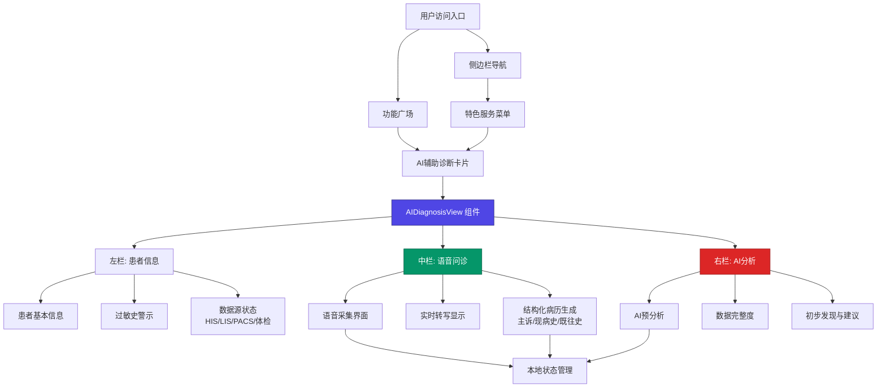

AI 辅助诊断模块是平台特色服务中的核心医疗智能化组件，通过**语音问诊采集**、**实时 AI 分析**和**结构化病历生成**三大能力，构建从患者信息采集到初步诊断建议的完整闭环。该模块目前处于**演示原型阶段**，采用纯前端模拟数据展示完整的业务流程与交互逻辑，为后续对接真实医疗 AI 服务（如 WiNGPT 模型）预留架构接口。

## 架构定位与业务价值

AI 辅助诊断模块定位于**临床辅助决策支持系统**的前端展现层，通过智能化的信息采集与分析流程，帮助医疗工作者提升诊断效率与准确性。模块采用**三栏式工作台布局**：左侧患者信息与数据源集成状态、中央语音问诊与结构化病历编辑、右侧 AI 实时分析与建议输出，形成信息采集—分析—反馈的即时响应闭环。



模块的核心价值体现在三个维度：**流程标准化**（四步诊断流程规范化临床路径）、**信息完整化**（多源数据集成与完整度实时追踪）、**决策智能化**（AI 实时分析提供辅助建议）。当前实现虽为静态演示，但已完整呈现医疗 AI 场景下的人机协作模式。

Sources: [AIDiagnosisView.tsx](src/components/AIDiagnosisView.tsx#L1-L349), [navigationData.ts](src/data/navigationData.ts#L101-L101), [FunctionSquareView.tsx](src/components/FunctionSquareView.tsx#L1-L200)

## 核心功能模块详解

### 四步诊断工作流

模块采用**线性递进式工作流**设计，将复杂的诊断过程拆解为四个标准化步骤：信息采集 → AI 诊断 → 诊断确认 → 方案流转。当前演示聚焦于**第一步信息采集**的完整呈现，其余步骤通过顶部步骤条展示流程框架。

```typescript
const steps = [
  { id: 1, label: '信息采集' },
  { id: 2, label: 'AI诊断' },
  { id: 3, label: '诊断确认' },
  { id: 4, label: '方案流转' },
];
```

步骤状态通过 `activeStep` 状态管理，支持**已完成**（绿色勾选图标）、**进行中**（品牌色高亮+阴影环）、**待处理**（灰色禁用）三种视觉状态，为用户提供清晰的流程进度反馈。该设计符合医疗场景对**流程可追溯性**和**阶段明确性**的严格要求。

Sources: [AIDiagnosisView.tsx](src/components/AIDiagnosisView.tsx#L18-L23), [AIDiagnosisView.tsx](src/components/AIDiagnosisView.tsx#L48-L67)

### 语音问诊采集与实时转写

中央工作区的核心是**语音问诊采集界面**，模拟真实医疗场景下医生与患者的对话记录过程。界面包含三个关键交互元素：**波形可视化动画**、**实时转写文本区**、**控制按钮组**（暂停/继续/完成采集）。

波形动画使用 **Framer Motion** 的 `animate` 属性实现动态高度变化，24 个波形条通过随机高度和持续时间的差异化配置，模拟真实语音波形的视觉反馈。录音状态通过 `isRecording` 布尔值控制，顶部显示**录音时长计时器**（当前演示显示 00:42）配合红色脉冲动画提示。

```typescript
{[...Array(24)].map((_, i) => (
  <motion.div
    key={`wave-${i}`}
    animate={{ 
      height: isRecording ? [10, Math.random() * 40 + 10, 10] : 4 
    }}
    transition={{ 
      repeat: Infinity, 
      duration: 0.5 + Math.random() * 0.5,
      ease: "easeInOut"
    }}
    className="w-1 bg-brand rounded-full"
  />
))}
```

实时转写区域展示**从语音到文本的转换结果**，当前演示使用硬编码的医疗场景对话内容（糖尿病患者问诊案例），包含主诉、现病史、家族史等关键医疗信息结构。该设计为后续集成真实语音识别服务（如 Web Speech API 或云端 ASR 服务）提供了标准化的数据展示接口。

Sources: [AIDiagnosisView.tsx](src/components/AIDiagnosisView.tsx#L143-L199)

### 结构化病历实时生成

语音转写内容同步输入到**AI 结构化病历生成系统**，通过五个标准化标签页（主诉、现病史、既往史、体格检查、辅助检查）组织医疗信息。标签切换使用 Framer Motion 的 `layoutId` 实现**平滑的下划线过渡动画**，提升用户交互体验。

```typescript
const tabs = ['主诉', '现病史', '既往史', '体格检查', '辅助检查'];
```

每个标签页对应一个**结构化文本输入区**，当前演示展示主诉内容的自动生成结果："口渴多饮、多尿3个月，体重下降5kg"。底部实时显示**AI 质量检查反馈**：主诉完整（绿色勾选）、时间明确（绿色勾选）、建议补充发病诱因（橙色提示），模拟真实 AI 辅助下的病历质量控制流程。

该模块的设计体现了医疗信息化中的**结构化数据标准**（如 HL7 FHIR、OMOP CDM）对前端展示层的要求，为后续对接电子病历系统（EMR）或医疗数据中台提供了数据结构基础。

Sources: [AIDiagnosisView.tsx](src/components/AIDiagnosisView.tsx#L25-L25), [AIDiagnosisView.tsx](src/components/AIDiagnosisView.tsx#L201-L251)

### 多源数据集成与状态监控

左侧边栏的**数据源接入状态面板**展示医疗信息系统集成的核心能力，模拟与 HIS（医院信息系统）、LIS（实验室信息系统）、PACS（影像归档与通信系统）、体检系统的实时数据同步状态。

```typescript
const dataSources = [
  { id: 'his', label: 'HIS 患者信息', status: '已同步', color: 'text-green-500' },
  { id: 'lis', label: 'LIS 检验报告', status: '3份报告', color: 'text-green-500' },
  { id: 'pacs', label: 'PACS 影像', status: '加载中...', color: 'text-brand' },
  { id: 'exam', label: '体检系统', status: '2次体检', color: 'text-green-500' },
];
```

每个数据源通过**颜色编码圆点**和**状态文本**提供即时视觉反馈：绿色表示已同步、品牌色表示加载中、灰色表示未连接。该设计遵循医疗数据集成的**可观测性原则**，确保医护人员能实时掌握信息完整性，避免因数据缺失导致的诊断偏差。

**过敏史警示卡片**使用红色背景与图标高亮显示患者过敏信息（青霉素严重过敏），这是医疗安全中的**关键风险提示**，在真实系统中通常需要与药物知识库联动，在处方环节进行自动校验与拦截。

Sources: [AIDiagnosisView.tsx](src/components/AIDiagnosisView.tsx#L26-L31), [AIDiagnosisView.tsx](src/components/AIDiagnosisView.tsx#L109-L137)

### AI 预分析与辅助决策

右侧边栏的**AI 预分析面板**展示基于 WiNGPT 医疗模型的实时分析能力，从语音转写内容中提取**关键症状特征**（症状、时间、家族史），并以彩色标签形式结构化展示。

```typescript
const extractedItems = [
  { id: 'symptom', label: '症状', value: '口渴多饮 · 多尿 · 体重下降 · 乏力', color: 'bg-blue-50 text-blue-600' },
  { id: 'duration', label: '时间', value: '3个月', color: 'bg-orange-50 text-orange-600' },
  { id: 'family', label: '家族', value: '父亲: 2型糖尿病', color: 'bg-pink-50 text-pink-600' },
];
```

**数据完整度追踪**通过进度条（当前 68%）和分项检查清单（主诉信息、现病史、体格检查、检验报告、影像报告）实时反馈病历信息的完整程度，帮助医生快速识别信息缺口。完整度低于阈值时，系统应在进入下一步骤前触发**补充提醒**，这是医疗质量控制的关键环节。

**AI 初步发现**模块以三色卡片形式展示分析结论：橙色（疑似代谢异常）、蓝色（建议优先检查）、红色（用药注意）。每张卡片包含**标题**、**详细说明**和**可操作性建议**，模拟真实 AI 决策支持系统（CDSS）的输出格式，为医生提供循证医学参考。

Sources: [AIDiagnosisView.tsx](src/components/AIDiagnosisView.tsx#L32-L43), [AIDiagnosisView.tsx](src/components/AIDiagnosisView.tsx#L255-L343)

## 技术实现与架构设计

### 组件状态管理

AIDiagnosisView 采用 **React Hooks** 进行本地状态管理，当前实现包含三个核心状态：

| 状态变量 | 类型 | 初始值 | 用途 |
|---------|------|--------|------|
| `activeStep` | number | 1 | 控制四步工作流的当前阶段 |
| `activeTab` | string | '主诉' | 管理结构化病历的标签页切换 |
| `isRecording` | boolean | true | 控制语音采集的录音状态 |

该设计遵循**单一职责原则**，每个状态管理组件内的特定交互逻辑，未引入全局状态管理（如 Zustand），因为当前演示场景下所有数据均为组件内部静态数据。后续对接真实 API 时，需评估是否需要将患者信息、诊断结果等数据提升至全局状态，以支持跨组件共享与持久化。

Sources: [AIDiagnosisView.tsx](src/components/AIDiagnosisView.tsx#L14-L16)

### 视觉设计与交互规范

模块采用**玻璃态设计语言**（Glassmorphism），通过 `bg-white/60 backdrop-blur-xl` 实现 60% 透明度的毛玻璃效果，配合 `rounded-3xl` 大圆角和 `shadow-sm` 微阴影，营造现代医疗应用的**轻盈感与专业性**。

颜色系统遵循平台**品牌色规范**：主品牌色（`text-brand`、`bg-brand`）用于高亮当前步骤与关键操作按钮；语义化颜色（绿色-完整、橙色-警告、红色-危险、蓝色-信息）用于状态反馈；中性色阶（slate 系列）用于文本层级与边框分隔。

**动画系统**基于 Framer Motion 实现：`layoutId` 用于标签切换的平滑过渡、`animate` 属性用于波形动画、`initial/animate` 组合用于组件进入动画。动画参数（持续时间、缓动函数）经过调优，确保在医疗严肃场景下**不影响信息获取效率**。

Sources: [AIDiagnosisView.tsx](src/components/AIDiagnosisView.tsx#L45-L347)

### 路由注册与懒加载

模块通过**页面注册表**（pageRegistry）集成到应用路由系统，使用 React.lazy 实现代码分割与懒加载：

```typescript
const AIDiagnosisView = lazy(async () => {
  const module = await import('./components/AIDiagnosisView');
  return { default: module.AIDiagnosisView };
});

const PAGE_RENDERERS = {
  // ...
  'ai-diagnosis': () => <AIDiagnosisView />,
};
```

路由路径定义为 `/ai-diagnosis`，在导航数据源中被归类到**特色服务**分组，与 AI 辅助决策、AI 辅助康复并列展示。懒加载策略确保该模块仅在用户访问时加载，避免增大首屏包体积（当前打包产物显示 AIDiagnosisView 相关代码独立为 `AIDiagnosisView-DxH-tXB8.js` 文件）。

Sources: [pageRegistry.tsx](src/pageRegistry.tsx#L60-L63), [pageRegistry.tsx](src/pageRegistry.tsx#L104-L104), [navigationData.ts](src/data/navigationData.ts#L160-L164)

## 数据流与集成接口

### 当前实现：静态模拟数据

当前模块所有数据均为**组件内硬编码的演示数据**，包括患者基本信息（张丽华，45岁，初诊）、过敏史（青霉素）、数据源状态、语音转写内容、AI 分析结果等。这种设计适用于**原型验证与交互演示**，但不具备生产环境的数据动态性。

静态数据的优势在于**零依赖外部服务**，可独立运行与展示完整业务流程，便于产品验证与用户测试。缺点是无法响应用户输入，无法与真实医疗系统（HIS/LIS/PACS）集成，无法提供个性化的诊断建议。

Sources: [AIDiagnosisView.tsx](src/components/AIDiagnosisView.tsx#L18-L43)

### 未来集成接口设计

基于当前架构，后续对接真实服务需在以下层面进行扩展：

**语音识别服务集成**：将 `isRecording` 状态与 Web Speech API 或云端 ASR 服务（如阿里云语音识别、腾讯云语音转写）对接，实时将音频流转换为文本并更新到转写区域。需增加**音频权限请求**、**网络状态监控**、**识别结果置信度过滤**等逻辑。

**医疗 AI 模型对接**：将语音转写文本通过 API 发送至后端医疗 AI 服务（如 WiNGPT），接收结构化的分析结果（提取的关键信息、初步诊断、建议检查项）。需定义**请求/响应数据格式**（建议使用 TypeScript 接口约束）、**错误处理机制**、**加载状态管理**。

**多源数据聚合**：通过后端 API 网关聚合 HIS、LIS、PACS、体检系统的患者数据，替代当前的静态 `dataSources` 数组。需引入**React Query**进行数据缓存与自动刷新、**乐观更新**策略提升用户体验、**数据一致性校验**确保信息准确性。

**状态持久化与同步**：将诊断过程中的关键数据（当前步骤、已录入病历、AI 分析结果）持久化至后端，支持**断点续传**（用户中途退出后恢复进度）与**多人协作**（主治医生与住院医共同编辑病历）。需评估引入 Zustand 全局状态管理与后端 WebSocket 实时同步的必要性。

Sources: [api.ts](src/services/api.ts#L1-L122), [useAppStore.ts](src/stores/useAppStore.ts#L1-L1)

## 扩展路径与架构演进

### 短期优化：交互增强与数据联调

**语音采集交互优化**：增加**音频波形实时可视化**（使用 Web Audio API 的 AnalyserNode）、**音量指示器**、**静音检测**（自动暂停录音）、**降噪处理**（提升识别准确率）。参考开源库如 `react-media-recorder`、`wavesurfer.js` 的实现方案。

**结构化病历编辑器**：将当前的只读展示升级为**可编辑表单**，支持医生手动修正 AI 生成的病历内容，并实时校验必填字段与格式规范。可集成富文本编辑器（如 TipTap、Slate.js）提供更灵活的编辑体验。

**AI 分析结果可视化**：将文本形式的 AI 初步发现转换为**图表与图形**，如症状时间轴、检查项目优先级矩阵、用药禁忌关系图。使用 ECharts 或 D3.js 实现医疗数据可视化标准图表。

### 中期演进：服务集成与业务闭环

**真实医疗 AI 服务对接**：与后端团队协作定义 API 接口规范，实现语音转写→AI 分析→结构化输出的完整链路。需重点处理**医疗数据隐私合规**（HIPAA、GDPR、中国网络安全法）、**AI 模型可解释性**（提供诊断依据与参考案例）、**医生审核机制**（AI 建议需人工确认后方可生效）。

**电子病历系统集成**：通过 HL7 FHIR 标准与医院 EMR 系统对接，实现**双向数据同步**：从 EMR 拉取患者历史病历、检验结果、影像报告；将 AI 辅助诊断结果回写至 EMR，作为临床决策参考。需处理**数据映射**（不同系统的字段对应）、**权限控制**（确保数据访问合规）、**冲突解决**（多人同时编辑的处理策略）。

**多模态输入支持**：除语音外，增加**图片上传**（皮肤病变、X 光片）、**文本输入**（患者自述症状）、**结构化表单**（标准化问诊问卷）等多种信息采集方式，提升诊断信息的全面性。参考腾讯觅影、阿里健康等产品的多模态诊断方案。

### 长期规划：智能化医疗平台

**全流程诊疗辅助**：将 AI 辅助诊断从单一的信息采集环节扩展至**完整诊疗流程**：预诊分诊→辅助诊断→治疗方案推荐→用药指导→康复跟踪→疗效评估。每个环节都由 AI 提供决策支持，形成闭环的医疗智能化平台。

**知识图谱与循证医学**：构建**医疗知识图谱**，整合疾病、症状、检查、药物、指南等多维度数据，为 AI 分析提供知识支撑。集成**循证医学数据库**（如 UpToDate、Cochrane），确保诊断建议基于最新临床研究证据。

**个性化与持续学习**：通过**联邦学习**技术，在不泄露患者隐私的前提下，让 AI 模型从各医疗机构的诊断案例中持续学习，提升诊断准确率。同时根据医生的反馈（采纳/修正 AI 建议）进行**个性化调优**，适应不同医生的诊疗风格。

Sources: [navigationData.ts](src/data/navigationData.ts#L102-L113), [mockData.ts](src/data/mockData.ts#L1-L200)

## 与其他模块的关联

AI 辅助诊断作为平台**特色服务**的核心模块，与多个业务模块存在逻辑关联与数据流转可能性：

**与[医疗 AI 工作台](14-yi-liao-ai-gong-zuo-tai)的协同**：医疗 AI 工作台可作为医生日常工作的总入口，AI 辅助诊断作为其中的一个功能卡片或快捷入口，医生可在工作台中快速启动诊断流程，完成后结果自动同步回工作台的任务列表。

**与[AI 辅助决策](ai-decision)的递进关系**：当前 AI 辅助诊断聚焦于**信息采集与初步分析**，AI 辅助决策模块（当前为占位页面）可承接后续的**治疗方案比对与风险提示**，两者形成"诊断→决策"的递进流程，为医生提供全链路支持。

**与[AI 辅助康复](ai-rehab)的闭环衔接**：诊断确认并制定治疗方案后，患者进入康复阶段，AI 辅助康复模块（当前为占位页面）可接收诊断结果与治疗方案，生成**个性化康复计划**，实现从诊断到康复的完整医疗周期覆盖。

**与[功能广场](19-gong-neng-yan-chang-yu-dao-hang)的入口集成**：当前用户可通过功能广场的"AI 辅助诊断"卡片（位于"最新功能"分组首位）进入该模块，卡片描述为"基于深度学习算法，辅助医生快速识别医学影像异常，提升诊断准确率"。后续需确保卡片描述与实际功能匹配，避免用户期望偏差。