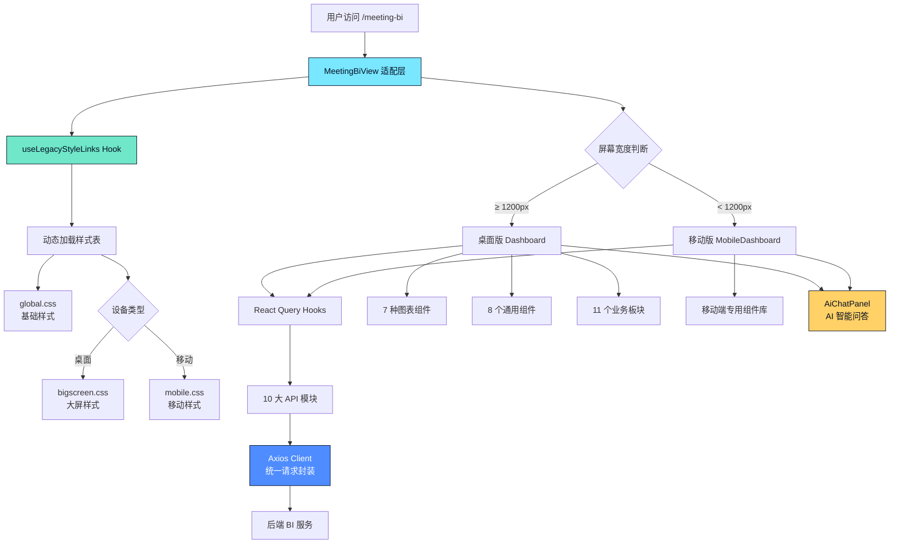

会议 BI 分析系统是 AI Business Platform 中的核心数据可视化模块，采用 **HUD（Heads-Up Display）科幻风格设计语言**，为会议场景提供全方位的业务数据洞察。系统通过 **双层架构设计**（现代适配层 + Legacy 完整系统）实现了对 10 大业务领域的深度分析，支持桌面端大屏展示和移动端触控交互，并集成了 AI 智能问答能力，可自动生成图表与 SQL 查询。

该系统不仅承载了传统的 BI 报表功能，还通过 **流式 AI 查询** 和 **动态图表生成** 技术，让非技术用户也能通过自然语言探索数据，是现代化数据驱动决策的典型实践案例。

Sources: [MeetingBiView.tsx](src/components/MeetingBiView.tsx#L1-L57) [Dashboard.tsx](src/legacy-meeting-bi/pages/Dashboard.tsx#L1-L200)

## 系统架构设计

会议 BI 系统采用 **适配器模式（Adapter Pattern）** 将遗留系统无缝集成到现代前端架构中，通过响应式布局切换和动态样式管理，实现了桌面端与移动端的独立优化。



### 适配层职责分离

**MeetingBiView** 作为适配层组件，承担了以下核心职责：

1. **响应式布局切换**：通过 `useIsMobileMeetingBi` Hook 监听窗口尺寸变化，在 1200px 断点处自动切换桌面版和移动版组件
2. **Legacy 样式隔离**：使用 `useLegacyStyleLinks` 动态创建和销毁 `<link>` 标签，避免样式污染全局
3. **导航集成**：提供"返回工作台"按钮，与主应用路由系统无缝对接

Sources: [MeetingBiView.tsx](src/components/MeetingBiView.tsx#L13-L56) [useLegacyStyleLinks.ts](src/legacy-meeting-bi/hooks/useLegacyStyleLinks.ts#L1-L29)

## 核心业务模块

系统围绕会议场景的数据分析需求，构建了 **10 个垂直业务 API 模块**，每个模块通过独立的 TypeScript 文件定义类型和请求方法，确保类型安全和可维护性。

| 模块名称 | API 文件 | 核心数据 | 主要用途 |
|---------|---------|---------|---------|
| **KPI 总览** | [kpi.ts](src/legacy-meeting-bi/api/kpi.ts) | 报名客户、抵达客户、成交金额、消耗预算、收款金额、ROI | 顶层指标监控 |
| **报名管理** | [registration.ts](src/legacy-meeting-bi/api/registration.ts) | 报名矩阵、报名趋势图表 | 客户报名追踪 |
| **客户画像** | [customer.ts](src/legacy-meeting-bi/api/customer.ts) | 金额等级分布、身份类型、新老客户对比 | 客户群体分析 |
| **客户来源** | [source.ts](src/legacy-meeting-bi/api/source.ts) | 来源渠道分布、目标抵达率 | 渠道效果评估 |
| **运营数据** | [operations.ts](src/legacy-meeting-bi/api/operations.ts) | 签到人数、接机人数、离开人数、到院人数、趋势数据 | 现场运营监控 |
| **业绩达成** | [achievement.ts](src/legacy-meeting-bi/api/achievement.ts) | 业绩图表、业绩明细表 | 销售目标追踪 |
| **任务进展** | [progress.ts](src/legacy-meeting-bi/api/progress.ts) | 区域达成金额、目标完成度 | 目标管理 |
| **提案分析** | [proposal.ts](src/legacy-meeting-bi/api/proposal.ts) | 提案总览、交叉分析表 | 方案转化分析 |
| **AI 智能分析** | [ai.ts](src/legacy-meeting-bi/api/ai.ts) | 流式查询响应、自动图表配置 | 自然语言数据探索 |
| **基础客户端** | [client.ts](src/legacy-meeting-bi/api/client.ts) | Axios 实例、ApiResponse<T> 泛型 | 统一请求封装 |

### 数据流管理

系统采用 **React Query** 进行数据缓存和状态管理，所有 API 调用通过 `useApi.ts` 统一封装为自定义 Hook，实现了：

- **自动缓存**：基于 `queryKey` 的智能缓存，避免重复请求
- **后台更新**：窗口聚焦时自动重新获取数据
- **错误重试**：网络故障时自动重试机制
- **类型安全**：TypeScript 类型推导贯穿整个数据流

```typescript
// 示例：KPI 总览 Hook 定义
export const useKpiOverview = () =>
  useQuery({ 
    queryKey: ['kpi-overview'], 
    queryFn: fetchKpiOverview 
  })

// 支持参数化的 Hook
export const useOperationsKpi = (dateFrom?: string, dateTo?: string) =>
  useQuery({
    queryKey: ['operations-kpi', dateFrom, dateTo],
    queryFn: () => fetchOperationsKpi(dateFrom, dateTo),
  })
```

Sources: [useApi.ts](src/legacy-meeting-bi/hooks/useApi.ts#L1-L52) [kpi.ts](src/legacy-meeting-bi/api/kpi.ts#L1-L21)

## 响应式设计策略

系统针对桌面大屏和移动设备采用了 **完全独立的组件实现**，而非简单的 CSS 媒体查询，这确保了两种场景下的最优用户体验。

### 桌面版 Dashboard

桌面版采用 **多标签页布局**，通过顶部 Tab 切换三个主要视图：

1. **客户总览**：展示客户画像、来源分布、报名抵达矩阵
2. **运营数据**：实时监控签到、接机、到院等运营指标
3. **目标达成**：追踪各区域业绩完成情况和任务进展

核心特性包括：
- **全屏 HUD 界面**：深色背景 + 青色发光效果，营造科技感
- **Ant Design 暗色主题**：通过 `antdDarkTheme` 配置统一视觉风格
- **6 列 KPI 卡片**：使用 CSS Grid 实现响应式网格布局
- **下钻分析**：通过 `DrillDownModal` 查看数据明细

### 移动版 MobileDashboard

移动版采用 **底部 Tab 导航**，优化了触控交互和小屏显示：

1. **简化的 KPI 展示**：2 个主要指标 + 4 个次要指标，使用卡片堆叠布局
2. **手势友好**：支持滑动切换页面，按钮点击区域符合移动端规范
3. **浅色主题**：通过 `mobileLightTheme` 提供高对比度的移动端配色
4. **抽屉式下钻**：使用 `MobileDrillDrawer` 替代桌面版的模态框

Sources: [Dashboard.tsx](src/legacy-meeting-bi/pages/Dashboard.tsx#L41-L200) [MobileDashboard.tsx](src/legacy-meeting-bi/pages/mobile/MobileDashboard.tsx#L1-L100) [MobileKpiCard.tsx](src/legacy-meeting-bi/components/mobile/MobileKpiCard.tsx#L1-L82)

## AI 智能分析引擎

系统集成了 **流式 AI 查询接口**，允许用户通过自然语言提问，AI 自动生成 SQL、执行查询并以图表形式返回结果，这是整个 BI 系统的差异化亮点。

### 流式响应处理

AI 查询采用 **Server-Sent Events (SSE)** 协议，通过 `streamAiQuery` 函数实现流式数据接收：

```typescript
export interface SseCallback {
  onSql?: (sql: string) => void          // SQL 语句生成
  onData?: (columns: string[], rows: QueryRow[]) => void  // 数据返回
  onChart?: (chart: ChartConfig) => void // 图表配置生成
  onAnswer?: (answer: string) => void    // 文本答案
  onError?: (message: string) => void    // 错误处理
}
```

流式处理的优势：
- **实时反馈**：用户可看到 SQL 生成过程，增强信任感
- **渐进式渲染**：数据到达即渲染，无需等待全部响应
- **错误快速定位**：任一阶段出错立即中止并提示

### 自动图表生成

AI 返回的 `ChartConfig` 包含 6 种图表类型：

```typescript
export interface ChartConfig {
  chart_type: 'pie' | 'bar' | 'grouped_bar' | 'horizontal_bar' | 'line' | 'none'
  categories: string[]      // X 轴分类
  series: ChartSeries[]     // 数据系列
}
```

系统根据 `chart_type` 自动选择对应的 ECharts 组件进行渲染，实现了 **零配置的可视化**。

### 会话历史管理

聊天面板通过 `localStorage` 持久化对话历史，支持：
- **多轮对话**：通过 `conversation_id` 维护上下文
- **历史回溯**：用户可查看和重新执行历史查询
- **数据导出**：支持将查询结果导出为 Excel 文件

Sources: [ai.ts](src/legacy-meeting-bi/api/ai.ts#L1-L60) [AiChatPanel.tsx](src/legacy-meeting-bi/components/sections/AiChatPanel.tsx#L1-L80)

## 数据可视化体系

系统构建了 **7 种专用图表组件**，所有图表基于 ECharts 封装，遵循统一的视觉规范和交互模式。

### 图表组件矩阵

| 组件名称 | 图表类型 | 典型用途 | 特色功能 |
|---------|---------|---------|---------|
| [DistributionBarChart](src/legacy-meeting-bi/components/charts/DistributionBarChart.tsx) | 横向条形图 | 客户等级分布、来源渠道分布 | 自动排序、百分比标签、发光效果 |
| GroupedBarChart | 分组柱状图 | 多维度对比分析 | 并排对比、自适应宽度 |
| HorizontalBarChart | 水平柱状图 | 排名展示 | 从大到小排序 |
| MultiLineChart | 多折线图 | 趋势分析 | 时间序列、多指标对比 |
| PieChart | 饼图 | 占比分析 | 环形设计、标签引导线 |
| RegistrationComparisonChart | 报名对比图 | 报名与抵达对比 | 双指标对比 |
| StackedBarChart | 堆叠柱状图 | 构成分析 | 层级展示 |

### 主题系统与视觉规范

所有视觉元素通过 [theme.ts](src/legacy-meeting-bi/styles/theme.ts) 统一管理，定义了：

**颜色体系**：
- **背景色**：深蓝渐变（`#050f24` → `#020a18`），营造科技氛围
- **强调色**：青色（`#79e7ff`）为主色，辅以蓝、绿、黄、紫等辅助色
- **文字色**：三级层次（主文字 `#f3f8ff`、次文字 `#9fb7db`、辅助文字 `#6f89b3`）

**图表调色板**：
```typescript
chartPalette: ['#79e7ff', '#4f8cff', '#6fe7c8', '#ffd166', '#9cb8ff', '#ffb486', '#8ad0ff']
```

**HUD 视觉元素**：
- **角标装饰**：4 个 HUD 角标（`hud-corner`）增强科技感
- **发光阴影**：通过 `box-shadow` 实现边缘发光效果
- **动态数字**：`AnimatedNumber` 组件实现数值滚动动画

Sources: [DistributionBarChart.tsx](src/legacy-meeting-bi/components/charts/DistributionBarChart.tsx#L1-L197) [theme.ts](src/legacy-meeting-bi/styles/theme.ts#L1-L75) [KpiCard.tsx](src/legacy-meeting-bi/components/common/KpiCard.tsx#L1-L115)

## 通用组件库

系统构建了 **8 个高度复用的通用组件**，遵循 **单一职责原则**，每个组件专注于一个特定的 UI 功能。

### 核心组件清单

1. **KpiCard**：指标卡片，支持自定义颜色、前缀、单位，内置 HUD 角标和背景装饰
2. **AnimatedNumber**：数字滚动动画组件，使用 `requestAnimationFrame` 实现平滑过渡
3. **DataTable**：数据表格，基于 Ant Design Table 封装，支持排序、筛选、固定列
4. **DrillDownModal**：下钻模态框，点击图表数据点时弹出详细信息
5. **LoadingSkeleton**：加载骨架屏，使用 CSS 动画模拟内容加载
6. **DashboardCard**：通用卡片容器，提供统一的边框和阴影样式
7. **RankingPanel**：排名面板，展示 Top N 数据并高亮前三名
8. **SectionTitle**：板块标题，支持副标题和右侧操作区

### 组件设计原则

**性能优化**：
- 使用 `React.memo` 避免不必要的重渲染
- 图表组件通过 `ResizeObserver` 实现自适应
- 大列表使用虚拟滚动（通过 Ant Design Table 内置支持）

**可访问性**：
- 所有交互元素支持键盘导航
- 图标按钮提供 `aria-label` 属性
- 颜色对比度符合 WCAG AA 标准

**类型安全**：
- 所有 Props 使用 TypeScript 接口定义
- 泛型组件支持不同数据类型（如 `ApiResponse<T>`）
- 严格的 `null` 和 `undefined` 检查

Sources: [KpiCard.tsx](src/legacy-meeting-bi/components/common/KpiCard.tsx#L1-L115) [CoreKpiRow.tsx](src/legacy-meeting-bi/components/sections/CoreKpiRow.tsx#L1-L32)

## 样式隔离与主题切换

Legacy 系统的样式通过 **动态 `<link>` 标签注入** 实现隔离，确保不影响主应用的 Tailwind CSS 和其他样式。

### useLegacyStyleLinks Hook

该 Hook 实现了样式的生命周期管理：

```typescript
export function useLegacyStyleLinks(urls: string[]) {
  useEffect(() => {
    // 1. 创建或复用 <link> 标签
    const createdLinks = urls.map((href) => {
      const existingLink = document.head.querySelector(
        `link[data-legacy-meeting-bi="true"][href="${href}"]`
      )
      if (existingLink) return existingLink
      
      const link = document.createElement('link')
      link.rel = 'stylesheet'
      link.href = href
      link.dataset.legacyMeetingBi = 'true'
      document.head.appendChild(link)
      return link
    })
    
    // 2. 组件卸载时清理
    return () => {
      createdLinks.forEach((link) => {
        if (link.dataset.legacyMeetingBi === 'true') {
          link.remove()
        }
      })
    }
  }, [urls.join('|')])
}
```

### 三套样式体系

1. **global.css**：基础样式，包括字体、重置样式、通用工具类
2. **bigscreen.css**：桌面大屏样式，定义 HUD 效果、卡片布局、图表样式
3. **mobile.css**：移动端样式，优化触控交互、简化布局、提升性能

样式切换逻辑：
```typescript
const styleUrls = React.useMemo(
  () => [globalCssUrl, isMobile ? mobileCssUrl : bigscreenCssUrl],
  [isMobile],
)
useLegacyStyleLinks(styleUrls)
```

Sources: [useLegacyStyleLinks.ts](src/legacy-meeting-bi/hooks/useLegacyStyleLinks.ts#L1-L29) [MeetingBiView.tsx](src/components/MeetingBiView.tsx#L35-L40)

## API 客户端架构

系统使用 **Axios** 作为 HTTP 客户端，通过统一的配置和拦截器实现了请求标准化。

### 客户端配置

```typescript
const client = axios.create({
  baseURL: apiBasePath,  // 根据环境自动适配
  timeout: 30000,        // 30 秒超时
})

export interface ApiResponse<T> {
  code: number
  message: string
  data: T
}
```

### 环境感知的 Base URL

系统通过 `base-path.ts` 实现了开发/生产环境的自动适配：

```typescript
// 开发模式：使用空字符串，请求走 Vite 代理
// 生产模式：使用环境变量配置的绝对地址
export const apiBasePath = import.meta.env.DEV
  ? ''
  : (configuredApiBase || `${normalizedBasePath}/api`)
```

**环境变量优先级**：
1. `VITE_MEETING_BI_API_URL`（专用配置）
2. `VITE_BUSINESS_API_URL`（业务通用配置）
3. `VITE_API_BASE_URL`（全局配置）
4. 回退到 `/api`（相对路径）

Sources: [client.ts](src/legacy-meeting-bi/api/client.ts#L1-L16) [base-path.ts](src/legacy-meeting-bi/utils/base-path.ts#L1-L16)

## 开发最佳实践

### 添加新的业务模块

1. **创建 API 模块**：在 `src/legacy-meeting-bi/api/` 下新建 TypeScript 文件
2. **定义类型接口**：使用 `interface` 定义请求参数和响应数据结构
3. **封装请求方法**：使用统一的 `client` 实例发起请求
4. **创建 React Query Hook**：在 `useApi.ts` 中添加对应的 Hook
5. **开发业务组件**：在 `components/sections/` 下创建业务板块
6. **集成到页面**：在 `Dashboard.tsx` 或移动端页面中引入组件

### 性能优化建议

**数据层**：
- 合理设置 `queryKey`，避免不必要的缓存失效
- 使用 `staleTime` 控制数据新鲜度，减少后台更新
- 对于大列表数据，考虑分页或虚拟滚动

**渲染层**：
- 使用 `React.memo` 包装纯展示组件
- 图表组件避免频繁 `resize`，使用防抖优化
- 移动端减少复杂动画，优先使用 CSS Transform

**网络层**：
- 启用 Gzip 压缩（生产环境 Nginx 配置）
- 使用 HTTP/2 多路复用
- 对于静态资源，配置长期缓存策略

### 样式开发规范

**命名约定**：
- 组件样式使用 BEM 命名：`.dashboard-card__title`
- 工具类使用功能命名：`.text-primary`, `.bg-card`
- 状态类使用 `is-` 前缀：`.is-active`, `.is-loading`

**主题变量**：
- 所有颜色通过 `theme.ts` 引用，避免硬编码
- 间距使用 4px 基准的倍数（8px, 12px, 16px, 24px）
- 阴影使用 `theme.shadows` 中定义的预设

Sources: [useApi.ts](src/legacy-meeting-bi/hooks/useApi.ts#L1-L52) [theme.ts](src/legacy-meeting-bi/styles/theme.ts#L1-L75)

## 扩展阅读

- **[Legacy 会议 BI 集成](36-legacy-hui-yi-bi-ji-cheng)**：深入了解遗留系统的迁移策略和兼容性处理
- **[React Query 数据缓存](29-react-query-shu-ju-huan-cun)**：掌握数据缓存的最佳实践和高级配置
- **[Tailwind CSS 配置](25-tailwind-css-pei-zhi)**：了解主应用的样式系统与 Legacy 样式的共存方案
- **[Docker 容器化部署](32-docker-rong-qi-hua-bu-shu)**：生产环境部署和 Nginx 配置优化

系统当前包含 **65 个 TypeScript/TSX 文件**，覆盖了从数据获取到可视化展示的完整链路，是大型 BI 系统在 React 技术栈下的典型实现参考。