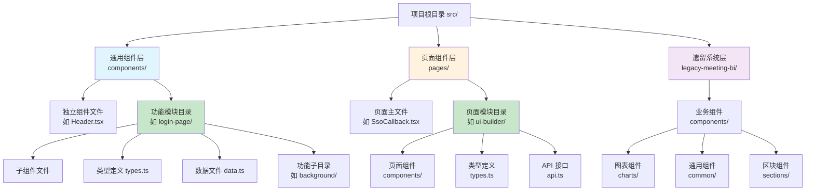

良好的组件目录结构与命名约定是大型 React 项目可维护性的基石。本项目采用**功能域驱动**的组织策略，将组件按业务逻辑聚合，而非简单按技术类型分类。这种架构让开发者能够快速定位相关代码、理解组件职责边界，并在团队协作中保持一致性。本文档将系统阐述项目的组件分层策略、命名规范和代码组织模式，帮助开发者建立清晰的心智模型。

## 三级分层架构原则

项目组件采用三级分层架构，从**原子组件**到**功能模块**再到**页面视图**，每一层都有明确的职责边界和组织方式。这种分层确保了代码的可预测性和复用性。



**通用组件层（`src/components/`）**是组件生态的核心，包含跨页面复用的 UI 组件和独立功能模块。顶层放置全局共享的布局组件（如 `Header`、`Sidebar`）和页面级视图组件（如 `DashboardView`、`MedicalAIWorkbench`）。功能模块目录（如 `login-page/`、`consultant-ai-workbench/`）则封装完整的业务功能，内部包含该功能所需的所有子组件、类型定义和辅助逻辑。

Sources: [目录结构](src/components#L1-L22)

**页面组件层（`src/pages/`）**存放路由级页面及其私有资源。简单页面使用单文件（如 `SsoCallback.tsx`），复杂页面则组织为目录（如 `ui-builder/`），内含页面主文件、私有组件、API 接口和类型定义。这种模式确保页面逻辑的封装性，避免与通用组件层混淆。

Sources: [页面目录](src/pages#L1-L8)

**遗留系统层（`src/legacy-meeting-bi/`）**展示了历史代码的隔离策略。该目录保持独立的组件体系（`components/charts/`、`components/sections/`），避免污染主代码库，同时便于渐进式重构。

Sources: [遗留组件](src/legacy-meeting-bi/components#L1-L6)

## 目录结构实战解析

以下是通用组件层的实际组织形态，展示了独立组件文件与功能模块目录的混合使用：

```
src/components/
├── Header.tsx                    # 全局顶部栏组件
├── Sidebar.tsx                   # 全局侧边栏组件
├── DashboardView.tsx             # 仪表盘页面视图
├── MedicalAIWorkbench.tsx        # 医疗 AI 工作台视图
├── TaskSection.tsx               # 任务区块组件
├── RiskSection.tsx               # 风险区块组件
├── Modals.tsx                    # 模态框集合
│
├── login-page/                   # 登录页功能模块
│   ├── types.ts                  # 模块类型定义
│   ├── InputField.tsx            # 输入框子组件
│   ├── LoginMethodRail.tsx       # 登录方式导航栏
│   ├── PermissionModal.tsx       # 权限弹窗
│   ├── background/               # 背景效果子模块
│   │   ├── LoginBackground.tsx   # 背景容器
│   │   ├── NeuralFlowBackground.tsx  # 神经网络动效
│   │   └── PhotonParticles.tsx   # 光子粒子效果
│   └── forms/                    # 表单子模块
│       └── LoginMethodPanel.tsx  # 登录表单面板
│
└── consultant-ai-workbench/      # 顾问 AI 工作台功能模块
    ├── types.ts                  # 模块类型定义
    ├── data.ts                   # 模块静态数据
    ├── chat.ts                   # 聊天逻辑辅助函数
    ├── WorkbenchHeader.tsx       # 工作台头部
    ├── AssistantSidebar.tsx      # AI 助手侧边栏
    ├── CustomerInfoBar.tsx       # 客户信息栏
    ├── InsightsSidebar.tsx       # 洞察侧边栏
    ├── MainReportsPanel.tsx      # 主报告面板
    └── json-render/              # JSON 渲染器子模块
        ├── spec.ts               # 渲染规范定义
        ├── catalog.ts            # 组件目录
        ├── registry.tsx          # 组件注册表
        └── AssistantMessageContent.tsx  # 消息内容渲染器
```

**关键设计决策**：独立组件文件适用于**无状态或低复杂度**的 UI 元素（如 `Header`、`Sidebar`），而功能模块目录则用于**有状态、多组件协作**的业务场景（如 `login-page` 包含 7 个子组件和 3 层嵌套目录）。这种弹性策略平衡了简单性与可扩展性。

Sources: [组件目录](src/components#L1-L22), [登录模块](src/components/login-page#L1-L12), [工作台模块](src/components/consultant-ai-workbench#L1-L12)

## 文件命名约定详解

项目采用严格的 PascalCase 命名规范，文件名与导出的主组件名完全一致。以下是具体的命名规则和语义约定：

### 组件文件命名模式

| 命名模式 | 示例 | 适用场景 | 职责说明 |
|---------|------|---------|---------|
| **无后缀** | `Header.tsx`<br/>`Sidebar.tsx` | 布局组件 | 全局框架组件，负责页面结构 |
| **View 后缀** | `DashboardView.tsx`<br/>`MeetingBiView.tsx` | 页面级视图 | 完整页面内容，由路由挂载 |
| **Section 后缀** | `TaskSection.tsx`<br/>`RiskSection.tsx` | 区块组件 | 页面内的功能区块，可组合 |
| **Panel 后缀** | `MainReportsPanel.tsx` | 面板组件 | 独立交互区域，含业务逻辑 |
| **Bar 后缀** | `CustomerInfoBar.tsx`<br/>`LoginMethodRail.tsx` | 栏组件 | 水平/垂直导航或信息展示 |
| **Tab 后缀** | `OverviewTab.tsx` | 标签页组件 | 标签页切换内容 |
| **Modal 后缀** | `PermissionModal.tsx` | 模态框 | 弹窗对话框 |
| **功能描述** | `AIAssistant.tsx`<br/>`InputField.tsx` | 通用组件 | 可复用的功能组件 |

**命名语义优先级**：后缀（如 `View`、`Section`）表示组件的**架构角色**，前缀（如 `AI`、`Customer`）表示**业务领域**。例如 `CustomerInfoBar` 明确表达"客户信息展示栏"，`AIAssistant` 表达"AI 助手功能"。

Sources: [Header 组件](src/components/Header.tsx#L1-L15), [Dashboard 视图](src/components/DashboardView.tsx#L1-L30), [Section 组件](src/components/TaskSection.tsx#L1), [登录模块组件](src/components/login-page/InputField.tsx#L1-L28)

### 辅助文件命名约定

| 文件类型 | 命名 | 示例 | 用途 |
|---------|------|------|------|
| **类型定义** | `types.ts` | `types.ts` | 模块内共享的类型接口 |
| **常量数据** | `data.ts` | `data.ts` | 静态配置和 Mock 数据 |
| **业务逻辑** | 小写描述 | `chat.ts`<br/>`helpers.ts` | 辅助函数和业务逻辑 |
| **API 接口** | `api.ts` | `api.ts` | 接口请求封装 |
| **样式文件** | 同组件名 | `LoginBackground.css` | 组件私有样式（如需） |
| **测试文件** | 组件名 + `.test` | `Header.test.tsx` | 单元测试 |

**模块化策略**：功能模块目录内的辅助文件使用**通用名称**（如 `types.ts`、`data.ts`），避免重复模块前缀。例如 `login-page/types.ts` 而非 `login-page/LoginTypes.ts`，因为导入路径已提供上下文：`import { LoginFormData } from '@/components/login-page/types'`。

Sources: [工作台类型](src/components/consultant-ai-workbench/types.ts#L1-L19), [工作台数据](src/components/consultant-ai-workbench/data.ts#L1), [UI Builder 类型](src/pages/ui-builder/types.ts#L1)

## 组件代码结构规范

每个组件文件遵循统一的代码组织模板，确保可读性和一致性。以下是标准结构：

### 标准组件模板

```typescript
// 1. 文件注释：说明组件职责和使用场景
// 顶部栏：展示页面标题、通知轮播、导出能力和当前登录用户。

// 2. 导入语句：按 React → 第三方库 → 本地模块顺序
import React from 'react';
import { motion } from 'motion/react';
import { Volume2, Bell } from 'lucide-react';
import { NOTICES } from '../data/mockData';
import type { AppPage } from '../navigation';

// 3. 类型定义：Props 接口命名为组件名 + Props
interface HeaderProps {
  currentNoticeIndex: number;
  currentPage: AppPage;
  currentUserName?: string;
}

// 4. 组件实现：使用命名导出 export function
export function Header({ currentNoticeIndex, currentPage, currentUserName }: HeaderProps) {
  
  return (
    <header className="h-20 bg-white/40 backdrop-blur-xl border-b border-slate-200/60">
      {/* 5. JSX 结构：使用语义化标签和注释标注区块 */}
      
      {/* Greeting */}
      <div className="flex items-center">
        {/* 组件内容 */}
      </div>
      
      {/* Notice Carousel */}
      <div className="flex-1 overflow-hidden">
        {/* 通知轮播 */}
      </div>
      
      {/* User Actions */}
      <div className="flex items-center gap-4">
        {/* 用户操作区 */}
      </div>
    </header>
  );
}
```

**关键规范**：
- **文件注释**必须用中文说明组件的**职责**和**使用场景**，而非简单翻译组件名
- **Props 接口**统一命名为 `组件名Props`（如 `HeaderProps`、`DashboardViewProps`）
- **命名导出**（`export function`）优先于默认导出，便于 Tree-shaking 和 IDE 自动导入
- **JSX 注释**标注主要区块（如 `{/* Greeting */}`），提升代码可扫描性

Sources: [Header 组件完整实现](src/components/Header.tsx#L1-L79), [DashboardView 组件](src/components/DashboardView.tsx#L1-L30), [InputField 组件](src/components/login-page/InputField.tsx#L1-L77)

### Props 接口设计模式

```typescript
// ✅ 推荐：明确的类型定义和文档注释
interface InputFieldProps {
  /** 输入框标签文本 */
  label: string;
  /** 输入类型，默认为 'text' */
  type?: string;
  /** 占位提示符 */
  placeholder?: string;
  /** 受控值 */
  value: string;
  /** 值变更回调 */
  onChange: (e: ChangeEvent<HTMLInputElement>) => void;
  /** 错误提示信息 */
  error?: string;
  /** 左侧图标 */
  icon?: LucideIcon;
  /** 右侧附加元素 */
  rightElement?: ReactNode;
}

// ✅ 推荐：使用解构参数并设置默认值
export function InputField({
  label,
  type = 'text',  // 默认值
  placeholder,
  value,
  onChange,
  error,
  icon: Icon,     // 重命名解构
  rightElement,
}: InputFieldProps) {
  // 组件实现
}

// ❌ 避免：过度使用可选参数而无默认值
interface BadProps {
  config?: any;  // 类型不明确
  data?: object; // 缺少文档
  onUpdate?: () => void; // 回调缺少参数类型
}
```

**类型安全原则**：所有 Props 必须定义类型，避免使用 `any`。回调函数需明确参数类型（如 `onChange: (e: ChangeEvent<HTMLInputElement>) => void`）。可选属性使用 `?` 标记，并在解构时提供合理的默认值。

Sources: [InputField Props 定义](src/components/login-page/InputField.tsx#L8-L17), [DashboardView Props](src/components/DashboardView.tsx#L17-L30)

## 类型定义管理策略

项目采用**混合策略**管理类型定义，平衡全局共享与模块封装：

### 策略对比

| 策略 | 文件位置 | 适用场景 | 优势 | 劣势 |
|------|---------|---------|------|------|
| **全局集中** | `src/types.ts` | 跨模块共享的核心类型 | 单一数据源，便于重构 | 文件过大，导入路径长 |
| **模块私有** | `模块目录/types.ts` | 模块内部使用的类型 | 高内聚，导入路径短 | 无法跨模块复用 |
| **组件内联** | 组件文件顶部 | 仅该组件使用的 Props | 就近原则，代码紧凑 | 无法复用类型 |

**实战案例**：

```typescript
// src/types.ts - 全局共享类型
export interface System {
  id: number;
  name: string;
  icon: LucideIcon;
  count: number;
  color: string;
}

// src/components/consultant-ai-workbench/types.ts - 模块私有类型
export type PlanningMessageRole = 'ai' | 'user';

export interface PlanningMessage {
  id: string;
  role: PlanningMessageRole;
  content: string;
}

// src/components/Header.tsx - 组件内联类型
interface HeaderProps {
  currentNoticeIndex: number;
  currentPage: AppPage;
  currentUserName?: string;
}
```

**决策指南**：
1. 如果类型被 **3 个以上模块**使用 → 放入 `src/types.ts`
2. 如果类型仅在**单个功能模块**内使用 → 放入模块的 `types.ts`
3. 如果类型仅用于**单个组件的 Props** → 在组件文件内定义

Sources: [全局类型](src/types.ts#L1-L30), [工作台模块类型](src/components/consultant-ai-workbench/types.ts#L1-L19), [UI Builder 类型](src/pages/ui-builder/types.ts#L1)

## 功能模块案例深度解析

### 案例 1：login-page 模块 - 多层嵌套组织

登录页模块展示了**三层嵌套目录**的组织策略，处理复杂的 UI 组件树：

```
login-page/
├── types.ts                      # 模块类型定义
├── InputField.tsx                # 通用输入框组件
├── LoginMethodRail.tsx           # 登录方式选择栏
├── PermissionModal.tsx           # 权限提示弹窗
├── FontLoader.tsx                # 字体加载器
│
├── background/                   # 背景效果子模块
│   ├── LoginBackground.tsx       # 背景容器（组合子组件）
│   ├── NeuralFlowBackground.tsx  # 神经网络动画效果
│   └── PhotonParticles.tsx       # 光子粒子动画效果
│
└── forms/                        # 表单子模块
    └── LoginMethodPanel.tsx      # 登录表单面板
```

**架构要点**：
- **顶层文件**（如 `InputField.tsx`）为**可复用组件**，可能被其他模块使用
- **子目录**（`background/`、`forms/`）封装**内部实现细节**，外部不应直接导入
- **`types.ts`** 集中定义模块的公共接口，如 `LoginFormData`、`LoginMethod`

Sources: [登录模块目录](src/components/login-page#L1-L12), [InputField 组件](src/components/login-page/InputField.tsx#L1-L77), [背景子模块](src/components/login-page/background#L1-L4)

### 案例 2：consultant-ai-workbench 模块 - 复杂业务逻辑

顾问 AI 工作台模块展示了**业务逻辑与 UI 分离**的策略：

```
consultant-ai-workbench/
├── types.ts                      # 类型定义：消息、视图模式、历史记录
├── data.ts                       # 静态数据：Mock 历史记录
├── chat.ts                       # 业务逻辑：聊天消息处理函数
│
├── WorkbenchHeader.tsx           # 工作台头部
├── AssistantSidebar.tsx          # AI 助手侧边栏
├── CustomerInfoBar.tsx           # 客户信息栏
├── InsightsSidebar.tsx           # 洞察侧边栏
├── MainReportsPanel.tsx          # 主报告面板
│
└── json-render/                  # JSON 渲染器子模块
    ├── spec.ts                   # 渲染规范（JSON Schema）
    ├── catalog.ts                # 组件目录映射
    ├── registry.tsx              # 组件注册表
    └── AssistantMessageContent.tsx  # 消息内容渲染器
```

**关键模式**：
- **逻辑分离**：`chat.ts` 包含纯函数逻辑（如消息格式化），与 UI 组件解耦
- **子模块封装**：`json-render/` 是独立的渲染引擎，有自己的规范（`spec.ts`）和注册表（`registry.tsx`）
- **类型驱动**：`types.ts` 定义了 5 种类型，确保组件间数据流类型安全

Sources: [工作台模块目录](src/components/consultant-ai-workbench#L1-L12), [类型定义](src/components/consultant-ai-workbench/types.ts#L1-L19), [JSON 渲染器](src/components/consultant-ai-workbench/json-render#L1-L7)

## 最佳实践快速参考

### 目录组织检查清单

| 场景 | 推荐方案 | 示例 |
|------|---------|------|
| 单个简单组件 | 独立文件放 `components/` | `Header.tsx`、`Sidebar.tsx` |
| 2-5 个相关组件 | 功能模块目录 + 顶层文件 | `login-page/InputField.tsx` |
| 5 个以上组件或 2 层以上嵌套 | 功能模块目录 + 子目录分组 | `login-page/background/` |
| 页面私有组件 | 放在 `pages/页面名/components/` | `pages/ui-builder/components/` |
| 跨项目共享组件 | 提取到独立 npm 包 | 不在本文档范围 |

### 命名决策树

```
组件命名决策：
├─ 是否为页面级视图？
│  ├─ 是 → 添加 View 后缀（如 DashboardView）
│  └─ 否 → 继续判断
├─ 是否为页面内的功能区块？
│  ├─ 是 → 添加 Section 后缀（如 TaskSection）
│  └─ 否 → 继续判断
├─ 是否为独立交互面板？
│  ├─ 是 → 添加 Panel 后缀（如 MainReportsPanel）
│  └─ 否 → 继续判断
├─ 是否为水平/垂直栏？
│  ├─ 是 → 添加 Bar 或 Rail 后缀（如 CustomerInfoBar）
│  └─ 否 → 使用功能描述命名（如 AIAssistant）
```

### 导入路径约定

```typescript
// ✅ 推荐：使用别名路径（需配置 tsconfig paths）
import { Header } from '@/components/Header';
import { InputField } from '@/components/login-page/InputField';
import type { PlanningMessage } from '@/components/consultant-ai-workbench/types';

// ❌ 避免：相对路径层级过深
import { InputField } from '../../../components/login-page/InputField';

// ❌ 避免：导入模块内部私有组件
import { NeuralFlowBackground } from '@/components/login-page/background/NeuralFlowBackground';
// 应使用模块的公共接口：
import { LoginBackground } from '@/components/login-page/background/LoginBackground';
```

**模块封装原则**：功能模块应提供清晰的公共接口（通过 `index.ts` 或直接导出顶层组件），外部不应直接导入内部子目录的组件。这确保了模块的封装性和重构自由度。

Sources: [Header 组件](src/components/Header.tsx#L1-L15), [登录模块](src/components/login-page#L1-L12), [工作台模块](src/components/consultant-ai-workbench#L1-L12)

## 扩展阅读

掌握了组件目录结构与命名约定后，建议继续学习以下主题以深化理解：

- **[通用组件与业务组件](23-tong-yong-zu-jian-yu-ye-wu-zu-jian)**：深入理解组件的职责划分和复用策略，学习如何设计高内聚低耦合的组件接口
- **[模态框与交互组件](24-mo-tai-kuang-yu-jiao-hu-zu-jian)**：探索复杂交互组件的状态管理和事件处理模式
- **[Mock 数据与类型定义](28-mock-shu-ju-yu-lei-xing-ding-yi)**：学习如何为组件提供类型安全的数据源和测试数据

这些章节将帮助您从组件结构知识进阶到组件设计能力，构建可维护、可扩展的前端架构。