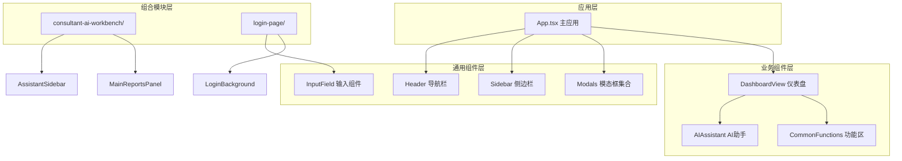
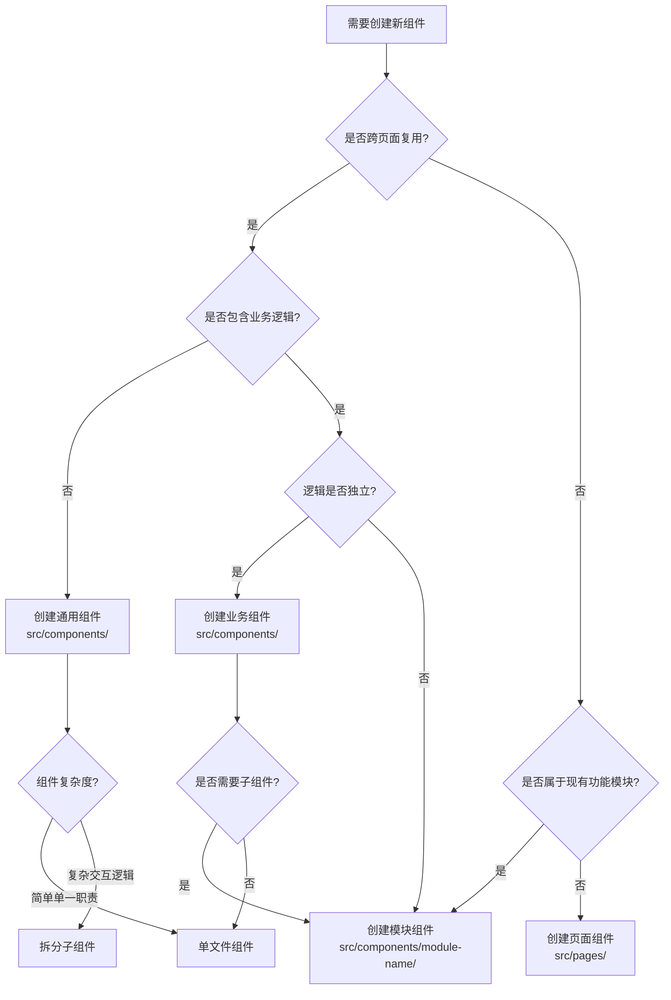

本页深入解析项目中组件的分层架构与设计原则，阐明通用组件与业务组件的边界划分、职责分离以及组织策略。通过理解这两种组件模式的差异与协作方式，开发者能够构建高复用性、易维护的前端架构。

## 组件分层架构概览

项目采用**双向分层策略**组织组件：横向按**功能域**划分为通用组件与业务组件，纵向按**复杂度**拆分为独立组件与组合模块。这种架构确保组件边界清晰，降低耦合度，提升可测试性与复用性。



Sources: [App.tsx](src/App.tsx#L1-L150), [Header.tsx](src/components/Header.tsx#L1-L79), [Sidebar.tsx](src/components/Sidebar.tsx#L1-L200)

## 通用组件：基础设施层

通用组件是应用的**视觉与交互基础设施**，具备三个核心特征：**高复用性**（跨页面使用）、**接口抽象**（通过 Props 配置行为）、**零业务逻辑**（不依赖特定数据模型）。这类组件聚焦于 UI 原语，为上层业务提供一致的交互体验。

### 导航与布局组件

**Header 组件**负责顶部栏的视觉呈现，包括页面标题图标、通知轮播和用户信息展示。其设计遵循**单一职责原则**：仅接收配置数据（当前页面、通知索引、用户名），不包含状态管理或业务计算逻辑。通过 `PAGE_TITLES` 映射表将页面标识符转换为可读标题，保持组件与路由系统的松耦合。

```typescript
// Header 接收纯展示数据，不执行副作用操作
interface HeaderProps {
  currentNoticeIndex: number;  // 外部控制轮播索引
  currentPage: AppPage;         // 当前页面标识
  currentUserName?: string;     // 可选用户信息
}
```

**Sidebar 组件**实现左侧导航的完整交互逻辑，包括菜单展开/折叠、主题切换和页面跳转。该组件通过 `renderNavigationItem` 函数递归渲染嵌套导航结构，使用 `ICON_MAP` 将配置中的图标标识符映射为 Lucide 组件实例，实现配置驱动的动态渲染。

Sources: [Header.tsx](src/components/Header.tsx#L9-L13), [Sidebar.tsx](src/components/Sidebar.tsx#L18-L89), [Sidebar.tsx](src/components/Sidebar.tsx#L131-L179)

### 表单与交互原语

**InputField 组件**展示了通用组件的**状态提升模式**：组件内部维护视觉状态（聚焦高亮），而业务状态（值、错误信息）由父组件管理。这种设计使组件既能提供即时视觉反馈，又保持与业务逻辑的解耦。

```typescript
interface InputFieldProps {
  label: string;              // 字段标签
  type?: string;              // 输入类型
  placeholder?: string;       // 占位提示
  value: string;              // 受控值（父组件管理）
  onChange: (e: ChangeEvent<HTMLInputElement>) => void;  // 变化回调
  error?: string;             // 错误提示（父组件传入）
  icon?: LucideIcon;          // 左侧图标
  rightElement?: ReactNode;   // 右侧扩展元素
}
```

组件通过 `isFocused` 状态控制边框样式与图标颜色，通过 `error` prop 叠加错误样式，实现**渐进式视觉反馈**：聚焦时提升可读性，错误时叠加红色警示，两者独立控制互不干扰。

Sources: [InputField.tsx](src/components/login-page/InputField.tsx#L8-L28), [InputField.tsx](src/components/login-page/InputField.tsx#L29-L74)

### 模态框集合

**Modals.tsx** 采用**集中式导出策略**，将多个业务模态框（ReceptionModal、CreateTaskModal）聚合在同一文件中。每个模态框封装独立的表单逻辑与交互流程，但共享统一的动画配置（AnimatePresence + motion.div）和视觉规范（圆角、阴影、毛玻璃背景）。

```typescript
// ReceptionModal 封装接待登记的完整交互流程
export function ReceptionModal({ 
  isOpen,     // 外部控制显示状态
  onClose,    // 关闭回调
  form,       // 受控表单数据
  setForm     // 表单更新函数
}: ReceptionModalProps)
```

这种设计使父组件（如 App.tsx）只需管理**开关状态**与**表单数据**，无需关心模态框内部的复杂 UI 逻辑，符合**关注点分离**原则。

Sources: [Modals.tsx](src/components/Modals.tsx#L1-L150), [Modals.tsx](src/components/Modals.tsx#L6-L11), [App.tsx](src/App.tsx#L7-L8)

## 业务组件：领域逻辑层

业务组件承载**特定功能域的完整交互流程**，包含领域数据模型、业务规则和状态管理逻辑。与通用组件不同，业务组件直接引用项目中的数据源（mockData、API 服务）和其他业务组件，形成**垂直功能切片**。

### 仪表盘视图组合器

**DashboardView 组件**扮演**组合器角色**：不直接渲染 UI，而是协调多个子组件（TaskSection、AIAssistant、CommonFunctions、StatsSection）的布局与数据流。其 Props 接口定义了完整的业务状态集合（活跃标签、选中任务、消息列表等），通过**属性下传**方式将状态分发至子组件。

```typescript
interface DashboardViewProps {
  activeTab: 'work' | 'todo' | 'risk';  // 标签页状态
  setActiveTab: React.Dispatch<...>;    // 标签切换器
  selectedTaskId: number | null;        // 选中任务 ID
  setSelectedTaskId: React.Dispatch<...>; // 任务选择器
  messages: DashboardMessage[];         // AI 聊天记录
  chatInput: string;                    // 聊天输入值
  setChatInput: React.Dispatch<...>;    // 输入更新器
  handleSendMessage: (text?: string) => void;  // 发送消息回调
  isAIOpen: boolean;                    // AI 助手展开状态
  setIsAIOpen: React.Dispatch<...>;     // AI 助手切换器
  // ... 更多业务状态
}
```

这种设计使 DashboardView 成为**业务逻辑的单一真相来源**，子组件只负责渲染与用户交互，状态管理全部提升至父组件，便于调试与状态持久化。

Sources: [DashboardView.tsx](src/components/DashboardView.tsx#L17-L30), [DashboardView.tsx](src/components/DashboardView.tsx#L32-L74)

### AI 助手交互组件

**AIAssistant 组件**实现了**双模式渲染**：嵌入式面板（用于首页侧边栏）和悬浮窗（用于全局访问）。组件内部定义了**推荐问题数据集**（suggestedPrompts），将业务知识（客户云仓查询、约车调度、报告生成）封装在组件内部，通过 `handleSendMessage` 回调与父组件通信。

```typescript
const suggestedPrompts = [
  { id: 'inventory', text: '帮我查询王先生在云仓的剩余库存', tag: '客户云仓' },
  { id: 'drivers', text: '今天下午3点到5点，有哪些空闲的专车司机？', tag: '约车调度' },
  { id: 'report', text: '生成一份本周高端客户接待效能报告', tag: '数据分析' },
  { id: 'policy', text: '查看最新的合规审查红头文件', tag: '政策中心' },
] as const;
```

组件的 `renderMessageContent` 函数展示了**内容解析策略**：通过字符串匹配（`\n`、`📊`、`[点击一键派单]`）识别特殊格式，动态渲染标题、按钮等交互元素。这种轻量级 DSL（领域特定语言）避免了引入重型 Markdown 解析器，同时保持了内容灵活性。

Sources: [AIAssistant.tsx](src/components/AIAssistant.tsx#L12-L19), [AIAssistant.tsx](src/components/AIAssistant.tsx#L29-L53), [AIAssistant.tsx](src/components/AIAssistant.tsx#L129-L161)

### 常用功能区组件

**CommonFunctions 组件**封装了**业务系统入口网格**，从 `mockData` 导入系统配置（SYSTEMS），通过条件判断（`sys.name === '到院接待'`）触发特定模态框。这种设计使组件能够**响应业务语义**，而非硬编码 UI 行为，提升了代码的可维护性。

```typescript
<div onClick={() => {
  if (sys.name === '到院接待') {
    setIsReceptionModalOpen(true);  // 业务语义驱动的行为
  }
}}>
  {/* 系统图标与标签 */}
</div>
```

组件通过**索引比较**（`index === 0`）实现**首项高亮**逻辑，使用渐变背景和提升阴影强化视觉层级。这种数据驱动的样式决策使业务规则（第一个系统始终高亮）与样式实现分离，便于后续调整。

Sources: [CommonFunctions.tsx](src/components/CommonFunctions.tsx#L6-L8), [CommonFunctions.tsx](src/components/CommonFunctions.tsx#L23-L60)

## 组件组合模式

对于复杂业务场景，项目采用**目录级组合模式**：将相关组件、类型定义、数据源和工具函数聚合在同一目录下，形成**功能模块**。这种组织方式超越了文件级别的组件划分，提供了更强的内聚性和更清晰的边界。

### 功能模块结构

**consultant-ai-workbench/** 目录展示了完整的模块化设计：顶层组件（ConsultantAIWorkbench.tsx）协调子组件（AssistantSidebar、CustomerInfoBar、InsightsSidebar、MainReportsPanel），子组件各自负责独立功能域。目录内包含**类型定义**（types.ts）、**数据源**（data.ts）、**业务逻辑**（chat.ts）以及**子模块**（json-render/），形成自包含的功能单元。

```
consultant-ai-workbench/
├── AssistantSidebar.tsx     # AI 对话侧边栏
├── CustomerInfoBar.tsx      # 客户信息条
├── InsightsSidebar.tsx      # 洞察侧边栏
├── MainReportsPanel.tsx     # 主报告面板
├── WorkbenchHeader.tsx      # 工作台头部
├── chat.ts                  # 对话逻辑
├── data.ts                  # 模块数据源
├── types.ts                 # 类型定义
└── json-render/             # JSON 渲染子模块
    ├── AssistantMessageContent.tsx
    ├── catalog.ts
    ├── registry.tsx
    └── spec.ts
```

**AssistantSidebar 组件**展示了模块内部协作：导入 `buildJsonRenderParts`（来自 json-render/spec）、`useJsonRenderMessage`（来自 @json-render/react）和 `quickPromptActions`（来自 ./data），通过模块内部路径引用保持依赖的局部性。组件接口定义了**完整的交互契约**（AI 名称、命名状态、消息列表、生成状态等），使外部调用者无需了解内部实现细节。

Sources: [consultant-ai-workbench/AssistantSidebar.tsx](src/components/consultant-ai-workbench/AssistantSidebar.tsx#L1-L60), [Directory Structure](src/components)

### 登录页模块化设计

**login-page/** 目录进一步细化了模块粒度：将登录页拆分为**表单组件**（forms/LoginMethodPanel）、**输入原语**（InputField）、**视觉背景**（background/NeuralFlowBackground、PhotonParticles）和**类型定义**（types.ts）。这种拆分使每个组件都能独立测试和复用。

```typescript
// InputField 作为通用原语，被 LoginMethodPanel 使用
<InputField
  label="手机号/工号"
  icon={User}
  value={username}
  onChange={(e) => setUsername(e.target.value)}
  error={errors.username}
/>
```

**FontLoader 组件**展示了**副作用封装**：组件内部动态加载字体（MiSans-Heavy），通过 `useEffect` 管理字体加载状态，对外暴露加载完成回调。这种设计将**字体加载的技术细节**与**业务逻辑**分离，符合单一职责原则。

Sources: [login-page/InputField.tsx](src/components/login-page/InputField.tsx#L19-L28), [login-page/Directory](src/components/login-page)

## 组件设计原则对比

通用组件与业务组件遵循不同的设计原则，理解这些差异有助于正确选择组件类型并设计合理的接口。

| 维度 | 通用组件 | 业务组件 |
|------|----------|----------|
| **复用范围** | 跨页面、跨项目 | 单一功能域 |
| **数据来源** | Props 传入（外部控制） | 内部引用（mockData、API） |
| **状态管理** | 视觉状态（聚焦、悬停） | 业务状态（表单、列表） |
| **依赖关系** | 仅依赖 UI 库（Lucide、Motion） | 依赖数据层、业务组件 |
| **测试策略** | 快照测试 + 交互测试 | 集成测试 + E2E 测试 |
| **命名约定** | 功能性名称（Header、InputField） | 业务性名称（AIAssistant、DashboardView） |
| **文件位置** | src/components/ 根目录 | src/components/ 或子目录 |

### Props 接口设计策略

**通用组件接口**强调**配置完整性**：提供合理的默认值，允许通过 Props 覆盖所有可配置项。例如 InputField 的 `type` 参数默认为 `'text'`，但支持传入 `'password'`、`'email'` 等类型。

```typescript
interface InputFieldProps {
  type?: string;  // 可选，提供默认值
  // 必需参数标记为必填
  label: string;
  value: string;
  onChange: (e: ChangeEvent<HTMLInputElement>) => void;
}
```

**业务组件接口**强调**状态托管**：接收状态值与更新函数配对（`value` + `onChange` 模式），使父组件能够完全控制子组件行为。这种设计便于实现**状态持久化**（如保存表单草稿）和**跨组件同步**（如多个组件共享同一数据源）。

```typescript
interface DashboardViewProps {
  activeTab: 'work' | 'todo' | 'risk';
  setActiveTab: React.Dispatch<React.SetStateAction<'work' | 'todo' | 'risk'>>;
  // 状态与更新器配对出现
}
```

Sources: [InputField.tsx](src/components/login-page/InputField.tsx#L8-L17), [DashboardView.tsx](src/components/DashboardView.tsx#L17-L30)

## 动画与交互规范

项目统一使用 **motion/react**（Framer Motion）处理动画，通过**声明式配置**实现复杂的过渡效果。通用组件和业务组件遵循相同的动画模式，但应用场景有所差异。

### 入场与退场动画

**AnimatePresence 组件**包裹条件渲染的内容，提供 `initial`、`animate`、`exit` 三态控制。Modals 中的模态框使用**缩放 + 透明度**组合动画，营造**弹出/收起**的视觉隐喻：

```typescript
<motion.div 
  initial={{ scale: 0.95, opacity: 0, y: 20 }}
  animate={{ scale: 1, opacity: 1, y: 0 }}
  exit={{ scale: 0.95, opacity: 0, y: 20 }}
  className="bg-white rounded-3xl shadow-2xl"
>
  {/* 模态框内容 */}
</motion.div>
```

**y 轴偏移**（y: 20 → 0）创造**从下向上浮起**的视觉效果，结合**缩放**（scale: 0.95 → 1）增强立体感。这种组合动画在通用组件（模态框、通知轮播）和业务组件（AI 消息列表）中保持一致。

Sources: [Modals.tsx](src/components/Modals.tsx#L23-L27), [Header.tsx](src/components/Header.tsx#L43-L58)

### 状态过渡动画

**AIAssistant 组件**的输入框展示了**条件动画**：通过 `group-focus-within` 伪类触发渐变动画，实现**聚焦时边框发光**效果。动画使用 `backgroundPosition` 属性驱动渐变流动，配合 `opacity` 过渡实现平滑的出现/消失。

```typescript
<motion.div
  className="absolute -inset-0.5 rounded-full opacity-30 blur-md group-focus-within:opacity-60"
  style={{
    backgroundImage: 'linear-gradient(to right, #3b82f6, #60a5fa, #93c5fd, #2563eb, #3b82f6)',
    backgroundSize: '200% 200%'
  }}
  animate={{ backgroundPosition: ['0% 50%', '100% 50%'] }}
  transition={{ duration: 4, repeat: Infinity, ease: 'linear' }}
/>
```

这种**双层渐变**设计（底层模糊 + 顶层清晰）创造出**光晕扩散**的视觉效果，提升交互反馈的视觉吸引力。

Sources: [AIAssistant.tsx](src/components/AIAssistant.tsx#L84-L102)

## 样式与主题集成

所有组件使用 **Tailwind CSS** 实现样式，通过**语义化类名**（如 `bg-brand`、`text-brand-hover`）引用主题变量，而非硬编码颜色值。这种设计使组件能够**自动响应主题切换**（亮色/暗色模式），无需修改组件代码。

### 主题感知样式

**Sidebar 组件**通过**条件类名**实现主题切换：`isDarkMode` 参数控制背景色、边框色和文字颜色的类名组合。组件内部使用**三元表达式**动态生成类名字符串，保持样式逻辑的可读性。

```typescript
<aside className={`
  flex flex-col relative overflow-hidden
  ${isDarkMode 
    ? 'bg-[#0F111A] border-r border-slate-800' 
    : 'bg-white border-r border-slate-100'
  }
`}>
```

这种**内联条件样式**模式在通用组件中广泛使用，使组件能够适应不同的主题环境而不需要外部样式注入。

Sources: [Sidebar.tsx](src/components/Sidebar.tsx#L182), [Sidebar.tsx](src/components/Sidebar.tsx#L54-L58)

### 响应式布局

组件通过 **Tailwind 的响应式前缀**（`xl:`、`lg:`）实现断点适配。DashboardView 使用 `grid-cols-1 xl:grid-cols-4` 实现**移动端单列、桌面端四列**的布局切换，无需编写媒体查询。

```typescript
<div className="grid grid-cols-1 xl:grid-cols-4 gap-6 mb-6">
  <TaskSection />  {/* 移动端全宽，桌面端占 1/4 */}
  <RiskSection />
</div>
```

**CommonFunctions 组件**使用 `grid-cols-5` 创建**固定五列**网格，通过 `justify-items-center` 居中对齐每个图标。这种布局在桌面端提供紧凑的功能入口，在移动端通过父容器的响应式规则自动调整。

Sources: [DashboardView.tsx](src/components/DashboardView.tsx#L48-L57), [CommonFunctions.tsx](src/components/CommonFunctions.tsx#L22)

## 开发实践建议

基于项目组件架构，以下是构建新组件时的决策流程与最佳实践。

### 组件类型选择决策树



### 命名与文件组织

**通用组件**使用**功能描述性命名**（Header、Sidebar、InputField），文件直接放置在 `src/components/` 根目录。**业务组件**使用**领域描述性命名**（AIAssistant、DashboardView），复杂业务组件创建同名目录并拆分子组件。

**类型定义**遵循**就近原则**：组件专用的类型定义在组件文件内部（如 `HeaderProps`），跨组件共享的类型定义在 `src/types.ts`，模块专用类型定义在模块目录内的 `types.ts`。

Sources: [types.ts](src/types.ts#L1-L80), [Header.tsx](src/components/Header.tsx#L9-L13)

### Props 接口设计清单

创建新组件时，按以下清单设计 Props 接口：

1. **必需参数**：标记核心功能所需的数据（如 InputField 的 `value` 和 `onChange`）
2. **可选参数**：提供合理默认值（如 InputField 的 `type` 默认为 `'text'`）
3. **回调函数**：使用明确的命名（如 `onClose`、`handleSubmit`）
4. **状态提升**：对于业务组件，接收状态值与更新函数配对
5. **扩展性**：使用 `ReactNode` 类型的 `rightElement`、`children` 等参数支持内容扩展

### 测试策略分层

**通用组件**适合**单元测试 + 快照测试**：验证 Props 变化时的渲染输出，测试交互行为（点击、输入）。**业务组件**需要**集成测试**：模拟数据源（mockData、API），验证组件与子组件的协作。**功能模块**需要**E2E 测试**：验证完整的用户流程（如登录 → 导航 → 操作）。

## 延伸阅读

- **组件目录结构与命名约定**：了解项目的文件组织规范和命名策略
- **模态框与交互组件**：深入模态框的设计模式与交互细节
- **Mock 数据与类型定义**：掌握数据层与组件层的协作方式
- **Tailwind CSS 配置**：理解主题系统与响应式设计实现