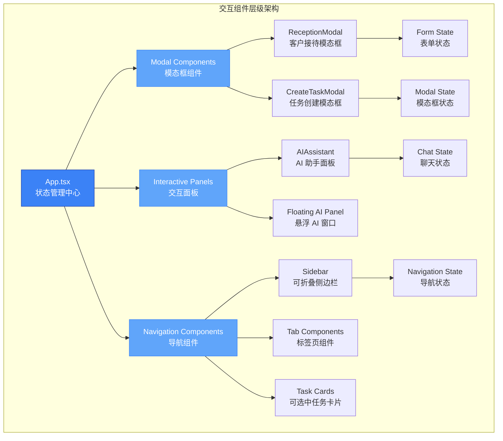
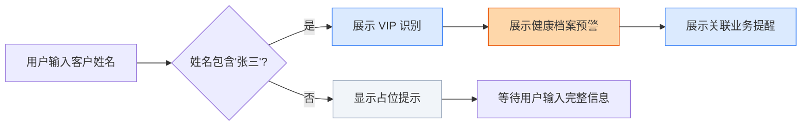
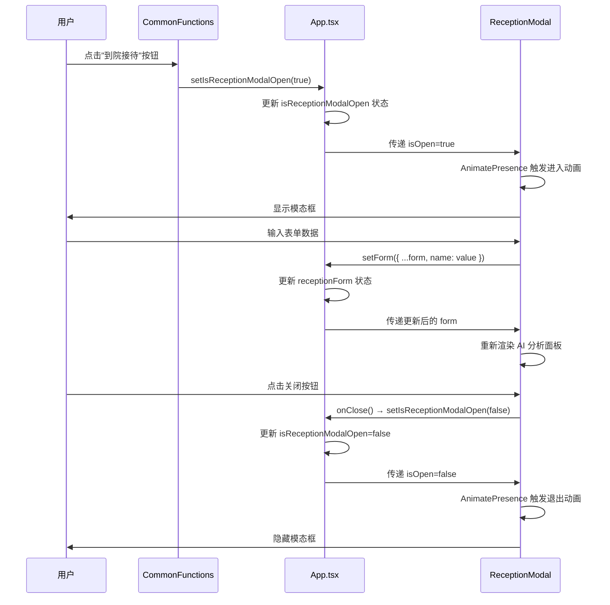

在现代企业级前端应用中，**模态框与交互组件**构成了用户界面的核心交互层，它们负责处理复杂的信息展示、表单提交以及即时反馈。本项目采用了一套统一的交互组件架构，基于 **Framer Motion** 实现流畅的动画效果，通过 **状态提升** 管理组件间的数据流，并遵循 **无障碍设计** 原则确保所有用户都能获得良好的交互体验。本文档将深入剖析模态框系统、AI 助手面板、可折叠侧边栏以及标签页切换等核心交互组件的设计模式与实现细节，帮助中级开发者掌握企业级交互组件的构建方法。

## 架构概览：交互组件体系

本项目的交互组件遵循 **单一职责原则**，每个组件专注于特定的交互场景，同时通过 **状态提升** 和 **受控组件模式** 保持数据流的清晰与可预测。整个交互系统建立在三个核心支柱之上：**Motion 动画库** 提供声明式动画能力，**AnimatePresence** 处理组件的进入与退出过渡，**状态管理** 确保组件间的协调运作。



所有交互组件的状态都通过 **useState** 在 App.tsx 中集中管理，这种 **状态提升** 策略确保了组件间的解耦，使得模态框的打开、标签页的切换、AI 面板的展开等操作都能通过 props 传递的回调函数进行精确控制。组件内部只负责 UI 渲染与用户事件处理，不维护业务状态，从而实现了 **单向数据流** 的架构原则。

Sources: [App.tsx](src/App.tsx#L40-L50)

## 模态框系统设计

模态框是处理复杂表单和多步骤操作的核心组件。本项目的模态框系统基于 **ReceptionModal** 和 **CreateTaskModal** 两个业务模态框构建，它们共享统一的动画模式、布局结构和交互逻辑。

### 模态框组件接口定义

每个模态框组件都遵循 **受控组件模式**，通过 props 接收状态数据和回调函数。**ReceptionModal** 需要处理复杂的表单数据，因此接收 `form` 和 `setForm` 作为 props，而 **CreateTaskModal** 相对简单，只需控制开关状态。

```typescript
// ReceptionModal 接口定义
interface ReceptionModalProps {
  isOpen: boolean;              // 控制模态框显示/隐藏
  onClose: () => void;          // 关闭模态框的回调
  form: {                       // 表单数据对象
    name: string;
    serial: string;
    details: string;
  };
  setForm: (form: any) => void; // 更新表单数据的回调
}

// CreateTaskModal 接口定义
interface CreateTaskModalProps {
  isOpen: boolean;              // 控制模态框显示/隐藏
  onClose: () => void;          // 关闭模态框的回调
}
```

这种接口设计使得模态框组件具有 **高度可测试性** 和 **可复用性**，父组件完全控制模态框的状态，便于在不同场景下复用相同的模态框逻辑。

Sources: [Modals.tsx](src/components/Modals.tsx#L6-L11)

### 动画系统与 AnimatePresence

模态框的进入与退出动画通过 **AnimatePresence** 和 **motion** 组件实现。**AnimatePresence** 允许组件在卸载时执行退出动画，而 **motion.div** 提供了声明式的动画属性定义。

```typescript
<AnimatePresence>
  {isOpen && (
    <motion.div 
      initial={{ opacity: 0 }}
      animate={{ opacity: 1 }}
      exit={{ opacity: 0 }}
      className="fixed inset-0 bg-slate-900/40 backdrop-blur-sm z-50"
    >
      {/* 模态框内容 */}
    </motion.div>
  )}
</AnimatePresence>
```

**遮罩层** 使用 `opacity` 从 0 到 1 的渐变，配合 `backdrop-blur-sm` 创建毛玻璃效果。**模态框主体** 则使用更复杂的组合动画：`scale` 从 0.95 到 1 的缩放，`opacity` 从 0 到 1 的渐变，`y` 从 20px 到 0 的位移，这三个动画同时进行创造出平滑的弹出效果。

Sources: [Modals.tsx](src/components/Modals.tsx#L15-L28)

### ReceptionModal：智能表单与 AI 分析

**ReceptionModal** 是一个业务级模态框，集成了 **表单输入** 和 **AI 智能分析** 两大功能模块。左侧为传统表单区域，包含客户姓名、流水单号和业务处理细节三个输入字段；右侧为 AI 分析面板，根据输入的客户信息动态展示个性化建议。



AI 分析面板采用 **条件渲染** 策略：当 `form.name.includes('张三')` 为真时，展示三条结构化的分析建议（VIP 识别、健康档案预警、关联业务提醒），每条建议都包含图标、标题和详细描述；否则显示占位提示，引导用户输入完整信息。这种设计模式使得模态框能够根据用户输入 **实时响应**，提供上下文相关的智能辅助。

Sources: [Modals.tsx](src/components/Modals.tsx#L88-L131)

### CreateTaskModal：多字段表单与交互元素

**CreateTaskModal** 展示了更复杂的表单交互模式，包含文本输入、文本域、参与者选择、日期时间选择器以及文件上传区域等多种表单控件。

| 表单字段 | 组件类型 | 交互特性 | 图标 |
|---------|---------|---------|------|
| 任务名称 | `<input type="text">` | 聚焦时蓝色边框高亮 | FileText |
| 任务详情 | `<textarea>` | 自动高度调整，禁止手动 resize | MessageSquareText |
| 参与任务 | 按钮组 + 头像 | 点击切换选中状态，悬停变色 | Users |
| 计划开始 | `<input type="datetime-local">` | 浏览器原生日期时间选择器 | Clock |
| 完成时间 | `<input type="datetime-local">` | 浏览器原生日期时间选择器 | CalendarClock |
| 上传附件 | 拖拽区域 | 虚线边框，悬停背景变色，支持拖拽 | Paperclip |

参与者选择区域使用了 **按钮组模式**，每个参与者以圆角按钮形式展示，包含头像和姓名。点击按钮时，通过 `hover:bg-brand-light` 和 `hover:border-brand-border` 实现视觉反馈。文件上传区域采用 **虚线边框** 和 **拖拽提示**，使用 `border-2 border-dashed border-slate-200` 样式，悬停时背景变为 `hover:bg-slate-50`，引导用户进行拖拽或点击操作。

Sources: [Modals.tsx](src/components/Modals.tsx#L191-L276)

### 模态框状态管理流程

模态框的状态管理遵循 **单向数据流** 原则，所有状态在 App.tsx 中初始化，通过 props 传递给子组件，子组件通过回调函数更新状态。



这种状态管理模式确保了 **数据流的可追溯性**，任何状态变更都能在 App.tsx 中追踪到源头，便于调试和维护。同时，模态框组件保持 **无状态**（Stateless），只负责渲染和事件处理，提高了组件的可测试性和可复用性。

Sources: [App.tsx](src/App.tsx#L238-L243)

## AI 助手交互面板

**AIAssistant** 组件展示了复杂的聊天交互界面，包含 **消息列表**、**输入框**、**推荐问题** 和 **悬浮面板** 四个核心模块。该组件采用 **双模式设计**：既可作为页面内嵌面板展示，也可作为悬浮窗口独立运行。

### 消息渲染与内容解析

消息列表使用 **role 字段** 区分用户消息和 AI 消息，通过条件渲染实现不同的样式和布局。用户消息右对齐，使用渐变背景 `bg-gradient-to-br from-cyan-500 to-blue-600`；AI 消息左对齐，使用白色背景配合品牌色图标。

```typescript
const renderMessageContent = (content: string) => {
  return content.split('\n').map((line) => (
    <React.Fragment key={`${content}-${line}`}>
      {line.startsWith('📊') || line.startsWith('🚗') ? (
        <strong className="block mb-2 text-slate-900 text-base font-bold">{line}</strong>
      ) : line.includes('[点击一键派单') ? (
        <button type="button" className="mt-3 w-full py-2.5 bg-brand-light text-brand font-bold rounded-xl">
          {line}
        </button>
      ) : (
        <span className="block">{line}</span>
      )}
    </React.Fragment>
  ));
};
```

`renderMessageContent` 函数实现了 **智能内容解析**：以 📊 或 🚗 开头的行渲染为粗体标题，包含 `[点击一键派单` 的行渲染为可点击按钮，普通行渲染为文本。这种模式使得 AI 响应能够包含 **富文本元素**，提升交互体验。

Sources: [AIAssistant.tsx](src/components/AIAssistant.tsx#L36-L53)

### 推荐问题组件

推荐问题组件 **SuggestedQuestions** 支持两种布局模式：大卡片模式（用于初始状态）和小标签模式（用于聊天进行中）。通过 `isSmall` prop 控制布局切换。

```typescript
const SuggestedQuestions = ({ isSmall = false }: { isSmall?: boolean }) => (
  <div className={isSmall ? 'shrink-0 pt-3 border-t border-slate-200/60' : 'flex-1 overflow-y-auto pr-2'}>
    <div className={isSmall ? 'flex flex-wrap gap-2' : 'flex flex-col space-y-3'}>
      {suggestedPrompts.map((prompt) => (
        <button
          key={prompt.id}
          type="button"
          onClick={() => handleSendMessage(prompt.text)}
          className={isSmall ? 'bg-white border border-slate-200 rounded-full' : 'bg-white p-5 rounded-2xl'}
        >
          {/* 按钮内容 */}
        </button>
      ))}
    </div>
  </div>
);
```

大卡片模式下，每个推荐问题占据独立卡片，包含问题文本和标签（如"客户云仓"、"约车调度"），点击后直接发送消息。小标签模式下，推荐问题以横向排列的圆角标签形式展示，节省空间并保持聊天流畅性。

Sources: [AIAssistant.tsx](src/components/AIAssistant.tsx#L55-L80)

### 输入框动画效果

AI 助手的输入框采用了 **渐变边框动画**，通过两层 motion.div 实现动态边框效果。外层为模糊的渐变光晕，内层为清晰的渐变边框，两者通过 `backgroundPosition` 动画实现流动效果。

```typescript
<motion.div
  className="absolute -inset-0.5 rounded-full opacity-30 blur-md group-focus-within:opacity-60"
  style={{
    backgroundImage: 'linear-gradient(to right, #3b82f6, #60a5fa, #93c5fd, #2563eb, #3b82f6)',
    backgroundSize: '200% 200%'
  }}
  animate={{ backgroundPosition: ['0% 50%', '100% 50%'] }}
  transition={{ duration: 4, repeat: Infinity, ease: 'linear' }}
/>
```

动画通过 `group-focus-within` 实现交互响应：当输入框获得焦点时，外层光晕的不透明度从 0.3 提升到 0.6，增强视觉反馈。输入框还集成了 **字符计数器**（`{chatInput.length}/100`）和 **发送按钮**，发送按钮在输入为空时通过 `disabled` 属性禁用，防止发送空消息。

Sources: [AIAssistant.tsx](src/components/AIAssistant.tsx#L82-L127)

### 悬浮 AI 面板

悬浮 AI 面板通过 **固定定位**（`fixed bottom-8 right-8`）锚定在页面右下角，包含一个触发按钮和一个展开的聊天窗口。触发按钮使用渐变背景和阴影效果，点击时通过 `setIsAIOpen(!isAIOpen)` 切换面板状态。

```typescript
<AnimatePresence>
  {isAIOpen && (
    <motion.div
      initial={{ opacity: 0, y: 20, scale: 0.95 }}
      animate={{ opacity: 1, y: 0, scale: 1 }}
      exit={{ opacity: 0, y: 20, scale: 0.95 }}
      transition={{ duration: 0.2 }}
      className="bg-white w-[400px] h-[550px] rounded-3xl shadow-2xl"
    >
      {/* 面板内容 */}
    </motion.div>
  )}
</AnimatePresence>
```

悬浮面板的动画使用了 **组合属性**：`opacity` 控制透明度，`y` 控制垂直位移，`scale` 控制缩放比例。`transition={{ duration: 0.2 }}` 确保动画快速流畅，符合现代 UI 的响应速度要求。面板顶部使用渐变背景 `bg-gradient-to-r from-brand to-brand-hover`，配合装饰性的模糊圆形元素 `bg-white/10 rounded-full blur-2xl`，创造出精致的视觉层次。

Sources: [AIAssistant.tsx](src/components/AIAssistant.tsx#L163-L234)

## 可折叠侧边栏交互

**Sidebar** 组件展示了复杂的导航交互模式，包含 **折叠/展开切换**、**主题切换**、**嵌套导航** 和 **Logo 上传** 等多个交互功能。

### 折叠/展开状态管理

侧边栏的折叠状态通过 `isCollapsed` prop 控制，折叠时宽度从 `w-72` 缩减到 `w-20`，通过 `transition-all duration-300` 实现平滑过渡。折叠状态下，所有文本标签隐藏，只保留图标，导航项居中对齐。

```typescript
<aside className={`flex flex-col transition-all duration-300 ${
  isCollapsed ? 'w-20' : 'w-72'
}`}>
  <button onClick={() => setIsCollapsed(!isCollapsed)}>
    <Menu className="w-4 h-4" />
  </button>
</aside>
```

折叠按钮位于侧边栏顶部，使用 **Menu 图标**，点击时通过 `setIsCollapsed(!isCollapsed)` 切换状态。折叠状态下，子导航项（`isSubItem`）完全隐藏，避免布局错乱。

Sources: [Sidebar.tsx](src/components/Sidebar.tsx#L182-L197)

### 嵌套导航与展开逻辑

嵌套导航通过 **hasArrow** 和 **isOpen** props 控制展开状态。父级导航项显示箭头图标，点击时展开或收起子导航。子导航项通过 `isSubItem` 标识，使用缩进和连接线展示层级关系。

```typescript
function NavItem({ icon: Icon, label, active, isSubItem, isCollapsed, hasArrow, isOpen, onClick }: NavItemProps) {
  if (isCollapsed && isSubItem) return null; // 折叠时隐藏子项
  
  return (
    <div className="relative">
      {isSubItem && !isCollapsed && (
        <div className="absolute left-[-1rem] top-1/2 w-2 h-[1px] bg-slate-200"></div>
      )}
      <button onClick={onClick}>
        {/* 导航项内容 */}
        {hasArrow && (
          <ChevronRight className={`w-3.5 h-3.5 transition-transform ${isOpen ? 'rotate-90' : ''}`} />
        )}
      </button>
    </div>
  );
}
```

连接线通过 **绝对定位** 实现，从父级导航项向子项延伸，使用 `left-[-1rem]` 定位到父级左侧，`w-2 h-[1px]` 定义线条尺寸。箭头图标通过 `rotate-90` 类实现旋转效果，展开时指向下方。

Sources: [Sidebar.tsx](src/components/Sidebar.tsx#L41-L89)

### 主题切换交互

主题切换器位于侧边栏底部，包含 **Light** 和 **Dark** 两个按钮，通过 `isDarkMode` 状态控制当前主题。未折叠时显示完整切换器，折叠时隐藏。

```typescript
{!isCollapsed && (
  <div className="flex items-center p-1 rounded-2xl bg-slate-100">
    <button
      onClick={() => setIsDarkMode(false)}
      className={`flex-1 py-2 rounded-xl ${!isDarkMode ? 'bg-white text-slate-900 shadow-sm' : 'text-slate-500'}`}
    >
      <Sun className="w-3.5 h-3.5" />
      <span>Light</span>
    </button>
    <button
      onClick={() => setIsDarkMode(true)}
      className={`flex-1 py-2 rounded-xl ${isDarkMode ? 'bg-brand text-white shadow-sm' : 'text-slate-500'}`}
    >
      <Moon className="w-3.5 h-3.5" />
      <span>Dark</span>
    </button>
  </div>
)}
```

切换器使用 **分段控制器**（Segmented Control）设计，当前激活的按钮通过 `bg-white` 或 `bg-brand` 突出显示，未激活按钮保持透明背景。整个切换器使用 `p-1` 内边距和 `rounded-2xl` 圆角，创造出内凹的视觉效果。

Sources: [Sidebar.tsx](src/components/Sidebar.tsx#L239-L256)

### Logo 上传功能

侧边栏的 Logo 区域支持 **自定义上传**，通过隐藏的 `<input type="file">` 元素和 `useRef` 实现点击触发。上传的图片通过 `FileReader` 转换为 Base64 URL，存储在组件状态中。

```typescript
const [logoUrl, setLogoUrl] = React.useState<string | null>(null);
const fileInputRef = React.useRef<HTMLInputElement>(null);

const handleLogoUpload = (event: React.ChangeEvent<HTMLInputElement>) => {
  const file = event.target.files?.[0];
  if (file) {
    const reader = new FileReader();
    reader.onloadend = () => {
      setLogoUrl(reader.result as string);
    };
    reader.readAsDataURL(file);
  }
};

return (
  <button onClick={() => fileInputRef.current?.click()}>
    <input type="file" ref={fileInputRef} onChange={handleLogoUpload} className="hidden" accept="image/*" />
    <div className="w-12 h-12 bg-brand rounded-2xl overflow-hidden">
      {logoUrl ?  : <Activity className="w-7 h-7" />}
    </div>
  </button>
);
```

Logo 容器使用 `overflow-hidden` 确保图片不会溢出圆角边界，默认显示 Activity 图标，上传后替换为用户图片。这种设计模式避免了传统文件上传按钮的丑陋外观，提供了更优雅的交互体验。

Sources: [Sidebar.tsx](src/components/Sidebar.tsx#L113-L218)

## 标签页与任务卡片交互

**TaskSection** 组件展示了标签页切换和任务卡片选择的交互模式，通过 **activeTab** 状态控制当前显示的内容，通过 **selectedTaskId** 状态管理卡片的选中状态。

### 标签页切换机制

标签页通过 **按钮组** 实现，每个标签对应一个 `activeTab` 值（'work'、'todo'、'risk'）。当前激活的标签使用 `text-slate-900` 深色文本，未激活标签使用 `text-slate-400` 浅色文本，悬停时变为 `hover:text-slate-600`。

```typescript
<div className="flex items-center space-x-8">
  <button 
    onClick={() => setActiveTab('work')}
    className={`text-lg font-bold ${activeTab === 'work' ? 'text-slate-900' : 'text-slate-400 hover:text-slate-600'}`}
  >
    我的工作
  </button>
  <button 
    onClick={() => setActiveTab('todo')}
    className={`text-lg font-bold ${activeTab === 'todo' ? 'text-slate-900' : 'text-slate-400 hover:text-slate-600'}`}
  >
    待办事项
    <span className="ml-2 bg-[#FF5F57] text-white text-[10px] px-1.5 py-0.5 rounded-full">3</span>
  </button>
</div>
```

"待办事项"标签包含 **徽章**（Badge）组件，显示未处理事项数量，使用红色背景 `bg-[#FF5F57]` 和白色文本，吸引注意力。标签页切换时，`currentTasks` 变量根据 `activeTab` 值动态选择数据源（WORKS 或 TODOS），实现内容的即时切换。

Sources: [TaskSection.tsx](src/components/TaskSection.tsx#L28-L43)

### 任务卡片选择交互

任务卡片支持 **单击选中** 和 **再次点击取消** 的交互模式。卡片使用 `button` 元素包裹，通过 `aria-pressed` 属性标识选中状态，提升无障碍访问性。

```typescript
<button
  type="button"
  key={todo.id} 
  onClick={() => setSelectedTaskId(isSelected ? null : todo.id)}
  aria-pressed={isSelected}
  className={`group flex flex-col p-5 rounded-2xl bg-white cursor-pointer transition-all duration-300 ${
    isSelected 
      ? 'shadow-[0_20px_40px_-15px_rgba(0,0,0,0.1)] scale-105 z-20 ring-1 ring-slate-200 rotate-1' 
      : 'shadow-sm hover:shadow-md hover:-translate-y-1 z-10'
  } text-left`}
>
  {/* 卡片内容 */}
</button>
```

选中状态下，卡片应用 **组合变换**：`scale-105` 放大 5%，`rotate-1` 轻微旋转 1 度，`shadow-[0_20px_40px_-15px_rgba(0,0,0,0.1)]` 增强阴影，`z-20` 提升层级，`ring-1 ring-slate-200` 添加边框环。这些变换组合创造出 **浮起效果**，使选中卡片从周围卡片中脱颖而出。未选中卡片悬停时仅应用 `hover:-translate-y-1` 轻微上移，保持视觉层次清晰。

Sources: [TaskSection.tsx](src/components/TaskSection.tsx#L63-L73)

### 进度条动态渲染

任务卡片底部包含 **进度条**，根据 `progress` 值动态设置颜色和宽度。进度超过 80% 显示品牌蓝色，40%-80% 显示橙色，低于 40% 显示红色，通过条件类名实现。

```typescript
<div className="h-1.5 bg-slate-100 rounded-full overflow-hidden">
  <div 
    className={`h-full rounded-full transition-all duration-500 ${
      todo.progress > 80 ? 'bg-brand' : todo.progress > 40 ? 'bg-orange-400' : 'bg-red-400'
    }`}
    style={{ width: `${todo.progress}%` }}
  ></div>
</div>
```

进度条容器使用 `overflow-hidden` 裁剪超出部分，内部进度条通过 `style={{ width: ${todo.progress}% }}` 动态设置宽度。`transition-all duration-500` 确保宽度变化时平滑过渡，提升视觉体验。

Sources: [TaskSection.tsx](src/components/TaskSection.tsx#L118-L123)

## 最佳实践与设计原则

### 动画性能优化

所有动画使用 **transform** 和 **opacity** 属性，避免触发重排（Reflow）和重绘（Repaint）。Framer Motion 自动启用 GPU 加速，通过 `will-change` 属性提示浏览器优化渲染。对于复杂动画，使用 `layoutId` 实现共享元素过渡，减少 DOM 操作。

### 无障碍设计要点

所有交互元素使用 **语义化标签**（`button`、`input`），避免 `div` 模拟按钮。模态框和悬浮面板包含 `aria-label` 属性，任务卡片使用 `aria-pressed` 标识状态。输入框关联 `label` 元素，通过 `htmlFor` 和 `id` 建立显式关联。键盘导航通过 `tabIndex` 和 `onKeyDown` 支持，Enter 键触发提交，Escape 键关闭模态框。

### 状态管理策略

遵循 **单一数据源** 原则，所有共享状态在 App.tsx 中集中管理。组件间通过 **props 向下传递**，**回调函数向上更新**，避免双向绑定带来的复杂性。对于复杂表单，使用 **对象状态**（如 `receptionForm`）而非多个独立状态，减少状态更新次数。

### 样式复用模式

使用 **Tailwind 的 @apply 指令** 提取重复样式，或创建 **组件变体**（如 NavItem 的 active/inactive 状态）。对于复杂的条件样式，使用 **类名拼接工具**（如 `clsx` 或 `classnames`）保持代码可读性。避免内联样式，优先使用 Tailwind 工具类，确保样式的一致性和可维护性。

## 下一步学习建议

掌握模态框与交互组件后，建议继续学习以下相关主题：

- **[Tailwind CSS 配置](25-tailwind-css-pei-zhi)**：深入了解如何定制 Tailwind 主题，扩展品牌色系，配置响应式断点，为交互组件提供更丰富的样式支持
- **[暗色模式与主题切换](26-an-se-mo-shi-yu-zhu-ti-qie-huan)**：学习如何实现完整的主题系统，包括 CSS 变量注入、主题持久化以及平滑的主题过渡动画
- **[响应式设计实践](27-xiang-ying-shi-she-ji-shi-jian)**：掌握移动端适配技巧，学习如何优化交互组件在不同屏幕尺寸下的表现，处理触摸事件和手势交互
- **[React Query 数据缓存](29-react-query-shu-ju-huan-cun)**：了解如何将交互组件与后端 API 集成，实现数据预取、乐观更新和错误重试机制

这些主题将帮助你构建更完善的企业级前端应用，将交互组件与数据层、样式系统深度融合，创造出既美观又高效的用户界面。