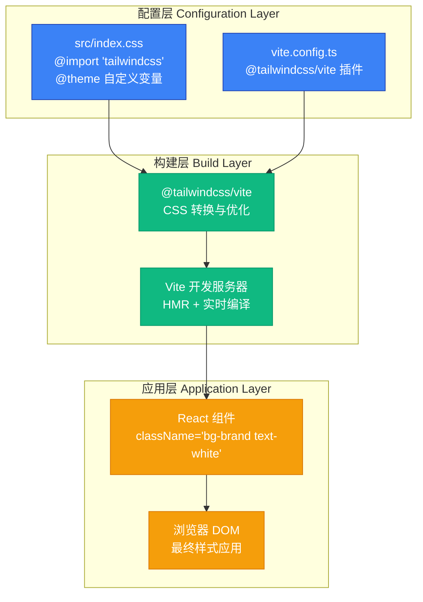

本页面深入解析 AI Business Platform 前端项目中的 Tailwind CSS v4 配置体系。项目采用 **Tailwind CSS v4.1.14**，这是 Tailwind 的最新主版本，采用全新的 **CSS-first 配置范式**，摒弃了传统的 `tailwind.config.js` 文件，转而在 CSS 文件中直接定义主题变量。这种架构显著简化了配置流程，使主题定制更加直观且符合现代前端工程化实践。本指南将系统性地阐述配置文件结构、Vite 集成机制、自定义主题扩展以及实际组件中的应用模式，帮助初学者快速掌握项目的样式系统架构。

Sources: [package.json](package.json#L6-L50)

## 配置架构总览

项目采用 **Tailwind CSS v4 + Vite 插件** 的零配置集成方案，所有主题定制通过 CSS 原生变量系统实现。以下架构图展示了配置文件、构建工具与组件代码之间的数据流向与依赖关系：



**核心配置文件说明**：
- **src/index.css**：定义 Tailwind 基础指令与自定义主题变量，是整个样式系统的入口文件
- **vite.config.ts**：注册 `@tailwindcss/vite` 插件，实现开发环境的实时样式编译与生产环境的优化打包
- **无 PostCSS 配置**：Tailwind v4 的 Vite 插件已内置所有必要的 CSS 转换能力，无需额外的 `postcss.config.js`

Sources: [src/index.css](src/index.css#L1-L9), [vite.config.ts](vite.config.ts#L1-L39)

## Vite 集成配置

Tailwind CSS v4 通过 **`@tailwindcss/vite`** 插件与 Vite 深度集成，提供开箱即用的开发体验。在 `vite.config.ts` 中，插件注册仅需一行代码：

```typescript
import tailwindcss from '@tailwindcss/vite';
import react from '@vitejs/plugin-react';
import { defineConfig } from 'vite';

export default defineConfig({
  plugins: [react(), tailwindcss()],
  // 其他 Vite 配置...
});
```

**插件核心能力**：
- **开发环境**：监听 CSS 文件变化，自动触发 HMR（热模块替换），修改 `@theme` 变量后无需重启服务器
- **生产构建**：自动执行 CSS 树摇（Tree-shaking），移除未使用的样式类，显著减小最终打包体积
- **Source Map 支持**：开发模式下生成精确的 CSS Source Map，便于调试样式来源

**依赖版本要求**：项目使用 `tailwindcss@4.1.14` 与 `@tailwindcss/vite@4.1.14`，确保插件与核心库版本完全一致以避免兼容性问题。`autoprefixer@10.4.21` 作为开发依赖自动处理 CSS 厂商前缀，无需手动配置。

Sources: [vite.config.ts](vite.config.ts#L1-L9), [package.json](package.json#L32-L49)

## 自定义主题配置

### @theme 指令与品牌色彩系统

Tailwind v4 的核心创新是 **`@theme` 指令**，允许在 CSS 中直接定义自定义设计令牌（Design Tokens）。项目的 `src/index.css` 文件通过此机制定义了完整的品牌色彩系统：

```css
@import "tailwindcss";

@theme {
  --color-brand: #3B82F6;
  --color-brand-hover: #2563EB;
  --color-brand-light: #EFF6FF;
  --color-brand-border: #DBEAFE;
}
```

**主题变量命名规范**：所有自定义颜色变量遵循 `--color-{语义名称}` 格式，Tailwind 会自动将这些变量映射为可用的工具类，例如 `bg-brand`、`text-brand-hover`、`border-brand-border`。

### 品牌色彩设计意图

以下表格详细说明每个品牌色彩变量的设计用途与典型应用场景：

| CSS 变量 | 色值 | 工具类名称 | 设计意图 | 典型应用场景 |
|---------|------|-----------|---------|------------|
| `--color-brand` | `#3B82F6` | `bg-brand`<br/>`text-brand` | 主品牌色，代表专业与信任 | 主要按钮、激活状态图标、品牌标识 |
| `--color-brand-hover` | `#2563EB` | `bg-brand-hover`<br/>`hover:bg-brand-hover` | 主品牌色的深色变体 | 按钮 hover 状态、链接悬停效果 |
| `--color-brand-light` | `#EFF6FF` | `bg-brand-light` | 极浅的品牌背景色 | 信息提示背景、次要高亮区域 |
| `--color-brand-border` | `#DBEAFE` | `border-brand-border` | 品牌相关的边框色 | 输入框聚焦边框、卡片边框 |

**色彩系统设计原则**：品牌色采用 **蓝色系**（Blue-500/600），传达医疗 AI 平台的科技感与专业性；hover 色通过增加饱和度（降低 Lightness 值）强化交互反馈；light 与 border 色保持低饱和度，确保背景与边框不喧宾夺主。

Sources: [src/index.css](src/index.css#L1-L9)

## 组件中的实际应用模式

### 基础工具类组合

项目组件广泛采用 Tailwind 的 **原子化 CSS** 理念，通过组合多个工具类实现复杂样式。以侧边栏导航项 `NavItem` 组件为例，其激活状态样式通过以下工具类组合实现：

```tsx
<button className={`
  w-full flex items-center justify-between 
  transition-all duration-300 
  ${active 
    ? 'text-white bg-[#323B4E] shadow-[0_0_15px_rgba(42,53,213,0.15)] ring-1 ring-white/10' 
    : 'text-slate-400 hover:text-white hover:bg-[#1F222E]'
  }
`}>
```

**样式解析**：
- **布局类**：`w-full`（100% 宽度）、`flex`（弹性布局）、`items-center`（垂直居中）
- **过渡动画**：`transition-all duration-300`（300ms 全属性过渡）
- **条件样式**：通过三元运算符动态切换激活/非激活状态的背景色与文字颜色
- **阴影效果**：`shadow-[...]` 使用任意值语法定义自定义阴影，营造发光效果
- **透明度边框**：`ring-1 ring-white/10` 使用透明度语法（`/10` 表示 10% 不透明度）

### 响应式布局实践

项目大量使用 Tailwind 的 **响应式前缀** 实现多设备适配。在 `DashboardView` 组件中，网格布局通过 `xl:` 前缀定义大屏幕下的列数：

```tsx
<div className="grid grid-cols-1 xl:grid-cols-4 gap-6 mb-6">
  <TaskSection />
  <RiskSection />
</div>
```

**响应式断点说明**：
- `grid-cols-1`：默认单列布局（移动设备优先）
- `xl:grid-cols-4`：屏幕宽度 ≥ 1280px 时切换为 4 列网格
- `gap-6`：网格间距 1.5rem（24px），统一各断点下的间距

### 品牌色的语义化应用

自定义品牌色通过 **语义化命名** 提升代码可读性。在 `Header` 组件中，品牌色用于强化视觉层级：

```tsx
<div className="w-12 h-12 rounded-2xl bg-brand flex items-center justify-center shadow-lg shadow-brand/20">
  <Activity className="w-6 h-6 text-white" />
</div>
```

**样式意图**：`bg-brand` 定义主色背景，`shadow-brand/20` 创建与品牌色协调的阴影效果（20% 不透明度），确保视觉元素的一致性。这种命名方式使样式代码自文档化，开发者能直接理解 `brand` 色的使用场景。

Sources: [src/components/Sidebar.tsx](src/components/Sidebar.tsx#L48-L62), [src/components/DashboardView.tsx](src/components/DashboardView.tsx#L62-L66), [src/components/Header.tsx](src/components/Header.tsx#L29-L31)

## 配置扩展与最佳实践

### 扩展自定义设计令牌

`@theme` 指令支持定义多种类型的设计令牌，除颜色外还可扩展字体、间距、圆角等。以下示例展示如何在 `src/index.css` 中添加自定义字体族与间距比例：

```css
@theme {
  /* 品牌色彩系统 */
  --color-brand: #3B82F6;
  --color-brand-hover: #2563EB;
  
  /* 自定义字体族 */
  --font-display: 'MiSans-Heavy', 'Bebas Neue', sans-serif;
  --font-mono: 'JetBrains Mono', 'SF Mono', monospace;
  
  /* 自定义间距比例 */
  --spacing-18: 4.5rem;
  --spacing-88: 22rem;
}
```

**工具类生成规则**：定义 `--font-display` 后，Tailwind 自动生成 `font-display` 工具类；定义 `--spacing-18` 后，可使用 `p-18`、`m-18`、`gap-18` 等工具类。

### 暗色模式实现策略

项目采用 **条件类名切换** 而非 Tailwind 的 `dark:` 变体实现暗色模式。在 `Sidebar` 组件中，通过 `isDark` 状态动态切换类名：

```tsx
<div className={`
  ${isDark ? 'bg-[#1F222E] text-slate-400' : 'bg-white text-slate-500'}
`}>
```

**设计考量**：此方案允许更灵活的主题控制逻辑（例如基于用户偏好或系统主题），但牺牲了 Tailwind 内置的 `dark:` 变体便利性。若需切换到标准暗色模式，可在 `@theme` 中定义 `--color-dark-*` 变量，并启用 Tailwind 的 `darkMode: 'class'` 配置（需迁移至 JavaScript 配置文件）。

Sources: [src/components/Sidebar.tsx](src/components/Sidebar.tsx#L54-L55)

## 配置参考速查表

以下表格汇总项目 Tailwind CSS 配置的关键信息，便于快速查阅：

| 配置项 | 值/位置 | 说明 |
|-------|--------|------|
| **Tailwind 版本** | `4.1.14` | 最新主版本，CSS-first 配置 |
| **Vite 插件** | `@tailwindcss/vite@4.1.14` | 零配置集成，内置 HMR 与优化 |
| **配置文件位置** | `src/index.css` | 使用 `@import` 与 `@theme` 指令 |
| **PostCSS 配置** | 无需配置 | 插件内置所有 CSS 转换 |
| **自定义品牌色** | `--color-brand` 系列 | 4 个语义化色彩变量 |
| **响应式断点** | Tailwind 默认断点 | `sm:640px` `md:768px` `lg:1024px` `xl:1280px` `2xl:1536px` |
| **暗色模式** | 条件类名切换 | 非标准 `dark:` 变体方案 |
| **开发命令** | `npm run dev` | 启动 Vite 开发服务器（端口 3000） |
| **构建命令** | `npm run build` | 生产环境打包，自动 CSS 树摇 |

Sources: [package.json](package.json#L6-L49), [src/index.css](src/index.css#L1-L9)

## 进阶学习路径

掌握 Tailwind CSS 配置后，建议按以下顺序深入学习相关主题：

1. **[暗色模式与主题切换](26-an-se-mo-shi-yu-zhu-ti-qie-huan)**：学习如何基于当前配置实现完整的暗色/亮色模式切换机制，包括状态管理与 CSS 变量动态更新
2. **[响应式设计实践](27-xiang-ying-shi-she-ji-shi-jian)**：深入理解 Tailwind 响应式前缀在项目中的高级应用，包括移动优先策略与断点选择
3. **[组件目录结构与命名约定](22-zu-jian-mu-lu-jie-gou-yu-ming-ming-yue-ding)**：了解如何组织包含大量 Tailwind 工具类的组件代码，保持可维护性
4. **[打包优化策略](31-da-bao-you-hua-ce-lue)**：探索 Tailwind CSS 在生产构建中的优化技巧，包括 CSS 压缩与关键路径提取

**外部资源推荐**：
- [Tailwind CSS v4 官方文档](https://tailwindcss.com/docs)：学习 `@theme` 指令的完整语法与高级用法
- [Tailwind Play](https://play.tailwindcss.com/)：在线实验 Tailwind 工具类组合，快速验证样式效果
- [Vite 插件文档](https://tailwindcss.com/docs/installation/vite)：了解 `@tailwindcss/vite` 的配置选项与故障排查