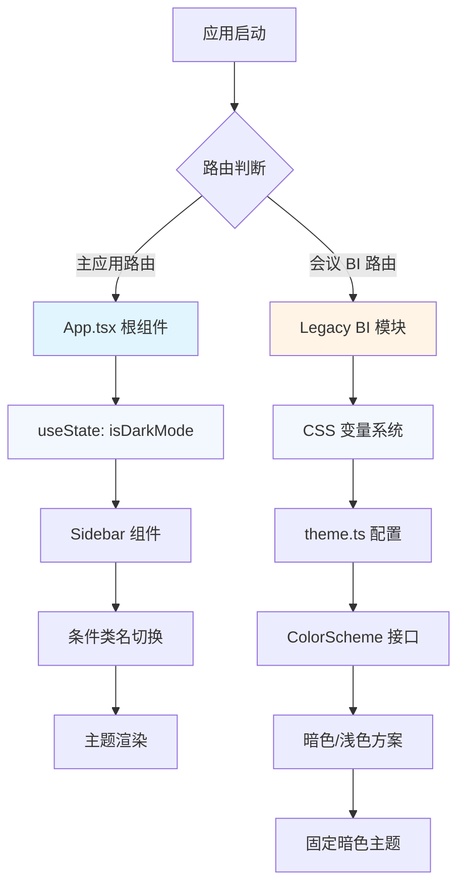
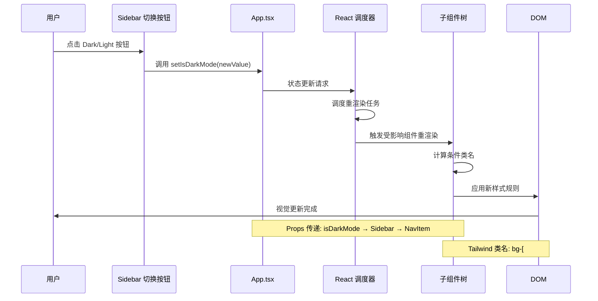

本项目的暗色模式采用**组件级条件样式**的实现策略，通过 React 状态管理和 Tailwind CSS 类名动态切换实现主题变化。不同于 Tailwind 官方推荐的 `dark:` 变体策略，项目选择了更具灵活性的运行时样式切换方案，同时针对不同业务模块采用了差异化的主题系统设计。

## 架构设计与状态管理

项目的主题切换功能建立在 React 本地状态管理基础之上，主题状态 (`isDarkMode`) 在应用根组件中初始化并向下传递。这种设计避免了引入额外的状态管理复杂度，同时保持了主题切换的响应性和可预测性。主题状态默认为 `true`，意味着应用首次加载时默认呈现暗色界面，这一设计决策符合现代医疗业务平台对专业感和沉浸感的追求。

状态管理采用 React Hooks 的 `useState` 实现，主题状态通过 props 显式传递给需要响应主题变化的组件，而非使用 Context API 全局广播。这种**显式数据流**设计使得主题依赖关系清晰可追踪，便于调试和维护。当前实现未集成 localStorage 持久化机制，每次页面刷新或重新加载都会重置为默认的暗色模式，这是当前架构的一个已知限制。

Sources: [App.tsx](src/App.tsx#L48-L48)

## 实现机制：条件样式切换

主题切换的核心机制基于**运行时条件类名**，组件根据 `isDarkMode` 属性动态选择 Tailwind CSS 类名组合。以 Sidebar 组件为例，其背景色在不同主题下使用完全不同的 Tailwind 类：暗色模式应用 `bg-[#0F111A]`，浅色模式应用 `bg-white`，这种条件表达式通过模板字符串的三元运算符实现，确保了样式切换的即时性和平滑过渡。

```tsx
// 条件样式应用示例
className={`${isDarkMode ? 'bg-[#0F111A] border-r border-slate-800' : 'bg-white border-r border-slate-100'}`}
```

这种实现方式相比 Tailwind 的 `darkMode: 'class'` 配置具有更高的灵活性，允许开发者为不同主题定义完全不同的颜色值（包括自定义十六进制颜色），而不局限于 Tailwind 调色板。同时，条件样式策略使得主题过渡动画的实现更为直观，可以通过 CSS transition 属性统一控制所有样式属性的切换动画。

Sources: [Sidebar.tsx](src/components/Sidebar.tsx#L41-L76)

### 主题切换 UI 组件

主题切换控件位于 Sidebar 底部区域，采用**分段控制器**（Segmented Control）设计模式，提供 Light 和 Dark 两个选项按钮。该组件通过监听按钮点击事件调用 `setIsDarkMode` 函数更新主题状态，触发整个组件树的重新渲染。当前激活的主题按钮会显示视觉反馈（白色背景或品牌色背景），未激活的按钮保持半透明状态，形成清晰的交互指引。

切换组件的布局采用 Flexbox 实现自适应排列，在 Sidebar 收起状态（`isCollapsed` 为 true）时自动隐藏主题切换 UI，确保界面在不同布局模式下的一致性和可用性。这种响应式设计考虑了空间约束下的用户体验优化。

Sources: [Sidebar.tsx](src/components/Sidebar.tsx#L225-L242)

## 双主题系统架构

项目存在**两套独立的主题系统**，分别服务于主应用和 Legacy 会议 BI 模块，这是渐进式架构演进的典型产物。主应用采用基于 Tailwind CSS 的条件样式方案，通过组件级别的状态管理实现主题切换；而 Legacy 会议 BI 模块则使用传统的 CSS 变量系统和 TypeScript 主题配置对象，构建了更为完整的颜色方案定义。



主应用的背景色在不同页面下有不同表现：常规工作台页面使用固定的浅色背景 `bg-[#F4F6F8]`，文本颜色为 `text-slate-800`；而会议 BI 页面则强制使用暗色背景 `bg-[#050f24]` 和浅色文本 `text-slate-100`，不受全局 `isDarkMode` 状态影响。这种**页面级主题隔离**确保了 Legacy 模块的视觉一致性，但也导致整体应用的主题切换体验不连贯。

Sources: [App.tsx](src/App.tsx#L172-L189)

### Legacy 会议 BI 主题系统

Legacy 会议 BI 模块的主题系统基于 **CSS 自定义属性**（CSS Variables）和 TypeScript 配置对象构建。全局样式文件定义了完整的暗色主题变量集合，包括背景色、文本色、边框色和强调色等 20+ 个设计 Token。这些变量通过 `:root` 选择器注入到全局作用域，供所有 Legacy 组件引用。

TypeScript 侧的主题配置对象 `theme.ts` 提供了类型安全的主题访问接口，定义了颜色、字体、阴影、过渡动画等完整的设计系统。该配置同时包含 Ant Design 组件库的暗色主题定制，通过 `antdDarkTheme` 对象统一覆盖表格、卡片、模态框等组件的默认样式，确保第三方组件与整体设计语言的协调统一。

Sources: [global.css](src/legacy-meeting-bi/styles/global.css#L14-L32), [theme.ts](src/legacy-meeting-bi/styles/theme.ts#L1-L75)

### 颜色方案对比

| 主题维度 | 主应用 (Tailwind) | Legacy BI (CSS Variables) |
|---------|------------------|--------------------------|
| **背景色** | 暗: `#0F111A` / 亮: `#FFFFFF` | 固定: `#050f24` (暗色) |
| **文本色** | 暗: `slate-400` / 亮: `slate-800` | 主: `#f3f8ff` / 次: `#9fb7db` |
| **强调色** | `brand: #3B82F6` | `accentCyan: #79e7ff` |
| **边框色** | 暗: `slate-800` / 亮: `slate-100` | `rgba(121, 231, 255, 0.24)` |
| **状态管理** | React `useState` | CSS 变量 + TypeScript 对象 |
| **持久化** | ❌ 无 | ❌ 无 |
| **切换支持** | ✅ 运行时切换 | ❌ 固定暗色 |

## 主题切换流程

主题切换的完整流程涉及状态更新、组件重渲染和样式应用三个阶段。当用户点击 Sidebar 底部的主题切换按钮时，触发 `setIsDarkMode` 函数调用，React 调度器将该状态更新标记为高优先级任务，触发受影响组件的重新渲染。接收 `isDarkMode` prop 的组件重新执行渲染逻辑，根据新的主题状态计算最新的类名字符串，Tailwind CSS 运行时解析这些类名并应用对应的样式规则。



由于主题状态通过 props 显式传递，React 的协调算法能够精确识别受影响的组件子树，避免全局重渲染带来的性能开销。同时，所有主题相关的样式类都已在构建时通过 Tailwind CSS 的 JIT 编译器生成，运行时只需切换类名即可完成样式应用，无需额外的 CSS 解析或计算。

Sources: [Sidebar.tsx](src/components/Sidebar.tsx#L103-L120), [App.tsx](src/App.tsx#L189-L210)

## 技术选型分析

项目选择**组件级条件样式**而非 Tailwind 官方的 `dark:` 变体策略，这一决策基于以下考量：首先，条件样式方案允许使用任意的自定义颜色值（如 `#0F111A`），不受 Tailwind 默认调色板限制；其次，该方案与现有的状态管理架构天然契合，无需额外配置 Tailwind 的 `darkMode` 选项；最后，条件表达式在 TypeScript 中具有完整的类型检查支持，降低了样式拼写错误的风险。

然而，当前实现也存在若干**架构债务**：缺乏 localStorage 持久化导致用户主题偏好无法保存；主应用与 Legacy 模块的主题系统割裂造成用户体验不连贯；主题状态未纳入 Zustand 全局状态管理，可能在未来扩展时增加维护成本。建议后续重构时考虑以下改进方向：统一主题系统架构、集成 localStorage 持久化、将主题状态迁移至 Zustand store。

Sources: [App.tsx](src/App.tsx#L48-L48)

### Tailwind CSS v4 主题配置

项目使用 **Tailwind CSS v4.1.14** 最新版本，通过 `@tailwindcss/vite` 插件集成到 Vite 构建流程。v4 版本引入了全新的主题配置语法，项目在 `src/index.css` 中通过 `@theme` 指令定义品牌色系的设计 Token，包括品牌主色 `--color-brand`、悬停色 `--color-brand-hover`、浅色背景 `--color-brand-light` 和边框色 `--color-brand-border`。这些自定义颜色通过 `@import "tailwindcss"` 指令自动注册到 Tailwind 的工具类系统中，可在任意组件中通过 `bg-brand`、`text-brand` 等类名引用。

这种配置方式相比传统的 `tailwind.config.js` 文件更为简洁，且支持 CSS 原生变量特性，便于实现主题切换时的动态更新。未来如需支持更复杂的主题系统（如多品牌主题），可扩展 `@theme` 配置块，定义多套颜色变量并通过 CSS 变量切换实现运行时主题切换。

Sources: [index.css](src/index.css#L1-L9), [vite.config.ts](vite.config.ts#L1-L39)

## 下一步学习

完成暗色模式与主题切换的学习后，建议继续探索以下相关主题以深化理解：

- **[Tailwind CSS 配置](25-tailwind-css-pei-zhi)** - 深入了解 Tailwind v4 的新配置语法和设计 Token 定义
- **[响应式设计实践](27-xiang-ying-shi-she-ji-shi-jian)** - 学习如何结合主题切换实现多设备适配
- **[Zustand 全局状态管理](7-zustand-quan-ju-zhuang-tai-guan-li)** - 探索将主题状态迁移至全局状态管理的最佳实践
- **[Legacy 会议 BI 集成](36-legacy-hui-yi-bi-ji-cheng)** - 了解 Legacy 模块的完整架构和主题系统实现细节