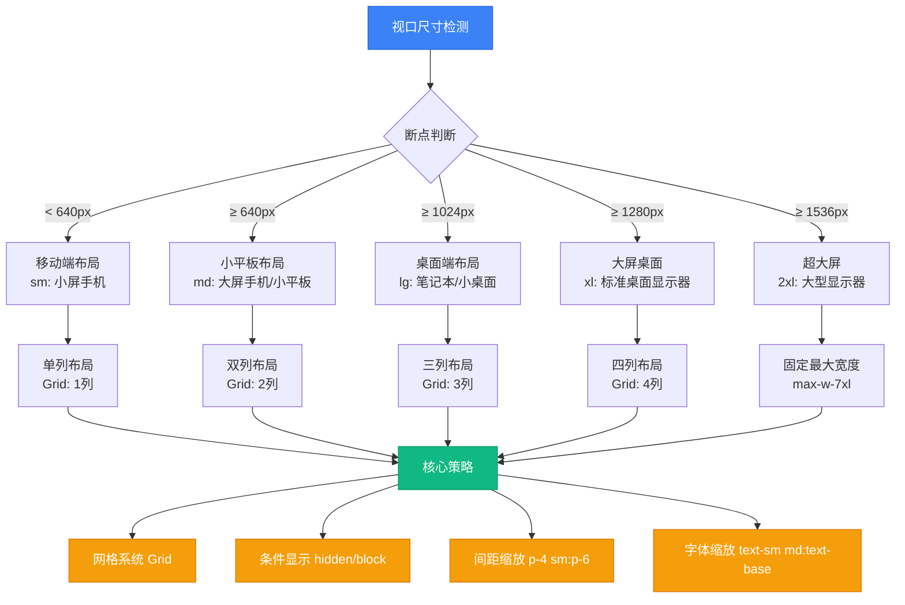

本项目采用 **Tailwind CSS 4.x** 的移动优先响应式设计策略，通过原子化类名组合实现从移动端到桌面端的流畅布局适配。整个响应式体系建立在三个核心支柱之上：**断点驱动的网格系统**、**渐进式布局增强**以及**条件性元素渲染**，确保应用在不同视口尺寸下都能提供最优的用户体验。

## 响应式架构概览

项目的响应式设计并非简单的媒体查询堆砌，而是形成了一套系统化的适配策略。以下架构图展示了从视口断点到具体布局方案的完整映射关系：



这套架构的核心思想是 **渐进增强**：所有组件默认以移动端样式为基准，通过响应式修饰符逐步添加更大屏幕的布局规则，而非为每个断点编写独立的样式块。

Sources: [index.css](src/index.css#L1-L9), [vite.config.ts](vite.config.ts#L1-L39)

## 断点系统与网格策略

Tailwind CSS 4.x 默认提供五个断点，项目严格遵循这一标准并在实际业务中形成了固定的网格映射模式。以下是断点定义与典型应用场景的对照表：

| 断点 | 最小宽度 | Tailwind 前缀 | 网格列数 | 典型应用场景 |
|------|---------|--------------|---------|-------------|
| 小屏手机 | 0px | (默认) | 1列 | 移动端基础布局，垂直堆叠 |
| 大屏手机 | 640px | `sm:` | 1-2列 | 表单输入框、按钮间距调整 |
| 平板 | 768px | `md:` | 2列 | 卡片网格、双栏表单 |
| 笔记本 | 1024px | `lg:` | 3-4列 | 功能模块网格、三栏布局 |
| 桌面显示器 | 1280px | `xl:` | 4列+ | 仪表盘主布局、四栏内容区 |
| 大型显示器 | 1536px | `2xl:` | 固定宽度 | 超宽屏居中、最大宽度限制 |

在实际代码中，这一断点系统通过 **网格类名链式组合** 实现。例如仪表盘主布局采用 `grid-cols-1 xl:grid-cols-4` 的组合，意味着默认单列布局在 `xl` 断点时切换为四列，跳过了中间的 `md` 和 `lg` 断点，这种 **跳跃式断点选择** 是基于业务内容优先级做出的决策：任务管理模块需要足够的宽度展示详情，因此在桌面端才进行列数提升。

```tsx
// 典型的渐进式网格布局
<div className="grid grid-cols-1 xl:grid-cols-4 gap-6 mb-6">
  <TaskSection className="xl:col-span-3" />
  <RiskSection className="xl:col-span-1" />
</div>
```

这种写法避免了为每个断点编写冗余的媒体查询，所有响应式逻辑浓缩在单个 `className` 字符串中，提升了代码的可维护性。

Sources: [DashboardView.tsx](src/components/DashboardView.tsx#L48-L59), [FunctionSquareView.tsx](src/components/FunctionSquareView.tsx#L47-L129)

## 核心响应式模式

项目中的响应式实现形成了几种可复用的模式，这些模式在不同组件中反复出现，构成了响应式设计的 **通用语法**。

### 模式一：渐进式网格增强

最常见的响应式模式是通过网格列数的渐进增加来适配更大屏幕。功能广场页面展示了这一模式的典型应用：

```tsx
// 最新功能：从单列到四列的渐进增强
<div className="grid grid-cols-1 md:grid-cols-2 lg:grid-cols-4 gap-6">
  {FUNCTION_MODULES.latest.map(item => (
    <FeatureCard key={item.id} {...item} />
  ))}
</div>

// 推荐功能：三列布局的中等密度展示
<div className="grid grid-cols-1 md:grid-cols-2 lg:grid-cols-3 gap-6">
  {FUNCTION_MODULES.recommended.map(item => (
    <RecommendCard key={item.id} {...item} />
  ))}
</div>
```

这种模式的精髓在于 **内容密度控制**：小屏幕时保持单列以确保可读性，中等屏幕时适度增加密度，大屏幕时最大化利用横向空间。`gap-6` 在所有断点保持一致，确保视觉节奏的统一。

### 模式二：条件性元素渲染

某些 UI 元素在小屏幕上会造成视觉拥挤或交互冲突，因此采用条件渲染策略。顶部导航栏的用户信息展示是这一模式的典型案例：

```tsx
// Header.tsx - 仅在超大屏幕显示完整用户信息
<div className="hidden rounded-full border border-slate-200/60 bg-white/60 
                px-4 py-2 text-sm font-medium text-slate-600 shadow-sm xl:block">
  当前用户：{currentUserName}
</div>
```

这里使用 `hidden xl:block` 的组合，意味着该元素默认隐藏，仅在 `xl` 断点（1280px+）时才显示。与之配套的是在小屏幕上通过其他方式（如侧边栏底部）展示相同信息，确保功能完整性。

### 模式三：响应式间距与字体

间距和字体的响应式调整遵循 **触控友好** 原则：小屏幕使用更大的触控区域，大屏幕则优化为紧凑布局。登录页的按钮和表单展示了这一原则：

```tsx
// LoginPage.tsx - 移动端增加触控区域
<div className="fixed inset-0 z-[100] flex items-center justify-center 
                p-4 sm:p-6">
  <motion.div className="w-full max-w-md">
    {/* 登录卡片内容 */}
  </motion.div>
</div>
```

`p-4 sm:p-6` 确保移动端有足够的边距避免内容贴边，而在更大屏幕时适度增加内边距提升视觉呼吸感。这种 **相对单位缩放** 策略比固定像素值更符合响应式设计理念。

Sources: [FunctionSquareView.tsx](src/components/FunctionSquareView.tsx#L47-L129), [Header.tsx](src/components/Header.tsx#L64-L68), [Modals.tsx](src/components/Modals.tsx#L23-L25), [LoginPage.tsx](src/LoginPage.tsx#L67-L78)

## 组件级响应式实践

不同类型的组件在响应式设计上有各自的侧重点。以下通过三个典型组件展示具体的实现策略。

### 侧边栏：折叠式导航

侧边栏是应用的核心导航组件，其响应式策略聚焦于 **空间效率与可访问性的平衡**。组件通过 `isCollapsed` 状态控制两种布局模式：

```tsx
// Sidebar.tsx - 折叠状态控制
<aside className={`flex flex-col relative overflow-hidden z-10 shadow-sm shrink-0 
                   transition-all duration-300 
                   ${isCollapsed ? 'w-20' : 'w-72'}`}>
  {/* 折叠时隐藏文字标签，仅显示图标 */}
  <NavItem 
    icon={Home}
    label="首页"
    isCollapsed={isCollapsed}
    className={`w-full flex items-center justify-between 
                ${isCollapsed ? 'px-0 justify-center py-3' : 'px-4 rounded-xl'}`}
  />
</aside>
```

折叠模式下宽度从 `w-72`（288px）缩减至 `w-20`（80px），仅保留图标列。这种设计在中小屏幕上释放了约 200px 的横向空间，同时通过 `transition-all duration-300` 提供流畅的动画过渡。子导航项在折叠状态下完全隐藏（`if (isCollapsed && isSubItem) return null`），避免布局错乱。

### 仪表盘：多模块网格编排

仪表盘页面包含任务管理、风险预警、AI 助手等多个功能模块，其响应式布局采用 **区域优先级** 策略：核心模块在大屏幕占据更多列宽，辅助模块则保持紧凑。

```tsx
// DashboardView.tsx - 两层网格嵌套
<>
  {/* 第一行：任务 + 风险 */}
  <div className="grid grid-cols-1 xl:grid-cols-4 gap-6 mb-6">
    <TaskSection className="xl:col-span-3" />  {/* 75% 宽度 */}
    <RiskSection className="xl:col-span-1" />  {/* 25% 宽度 */}
  </div>

  {/* 第二行：AI 助手 + 常用功能 */}
  <div className="grid grid-cols-1 xl:grid-cols-3 gap-6 mb-6">
    <AIAssistant className="xl:col-span-1" />
    <CommonFunctions className="xl:col-span-2" />  {/* 66% 宽度 */}
  </div>
</>
```

通过 `xl:col-span-*` 修饰符，不同模块在桌面端获得差异化的宽度分配，而移动端则统一回退到全宽单列。这种 **内容权重驱动的列分配** 确保了关键信息始终占据视觉焦点。

### 模态框：响应式内边距与布局

模态框作为覆盖层组件，其响应式设计需要同时考虑 **内容可读性** 和 **屏幕空间利用**。接待登记模态框展示了双层响应式策略：

```tsx
// Modals.tsx - 外层容器响应式内边距
<div className="fixed inset-0 bg-slate-900/40 backdrop-blur-sm z-50 
                flex items-center justify-center p-4 sm:p-6">
  
  {/* 模态框主体 */}
  <div className="bg-white rounded-3xl shadow-2xl w-full max-w-5xl">
    
    {/* 内部表单：双列布局仅在 lg+ 生效 */}
    <div className="grid grid-cols-1 lg:grid-cols-2 gap-6 mt-6">
      <FormSection />
      <AIAnalysisSection />
    </div>
  </div>
</div>
```

外层 `p-4 sm:p-6` 确保模态框在小屏幕上有足够的边距避免贴边，内部表单通过 `grid-cols-1 lg:grid-cols-2` 在大屏幕时切换为双列，充分利用模态框的宽度。`max-w-5xl` 限制了最大宽度，防止在超大屏幕上过度拉伸影响阅读。

Sources: [Sidebar.tsx](src/components/Sidebar.tsx#L116-L133), [DashboardView.tsx](src/components/DashboardView.tsx#L48-L72), [Modals.tsx](src/components/Modals.tsx#L23-L48)

## 响应式设计决策矩阵

在实际开发中，响应式决策需要基于内容类型、交互复杂度和用户场景进行综合考量。以下矩阵总结了项目中常见的决策模式：

| 内容类型 | 移动端策略 | 平板策略 | 桌面策略 | 技术实现 |
|---------|-----------|---------|---------|---------|
| **导航菜单** | 底部固定栏 | 侧边栏可折叠 | 固定侧边栏 | `hidden md:flex` + 状态管理 |
| **数据表格** | 卡片列表 | 简化表格 | 完整表格 | 条件渲染不同组件 |
| **表单输入** | 单列垂直 | 双列分组 | 多列紧凑 | `grid-cols-1 md:grid-cols-2` |
| **卡片网格** | 单列滑动 | 2-3列网格 | 4列+网格 | `grid-cols-1 lg:grid-cols-4` |
| **图表展示** | 简化图表 | 标准图表 | 交互式图表 | 响应式图表库配置 |
| **模态框** | 全屏抽屉 | 居中弹窗 | 居中弹窗 | `w-full max-w-*` |

这一矩阵的核心原则是 **交互复杂度与屏幕空间的正相关**：小屏幕简化交互，大屏幕增强功能。例如数据表格在移动端转换为卡片列表，保留了核心信息展示能力，同时避免了横向滚动的糟糕体验。

Sources: [FunctionSquareView.tsx](src/components/FunctionSquareView.tsx#L47-L129), [TaskSection.tsx](src/components/TaskSection.tsx#L1-L200), [Header.tsx](src/components/Header.tsx#L1-L79)

## 最佳实践与反模式警示

基于项目实践，总结出以下响应式设计的最佳实践和需要避免的反模式：

### 最佳实践

**1. 移动优先的类名顺序**
始终将移动端样式作为基础类名，响应式修饰符按断点从小到大排列：
```tsx
// ✅ 正确：渐进增强
<div className="grid-cols-1 md:grid-cols-2 xl:grid-cols-4">

// ❌ 错误：桌面优先
<div className="grid-cols-4 md:grid-cols-2 grid-cols-1">
```

**2. 语义化的断点选择**
根据内容逻辑而非具体像素值选择断点。如果内容在 1024px 时更适合三列布局，使用 `lg:grid-cols-3` 而非自定义断点。

**3. 组件级响应式封装**
将响应式逻辑封装在组件内部，避免在父组件中传递复杂的样式类：
```tsx
// ✅ 封装响应式逻辑
<ResponsiveGrid cols={{ base: 1, md: 2, xl: 4 }}>
  {items}
</ResponsiveGrid>

// ❌ 在多处重复响应式类名
<div className="grid-cols-1 md:grid-cols-2 xl:grid-cols-4">
```

### 反模式警示

**1. 过度嵌套的响应式网格**
避免多层网格嵌套导致布局计算复杂化：
```tsx
// ❌ 反模式：三层嵌套网格
<div className="grid-cols-1 md:grid-cols-2">
  <div className="grid-cols-1 lg:grid-cols-3">
    <div className="grid-cols-1 xl:grid-cols-2">
```

**2. 固定像素宽度**
在响应式组件中使用固定像素会破坏流动性：
```tsx
// ❌ 反模式：固定宽度
<div className="w-300px">

// ✅ 正确：相对单位或百分比
<div className="w-full max-w-md">
```

**3. 忽略触控区域**
移动端的按钮和交互元素需要足够的触控面积（至少 44x44px）：
```tsx
// ❌ 反模式：触控区域过小
<button className="p-1">

// ✅ 正确：符合触控标准
<button className="p-3 sm:p-4">
```

Sources: [LoginPage.tsx](src/LoginPage.tsx#L67-L212), [Sidebar.tsx](src/components/Sidebar.tsx#L116-L285), [Modals.tsx](src/components/Modals.tsx#L1-L293)

## 延伸阅读

本页聚焦于响应式设计的实战应用，以下相关主题可帮助您深入理解项目的完整样式体系：

- **[Tailwind CSS 配置](25-tailwind-css-pei-zhi)** - 了解 Tailwind 4.x 的新配置语法和主题定制
- **[暗色模式与主题切换](26-an-se-mo-shi-yu-zhu-ti-qie-huan)** - 响应式设计与主题系统的协同工作
- **[组件目录结构与命名约定](22-zu-jian-mu-lu-jie-gou-yu-ming-ming-yue-ding)** - 响应式组件的文件组织规范