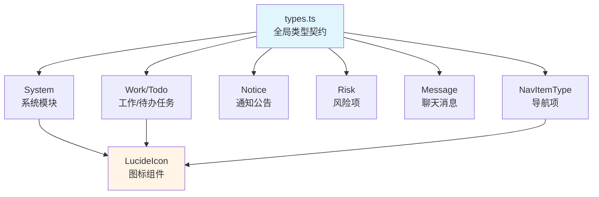
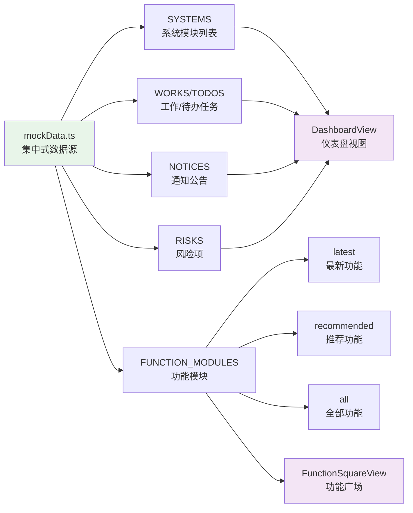

在 AI Business Platform 的前端架构中，**Mock 数据与类型定义**构成了开发阶段的**数据契约层**，为前端团队提供独立于后端的开发能力。该系统采用**集中式类型定义 + 分层 Mock 数据**的策略，通过 TypeScript 的强类型约束确保数据结构的一致性，同时通过模块化的 Mock 数据组织方式支持不同业务场景的数据模拟需求。

## 类型系统架构

### 全局类型契约

项目的核心类型定义集中在 [src/types.ts](src/types.ts#L1-L80)，该文件作为**全局类型契约层**，声明了系统范围内通用的业务实体接口。这种集中式设计避免了类型定义的碎片化，确保不同组件对同一业务实体具有统一的类型理解。

每个接口的设计都遵循**最小必要字段原则**，既满足 UI 渲染需求，又保持数据结构的简洁性。以 `System` 接口为例，它定义了业务系统入口所需的全部属性：基础标识（id、name）、视觉元素（icon、color）、交互状态（count、bg、text）。其中 `icon` 字段使用了 `lucide-react` 的 `LucideIcon` 类型，这体现了**类型安全与组件库集成**的设计思路——TypeScript 会在编译期检查传入的图标组件是否符合预期类型。

Sources: [src/types.ts](src/types.ts#L4-L12)

### 导航类型系统

在 [src/data/navigationData.ts](src/data/navigationData.ts#L2-L48) 中定义了专门的导航类型系统，这套类型系统与全局类型契约相互独立但又紧密协作。`AppPage` 类型通过**联合类型（Union Type）**枚举了所有可能的页面标识符，这种设计提供了编译期的页面名称校验——任何拼写错误或未声明的页面名称都会在开发阶段被捕获。

`PageDefinition` 和 `NavigationItemDefinition` 接口则分别定义了**页面元信息**和**导航结构**的类型契约。前者包含路径、标题、实现状态和占位描述，后者定义了导航项的标签、图标、徽章和子菜单结构。这种分离设计使得**路由配置**与**导航渲染**可以独立演化，同时通过类型系统保持一致性。

Sources: [src/data/navigationData.ts](src/data/navigationData.ts#L34-L47)

### 模块级类型定义

对于业务复杂度较高的模块，项目采用了**就近类型定义**策略。以顾问 AI 工作台为例，其类型定义独立维护在 [src/components/consultant-ai-workbench/types.ts](src/components/consultant-ai-workbench/types.ts#L1-L19)。这种模块化设计避免了全局类型文件的膨胀，同时使得类型定义与业务逻辑保持**物理位置上的邻近性**，便于维护和理解。

`WorkbenchViewMode` 类型使用了联合类型枚举工作台的所有视图模式，这种设计在切换视图时提供了**智能提示和类型检查**——IDE 会自动补全可用的视图模式名称，而任何无效的模式名称都会触发编译错误。`HistoryItem` 接口则定义了客户历史记录的数据结构，该类型在模块内部的 `data.ts` 和 `chat.ts` 中被引用，形成了**模块内的类型闭环**。

Sources: [src/components/consultant-ai-workbench/types.ts](src/components/consultant-ai-workbench/types.ts#L1-L19)

## Mock 数据组织策略

### 集中式 Mock 数据源

核心 Mock 数据统一维护在 [src/data/mockData.ts](src/data/mockData.ts#L1-L245)，该文件作为**单一数据源**，为整个应用提供开发阶段的假数据支持。这种集中式策略带来了三个核心优势：**数据一致性**（所有组件引用同一份 Mock 数据）、**易于维护**（修改数据只需更新一个文件）、**清晰的边界**（生产环境替换 Mock 数据时只需修改数据源层）。

Mock 数据的设计遵循**真实业务场景模拟**原则。以 `WORKS` 数组为例，每个工作项都包含了完整的业务属性：基础信息（id、title、system）、时间约束（sla、timeRange）、优先级与进度（priority、progress）、协作信息（comments、attachments、assignees）。其中 `assignees` 字段使用了 `pravatar.cc` 提供的随机头像 URL，这种设计使得 UI 在开发阶段就能呈现接近真实的视觉效果。

Sources: [src/data/mockData.ts](src/data/mockData.ts#L18-L79)

### 分层数据结构设计

`FUNCTION_MODULES` 采用了**三层分类结构**，这种设计反映了功能广场页面的业务逻辑：最新上新、AI 推荐、全部功能。每层都是一个数组，包含具有 `id`、`title`、`desc`、`icon`、`tag` 属性的对象。其中 `icon` 字段使用了 Unsplash 的图片 URL，这种设计支持**快速的视觉原型验证**——开发者无需准备本地图片资源，直接使用在线图片即可完成 UI 开发。

这种分层结构的另一个优势是**支持独立的业务逻辑演化**。例如，`latest` 数组可能只包含 4 个最新功能，而 `all` 数组包含 20 个全部功能；`recommended` 数组可能根据用户画像动态调整（在真实场景中）。Mock 数据通过静态模拟这种结构，为前端开发提供了**可预测的数据基础**。

Sources: [src/data/mockData.ts](src/data/mockData.ts#L216-L244)

### 导航数据源

[src/data/navigationData.ts](src/data/navigationData.ts#L49-L189) 承担了**路由与导航的双重职责**。`PAGE_DEFINITIONS` 对象使用 `Record<AppPage, PageDefinition>` 类型，将每个页面标识符映射到其完整的配置信息。这种设计使得**路由配置**和**页面元信息**保持在同一数据结构中，避免了信息分散导致的同步问题。

`NAVIGATION_ITEMS` 和 `FOOTER_NAVIGATION_ITEMS` 数组定义了侧边栏的导航结构，其中 `children` 字段支持**多级菜单**。`badge` 字段用于显示未读消息数（如通知公告的徽章），这种设计将 UI 状态信息集成到数据源中，使得导航组件可以**纯函数式地渲染**——只需根据数据渲染界面，无需维护额外的状态。

Sources: [src/data/navigationData.ts](src/data/navigationData.ts#L134-L189)

## 类型与数据的协作模式

### 组件 Props 类型约束

Mock 数据通过**类型安全的 Props 传递**机制流入组件。以 [src/components/WorkSection.tsx](src/components/WorkSection.tsx#L1-L50) 为例，该组件的 Props 接口明确定义了 `works` 和 `todos` 参数的类型为 `Work[]` 和 `Todo[]`，这些类型来自全局类型契约。当父组件传入 Mock 数据时，TypeScript 会进行**编译期类型检查**，确保数据结构完全匹配。

这种模式带来了**开发时的智能提示**和**重构时的安全网**。当 `Work` 接口新增字段时，所有使用该类型的组件都会收到类型错误提示，开发者可以逐个修复，避免运行时错误。同时，IDE 会根据类型定义自动补全字段名称，提升开发效率。

Sources: [src/components/WorkSection.tsx](src/components/WorkSection.tsx#L7-L17)

### 数据流向与状态管理

在 [src/App.tsx](src/App.tsx#L1-L100) 中，Mock 数据被引入并传递给子组件。这种**自上而下的数据流**符合 React 的单向数据流原则：顶层组件持有数据源，通过 Props 向下传递。对于全局状态（如用户认证信息），项目使用了 Zustand 进行管理（详见 [Zustand 全局状态管理](7-zustand-quan-ju-zhuang-tai-guan-li)），而 Mock 数据主要用于**组件级的状态初始化**。

`NOTICES` 数据在 App 组件中被用于实现**公告轮播逻辑**：通过 `setInterval` 每 4 秒更新 `currentNoticeIndex`，从而实现公告的自动切换。这种设计展示了 Mock 数据在**交互逻辑开发**中的价值——开发者可以在没有真实后端的情况下，完整实现并测试 UI 交互。

Sources: [src/App.tsx](src/App.tsx#L9-L69)

### 模块级数据与类型协作

以顾问 AI 工作台为例，[src/components/consultant-ai-workbench/data.ts](src/components/consultant-ai-workbench/data.ts#L1-L30) 定义了模块内部的 Mock 数据，这些数据的类型来自同目录下的 `types.ts`。这种**模块内的类型-数据闭环**降低了模块间的耦合度，使得工作台模块可以独立开发和测试。

`quickPromptActions` 使用了 `as const` 断言，这会将数组推断为**只读元组类型**，而不是通用的字符串数组。这种设计在组件中使用该数据时，会获得更精确的类型提示——IDE 知道数组中每个元素的确切值，从而提供更准确的自动补全。

Sources: [src/components/consultant-ai-workbench/data.ts](src/components/consultant-ai-workbench/data.ts#L1-L30)

## Mock 数据的使用场景

### 功能广场的动态渲染

[src/components/FunctionSquareView.tsx](src/components/FunctionSquareView.tsx#L1-L80) 展示了 Mock 数据驱动 UI 渲染的典型模式。组件直接从 `mockData.ts` 导入 `FUNCTION_MODULES`，然后使用 `map` 方法遍历数据生成卡片组件。每个卡片的数据绑定都是**类型安全**的：`item.title`、`item.desc`、`item.icon`、`item.tag` 字段的访问都经过 TypeScript 的类型检查。

这种**数据驱动渲染**的模式使得 UI 结构与数据结构解耦：如果需要调整功能分类（例如新增一个"热门功能"分类），只需修改 Mock 数据结构，组件代码会自动适应。同时，`motion.button` 的动画效果通过 `idx * 0.1` 实现了**交错动画**，每个卡片的延迟时间基于其在数组中的索引计算得出。

Sources: [src/components/FunctionSquareView.tsx](src/components/FunctionSquareView.tsx#L5-L76)

### 系统宫格的图标渲染

[src/components/SystemGrid.tsx](src/components/SystemGrid.tsx#L1-L50) 展示了**组件类型与图标库集成**的最佳实践。`System` 接口的 `icon` 字段类型为 `LucideIcon`，这使得 Mock 数据可以直接传入图标组件引用（如 `UserCheck`、`CalendarClock`），而不是字符串形式的图标名称。在渲染时，组件使用 `<sys.icon className={...} />` 语法动态渲染图标。

这种设计避免了**字符串到组件的映射逻辑**：如果使用字符串形式的图标名称，组件需要维护一个映射表（如 `{ 'user-check': UserCheck }`），增加了维护成本。而直接使用组件引用，既保证了类型安全，又简化了渲染逻辑。

Sources: [src/components/SystemGrid.tsx](src/components/SystemGrid.tsx#L4-L50)

## 类型系统的最佳实践

### 联合类型与字面量类型

项目中大量使用了**联合类型（Union Type）**和**字面量类型（Literal Type）**。例如，`Message` 接口的 `role` 字段定义为 `'ai' | 'user'`，这是一个字符串字面量联合类型。这种设计在组件中处理消息时提供了**编译期保障**：开发者不会意外传入 `'assistant'` 或 `'bot'` 等未定义的值。

`WorkbenchViewMode` 类型使用了多个字符串字面量的联合，定义了工作台的所有可能视图模式。当组件切换视图时，TypeScript 会检查传入的模式名称是否在联合类型中定义，从而避免拼写错误导致的运行时错误。

Sources: [src/types.ts](src/types.ts#L67-L70)

### 可选属性与默认值处理

类型定义中的可选属性（如 `System.bg?`、`System.text?`、`Risk.link?`）体现了**渐进式类型设计**的思想：必填属性定义核心数据结构，可选属性支持扩展场景。组件在访问可选属性时，需要使用**可选链操作符**（`?.`）或提供默认值，这种设计在 TypeScript 严格模式下强制开发者处理可能为 `undefined` 的情况。

以 `System` 接口为例，`bg` 和 `text` 字段是可选的，只有第一个系统项（到院接待）提供了这两个字段，用于实现**高亮激活状态**。其他系统项使用默认样式，通过可选属性避免了为每个系统项都填充所有字段的冗余。

Sources: [src/types.ts](src/types.ts#L4-L12)

## 数据结构的演进策略

### 向后兼容的类型扩展

当需要为现有接口新增字段时，推荐使用**可选属性**而非必填属性。例如，如果需要为 `Work` 接口新增 `tags` 字段，应定义为 `tags?: string[]`，这样现有的 Mock 数据无需立即更新，组件也可以渐进式地适配新字段。这种**向后兼容**的扩展策略降低了大型项目的维护成本。

### Mock 数据的真实性原则

高质量的 Mock 数据应**模拟真实业务场景**的多样性和边界情况。以 `WORKS` 数组为例，它包含了不同优先级（high、medium、low）、不同进度（10%、46%、80%、100%）、不同完成状态的任务。这种多样性使得开发者可以**全面测试 UI 的各种状态**，避免在生产环境中遇到未预料的视觉问题。

Sources: [src/data/mockData.ts](src/data/mockData.ts#L18-L79)

## 从 Mock 到生产的迁移路径

### API 响应类型对齐

在接入真实 API 之前，应确保后端返回的数据结构与 Mock 数据的类型定义**完全对齐**。推荐的做法是：基于现有的 Mock 数据类型定义，与后端团队协商 API 契约，确保字段名称、类型、嵌套结构一致。如果存在差异，可以通过**类型适配层**进行转换，避免直接修改组件代码。

### 数据源的抽象与替换

为了简化从 Mock 数据到真实 API 的迁移，推荐引入**数据源抽象层**。例如，定义一个 `getWorks()` 函数，在开发阶段返回 Mock 数据，在生产阶段调用真实 API。组件只依赖这个抽象接口，而不直接导入 Mock 数据。这种设计使得**数据源的切换**只需修改一个地方，而无需修改所有使用该数据的组件。

对于更复杂的数据缓存和同步需求，可以结合 [React Query 数据缓存](29-react-query-shu-ju-huan-cun) 实现自动化的数据管理和缓存策略。

## 延伸阅读

- **类型安全路由**：了解如何在路由层面应用类型约束，参见 [类型安全的路由架构](8-lei-xing-an-quan-de-lu-you-jia-gou)
- **组件数据流**：深入理解组件间的数据传递模式，参见 [通用组件与业务组件](23-tong-yong-zu-jian-yu-ye-wu-zu-jian)
- **API 集成**：从 Mock 数据迁移到真实 API 的完整指南，参见 [Axios 客户端封装与拦截器](11-axios-ke-hu-duan-feng-zhuang-yu-lan-jie-qi)