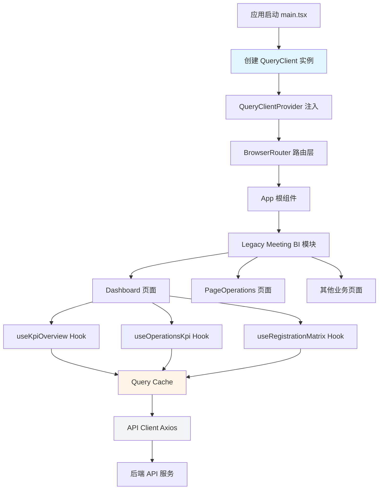

本项目采用 **@tanstack/react-query** (v5.95.2) 作为数据获取与缓存的核心解决方案，主要用于 legacy 会议 BI 系统的数据管理。通过声明式的查询 hooks 与自动化的缓存机制，实现了高效的数据同步、状态管理与性能优化，避免了手动管理加载状态、错误处理和缓存失效的复杂性。

## 架构设计与初始化配置

React Query 的核心是 **QueryClient** 实例，它作为全局缓存容器协调所有查询操作。项目在应用启动时通过 `QueryClientProvider` 将 QueryClient 注入到组件树的顶层，确保所有子组件都能访问统一的缓存实例。这种设计遵循了 **依赖注入** 模式，使得数据层与 UI 层解耦，便于测试和维护。



初始化配置采用 **零配置策略**，直接使用 QueryClient 的默认参数，这种方式适合大多数业务场景。默认配置提供了合理的缓存时间（gcTime: 5 分钟）、窗口聚焦时自动重新获取（refetchOnWindowFocus: true）以及失败重试机制（retry: 3 次），在开发效率与运行时性能之间取得了平衡。

Sources: [main.tsx](src/main.tsx#L1-L23)

## 数据获取层：API Client 封装

数据获取层基于 **Axios** 封装了统一的 HTTP 客户端，所有 API 请求通过该客户端发起。客户端配置了 30 秒超时限制和动态 baseURL，其中 baseURL 根据环境变量智能切换：开发模式下使用空字符串以走 Vite 代理，生产模式下则使用配置的绝对地址或相对路径。这种设计确保了跨环境的一致性与灵活性。

API 响应遵循统一的 **ApiResponse<T>** 结构，包含 `code`（状态码）、`message`（提示信息）和 `data`（业务数据）三个字段。每个 API 函数负责从响应中提取 `data` 字段并返回，使得 React Query 的 queryFn 只需关注业务数据本身，简化了错误处理逻辑。

```typescript
// API 响应统一结构
export interface ApiResponse<T> {
  code: number
  message: string
  data: T
}

// 典型 API 函数实现
export const fetchKpiOverview = () =>
  client.get<ApiResponse<KpiOverview>>('/v1/kpi/overview').then(r => r.data.data)
```

Sources: [client.ts](src/legacy-meeting-bi/api/client.ts#L1-L16), [kpi.ts](src/legacy-meeting-bi/api/kpi.ts#L19-L21)

## 自定义 Hooks：查询封装与复用

项目在 `useApi.ts` 中集中定义了所有业务查询的自定义 hooks，采用 **工厂模式** 封装 `useQuery` 调用。每个 hook 负责特定业务域的数据获取，如 `useKpiOverview` 获取 KPI 总览、`useOperationsKpi` 获取运营数据、`useRegistrationMatrix` 获取报名矩阵等。这种设计将查询逻辑与组件逻辑分离，提高了代码的可维护性与可测试性。

### Query Key 设计模式

Query Key 是 React Query 缓存的核心标识符，采用 **数组形式** 的层级命名约定。基础查询使用单一字符串键（如 `['kpi-overview']`），而参数化查询则将参数包含在键中（如 `['operations-kpi', dateFrom, dateTo]`）。这种设计确保了相同参数的查询共享缓存，不同参数的查询独立缓存，实现了细粒度的缓存控制。

```typescript
// 无参数查询：静态 Query Key
export const useKpiOverview = () =>
  useQuery({ queryKey: ['kpi-overview'], queryFn: fetchKpiOverview })

// 参数化查询：动态 Query Key
export const useOperationsKpi = (dateFrom?: string, dateTo?: string) =>
  useQuery({
    queryKey: ['operations-kpi', dateFrom, dateTo],
    queryFn: () => fetchOperationsKpi(dateFrom, dateTo),
  })
```

### Hooks 清单与职责

| Hook 名称 | Query Key | 数据类型 | 业务用途 |
|----------|-----------|---------|---------|
| `useKpiOverview` | `['kpi-overview']` | KpiOverview | KPI 总览指标（报名、抵达、成交等） |
| `useOperationsKpi` | `['operations-kpi', dateFrom, dateTo]` | OperationsKpi | 运营数据（签到、接机、离场等） |
| `useRegistrationMatrix` | `['registration-matrix']` | MatrixRow[] | 报名矩阵（区域 × 金额等级） |
| `useTrendData` | `['trend-data']` | TrendPoint[] | 客流趋势时序数据 |
| `useCustomerProfile` | `['customer-profile']` | CustomerProfile | 客户画像分布 |
| `useSourceDistribution` | `['source-distribution']` | SourceDistribution[] | 客户来源分布 |
| `useProgress` | `['progress']` | ProgressData | 任务进展达成率 |
| `useAchievementChart` | `['achievement-chart']` | AchievementChart | 成交图表数据 |
| `useProposalOverview` | `['proposal-overview']` | ProposalOverview | 方案总览统计 |

Sources: [useApi.ts](src/legacy-meeting-bi/hooks/useApi.ts#L1-L52)

## 组件集成：声明式数据消费

业务组件通过自定义 hooks 以 **声明式** 方式消费缓存数据。每个 hook 返回包含 `data`（数据）、`isLoading`（加载状态）、`isError`（错误状态）等属性的对象，组件根据这些状态渲染不同的 UI。这种模式避免了手动管理状态的复杂性，使得数据流清晰可预测。

在 Dashboard 页面中，同时发起了 7 个并行查询，React Query 会自动优化请求调度、缓存结果并在数据变化时触发组件重渲染。组件通过解构获取 `data` 和 `isLoading`，使用可选链（`?.`）安全访问嵌套属性，并在数据未就绪时展示骨架屏或占位内容。

```typescript
const Dashboard: React.FC = () => {
  // 并行发起多个查询
  const { data: kpiData, isLoading: kpiLoading } = useKpiOverview()
  const { data: operationsData, isLoading: operationsLoading } = useOperationsKpi(selectedDate, selectedDate)
  const { data: registrationData, isLoading: registrationLoading } = useRegistrationMatrix()
  const { data: trendData, isLoading: trendLoading } = useTrendData()
  const { data: customerProfile, isLoading: profileLoading } = useCustomerProfile()
  const { data: sourceData, isLoading: sourceLoading } = useSourceDistribution()
  const { data: progressData, isLoading: progressLoading } = useProgress()

  // 安全访问数据
  const dealAmountItem = kpiData?.deal_amount
  const checkin = operationsData?.checkin_count ?? 0
  
  // 根据加载状态渲染 UI
  if (kpiLoading || operationsLoading) {
    return <LoadingSkeleton />
  }
  
  return (
    <div>
      {/* 数据驱动的 UI 渲染 */}
    </div>
  )
}
```

Sources: [Dashboard.tsx](src/legacy-meeting-bi/pages/Dashboard.tsx#L231-L246)

## 缓存策略与性能优化

### 默认缓存行为

项目采用 React Query 的 **默认缓存配置**，提供了开箱即用的性能优化：

- **staleTime: 0**：数据立即标记为过期，确保下次访问时重新验证
- **gcTime: 5 分钟**：未使用的缓存数据在 5 分钟后垃圾回收
- **refetchOnWindowFocus: true**：窗口聚焦时自动重新获取数据，保持数据新鲜度
- **retry: 3**：失败请求自动重试 3 次，提高容错性

这种配置适合 **实时性要求较高** 的业务场景（如会议 BI 大屏），确保用户看到的始终是最新数据。对于实时性要求较低的场景（如配置数据、字典数据），可以通过自定义 hook 参数调整 `staleTime` 以减少不必要的请求。

### 缓存共享与去重

React Query 的 **智能去重机制** 确保相同 Query Key 的并发请求只发起一次网络调用。当多个组件同时使用 `useKpiOverview()` 时，React Query 会识别相同的 Query Key 并共享同一个 Promise，避免重复请求。这种机制在复杂页面（如 Dashboard 同时使用多个数据源）中显著降低了网络开销。

### 参数化查询的缓存隔离

对于 `useOperationsKpi(dateFrom, dateTo)` 这类参数化查询，不同的参数组合会生成不同的 Query Key，从而在缓存中独立存储。当用户切换日期筛选时，新的查询会发起新请求并缓存，旧的查询结果仍保留在缓存中供后续快速访问。这种设计在 **筛选器频繁切换** 的场景下提供了流畅的用户体验。

## 与其他状态管理方案的协作

项目同时使用 **Zustand** 管理全局应用状态（如用户认证、UI 偏好），而 **React Query** 专注服务器状态管理。这种 **关注点分离** 的架构清晰地区分了两种状态类型：

- **服务器状态**（Server State）：来自 API 的数据，具有异步性、所有权归属外部、需要缓存与同步，由 React Query 管理
- **客户端状态**（Client State）：本地 UI 状态、用户会话信息，由 Zustand 管理

两者通过 **独立的数据流** 运行，避免了状态管理的混乱。React Query 负责数据获取、缓存、同步与更新，Zustand 负责跨组件的状态共享与持久化，各自发挥优势。

## 最佳实践与注意事项

### Query Key 命名约定

采用 **业务域-实体-操作** 的层级命名，如 `['kpi-overview']`、`['registration-matrix']`、`['operations-kpi', dateFrom, dateTo]`。这种命名方式具有自描述性，便于调试和缓存管理。避免使用过于通用的键名（如 `['data']`），以免造成缓存冲突。

### 错误处理策略

当前实现依赖 React Query 的默认错误处理（重试 3 次后标记为错误状态）。在生产环境中，建议在 API Client 层添加统一的错误拦截器，将业务错误（如 token 过期、权限不足）转换为统一的错误类型，并在组件层展示友好的错误提示。

### 缓存失效与刷新

对于需要手动刷新的场景（如用户点击刷新按钮），可以通过 `useQueryClient()` 获取 QueryClient 实例，调用 `invalidateQueries(['query-key'])` 使特定缓存失效并触发重新获取。对于全局刷新，可以使用 `invalidateQueries()` 使所有缓存失效。

### TypeScript 类型安全

所有 API 响应和查询结果都通过 TypeScript 泛型进行类型标注，确保编译时类型检查。`ApiResponse<T>` 泛型确保响应结构一致，自定义 hooks 返回类型自动推断，组件中使用时享有完整的类型提示与保护。

## 扩展阅读

- **API 代理配置**：了解开发与生产环境的 API 请求路由策略，参考 [API 代理配置](13-api-dai-li-pei-zhi)
- **Legacy 会议 BI 集成**：深入理解会议 BI 系统的整体架构，参考 [Legacy 会议 BI 集成](36-legacy-hui-yi-bi-ji-cheng)
- **Axios 客户端封装**：掌握 HTTP 客户端的拦截器与错误处理机制，参考 [Axios 客户端封装与拦截器](11-axios-ke-hu-duan-feng-zhuang-yu-lan-jie-qi)
- **Zustand 全局状态管理**：对比客户端状态与服务器状态的管理差异，参考 [Zustand 全局状态管理](7-zustand-quan-ju-zhuang-tai-guan-li)