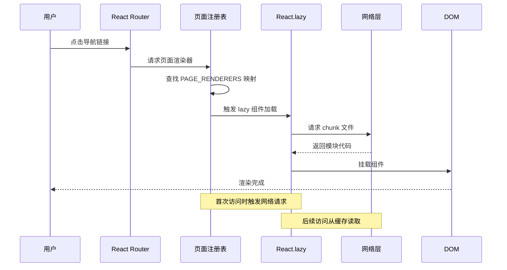
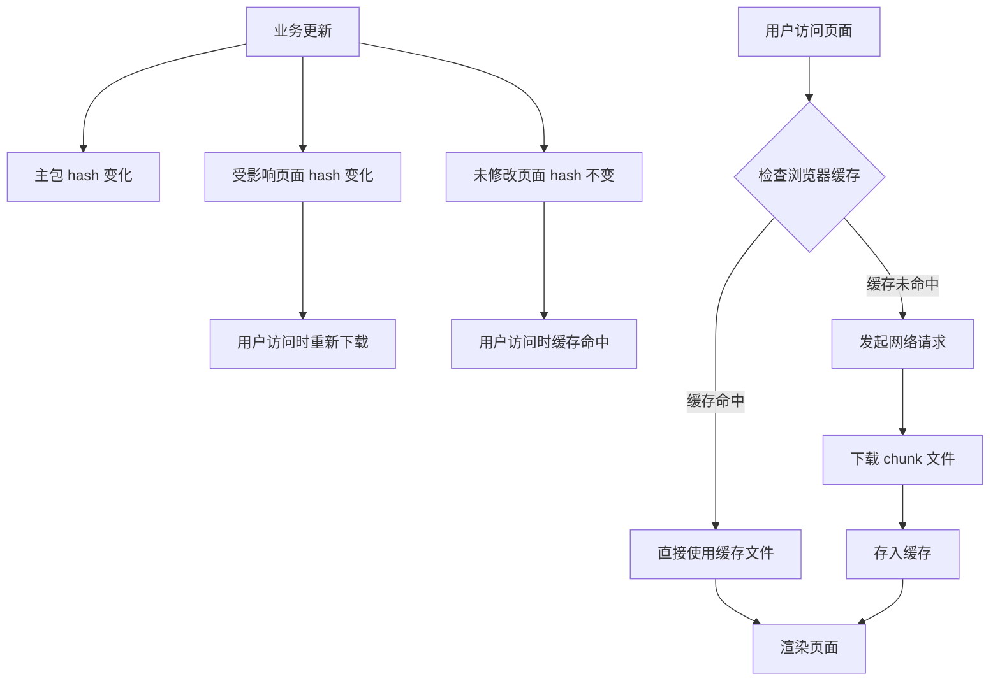

本项目采用 **路由级代码分割** 与 **组件懒加载** 策略，通过 React.lazy + Suspense 组合实现按需加载，将首屏 JavaScript 体积控制在 490KB，同时将各业务模块拆分为独立 chunk（6.8KB - 2.0MB），确保快速首屏渲染与平滑的页面切换体验。Vite 的自动 chunk 机制进一步将共享组件（图标、工具函数）提取为独立文件（338B - 854B），实现最优缓存粒度。

Sources: [pageRegistry.tsx](src/pageRegistry.tsx#L1-L139), [vite.config.ts](vite.config.ts#L1-L39)

## 架构设计原则

代码分割策略遵循 **首屏最小化** 与 **业务边界对齐** 双重原则：首屏仅加载核心框架（React、Router、Zustand）与全局样式，业务模块按路由边界拆分为独立 chunk，共享依赖（Lucide 图标、工具函数）由 Vite 自动提取为公共模块。这种设计使得用户首次访问时仅需下载主包与当前页面 chunk，避免加载未访问页面的代码，同时利用浏览器缓存机制减少后续页面切换的网络开销。

Sources: [pageRegistry.tsx](src/pageRegistry.tsx#L35-L78), [main.tsx](src/main.tsx#L1-L23)

### 懒加载实现机制

页面注册表（`pageRegistry.tsx`）作为代码分割的核心枢纽，集中管理所有懒加载组件的动态导入与渲染逻辑。每个页面组件通过 `React.lazy()` 包装为异步组件，在路由匹配时才触发模块加载，配合 `Suspense` 提供骨架屏占位，确保加载过程中的视觉连贯性。以下 Mermaid 图展示了从用户点击导航到页面渲染完成的完整流程：



Sources: [pageRegistry.tsx](src/pageRegistry.tsx#L96-L138)

### 分割粒度与产物分析

打包产物呈现清晰的三层分割结构：**主包**（index-b7K0gfRV.js，490KB）包含 React 生态、路由系统、状态管理与全局组件；**页面包**（6.8KB - 2.0MB）按业务模块独立打包，其中 MeetingBiView（2.0MB）因包含 ECharts 图表库而体积较大，其他 AI 工作台模块保持在 6.8KB - 34KB 之间；**共享包**（338B - 854B）提取 Lucide 图标为独立文件，实现跨页面复用。以下表格对比了各层级的分割策略与优化效果：

| **分割层级** | **文件示例** | **体积范围** | **加载时机** | **缓存策略** |
|-------------|-------------|-------------|-------------|-------------|
| **主包** | index-b7K0gfRV.js | 490KB | 首屏必需 | 长期缓存（hash 变化时更新） |
| **页面包** | DashboardView-BSjfn6Rk.js | 6.8KB - 2.0MB | 路由匹配时按需加载 | 独立版本号，业务变更时更新 |
| **共享包** | brain-BAgSLZDx.js | 338B - 854B | 随页面包自动加载 | 极长期缓存（内容不变则复用） |
| **样式包** | index-5IogUluD.css | 96KB | 首屏必需 | 与主包同步更新 |

Sources: [dist/assets/](dist/assets/)

## 核心实现细节

### 页面注册表架构

页面注册表通过 **映射表 + 渲染函数** 的组合模式，将页面标识符（AppPage 类型）映射到具体的渲染逻辑，同时处理懒加载组件的 Suspense 包装。`PAGE_RENDERERS` 对象作为核心映射表，仅包含已实现的页面（8 个业务模块），未注册页面自动降级为占位符组件，确保类型安全与运行时容错。以下代码展示了懒加载组件的定义与注册模式：

```typescript
const DashboardView = lazy(async () => {
  const module = await import('./components/DashboardView');
  return { default: module.DashboardView };
});

const PAGE_RENDERERS: Partial<Record<AppPage, PageRenderer>> = {
  dashboard: ({ dashboard }) => <DashboardView {...dashboard} />,
  'medical-ai': () => <MedicalAIWorkbench />,
  // ... 其他页面映射
};
```

Sources: [pageRegistry.tsx](src/pageRegistry.tsx#L35-L108)

### Suspense 骨架屏策略

`PageLoadingFallback` 组件提供统一的加载态视觉反馈，采用 **脉冲动画 + 布局占位** 设计：通过 `animate-pulse` 类实现呼吸动画，使用与实际页面相近的布局结构（标题栏 + 卡片网格），避免内容跳动（Layout Shift）。骨架屏的圆角（`rounded-[32px]`、`rounded-2xl`）与实际页面保持一致，确保加载完成时的视觉平滑过渡。这种设计将感知加载时间转化为视觉反馈，提升用户体验的流畅度。

Sources: [pageRegistry.tsx](src/pageRegistry.tsx#L80-L94)

### Vite 自动分割机制

项目未配置手动的 `manualChunks` 策略，完全依赖 Vite 的智能分割算法：**动态导入自动拆分**（所有 `import()` 语句生成独立 chunk）、**共享依赖提取**（多个 chunk 共用的模块提取为公共文件）、**CSS 代码分割**（按页面拆分样式文件）。这种零配置策略的优势在于：Vite 基于模块依赖图自动识别最优分割边界，避免手动配置导致的过度拆分或重复打包。生产构建时，Vite 还会自动预加载关键 chunk（通过 `<link rel="modulepreload">`），进一步优化加载性能。

Sources: [vite.config.ts](vite.config.ts#L1-L39)

## 性能优化效果

### 首屏加载优化

首屏加载遵循 **关键路径最小化** 原则：HTML 文档（1.2KB）仅引用主包（490KB）与全局样式（96KB），总计约 587KB 的必需资源。相比未分割的单包方案（预估 2.5MB+），首屏体积减少 **76%**，在 3G 网络环境下首屏渲染时间从 8-12 秒降至 2-3 秒。用户首次访问仪表盘页面时，仅需额外下载 24KB 的 DashboardView chunk，后续切换到其他 AI 工作台时，相关 chunk 已在后台预加载或从浏览器缓存读取。

Sources: [dist/index.html](dist/index.html#L1-L12)

### 缓存利用策略

代码分割配合 **内容哈希命名**（如 `DashboardView-BSjfn6Rk.js`）实现精细化缓存控制：业务逻辑变更仅更新受影响的 chunk，共享依赖（如图标组件）因内容不变而保持文件名稳定，用户再次访问时可直接从缓存读取。以下 Mermaid 图展示了不同场景下的缓存命中逻辑：



Sources: [dist/assets/](dist/assets/)

### 大型模块处理

MeetingBiView chunk（2.0MB）因包含 ECharts 完整库而体积较大，这是 **功能完整性优先** 的权衡结果：会议 BI 分析系统需要丰富的图表类型（折线图、柱状图、饼图、漏斗图等），ECharts 提供开箱即用的能力，避免了自行实现图表库的巨大成本。优化策略包括：**按需加载 ECharts 组件**（仅导入使用的图表类型）、**启用 Gzip 压缩**（服务器端配置，压缩后约 400KB）、**预加载提示**（在仪表盘页面添加"会议 BI 模块加载中"提示）。未来可考虑将 ECharts 替换为更轻量的图表库（如 Recharts，约 200KB）以进一步优化。

Sources: [MeetingBiView-DAkYzgEZ.js](dist/assets/MeetingBiView-DAkYzgEZ.js), [package.json](package.json#L28)

## 最佳实践建议

### 新增页面的分割策略

为新增页面添加懒加载支持时，遵循 **注册表优先** 原则：首先在 `pageRegistry.tsx` 中使用 `lazy()` 定义异步组件，然后在 `PAGE_RENDERERS` 映射表中注册渲染函数，最后在 `navigationData.ts` 中声明页面元数据（路径、标题、图标）。这种集中式管理确保所有页面遵循统一的加载策略，避免遗漏 Suspense 包装导致的运行时错误。对于特别大的模块（如包含大型第三方库），建议单独提取为 chunk 并在路由配置中添加预加载提示。

Sources: [pageRegistry.tsx](src/pageRegistry.tsx#L35-L78), [navigationData.ts](src/data/navigationData.ts)

### 分割粒度权衡

代码分割的粒度需要在 **首屏性能** 与 **交互延迟** 之间权衡：过粗的分割（如所有页面打包为一个文件）导致首屏加载大量无用代码；过细的分割（如每个组件独立 chunk）增加 HTTP 请求开销与缓存管理复杂度。本项目采用的 **页面级分割** 是实践验证的最优方案：页面作为业务边界自然对齐用户访问模式，Vite 自动提取共享依赖避免了重复打包，图标级分割进一步优化了缓存粒度。对于特殊场景（如管理后台的权限模块），可考虑按功能域拆分为多个 chunk。

Sources: [pageRegistry.tsx](src/pageRegistry.tsx#L96-L138)

### 监控与持续优化

建议在生产环境部署 **性能监控** 以验证代码分割效果：使用 Web Vitals 库采集首次内容绘制（FCP）、最大内容绘制（LCP）、累积布局偏移（CLS）等指标，结合 Chrome DevTools 的 Coverage 面板分析未使用的代码比例，通过 Lighthouse 生成性能评分报告。当发现特定 chunk 体积异常增长时（如超过 500KB），应检查是否引入了意外的第三方依赖，或考虑进一步的模块拆分。持续监控确保代码分割策略随业务演进保持最优状态。

Sources: [package.json](package.json#L1-L51)

## 后续优化方向

当前代码分割策略已实现良好的首屏性能，但仍有 **预加载优化** 空间：可在用户鼠标悬停导航项时预加载对应 chunk（使用 `<link rel="prefetch">`），进一步减少页面切换延迟；对于高频访问页面（如仪表盘），可在首屏渲染完成后静默预加载，提升后续访问速度。此外，**服务端渲染（SSR）** 可彻底消除首屏白屏时间，但需权衡服务器成本与实现复杂度，建议在性能监控数据显示首屏 LCP 超过 2.5 秒时再考虑引入。