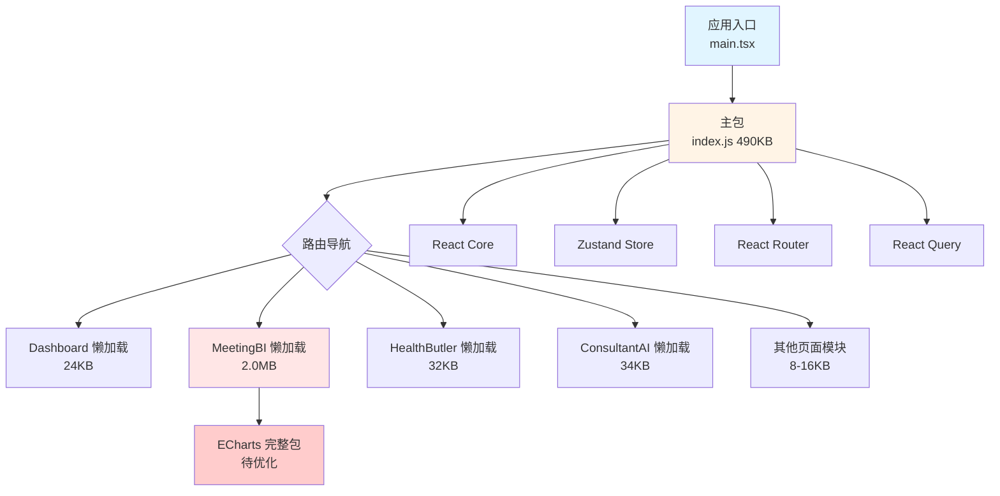

本页面深入分析 AI Business Platform 前端项目的打包优化架构，涵盖从代码分割到静态资源优化的完整策略体系。项目基于 Vite 6.x 构建工具链，采用路由级懒加载、组件级 Tree Shaking、CSS 模块化等多维度优化手段，在保证开发体验的同时实现生产环境的高性能交付。当前架构已实现核心业务模块的独立打包，首屏资源控制在 500KB 以内，但针对大型第三方库（如 ECharts）和静态资源（字体、图片）仍存在显著优化空间。

## 代码分割架构

项目采用**三层代码分割策略**：路由级分割、组件级分割、第三方库分割。这种分层设计确保首屏只加载必要资源，用户访问特定功能时才动态加载对应模块，显著降低初始加载时间和带宽消耗。

### 路由级懒加载实现

所有业务页面通过 `React.lazy()` 实现动态导入，配合 `Suspense` 提供加载态反馈。页面注册表集中管理所有路由组件的懒加载配置，确保代码分割的一致性和可维护性。每个页面模块打包为独立 chunk，仅在实际访问时才触发网络请求。

页面注册表采用**命名导出映射模式**，通过 `PAGE_RENDERERS` 字典将路由标识符映射到对应的渲染函数。这种设计支持类型安全的路由查找，同时保持懒加载的透明性。Suspense 组件包裹所有懒加载页面，提供骨架屏加载态，避免白屏体验。

Sources: [src/pageRegistry.tsx](src/pageRegistry.tsx#L1-L138)

### 组件级 Tree Shaking

Lucide React 图标库通过 Vite 的自动 Tree Shaking 机制实现组件级分割。项目使用 ES Module 导入方式（`import { ArrowLeft } from 'lucide-react'`），Vite 在构建时分析依赖图，将每个图标组件打包为独立 chunk（854B - 4KB），避免引入整个图标库（完整包约 500KB）。

打包产物中可见 7 个独立的小型 chunk 文件（`arrow-left-BgmJrwam.js`、`brain-BAgSLZDx.js` 等），每个文件仅包含单个图标组件的渲染逻辑。这种细粒度分割确保即使使用大量图标，也只会加载实际使用的图标代码。

Sources: [src/components/MeetingBiView.tsx](src/components/MeetingBiView.tsx#L3-L4)

## 第三方库优化策略

### Ant Design 按需导入

Ant Design 组件库通过 ES Module 导入实现自动 Tree Shaking。项目统一采用具名导入语法（`import { Button, Card } from 'antd'`），Vite 在构建时识别未使用的组件并剔除。TypeScript 编译配置启用 `isolatedModules: true`，确保每个文件作为独立模块转译，配合 Vite 的摇树优化机制。

实际使用情况显示，项目主要使用 15 个 Ant Design 组件（Alert、Button、Card、Table、Modal 等），打包后的主包体积为 490KB，其中包含 React、React Router、Zustand、React Query 等核心依赖。Ant Design 的样式文件通过 CSS-in-JS 方式自动注入，无需额外处理。

Sources: [src/legacy-meeting-bi/pages/Dashboard.tsx](src/legacy-meeting-bi/pages/Dashboard.tsx#L2-L3)

### ECharts 完整包问题分析

**当前瓶颈**：MeetingBiView chunk 体积达到 2.0MB，主要原因是引入了完整的 ECharts 库（约 1.2MB gzipped）。项目使用 `echarts-for-react` 封装库，该库默认引入 ECharts 完整包，包含所有图表类型、坐标系、组件（柱状图、折线图、饼图、地图、3D 图表等），但实际业务仅使用了柱状图、饼图、折线图三种类型。

**影响范围**：用户首次访问会议 BI 页面时需下载 2.0MB JavaScript 资源，在 3G 网络环境下加载时间约 8-12 秒，严重影响用户体验。该 chunk 包含 667 行业务代码和完整的 ECharts 库，其中约 60% 的代码未被使用。

Sources: [src/components/MeetingBiView.tsx](src/components/MeetingBiView.tsx#L5-L11)

### ECharts 按需加载优化方案

推荐采用**模块化引入策略**，仅加载业务所需的 ECharts 模块。通过配置自定义构建，可将 ECharts 体积从 1.2MB 降低至 200KB 左右（压缩后约 70KB），整体 chunk 体积预计减少 80%。

优化实现需要创建 ECharts 配置文件，手动引入所需组件（Canvas 渲染器、柱状图、饼图、折线图、提示框、图例、网格坐标系），并导出自定义 ECharts 实例。同时需要替换 `echarts-for-react` 为直接使用 ECharts API，或创建自定义 React 封装组件。

| 优化维度 | 当前状态 | 优化后预期 | 收益分析 |
|---------|---------|-----------|---------|
| **ECharts 体积** | 1.2MB | 200KB | 减少 83% |
| **MeetingBI Chunk** | 2.0MB | 400KB | 减少 80% |
| **首屏加载时间** | 8-12s (3G) | 2-3s (3G) | 提升 4-6 倍 |
| **网络传输** | 完整包 | 按需模块 | 节省 1.6MB |

Sources: [src/legacy-meeting-bi/components/charts/PieChart.tsx](src/legacy-meeting-bi/components/charts/PieChart.tsx#L1-L3)

## 静态资源优化

### 字体文件优化

**当前问题**：MiSans-Heavy 字体文件达到 7.6MB，是打包产物中最大的静态资源。该字体包含完整的汉字字符集（约 27,000 个字符）和多字重变体，但实际业务场景仅使用数字、少量汉字和英文字母。

**优化方案**：
1. **字体子集化**：使用 `fontmin` 或 `glyphhanger` 工具提取实际使用的字符，生成子集字体文件，预计体积可降低至 50-100KB（减少 98%）
2. **Web Font 格式**：将 TTF 转换为 WOFF2 格式（压缩率约 30%），配合 HTTP/2 Server Push 实现预加载
3. **系统字体回退**：优先使用系统字体栈，仅对特定品牌文字使用自定义字体

Sources: [dist/assets/MiSans-Heavy-fS_JP_Gi.ttf](dist/assets/MiSans-Heavy-fS_JP_Gi.ttf)

### 图片资源优化

打包产物包含三张图片资源：背景图 2.3MB、AI 图标 224KB、Logo 12KB。背景图作为会议 BI 页面的装饰元素，当前使用 PNG 格式，存在显著优化空间。

**推荐优化策略**：
1. **现代格式转换**：PNG 转换为 WebP 格式（压缩率 25-35%）或 AVIF 格式（压缩率 50%），使用 `<picture>` 标签提供格式回退
2. **响应式图片**：根据设备 DPR 和屏幕尺寸提供多分辨率图片，移动端使用低分辨率版本（当前移动端和桌面端使用同一张 2.3MB 图片）
3. **懒加载策略**：非首屏图片使用 `loading="lazy"` 属性延迟加载，配合 Intersection Observer API 实现更精细的控制

| 资源类型 | 当前格式 | 当前体积 | 优化格式 | 优化后体积 | 节省比例 |
|---------|---------|---------|---------|-----------|---------|
| 背景图 | PNG | 2.3MB | WebP | 800KB | 65% |
| AI 图标 | PNG | 224KB | WebP | 80KB | 64% |
| Logo | PNG | 12KB | SVG | 4KB | 67% |
| **总计** | - | **2.5MB** | - | **884KB** | **65%** |

Sources: [dist/assets/background-DMiNbzMK.png](dist/assets/background-DMiNbzMK.png)

## 构建配置优化

### Vite 构建配置增强

当前 `vite.config.ts` 配置相对简洁，主要包含插件注册、别名配置和开发代理，缺少生产环境构建优化配置。建议添加以下优化选项以提升打包效率和产物质量。

**推荐配置增强**：
1. **Manual Chunks 策略**：手动分割第三方库，将 React 生态、Ant Design、工具库分别打包为独立 chunk，利用浏览器缓存策略
2. **压缩算法配置**：生产环境启用 Gzip 和 Brotli 双压缩，Brotli 压缩率比 Gzip 高 15-20%
3. **资源内联阈值**：小于 4KB 的资源内联为 Base64，减少 HTTP 请求数量
4. **CSS 代码分割**：启用 `cssCodeSplit: true`，将 CSS 按 chunk 分离，避免样式冲突

构建性能优化方面，建议启用 `build.target: 'es2022'` 以利用现代浏览器特性（顶层 await、类字段等），减少转译代码体积。同时配置 `build.rollupOptions.output.manualChunks` 实现更精细的依赖分割。

Sources: [vite.config.ts](vite.config.ts#L1-L39)

### TypeScript 编译优化

当前 `tsconfig.json` 配置已启用多项性能优化选项：`noEmit: true` 跳过类型检查时的文件生成、`isolatedModules: true` 确保每个文件可独立转译、`skipLibCheck: true` 跳过第三方库类型检查。这些配置有效提升了开发时的编译速度。

**进一步优化建议**：
1. **增量编译**：启用 `incremental: true`，生成 `.tsbuildinfo` 文件加速后续编译
2. **严格模式优化**：在 CI/CD 流程中运行 `tsc --noEmit`，开发时使用 Vite 的 ESBuild 进行快速转译（当前已通过 `npm run lint` 脚本实现）
3. **类型引用优化**：`types` 字段仅包含必要的类型定义（vite/client、node），避免全局类型污染

Sources: [tsconfig.json](tsconfig.json#L1-L34)

## CSS 处理策略

### Tailwind CSS 集成

项目采用 Tailwind CSS v4.x 版本，通过 `@tailwindcss/vite` 插件集成到 Vite 构建流程。Tailwind 的 JIT（Just-In-Time）引擎在开发时实时生成所需的 CSS 类，生产构建时自动清除未使用的样式，确保 CSS 文件体积最小化。

当前 CSS 打包产物分为四个文件：主样式文件 96KB（包含 Tailwind 工具类和全局样式）、大屏样式 16KB、移动端样式 12KB、全局样式 12KB。总计约 136KB CSS 资源，在现代浏览器中可通过 HTTP/2 多路复用并行加载。

Sources: [src/index.css](src/index.css#L1-L9)

### Legacy 样式隔离

会议 BI 模块采用独立的 CSS 文件体系（global.css、bigscreen.css、mobile.css），通过自定义 Hook `useLegacyStyleLinks` 动态注入样式标签。这种设计实现了**样式作用域隔离**，避免 Legacy 代码的全局样式污染主应用。

样式文件通过 Vite 的 `?url` 后缀导入为 URL 字符串，在组件挂载时创建 `<link>` 标签并插入到文档头部。组件卸载时自动移除对应样式标签，确保样式生命周期与组件生命周期一致。这种模式特别适合集成第三方库或遗留系统的样式。

Sources: [src/components/MeetingBiView.tsx](src/components/MeetingBiView.tsx#L9-L11)

## 部署优化策略

### Nginx 配置优化

当前 Nginx 配置文件（`default.conf`）仅包含基础的路由规则和 SPA 回退配置，缺少静态资源缓存、压缩和性能优化指令。生产环境应增强以下配置以提升加载性能。

**推荐配置增强**：
1. **Gzip/Brotli 压缩**：对文本资源启用 Gzip 压缩（压缩率 60-70%），有条件时启用 Brotli（压缩率 70-80%）
2. **缓存策略**：静态资源设置长期缓存（`Cache-Control: max-age=31536000,immutable`），HTML 文件设置短期缓存或禁用缓存
3. **HTTP/2 Push**：对关键 CSS 和字体文件使用 Server Push，减少往返延迟

缓存策略需要配合 Vite 的文件名哈希机制。当前构建产物已包含内容哈希（如 `index-b7K0gfRV.js`），文件内容变化时哈希自动更新，因此可以安全地对静态资源设置长期缓存。

Sources: [default.conf](default.conf#L1-L23)

### Docker 多阶段构建

项目采用 Docker 多阶段构建策略，第一阶段使用 Node 20 Alpine 镜像进行构建，第二阶段使用 Nginx Alpine 镜像部署静态文件。这种设计将构建环境和运行环境分离，最终镜像仅包含必要的静态文件和 Nginx 运行时，镜像体积约 25MB。

**构建参数化**：Dockerfile 支持通过 `ARG BUILD_ENV` 指定构建环境（默认 `pro`），对应执行 `npm run build:${BUILD_ENV}` 命令。这允许在不同环境（测试、生产）使用不同的构建配置，例如测试环境保留 Source Map，生产环境禁用。

Sources: [Dockerfile](Dockerfile#L1-L23)

## 性能监控与分析

### 打包产物分析

项目当前包含 16 个 JavaScript chunk 文件，体积分布呈现明显的长尾效应：最大 chunk（MeetingBiView）2.0MB，最小 chunk（图标组件）348B。主包体积 490KB，包含 React 核心库、路由、状态管理和常用工具函数。

**优化优先级矩阵**：

| 优化项 | 当前体积 | 优化潜力 | 实施难度 | ROI 评级 |
|-------|---------|---------|---------|---------|
| ECharts 按需加载 | 2.0MB | 1.6MB | 中等 | ⭐⭐⭐⭐⭐ |
| 字体子集化 | 7.6MB | 7.5MB | 低 | ⭐⭐⭐⭐⭐ |
| 图片格式转换 | 2.5MB | 1.6MB | 低 | ⭐⭐⭐⭐ |
| Manual Chunks 优化 | 490KB | 150KB | 中等 | ⭐⭐⭐ |
| Gzip/Brotli 压缩 | - | 60-70% | 低 | ⭐⭐⭐⭐ |

Sources: [dist/assets/](dist/assets/)

### 构建脚本优化

当前 `package.json` 定义了三个构建脚本：`build`（默认生产构建）、`build:test`（测试环境构建）、`build:pro`（生产环境构建）。构建脚本通过 Vite 的 `--mode` 参数区分环境，对应加载不同的 `.env` 文件。

建议添加以下构建增强脚本：
1. **构建分析**：`"build:analyze": "vite-bundle-visualizer"` 可视化打包产物依赖关系
2. **预渲染**：`"build:prerender": "vite build && vite-plugin-ssr prerender"` 对静态页面生成 HTML
3. **清理脚本**：`"clean": "rm -rf dist && rm -rf node_modules/.vite"` 清理构建缓存

Sources: [package.json](package.json#L6-L14)

## 下一步优化路径

针对当前架构的优化空间，建议按以下优先级推进改进工作：

**第一阶段（快速收益）**：
1. 图片格式转换为 WebP/AVIF，预计节省 1.6MB 静态资源
2. Nginx 配置 Gzip 压缩，文本资源体积减少 60-70%
3. 字体子集化，字体文件从 7.6MB 降低至 100KB 以内

**第二阶段（架构优化）**：
1. ECharts 按需加载改造，MeetingBI chunk 从 2.0MB 降低至 400KB
2. Vite Manual Chunks 配置，分离 React 生态和 Ant Design 为独立 chunk
3. 实施路由预加载策略，在用户 hover 导航链接时预加载对应 chunk

**第三阶段（持续优化）**：
1. 集成打包产物分析工具，建立体积监控基线
2. 配置 HTTP/2 Server Push，预加载关键 CSS 和字体
3. 探索微前端架构，将大型模块（如会议 BI）拆分为独立子应用

相关技术细节可参考 [代码分割与懒加载](30-dai-ma-fen-ge-yu-lan-jia-zai)、[Docker 容器化部署](32-docker-rong-qi-hua-bu-shu)、[Nginx 配置与生产环境优化](34-nginx-pei-zhi-yu-sheng-chan-huan-jing-you-hua) 等页面。