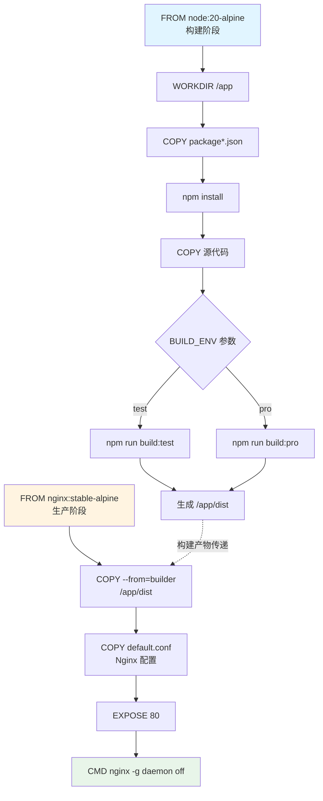
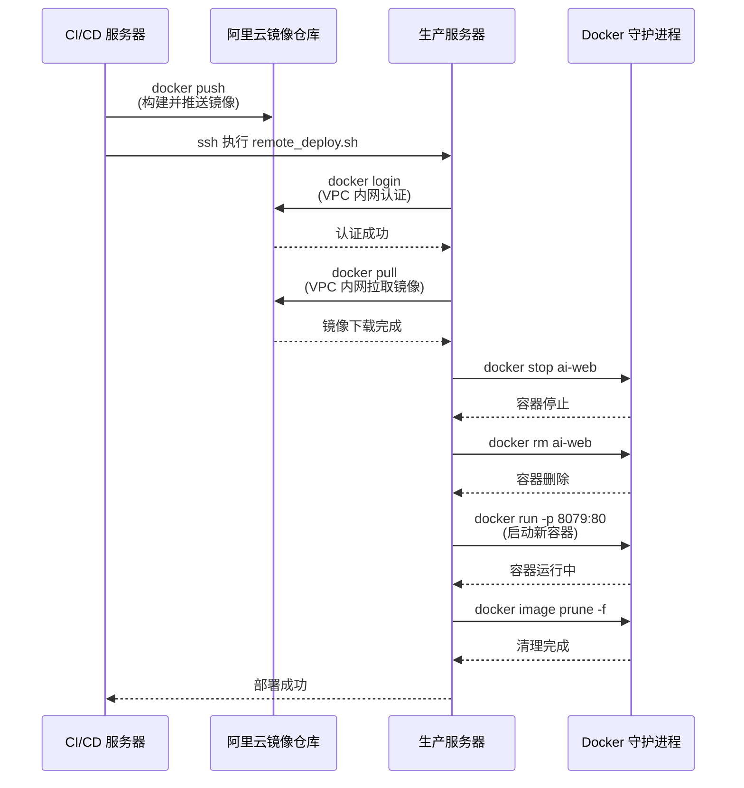

本项目采用 Docker 多阶段构建策略实现前端应用的容器化部署，通过双 Dockerfile 设计支持公网和 VPC 内网两种镜像拉取方式，结合自动化部署脚本实现从构建到上线的全流程标准化。核心设计理念在于**构建与运行环境分离**——构建阶段使用完整的 Node.js 环境完成依赖安装和代码编译，生产阶段仅保留编译后的静态资源与 Nginx 服务器，从而将最终镜像体积控制在 25MB 左右（Alpine 基础镜像 + Nginx + 静态资源）。项目配置了完整的多环境支持（test/prod），通过构建参数和命名空间隔离不同环境的镜像版本，并利用阿里云容器镜像服务实现镜像的版本化管理与快速分发。

Sources: [Dockerfile](Dockerfile#L1-L23), [DockerVPCfile](DockerVPCfile#L1-L23)

## 多阶段构建架构

项目采用典型的**双阶段构建模式**（Builder Pattern），将构建过程与运行环境严格分离。第一阶段使用 Node.js 20 Alpine 镜像作为构建环境，完成 `npm install` 依赖安装和 `npm run build:${BUILD_ENV}` 项目构建；第二阶段使用 Nginx Alpine 镜像作为生产环境，仅通过 `COPY --from=builder` 指令复制构建产物 `/app/dist` 到 Nginx 静态资源目录，并注入自定义 Nginx 配置文件。这种设计确保最终镜像不包含 Node.js 运行时、源代码、开发依赖等冗余内容，不仅显著减小镜像体积（相比单阶段构建减少约 80%），还提升了安全性（减少攻击面）和启动速度（更少的文件系统层）。



构建参数 `BUILD_ENV` 默认值为 `pro`，通过 `ARG BUILD_ENV=pro` 声明并在构建时可通过 `--build-arg BUILD_ENV=test` 覆盖，该参数直接映射到 `package.json` 中的 npm scripts（`build:test` 和 `build:pro`），从而实现不同环境的构建配置切换。Vite 构建工具根据 `--mode` 参数加载对应的环境变量文件（如 `.env.test`），并设置 `base` 路径为 `/ai-platform/` 以适配生产环境的子路径部署需求。

Sources: [Dockerfile](Dockerfile#L1-L23), [package.json](package.json#L7-L11), [vite.config.ts](vite.config.ts#L17-L18)

## 双 Dockerfile 设计策略

项目维护了两个几乎完全相同的 Dockerfile——`Dockerfile` 和 `DockerVPCfile`，唯一的区别在于基础镜像的**仓库地址选择**。`Dockerfile` 使用公网地址 `crpi-301jbh81iyvo39lb.cn-beijing.personal.cr.aliyuncs.com`，适用于 CI/CD 构建服务器或开发环境；`DockerVPCfile` 使用 VPC 内网地址 `crpi-301jbh81iyvo39lb-vpc.cn-beijing.personal.cr.aliyuncs.com`（注意 `-vpc` 后缀），适用于生产服务器与镜像仓库在同一 VPC 网络内的场景。VPC 内网拉取镜像具有**零流量费用**、**传输速度快**（内网带宽通常 1Gbps+）、**安全性高**（不经过公网）三大优势，在生产环境强烈推荐使用 VPC 地址。

| Dockerfile | 镜像仓库地址 | 适用场景 | 网络类型 | 传输速度 | 流量费用 |
|------------|-------------|---------|---------|---------|---------|
| Dockerfile | `crpi-...cn-beijing.personal.cr.aliyuncs.com` | CI/CD 构建服务器、本地开发 | 公网 | 取决于带宽 | 按量计费 |
| DockerVPCfile | `crpi-...-vpc.cn-beijing.personal.cr.aliyuncs.com` | 生产服务器部署 | VPC 内网 | 1Gbps+ | 免费 |

使用时需要根据部署环境选择对应的 Dockerfile：`docker build -f Dockerfile -t ai-web:1.0.0 .`（公网）或 `docker build -f DockerVPCfile -t ai-web:1.0.0 .`（VPC）。在 CI/CD 流程中，通常在构建阶段使用公网地址（因为构建服务器可能不在同一 VPC），而在生产部署阶段通过 `remote_deploy.sh` 脚本在目标服务器上使用 VPC 地址拉取镜像，实现构建与部署的地理位置解耦。

Sources: [Dockerfile](Dockerfile#L1-L2), [DockerVPCfile](DockerVPCfile#L1-L2), [remote_deploy.sh](remote_deploy.sh#L9)

## Nginx 配置与 SPA 路由支持

生产环境使用 Nginx 作为静态资源服务器，配置文件 `default.conf` 定义了完整的路由规则和错误处理逻辑。核心配置包括：**根路径重定向**（`location = /` 返回 302 重定向到 `/ai-platform/`）、**SPA 路由支持**（`try_files $uri $uri/ /ai-platform/index.html` 确保所有前端路由都能回退到 index.html）、**静态资源服务**（`alias /usr/share/nginx/html/` 映射容器内的构建产物）。特别注意 `absolute_redirect off` 配置，它禁用了 Nginx 的绝对重定向，避免在反向代理场景下暴露内部服务器地址。

```nginx
server {
    listen 80;                    # 监听 HTTP 80 端口
    server_name localhost;        # 接受所有主机名请求
    
    absolute_redirect off;        # 禁用绝对路径重定向
    
    location = / {
        return 302 /ai-platform/; # 根路径重定向到应用入口
    }
    
    location /ai-platform {
        alias /usr/share/nginx/html/;           # 静态资源目录
        index index.html;                       # 默认首页
        try_files $uri $uri/ /ai-platform/index.html;  # SPA 路由回退
    }
    
    error_page 500 502 503 504 /50x.html;       # 错误页面处理
}
```

配置中的 `try_files` 指令是支持单页应用（SPA）的关键：当浏览器访问 `/ai-platform/dashboard` 时，Nginx 首先尝试查找 `/usr/share/nginx/html/dashboard` 文件（不存在），然后尝试 `/usr/share/nginx/html/dashboard/` 目录（也不存在），最后回退到 `/ai-platform/index.html`（前端应用入口），由前端路由器接管并渲染对应的 Dashboard 组件。这种设计允许前端使用 HTML5 History 模式路由，URL 看起来像传统的服务器路径，但实际完全由客户端 JavaScript 控制。

Sources: [default.conf](default.conf#L1-L23)

## 远程部署自动化流程

`remote_deploy.sh` 脚本实现了在目标服务器上自动拉取镜像并更新容器的完整流程，采用**声明式部署策略**——每次部署都会完全替换旧容器，确保环境的一致性和可重现性。脚本执行流程包括五个关键步骤：**镜像仓库登录**（使用环境变量传递的凭证通过 `docker login` 认证）、**镜像拉取**（根据 `BUILD_ENV` 动态选择命名空间 `leczcore_dev` 或 `leczcore_prod`）、**旧容器清理**（先 `docker stop` 再 `docker rm` 确保优雅关闭）、**新容器启动**（映射端口 8079:80，设置自动重启策略 `unless-stopped`）、**垃圾回收**（`docker image prune -f` 清理悬空镜像释放磁盘空间）。



脚本通过环境变量实现配置注入，关键变量包括：`ALIYUN_USER` 和 `ALIYUN_PASSWORD`（镜像仓库凭证，通过 `--password-stdin` 安全传递避免在进程列表中暴露）、`BUILD_ENV`（环境标识，用于选择镜像命名空间）、`IMAGE_TAG`（镜像版本标签，默认为 1.0.0）。端口映射 `8079:80` 将容器内的 Nginx 80 端口映射到宿主机 8079 端口，生产环境通常会在宿主机前再加一层负载均衡器（如阿里云 SLB）或反向代理（如另一个 Nginx）来处理 HTTPS 终止、域名绑定、流量分发等高级功能。

Sources: [remote_deploy.sh](remote_deploy.sh#L1-L58)

## 多环境配置管理

项目通过**构建时环境注入**和**运行时配置分离**的双层机制管理多环境配置。构建阶段通过 `ARG BUILD_ENV` 参数区分环境（test/prod），该参数触发 Vite 的 `--mode` 参数切换，进而加载不同的 `.env` 文件（如 `.env.test`、`.env.production`）。运行时阶段通过镜像仓库的**命名空间隔离**实现环境分离——`leczcore_dev` 命名空间存储开发和测试环境镜像，`leczcore_prod` 命名空间存储生产环境镜像，通过命名空间级别的访问控制（RAM 策略）确保开发人员无法误操作生产镜像。

| 配置维度 | 测试环境 (test) | 生产环境 (prod) | 配置方式 |
|---------|----------------|----------------|---------|
| 构建参数 | `BUILD_ENV=test` | `BUILD_ENV=pro` | `--build-arg` |
| NPM 脚本 | `npm run build:test` | `npm run build:pro` | package.json |
| Vite 模式 | `--mode test` | 默认 production | vite.config.ts |
| 镜像命名空间 | `leczcore_dev` | `leczcore_prod` | 阿里云 ACR |
| API 地址 | 测试环境后端 | 生产环境后端 | .env 文件 |
| 容器端口 | 8079（可自定义） | 8079（可自定义） | docker run |

环境变量文件 `.env.example` 展示了关键配置项：`VITE_API_BASE_URL` 定义了 AI 网关的 API 地址（本地开发默认指向 `http://172.23.15.59:9080/ai-platform`），`GEMINI_API_KEY` 用于 Google GenAI 集成（通过 AI Studio 的 Secrets 机制注入），`APP_URL` 用于 OAuth 回调地址等自引用场景。注意 Vite 的环境变量必须以 `VITE_` 前缀才能暴露给客户端代码，敏感信息（如数据库密码）应通过后端 API 或服务端渲染注入，而非直接写入前端环境变量。

Sources: [remote_deploy.sh](remote_deploy.sh#L25-L31), [.env.example](.env.example#L1-L18), [vite.config.ts](vite.config.ts#L7-L9)

## 构建优化与最佳实践

项目在 Docker 构建中应用了多项优化技术以提升构建速度和镜像质量。**.dockerignore 文件**排除了 `node_modules`（避免复制本地依赖，由容器内 `npm install` 重新生成）、`dist`（避免复制旧的构建产物）、`.git`（减小上下文大小）、`.DS_Store` 和 `*.log`（无关文件），这些配置将构建上下文从数百 MB 减小到几 MB，显著提升镜像上传速度。**多阶段构建**通过 `COPY --from=builder` 仅复制必要文件，避免了将 200MB+ 的 `node_modules` 打包进最终镜像。**Alpine 基础镜像**（`node:20-alpine` 和 `nginx:stable-alpine`）使用 musl libc 和精简的工具链，相比 Debian 基础镜像减少约 80% 的体积。

```bash
# 构建命令示例（公网镜像）
docker build \
  --build-arg BUILD_ENV=prod \
  -t crpi-301jbh81iyvo39lb.cn-beijing.personal.cr.aliyuncs.com/leczcore_prod/ai-web:1.0.0 \
  -f Dockerfile \
  .

# 构建命令示例（VPC 内网镜像）
docker build \
  --build-arg BUILD_ENV=test \
  -t crpi-301jbh81iyvo39lb-vpc.cn-beijing.personal.cr.aliyuncs.com/leczcore_dev/ai-web:1.0.0 \
  -f DockerVPCfile \
  .
```

**最佳实践建议**：1) **使用显式镜像标签**（如 `1.0.0` 而非 `latest`）确保版本可追溯和回滚能力；2) **定期更新基础镜像**（`docker pull node:20-alpine`）获取安全补丁；3) **启用 Docker BuildKit**（`DOCKER_BUILDKIT=1 docker build`）利用并行构建和层缓存优化；4) **镜像扫描**（使用 `docker scan` 或阿里云 ACR 的安全扫描功能）检测已知漏洞；5) **资源限制**（生产环境添加 `--memory=512m --cpus=0.5` 限制容器资源使用）防止异常容器耗尽宿主机资源；6) **健康检查**（在 Dockerfile 中添加 `HEALTHCHECK` 指令或 docker-compose 中配置）实现容器自愈。

Sources: [.dockerignore](.dockerignore#L1-L8), [Dockerfile](Dockerfile#L14-L18)

## 部署验证与故障排查

完成部署后，可通过以下步骤验证服务状态：**容器状态检查**（`docker ps | grep ai-web` 确认容器运行中）、**日志查看**（`docker logs ai-web --tail 100` 检查 Nginx 启动日志和访问日志）、**端口连通性测试**（`curl http://localhost:8079/ai-platform/` 验证 HTTP 响应）、**前端路由测试**（访问 `http://<server-ip>:8079/ai-platform/dashboard` 确认 SPA 路由正常）。常见问题包括：**容器启动失败**（检查 `docker logs ai-web` 查看错误信息，通常是配置文件语法错误或端口冲突）、**静态资源 404**（确认 `default.conf` 中的 `alias` 路径与 Dockerfile 中的 `COPY` 目标一致）、**API 请求失败**（检查前端代码中的 API 地址配置和后端服务可达性）。

| 故障现象 | 诊断命令 | 可能原因 | 解决方案 |
|---------|---------|---------|---------|
| 容器无法启动 | `docker logs ai-web` | Nginx 配置语法错误 | `nginx -t` 验证配置文件 |
| 页面白屏 | 浏览器开发者工具 Network | 静态资源路径错误 | 检查 vite.config.ts 的 base 配置 |
| API 请求 CORS 错误 | 浏览器 Console | 后端未配置 CORS 头 | 后端添加 Access-Control-Allow-Origin |
| 路由刷新 404 | 直接访问前端路由 | Nginx 未配置 try_files | 确认 default.conf 包含 try_files 指令 |
| 镜像拉取失败 | `docker pull <image>` | 认证过期或网络不通 | 重新执行 docker login |

生产环境建议配置**监控告警**（如 Prometheus + Grafana 监控容器 CPU/内存/网络指标）、**日志收集**（如 ELK Stack 收集 Nginx 访问日志和应用错误日志）、**自动扩缩容**（如 Kubernetes HPA 根据 CPU 使用率自动调整副本数），这些超出当前 Docker 容器化部署的范畴，可参考 [多环境配置管理](33-duo-huan-jing-pei-zhi-guan-li) 和 [Nginx 配置与生产环境优化](34-nginx-pei-zhi-yu-sheng-chan-huan-jing-you-hua) 了解更高级的运维实践。