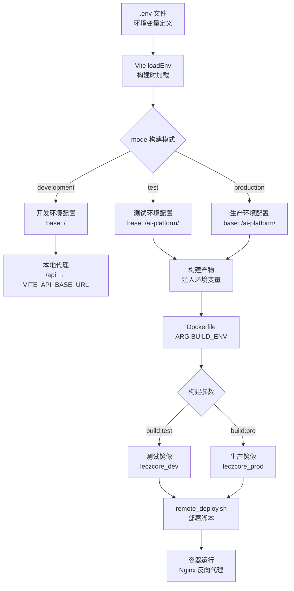

现代前端项目需要在开发、测试、生产等多个环境中运行，每个环境的 API 地址、构建配置、部署路径都有所不同。本项目基于 Vite 构建系统，采用环境变量注入、构建模式切换、Docker 参数化构建三层架构，实现了从本地开发到云端部署的全链路环境隔离与配置管理。这种分层设计使得开发者可以在本地使用代理调试接口、测试团队获得独立的测试环境构建、生产部署通过容器化实现环境隔离，所有配置通过声明式文件管理，避免了硬编码带来的维护成本。

Sources: [.env.example](.env.example#L1-L18) [.env](.env#L1-L20) [vite.config.ts](vite.config.ts#L1-L39)

## 环境配置层级架构

项目的环境配置系统采用**构建时注入、运行时读取、部署时覆盖**的三层架构。构建时通过 Vite 的 `loadEnv` 加载 `.env` 文件中的变量并注入到打包产物中；运行时通过 `import.meta.env` 读取这些变量；部署时通过 Docker 的 `ARG` 参数动态选择构建命令。这种设计确保了同一份代码在不同环境下的行为差异完全由配置驱动，无需修改源码。



上图中，**左侧为配置定义层**（.env 文件）、**中间为构建处理层**（Vite 根据模式生成不同配置）、**右侧为部署执行层**（Docker 根据参数选择构建命令和镜像命名空间）。这种分层确保了配置的单一职责原则：环境变量文件只负责定义变量，构建工具负责根据模式注入变量，容器化工具负责选择构建策略。

Sources: [vite.config.ts](vite.config.ts#L7-L8) [package.json](package.json#L7-L10) [Dockerfile](Dockerfile#L14-L16)

## 环境变量定义与分类

项目的环境变量分为**公共配置**和**前端专用配置**两类。公共配置主要服务于 CI/CD 流程和部署脚本，包括阿里云镜像仓库地址、远程服务器信息等；前端专用配置则直接注入到客户端代码中，影响运行时行为。所有环境变量都在 `.env.example` 中有完整的使用说明，确保新开发者能够快速理解每个变量的用途。

### 公共配置（CI/CD 与部署）

| 变量名 | 示例值 | 用途说明 |
|--------|--------|----------|
| `ALIYUN_REGISTRY` | `crpi-xxx.cn-beijing.personal.cr.aliyuncs.com` | 阿里云容器镜像服务地址 |
| `ALIYUN_NAMESPACE` | `leczcore_dev` | 镜像命名空间（dev/test 使用 dev，prod 使用 prod） |
| `ALIYUN_USER` | `丽滋卡尔中台` | 镜像仓库登录用户名 |
| `ALIYUN_PASSWORD` | `uEXY&OehcpSe1sTG` | 镜像仓库登录密码 |
| `REMOTE_USER` | `root` | 远程服务器登录用户名 |
| `REMOTE_HOST` | `39.96.197.81` | 远程服务器 IP 地址 |
| `REMOTE_DIR` | `/root` | 远程服务器部署目录 |
| `GIT_COMMIT_ENABLED` | `true` | 是否启用 Git 提交触发部署 |

这些变量被 `remote_deploy.sh` 脚本读取，用于自动化部署流程。**命名空间的选择逻辑**在部署脚本中实现：如果 `BUILD_ENV` 为 `test`，使用 `leczcore_dev`；如果为 `prod`，使用 `leczcore_prod`。这种设计允许同一份部署脚本根据构建参数动态切换目标环境。

Sources: [.env](.env#L1-L10) [remote_deploy.sh](remote_deploy.sh#L21-L28)

### 前端专用配置（运行时注入）

| 变量名 | 开发环境示例 | 生产环境示例 | 用途说明 |
|--------|-------------|-------------|----------|
| `VITE_API_BASE_URL` | `http://172.23.15.59:9080/ai-platform` | 留空（使用代理） | AI 网关接口基础地址 |
| `VITE_BUSINESS_API_URL` | 留空 | 留空 | 业务编排层接口地址（登录、任务、审计等） |
| `GEMINI_API_KEY` | `MY_GEMINI_API_KEY` | 运行时注入 | Google Gemini AI API 密钥 |
| `APP_URL` | `MY_APP_URL` | 运行时注入 | 应用托管地址（用于 OAuth 回调） |

**关键设计决策**：以 `VITE_` 开头的变量会被 Vite 自动注入到客户端代码中，通过 `import.meta.env.VITE_XXX` 访问。而不带前缀的变量只在构建脚本中使用，不会暴露给浏览器。`VITE_API_BASE_URL` 在开发环境中配置为内网地址，便于本地调试；在生产环境中留空，让运行时代码通过 `import.meta.env.BASE_URL` 动态计算相对路径，确保部署到任意子路径都能正常工作。

Sources: [.env.example](.env.example#L8-L17) [src/services/api.ts](src/services/api.ts#L107-L111)

## Vite 构建模式与配置切换

Vite 通过 `--mode` 参数区分构建环境，项目定义了三种构建命令：`dev`（开发）、`build:test`（测试构建）、`build:pro`（生产构建）。`vite.config.ts` 中的配置会根据 `mode` 动态调整，包括基础路径、API 代理、环境变量注入等。这种设计允许开发者通过简单的命令切换完整的环境配置，而无需手动修改配置文件。

### 构建命令与模式映射

| 命令 | 模式 | base 路径 | 代理配置 | 典型用途 |
|------|------|-----------|---------|---------|
| `npm run dev` | development | `/` | 启用 | 本地开发与接口调试 |
| `npm run build:test` | test | `/ai-platform/` | 禁用 | 测试环境部署 |
| `npm run build:pro` | production | `/ai-platform/` | 禁用 | 生产环境部署 |

**配置切换逻辑**在 `vite.config.ts` 中实现：`export default defineConfig(({ mode }) => { ... })`，通过 `mode` 参数判断当前构建环境。开发模式下 `base` 设置为 `/`，允许本地直接访问根路径；测试和生产模式下设置为 `/ai-platform/`，匹配 Nginx 的路径重写规则。代理配置只在开发服务器中生效，生产构建时会被忽略。

Sources: [vite.config.ts](vite.config.ts#L10-L13) [package.json](package.json#L7-L10)

### API 代理配置（仅开发环境）

开发环境中，前端运行在 `localhost:3000`，而后端 API 可能部署在内网服务器或云端。Vite 的代理配置允许前端通过相对路径 `/api` 访问接口，由开发服务器转发到真实地址，**避免了浏览器的跨域限制**。配置中定义了两条代理规则：`/api/v1` 映射到业务编排层接口（认证、任务、知识库等），`/api` 映射到 AI 网关其余接口（聊天、健康检查、BI 分析等）。

```typescript
server: {
  hmr: process.env.DISABLE_HMR !== 'true',
  proxy: {
    '/api/v1': {
      target: apiUrl,  // 从环境变量读取
      changeOrigin: true,
    },
    '/api': {
      target: apiUrl,
      changeOrigin: true,
    },
  },
}
```

**代理目标地址** `apiUrl` 从环境变量 `VITE_API_BASE_URL` 读取，如果未配置则使用默认值 `http://172.23.15.59:9080/ai-platform`。这种设计允许团队成员根据本地网络环境配置不同的后端地址，而无需修改代码。`changeOrigin: true` 确保请求头中的 `Host` 字段被重写为目标地址，避免后端服务器拒绝请求。

Sources: [vite.config.ts](vite.config.ts#L21-L35)

## 运行时环境变量读取

前端代码通过 `import.meta.env` 对象访问 Vite 注入的环境变量。`src/services/api.ts` 中封装了两个 Axios 客户端：`apiClient` 用于调用 AI 网关接口（超时 30 秒），`businessClient` 用于调用业务编排层接口（超时 15 秒）。**基础地址的计算逻辑**采用环境变量优先、BASE_URL 回退的策略，确保在不同部署场景下都能正确连接后端。

### 动态基础地址计算

```typescript
const getBaseUrl = (envUrl?: string) => {
  if (envUrl?.trim()) return envUrl.trim();  // 优先使用环境变量
  const base = import.meta.env.BASE_URL || '';  // 回退到构建时的 base 路径
  return base.endsWith('/') ? base.slice(0, -1) : base;  // 移除末尾斜杠
};

export const apiClient = createClient(
  getBaseUrl(import.meta.env.VITE_API_BASE_URL), 
  30_000
);
export const businessClient = createClient(
  getBaseUrl(import.meta.env.VITE_BUSINESS_API_URL), 
  15_000
);
```

**三种典型场景**：本地开发时 `VITE_API_BASE_URL` 配置为 `http://172.23.15.59:9080/ai-platform`，客户端直接向该地址发请求；部署到测试环境时 `VITE_API_BASE_URL` 留空，客户端使用 `import.meta.env.BASE_URL`（值为 `/ai-platform`），请求发送到同域的 Nginx 代理；生产环境与测试环境相同，依赖 Nginx 反向代理转发请求到真实后端。

Sources: [src/services/api.ts](src/services/api.ts#L107-L121)

### 构建时变量注入

部分环境变量需要在构建时硬编码到产物中，例如 Google Gemini API 密钥。Vite 的 `define` 配置项允许将全局变量替换为字面量值，这里将 `process.env.GEMINI_API_KEY` 替换为 `.env` 文件中的实际值。这种注入发生在打包阶段，**最终产物中会直接包含密钥的字面值**，因此仅适用于非敏感配置或需要运行时动态获取的密钥。

```typescript
define: {
  'process.env.GEMINI_API_KEY': JSON.stringify(env.GEMINI_API_KEY),
}
```

**安全注意事项**：以 `VITE_` 开头的环境变量和通过 `define` 注入的变量都会暴露给客户端代码，**绝不能包含数据库密码、服务器私钥等敏感信息**。项目的 `.env.example` 中明确标注了哪些变量会被注入到客户端，哪些只在构建脚本中使用，帮助开发者避免安全风险。

Sources: [vite.config.ts](vite.config.ts#L14-L16) [.env.example](.env.example#L1-L3)

## Docker 容器化多环境构建

Docker 构建过程通过 `ARG` 参数接收构建环境标识，动态选择构建命令。Dockerfile 定义了 `ARG BUILD_ENV=pro`，默认值为 `pro`（生产环境），在构建镜像时可以通过 `--build-arg BUILD_ENV=test` 覆盖。这种设计允许同一个 Dockerfile 支持多个环境的构建，而无需维护多份配置文件，**遵循了基础设施即代码的原则**。

### Dockerfile 构建参数传递

```dockerfile
# Build stage
FROM node:20-alpine as builder
WORKDIR /app
COPY package*.json ./
RUN npm install
COPY . .
ARG BUILD_ENV=pro  # 声明构建参数，默认为 pro
RUN npm run build:${BUILD_ENV}  # 动态执行 build:test 或 build:pro

# Production stage
FROM nginx:stable-alpine as production
COPY --from=builder /app/dist /usr/share/nginx/html
COPY default.conf /etc/nginx/conf.d/default.conf
EXPOSE 80
CMD ["nginx", "-g", "daemon off;"]
```

**多阶段构建的优势**：第一阶段（builder）安装依赖并执行构建，生成 `dist` 目录；第二阶段（production）仅复制构建产物和 Nginx 配置，丢弃源码和依赖，最终镜像体积更小、更安全。构建参数 `BUILD_ENV` 只在第一阶段生效，不会保留在最终镜像中，避免了环境信息泄露。

Sources: [Dockerfile](Dockerfile#L1-L23)

### 镜像仓库命名空间策略

项目提供了两个 Dockerfile：`Dockerfile` 使用标准阿里云镜像仓库地址，`DockerVPCfile` 使用 VPC 内网地址（`-vpc` 后缀）。VPC 版本在阿里云内部网络中使用，下载速度更快、不占用公网带宽。**命名空间的选择**在 `remote_deploy.sh` 中根据 `BUILD_ENV` 动态决定：测试环境使用 `leczcore_dev`，生产环境使用 `leczcore_prod`，实现了测试与生产镜像的完全隔离。

| 构建环境 | 命名空间 | Dockerfile | 镜像地址示例 |
|---------|---------|-----------|------------|
| test | `leczcore_dev` | Dockerfile / DockerVPCfile | `crpi-xxx/leczcore_dev/ai-web:1.0.0` |
| prod | `leczcore_prod` | Dockerfile / DockerVPCfile | `crpi-xxx/leczcore_prod/ai-web:1.0.0` |

**部署脚本逻辑**：`remote_deploy.sh` 在远程服务器上执行，首先登录阿里云镜像仓库，然后根据 `BUILD_ENV` 拼接完整镜像名称（包括命名空间），拉取镜像后停止旧容器、启动新容器，最后清理无用镜像。整个过程完全自动化，只需在本地执行 `npm run deploy` 即可触发完整的 CI/CD 流程。

Sources: [DockerVPCfile](DockerVPCfile#L1-L23) [remote_deploy.sh](remote_deploy.sh#L12-L58)

## Nginx 生产环境配置

生产环境的前端应用通过 Nginx 提供静态文件服务，配置文件 `default.conf` 定义了路径重写规则和反向代理策略。核心配置包括：根路径重定向到 `/ai-platform/`、静态文件服务配置、SPA 应用的 fallback 规则。这些配置确保了应用部署到子路径时，路由和资源加载都能正常工作。

### 路径重写与 SPA 支持

```nginx
server {
    listen 80;
    server_name localhost;
    absolute_redirect off;  # 禁用绝对重定向

    location = / {
        return 302 /ai-platform/;  # 根路径重定向到子路径
    }

    location /ai-platform {
        alias /usr/share/nginx/html/;  # 映射到容器内的构建产物目录
        index index.html index.htm;
        try_files $uri $uri/ /ai-platform/index.html;  # SPA fallback
    }
}
```

**关键配置说明**：`absolute_redirect off` 防止 Nginx 在重定向时使用绝对 URL，避免在反向代理后出现地址错误。`location /ai-platform` 使用 `alias` 而非 `root`，确保 `/ai-platform/xxx` 映射到 `/usr/share/nginx/html/xxx`，而不是 `/usr/share/nginx/html/ai-platform/xxx`。`try_files` 指令实现了 SPA 应用的核心逻辑：优先返回匹配的静态文件，如果不存在则返回 `index.html`，由前端路由接管。

Sources: [default.conf](default.conf#L1-L23)

### 与前端构建配置的协作

Nginx 配置中的 `/ai-platform` 路径与 Vite 构建配置中的 `base: '/ai-platform/'` **必须保持一致**。Vite 在构建时会将所有静态资源路径添加 `/ai-platform/` 前缀，例如 `import('./DashboardView.js')` 会变成 `import('/ai-platform/assets/DashboardView-xxx.js')`。如果 Nginx 配置的路径与构建时的 `base` 不一致，会导致资源加载失败。

**协作流程**：开发者在 `vite.config.ts` 中设置 `base: '/ai-platform/'`，Vite 构建产物中的所有资源引用都会带上此前缀；Docker 构建时将产物复制到 Nginx 容器的 `/usr/share/nginx/html/`；Nginx 配置 `location /ai-platform { alias /usr/share/nginx/html/; }` 将 `/ai-platform/assets/xxx` 映射到 `/usr/share/nginx/html/assets/xxx`，完成路径匹配。这种设计允许应用部署到任意子路径，只需修改 `base` 和 Nginx 配置即可。

Sources: [vite.config.ts](vite.config.ts#L10-L13) [default.conf](default.conf#L11-L16)

## 环境配置最佳实践

多环境配置管理需要在**灵活性、安全性、可维护性**之间找到平衡。本项目采用了一系列最佳实践，包括环境变量模板、敏感信息隔离、配置验证等，确保团队协作时配置管理的规范性。以下表格总结了关键实践与具体实现方式。

| 实践原则 | 实现方式 | 收益说明 |
|---------|---------|---------|
| 环境变量模板化 | 提供 `.env.example` 文件，包含所有变量及其说明 | 新成员快速上手，避免遗漏配置 |
| 敏感信息隔离 | `.env` 文件添加到 `.gitignore`，不提交到代码仓库 | 防止密码、密钥泄露 |
| 构建参数化 | Dockerfile 使用 `ARG BUILD_ENV`，支持动态选择构建命令 | 同一 Dockerfile 支持多环境 |
| 运行时动态计算 | API 基础地址优先读环境变量，回退到 BASE_URL | 部署到任意路径无需修改配置 |
| 命名空间隔离 | 测试环境使用 `leczcore_dev`，生产使用 `leczcore_prod` | 避免测试与生产镜像混淆 |

**团队协作建议**：在项目文档中明确说明每个环境变量的用途和示例值，确保新成员能够独立配置开发环境。对于 CI/CD 流程中的敏感变量（如镜像仓库密码、服务器密码），使用 CI 系统的密钥管理功能，而不是硬编码在 `.env` 文件中。定期审计 `.env.example` 文件，确保其与 `.env` 的变量列表保持同步。

Sources: [.env.example](.env.example#L1-L18) [.gitignore](.gitignore) [Dockerfile](Dockerfile#L14-L16)

## 故障排查与调试指南

环境配置问题通常表现为 API 请求失败、资源加载 404、路由无法跳转等症状。以下表格列出了常见问题及其诊断方法，帮助开发者快速定位配置错误。

| 症状表现 | 可能原因 | 诊断步骤 | 解决方案 |
|---------|---------|---------|---------|
| API 请求返回 404 | VITE_API_BASE_URL 配置错误 | 检查浏览器 Network 面板中的请求地址 | 修改 `.env` 文件或使用代理 |
| 静态资源加载失败 | Vite `base` 与 Nginx 路径不匹配 | 对比 `vite.config.ts` 的 `base` 与 Nginx 的 `location` | 统一路径配置 |
| 本地开发跨域错误 | 代理配置未生效或目标地址错误 | 检查终端中的代理日志 | 修正 `vite.config.ts` 中的 `proxy` 配置 |
| Docker 构建失败 | BUILD_ENV 参数未传递 | 检查构建命令中的 `--build-arg` | 添加构建参数或使用默认值 |
| 镜像拉取失败 | 命名空间或镜像标签错误 | 检查 `remote_deploy.sh` 中的镜像名称 | 修正命名空间选择逻辑 |

**调试工具推荐**：使用 `console.log(import.meta.env)` 在浏览器控制台查看注入的环境变量，确认 Vite 是否正确加载 `.env` 文件。在 Nginx 容器中执行 `cat /etc/nginx/conf.d/default.conf` 检查配置是否正确复制。使用 `docker inspect <container_id>` 查看容器的环境变量和挂载点，排查部署配置问题。