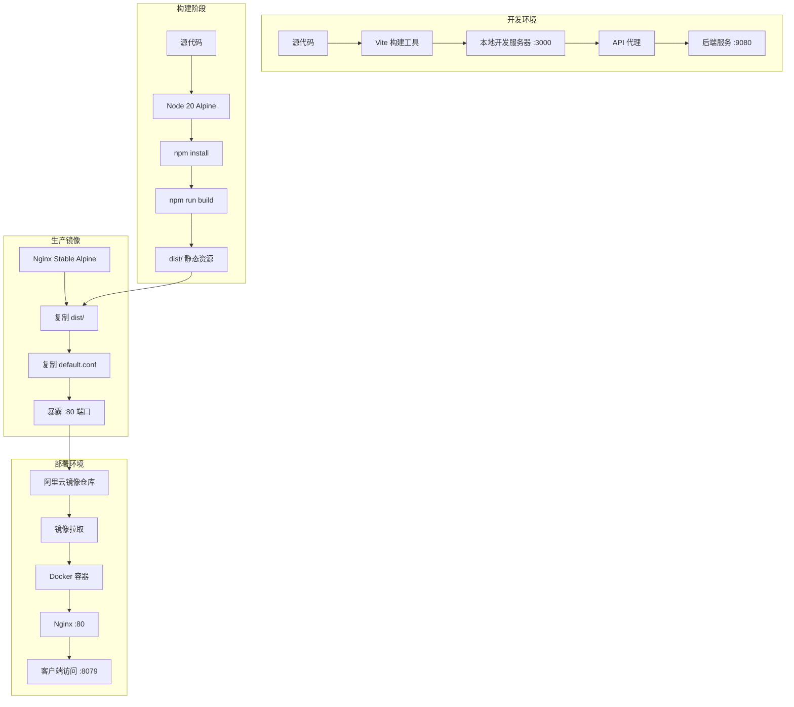
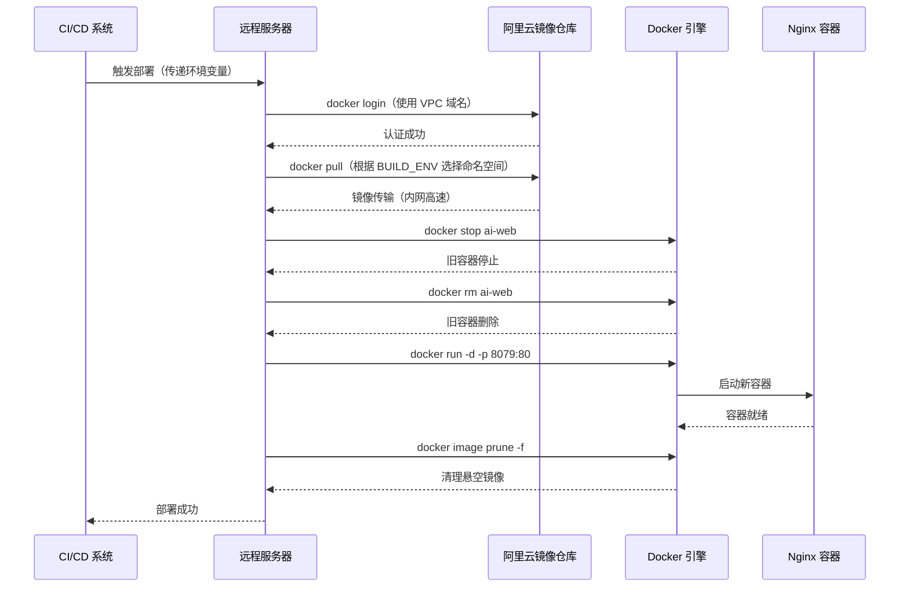

本文档深入解析 AI Business Platform 前端应用的生产环境部署架构，涵盖 Nginx 反向代理配置、Docker 容器化策略、多环境构建优化以及自动化部署流程。通过系统化的架构设计，实现高性能、可维护、易扩展的前端应用交付方案。

## 生产环境架构总览

该平台采用现代化的容器化部署架构，通过 Nginx 作为静态资源服务器与反向代理，结合 Docker 多阶段构建实现轻量化镜像，借助阿里云容器镜像服务完成持续交付。整个架构遵循"构建一次，到处部署"的原则，确保开发、测试、生产环境的一致性。



**架构核心特征**：多阶段构建确保生产镜像仅包含运行时必需文件，Alpine Linux 基础镜像将镜像体积控制在最小范围，Nginx 配置针对单页应用（SPA）路由特性进行深度优化，环境变量注入实现多环境灵活切换。

Sources: [default.conf](default.conf#L1-L23) [Dockerfile](Dockerfile#L1-L23) [vite.config.ts](vite.config.ts#L1-L39) [remote_deploy.sh](remote_deploy.sh#L1-L58)

## Nginx 配置深度解析

Nginx 配置文件 `default.conf` 针对单页应用（SPA）的部署特性进行了精确优化，重点解决路由回退、静态资源映射和错误处理三大核心问题。配置采用最小化原则，仅保留生产环境必需的指令，避免冗余配置带来的性能开销。

### 核心配置项分析

| 配置指令 | 配置值 | 作用说明 | 性能影响 |
|---------|--------|---------|---------|
| `listen` | `80` / `[::]:80` | 同时监听 IPv4 和 IPv6 的 80 端口，支持双栈网络访问 | 低开销，内核级转发 |
| `server_name` | `localhost` | 虚拟主机标识，容器内使用 localhost 即可 | 无性能影响 |
| `absolute_redirect` | `off` | 禁用 Nginx 默认的绝对路径重定向，防止端口丢失问题 | 避免重定向循环 |
| `location = /` | `return 302 /ai-platform/` | 根路径精确匹配，重定向到应用基础路径 | 减少 301 永久重定向的缓存副作用 |
| `alias` | `/usr/share/nginx/html/` | 将 URL 路径映射到文件系统路径，与 root 指令的关键区别在于路径拼接方式 | 精确路径映射，无额外解析开销 |
| `try_files` | `$uri $uri/ /ai-platform/index.html` | 依次尝试文件、目录、回退到 SPA 入口，实现前端路由支持 | 仅在文件不存在时回退，性能损耗极小 |
| `error_page` | `500 502 503 504` | 定义服务端错误的静态页面响应 | 统一错误体验，不增加运行时开销 |

**SPA 路由回退机制**是该配置的核心技术点。单页应用使用客户端路由（如 React Router），所有路由路径在服务器端都应返回同一个 `index.html` 文件，由前端 JavaScript 解析路由并渲染对应组件。`try_files` 指令的三阶段匹配策略确保静态资源（如 `/assets/logo.png`）优先命中，仅当路径不存在对应文件时才回退到入口文件，避免所有请求都经过文件系统检查的性能陷阱。

**路径映射策略对比**：`alias` 与 `root` 指令的关键差异在于路径拼接逻辑。`alias` 会将 location 匹配的部分完全替换为指定路径，例如 `/ai-platform/assets/app.js` 映射到 `/usr/share/nginx/html/assets/app.js`；而 `root` 则是路径追加，会导致 `/usr/share/nginx/html/ai-platform/assets/app.js` 的错误映射。这种精确控制在子路径部署场景下至关重要。

Sources: [default.conf](default.conf#L1-L23)

### IPv6 双栈支持配置

```nginx
listen       80;      # IPv4 监听
listen  [::]:80;      # IPv6 监听（括号表示 IPv6 地址格式）
```

现代生产环境通常需要同时支持 IPv4 和 IPv6 客户端访问。配置中的双 `listen` 指令确保容器能够处理两种协议的请求，无需额外配置即可适配混合网络环境。这种配置方式在云原生部署中尤为重要，因为 Kubernetes 等编排平台可能根据集群网络策略使用不同的 IP 协议。

**生产环境建议**：若部署环境已强制使用 HTTPS，应在 Nginx 配置中添加 SSL/TLS 相关指令，或在前端部署负载均衡器（如阿里云 SLB）统一处理 HTTPS 卸载，Nginx 容器仅负责 HTTP 服务以简化证书管理。

Sources: [default.conf](default.conf#L3-L4)

## Docker 容器化策略

Dockerfile 采用双阶段构建模式，第一阶段负责源码编译与资源打包，第二阶段仅包含运行时必需的 Nginx 与静态资源。这种架构设计使生产镜像体积从构建阶段的约 500MB 压缩至运行阶段的约 25MB，极大降低了镜像传输与存储成本。

### 多阶段构建架构

```dockerfile
# 阶段一：构建环境
FROM node:20-alpine as builder
WORKDIR /app
COPY package*.json ./
RUN npm install
COPY . .
ARG BUILD_ENV=pro
RUN npm run build:${BUILD_ENV}

# 阶段二：运行环境
FROM nginx:stable-alpine as production
COPY --from=builder /app/dist /usr/share/nginx/html
COPY default.conf /etc/nginx/conf.d/default.conf
EXPOSE 80
CMD ["nginx", "-g", "daemon off;"]
```

**构建阶段**（builder stage）选择 `node:20-alpine` 镜像，该镜像基于 Alpine Linux，相比标准 Node 镜像减少约 150MB 体积。构建过程首先复制 `package.json` 并执行依赖安装，利用 Docker 层缓存机制避免源码变更时的重复安装。`ARG BUILD_ENV=pro` 指令定义构建参数，允许在镜像构建时通过 `--build-arg` 注入环境标识，实现测试与生产环境的差异化构建。

**运行阶段**（production stage）从 builder 阶段复制 `/app/dist` 目录到 Nginx 静态资源目录，同时复制定制的 Nginx 配置文件。`CMD ["nginx", "-g", "daemon off;"]` 指令确保 Nginx 以前台模式运行，这是容器化部署的标准实践，使容器进程保持活跃状态。

Sources: [Dockerfile](Dockerfile#L1-L23)

### 镜像仓库与 VPC 加速

项目提供两个 Dockerfile 变体以适配不同网络环境：

| 文件名 | 镜像仓库地址 | 适用场景 | 拉取速度 |
|--------|-------------|---------|---------|
| `Dockerfile` | `crpi-301jbh81iyvo39lb.cn-beijing.personal.cr.aliyuncs.com` | 公网访问环境 | 标准速度 |
| `DockerVPCfile` | `crpi-301jbh81iyvo39lb-vpc.cn-beijing.personal.cr.aliyuncs.com` | 阿里云 VPC 内网 | 高速内网传输 |

**VPC 镜像加速原理**：阿里云容器镜像服务为每个仓库实例分配公网和 VPC 两个域名。VPC 域名仅在阿里云 ECS、ACK 等云产品内网可访问，数据传输走内网链路，避免公网带宽限制和流量费用。在自动化部署流水线中，构建节点与部署节点若位于同一 VPC，使用 VPC 域名可将镜像拉取时间从分钟级缩短至秒级。

**构建命令示例**：
```bash
# 公网构建
docker build -f Dockerfile --build-arg BUILD_ENV=prod -t ai-web:prod .

# VPC 内网构建（部署节点需在阿里云 VPC 内）
docker build -f DockerVPCfile --build-arg BUILD_ENV=test -t ai-web:test .
```

Sources: [Dockerfile](Dockerfile#L2) [DockerVPCfile](DockerVPCfile#L2)

### .dockerignore 优化策略

`.dockerignore` 文件定义构建上下文的排除规则，防止无关文件进入 Docker 构建上下文，提升构建速度并减少上下文传输数据量。项目配置排除以下路径：

| 排除项 | 排除原因 | 体积影响 |
|--------|---------|---------|
| `node_modules` | 依赖已通过 `npm install` 安装，源码依赖无需进入构建上下文 | 减少约 200-500MB |
| `dist` | 构建产物将在构建阶段重新生成，避免旧产物干扰 | 减少约 10-50MB |
| `.git` | 版本控制历史对运行时无意义 | 减少约 50-200MB |
| `.idea` / `.vscode` | IDE 配置文件仅开发环境需要 | 减少约 1-10MB |
| `.DS_Store` | macOS 系统文件无跨平台价值 | 减少约 1KB-1MB |
| `*.log` | 日志文件不应包含在镜像中 | 减少约 1-100MB |

**最佳实践建议**：定期审查 `.dockerignore` 配置，确保新增的临时文件、测试报告、文档目录等非运行时必需文件被正确排除。可使用 `docker build --progress=plain . 2>&1 | less` 命令查看构建上下文传输详情，定位大文件传输瓶颈。

Sources: [.dockerignore](.dockerignore#L1-L8)

## Vite 构建配置与环境适配

Vite 构建配置通过 `defineConfig` 函数的 `mode` 参数实现环境感知，动态调整基础路径、代理规则和全局变量注入策略。这种配置模式使同一份代码库能够无缝适配开发、测试、生产三种环境，无需维护多份配置文件。

### 环境感知的构建策略

```typescript
export default defineConfig(({ mode }) => {
  const env = loadEnv(mode, '.', '');
  const apiUrl = env.VITE_API_BASE_URL?.trim() || 'http://172.23.15.59:9080/ai-platform';

  return {
    base: mode === 'development' ? '/' : '/ai-platform/',
    // ... 其他配置
  };
});
```

**基础路径动态配置**是 SPA 部署的核心技术点。开发环境使用根路径 `/` 简化本地调试，生产环境切换为 `/ai-platform/` 子路径以适配反向代理配置。这种设计要求 Nginx 配置中的 `alias` 指令与 Vite 的 `base` 配置保持一致，否则会导致静态资源 404 错误。

**环境变量加载策略**：`loadEnv(mode, '.', '')` 函数从项目根目录加载 `.env`、`.env.local`、`.env.[mode]`、`.env.[mode].local` 四个层级的文件，后加载的文件覆盖先加载的同名变量。第三个参数空字符串表示加载所有环境变量，而非仅 `VITE_` 前缀的变量。

Sources: [vite.config.ts](vite.config.ts#L7-L14)

### 开发环境代理配置

```typescript
server: {
  hmr: process.env.DISABLE_HMR !== 'true',
  proxy: {
    '/api/v1': {
      target: apiUrl,
      changeOrigin: true,
    },
    '/api': {
      target: apiUrl,
      changeOrigin: true,
    },
  },
}
```

**代理规则设计**采用前缀匹配策略，`/api/v1` 优先匹配业务编排层接口（认证、任务、知识库等），`/api` 兜底匹配 AI 网关其余接口（聊天、健康检查、BI 分析等）。这种分层代理设计支持未来接口版本的平滑升级，无需修改前端代码即可切换后端服务地址。

**HMR（热模块替换）控制**：`process.env.DISABLE_HMR !== 'true'` 配置允许在特定场景（如 Docker 容器内开发）禁用 HMR，避免 WebSocket 连接问题导致的开发服务器卡顿。生产环境构建时该配置被忽略，因为 Vite 构建产物不包含 HMR 运行时代码。

Sources: [vite.config.ts](vite.config.ts#L23-L37)

### 多环境构建脚本

`package.json` 定义了三套构建脚本以适配不同部署场景：

| 脚本命令 | 构建模式 | 环境标识 | 适用场景 |
|---------|---------|---------|---------|
| `npm run build` | 默认生产模式 | `production` | 本地验证、CI/CD 默认构建 |
| `npm run build:test` | 测试模式 | `test` | 测试环境部署，启用调试工具 |
| `npm run build:pro` | 生产模式 | `production` | 正式环境部署，代码压缩混淆 |

**构建脚本实现原理**：`vite build --mode test` 命令触发 Vite 加载 `.env.test` 文件，该文件可定义测试环境专用的 API 地址、功能开关等变量。`npm run build` 与 `npm run build:pro` 虽然都使用生产模式，但前者便于本地快速验证构建产物，后者明确表达生产部署意图。

**构建产物特征**：当前项目构建后生成约 13MB 的 `dist/` 目录，包含代码分割后的 JavaScript 文件（如 `MedicalAIWorkbench-CQH09Oq5.js`）、按需加载的 CSS 文件（如 `mobile-BVs2a5zd.css`）以及静态资源（图片、字体）。文件名中的哈希值（如 `CQH09Oq5`）基于内容生成，实现长期缓存策略。

Sources: [package.json](package.json#L8-L11)

## 自动化部署流程

`remote_deploy.sh` 脚本封装了完整的远程部署流程，涵盖镜像拉取、容器生命周期管理、端口映射等核心操作。该脚本设计为幂等操作，多次执行不会产生副作用，适合集成到 CI/CD 流水线中实现持续部署。

### 部署流程架构



**环境感知的镜像命名空间**：脚本根据 `BUILD_ENV` 变量动态选择镜像仓库命名空间，测试环境使用 `leczcore_dev`，生产环境使用 `leczcore_prod`。这种命名空间隔离策略确保测试版本与生产版本互不干扰，降低误部署风险。

**关键部署参数**：

| 参数名 | 默认值 | 作用说明 |
|--------|--------|---------|
| `ALIYUN_REGISTRY` | `crpi-301jbh81iyvo39lb-vpc.cn-beijing.personal.cr.aliyuncs.com` | VPC 内网镜像仓库地址 |
| `IMAGE_NAME` | `ai-web` | 镜像名称，同时用作容器名称 |
| `IMAGE_TAG` | `1.0.0` | 镜像标签，可通过环境变量覆盖 |
| `BUILD_ENV` | `prod` | 构建环境标识，决定命名空间选择 |
| 端口映射 | `8079:80` | 宿主机 8079 端口映射到容器 80 端口 |

**容器重启策略**：`--restart unless-stopped` 参数确保容器在异常退出、Docker 服务重启、宿主机重启等场景下自动恢复运行，仅在显式执行 `docker stop` 命令时才保持停止状态。这是生产环境容器的高可用性保障措施。

Sources: [remote_deploy.sh](remote_deploy.sh#L1-L58)

### 镜像清理与存储优化

```bash
echo "Cleaning up dangling images..."
docker image prune -f
```

**悬空镜像**（dangling images）是指没有标签指向的镜像层，通常在镜像更新后产生。`docker image prune -f` 命令自动清理这些无用镜像，释放磁盘空间。`-f` 参数跳过交互确认，适合自动化脚本执行。

**存储优化建议**：长期运行的服务器应配置定时任务执行 `docker system prune -a --volumes -f` 命令，清理所有未使用的镜像、容器、网络和卷。但需注意该命令会删除所有未被至少一个容器引用的镜像，可能导致下次部署时的镜像重新拉取。建议在磁盘空间紧张时手动执行，而非自动化执行。

Sources: [remote_deploy.sh](remote_deploy.sh#L55-L57)

## 生产环境性能优化建议

基于当前架构设计，以下优化建议可进一步提升生产环境的性能、安全性和可维护性。

### Nginx 性能调优配置

在 `default.conf` 中添加以下配置以启用高级性能特性：

```nginx
server {
    # ... 现有配置 ...
    
    # Gzip 压缩配置
    gzip on;
    gzip_vary on;
    gzip_min_length 1024;
    gzip_types text/plain text/css text/xml text/javascript application/javascript application/json application/xml;
    gzip_comp_level 6;
    
    # 静态资源缓存策略
    location ~* \.(js|css|png|jpg|jpeg|gif|ico|svg|woff|woff2|ttf|eot)$ {
        expires 1y;
        add_header Cache-Control "public, immutable";
    }
    
    # 安全头部配置
    add_header X-Frame-Options "SAMEORIGIN" always;
    add_header X-Content-Type-Options "nosniff" always;
    add_header X-XSS-Protection "1; mode=block" always;
}
```

**Gzip 压缩优化**：启用 Gzip 可将文本资源（HTML、CSS、JavaScript）体积压缩 60-80%，显著减少网络传输时间。`gzip_comp_level 6` 提供压缩率与 CPU 消耗的平衡点，高于此值压缩率提升有限但 CPU 开销显著增加。

**长期缓存策略**：Vite 构建产物文件名包含内容哈希（如 `index-b7K0gfRV.js`），文件内容变化时哈希值改变，实现缓存自动失效。配合 `Cache-Control: immutable` 指令，浏览器可永久缓存这些资源，无需发起条件请求（If-None-Match / If-Modified-Since），极大减少网络往返。

**安全头部加固**：`X-Frame-Options` 防止点击劫持攻击，`X-Content-Type-Options` 阻止 MIME 类型嗅探，`X-XSS-Protection` 启用浏览器内置的 XSS 过滤器（现代浏览器中已逐步被 CSP 替代，但仍作为纵深防御措施）。

Sources: [default.conf](default.conf#L1-L23)

### 容器资源限制建议

在 `remote_deploy.sh` 的 `docker run` 命令中添加资源限制参数，防止单个容器耗尽宿主机资源：

```bash
docker run -d \
  --name "$IMAGE_NAME_CONTAINER" \
  --restart unless-stopped \
  --memory="512m" \
  --cpus="1.0" \
  --memory-swap="1g" \
  -p 8079:80 \
  "$FULL_IMAGE_NAME"
```

**资源限制参数说明**：

| 参数 | 配置值 | 作用说明 |
|------|--------|---------|
| `--memory` | `512m` | 容器最大可用内存，超过此值触发 OOM Killer |
| `--cpus` | `1.0` | 容器最多使用 1 个 CPU 核心的计算能力 |
| `--memory-swap` | `1g` | 内存+交换空间总上限，设置为内存的 2 倍可提供弹性缓冲 |

**监控与告警**：建议在宿主机部署 Prometheus + cAdvisor 监控容器资源使用情况，配置告警规则在资源使用率超过 80% 时通知运维团队。长期运行后可根据实际负载数据调整资源限制值。

Sources: [remote_deploy.sh](remote_deploy.sh#L45-L53)

### 健康检查与优雅停机

为 Docker 容器配置健康检查，确保负载均衡器仅将流量路由到健康实例：

```dockerfile
# 在 Dockerfile 中添加
HEALTHCHECK --interval=30s --timeout=3s --start-period=5s --retries=3 \
  CMD wget --quiet --tries=1 --spider http://localhost/ai-platform/ || exit 1
```

**健康检查参数解读**：`--interval=30s` 每 30 秒检查一次，`--timeout=3s` 单次检查超时 3 秒，`--start-period=5s` 容器启动后前 5 秒不计入失败重试，`--retries=3` 连续 3 次失败后标记容器为 unhealthy。

**优雅停机配置**：Nginx 默认处理 SIGTERM 信号时立即停止接收新连接并等待现有请求完成（最长 60 秒）。可通过在 `nginx.conf` 中添加 `worker_shutdown_timeout 30s;` 指令调整等待时间，确保部署更新时零宕机。

Sources: [Dockerfile](Dockerfile#L1-L23)

## 环境变量与配置管理

`.env.example` 文件定义了应用运行所需的环境变量模板，涵盖 AI 服务密钥、应用 URL、API 基础地址等核心配置。生产环境部署时应基于此模板创建实际的 `.env` 文件，并通过密钥管理系统（如阿里云 KMS）注入敏感信息。

### 环境变量分类与用途

| 变量名 | 作用域 | 敏感性 | 配置建议 |
|--------|--------|--------|---------|
| `GEMINI_API_KEY` | 构建时 | 高 | 通过 CI/CD 密钥管理功能注入，禁止提交到代码仓库 |
| `APP_URL` | 运行时 | 低 | 根据部署环境动态配置，用于 OAuth 回调地址 |
| `VITE_API_BASE_URL` | 构建时 | 低 | 测试/生产环境分别配置，前端代码构建时固化 |
| `VITE_BUSINESS_API_URL` | 构建时 | 低 | 可选配置，留空时使用 Vite 代理转发请求 |

**构建时变量与运行时变量**：`VITE_` 前缀的变量在构建阶段通过 `import.meta.env.VITE_API_BASE_URL` 访问，会被静态替换为实际值。不带前缀的变量（如 `GEMINI_API_KEY`）通过 `process.env` 访问，需要在 Vite 配置的 `define` 选项中显式声明才能在客户端代码中使用。

**多环境配置策略**：创建 `.env.development`、`.env.test`、`.env.production` 三个文件分别配置不同环境的变量，Vite 根据 `--mode` 参数自动加载对应文件。敏感信息（如 API 密钥）不应包含在这些文件中，而是在 CI/CD 流水线中动态注入。

Sources: [.env.example](.env.example#L1-L18)

## 下一步学习建议

完成 Nginx 配置与生产环境优化的学习后，建议继续探索以下相关主题以构建完整的运维知识体系：

- **容器化部署深入**：参考 [Docker 容器化部署](32-docker-rong-qi-hua-bu-shu) 了解镜像构建、网络配置、数据卷管理等进阶话题
- **多环境配置管理**：学习 [多环境配置管理](33-duo-huan-jing-pei-zhi-guan-li) 掌握开发、测试、生产环境的差异化配置策略
- **性能监控与优化**：结合 [代码分割与懒加载](30-dai-ma-fen-ge-yu-lan-jia-zai) 和 [打包优化策略](31-da-bao-you-hua-ce-lue) 全面提升应用性能
- **CI/CD 流水线集成**：探索如何将本节介绍的部署脚本集成到 GitLab CI、Jenkins 等持续集成平台，实现自动化测试与部署