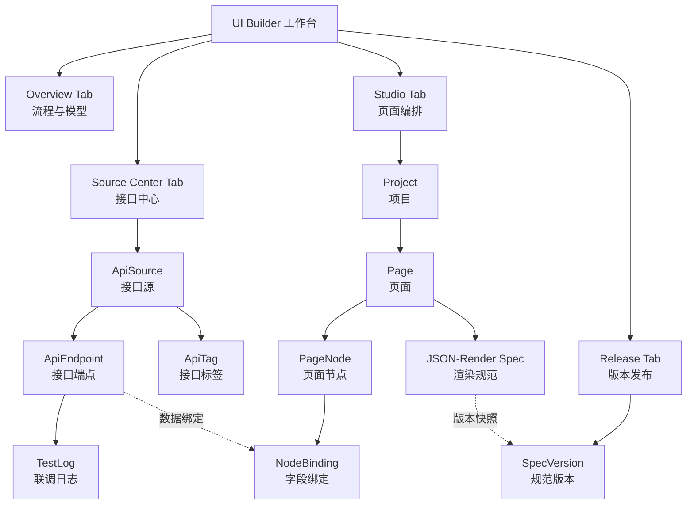
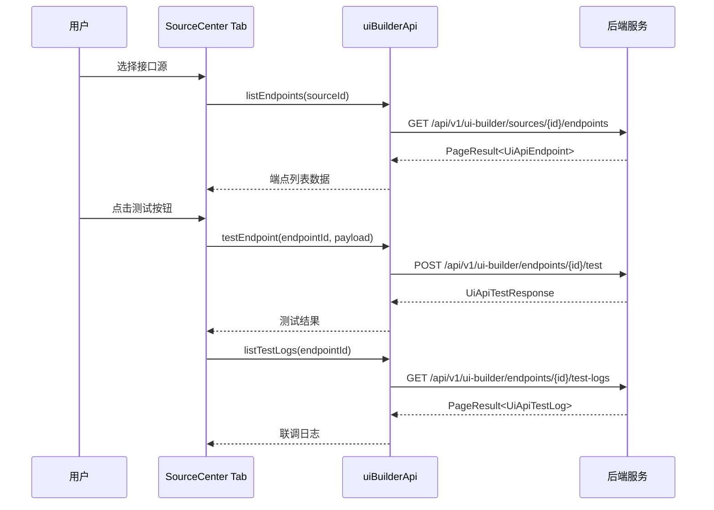
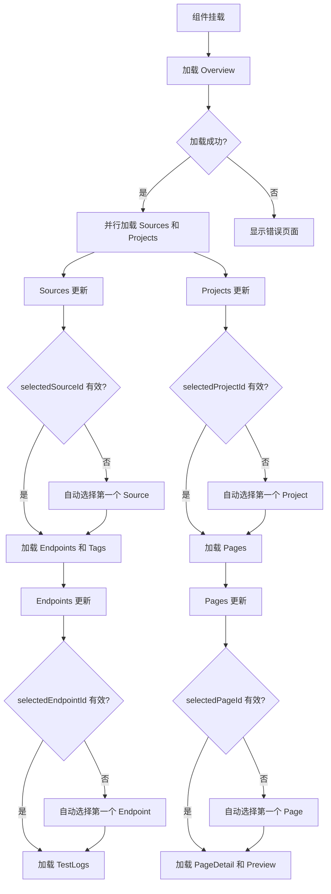

UI Builder 是一个一站式的低代码页面构建平台，将 OpenAPI 接口文档管理、页面可视化编排、数据字段绑定和版本发布控制集成在统一工作台中。该系统采用声明式架构，通过 JSON-Render 规范驱动前端组件渲染，实现了从接口定义到页面发布的完整闭环，为业务系统提供快速构建数据驱动型页面的能力。

## 核心架构与设计理念

UI Builder 基于**数据源-节点-绑定**三层抽象模型构建，将传统的前端开发流程转化为配置化操作。系统通过统一的 API 层与后端交互，所有业务实体（接口源、端点、项目、页面、节点、绑定）均采用类型安全的 TypeScript 定义，确保编译期类型检查和开发时智能提示。



Sources: [UiBuilderPage.tsx](src/pages/ui-builder/UiBuilderPage.tsx#L74-L108), [types.ts](src/pages/ui-builder/types.ts#L1-L303)

## 四大功能模块详解

### 流程与模型（Overview Tab）

Overview Tab 作为系统的文档中心和导航入口，展示了 UI Builder 的完整落地流程和核心概念模型。该模块通过可视化步骤条展示从接口导入到 Spec 发布的五个关键阶段，同时以卡片形式呈现系统支持的节点类型、认证方式和后端表结构设计。

**工作流阶段**：接口导入 → 接口联调 → 页面编排 → 字段绑定 → Spec 发布

该模块从后端 `/api/v1/ui-builder/overview` 端点获取 `UiBuilderOverview` 对象，包含模块名称、功能特性列表、工作流步骤、认证类型、节点类型定义和数据库表结构信息。这些元数据驱动界面渲染，使文档始终保持与后端实现同步。

Sources: [OverviewTab.tsx](src/pages/ui-builder/components/OverviewTab.tsx#L19-L154), [types.ts](src/pages/ui-builder/types.ts#L48-L56)

### 接口中心（Source Center Tab）

接口中心是 API 资产管理核心模块，支持 OpenAPI 文档导入、手工接口定义、接口联调测试和测试日志查询。该模块采用左右分栏布局，左侧展示接口源列表，右侧显示选中接口源的端点列表和详细配置。

**核心能力**：
- **多源管理**：支持 OpenAPI、Manual、Postman 三种接口源类型，每个源独立配置 BaseURL、认证方式和默认请求头
- **智能导入**：通过文档 URL 或 JSON 内容导入 OpenAPI 规范，自动解析 Path、Method、参数和响应结构
- **实时联调**：提供接口测试面板，支持自定义 Headers、Query 参数和 Request Body，实时查看响应结果和状态码
- **日志追溯**：自动记录每次联调请求的完整上下文，包括请求头、请求体、响应状态、响应头和响应体



Sources: [SourceCenterTab.tsx](src/pages/ui-builder/components/SourceCenterTab.tsx#L98-L837), [api.ts](src/pages/ui-builder/api.ts#L42-L98)

### 页面编排工作台（Studio Tab）

Studio Tab 是可视化页面构建的核心工作区，采用项目-页面-节点三层结构管理页面资产。该模块提供完整的 CRUD 操作界面，支持节点树的创建、编辑、删除和层级调整，并通过字段绑定机制将节点属性与接口端点数据动态关联。

**实体关系模型**：

| 实体 | 职责 | 关键字段 |
|------|------|----------|
| **Project** | 项目容器，隔离不同业务域 | `name`, `code`, `category` |
| **Page** | 页面单元，对应一个完整视图 | `name`, `routePath`, `rootNodeId` |
| **PageNode** | UI 组件节点，构成页面树 | `nodeType`, `nodeKey`, `parentId`, `propsConfig` |
| **NodeBinding** | 数据绑定规则，连接节点与接口 | `endpointId`, `targetProp`, `sourcePath` |

**节点类型系统**：每个节点包含 `nodeType`（如 Card、Table、Form）、`propsConfig`（组件属性 JSON）、`styleConfig`（样式配置 JSON）和 `slotName`（插槽名称）。节点通过 `parentId` 形成树形结构，支持无限层级嵌套。

**字段绑定机制**：绑定规则定义了如何将接口响应数据映射到节点属性。`targetProp` 指定目标属性路径（如 `dataSource`），`sourcePath` 定义数据提取路径（如 `data.list`），`transformScript` 支持自定义转换脚本，`defaultValue` 提供降级值。

Sources: [StudioTab.tsx](src/pages/ui-builder/components/StudioTab.tsx#L92-L805), [types.ts](src/pages/ui-builder/types.ts#L140-L194)

### 版本发布控制台（Release Tab）

Release Tab 提供 Spec 预览、版本管理和发布控制功能。该模块基于当前页面的节点树和绑定关系，生成符合 JSON-Render 规范的声明式配置，并通过版本快照机制实现配置的持久化和回滚能力。

**JSON-Render Spec 结构**：

```typescript
{
  "root": "node-key-root",           // 根节点标识
  "elements": {                      // 节点元素映射
    "node-key-root": {
      "type": "Card",
      "props": { "title": "用户列表" },
      "children": ["node-key-table"]
    },
    "node-key-table": {
      "type": "Table",
      "props": { "dataSource": "${api.users}" }
    }
  }
}
```

**版本发布流程**：
1. 点击"刷新预览"调用 `/api/v1/ui-builder/pages/{id}/preview` 生成当前 Spec
2. 预览面板展示完整 JSON 配置，包含所有节点定义和数据绑定表达式
3. 点击"发布新版本"调用 `/api/v1/ui-builder/pages/{id}/publish` 创建版本快照
4. 系统将当前 Spec、节点快照和绑定关系序列化存储到 `UiSpecVersion` 表
5. 版本记录支持分页查询，每个版本包含版本号、发布状态、发布人和发布时间

Sources: [ReleaseTab.tsx](src/pages/ui-builder/components/ReleaseTab.tsx#L23-L156), [types.ts](src/pages/ui-builder/types.ts#L196-L219)

## 状态管理与数据流

UI Builder 采用 React Hooks 进行本地状态管理，通过 22 个独立的 `useState` 钩子维护应用状态，配合 14 个 `useEffect` 钩子实现数据加载和状态同步。这种细粒度状态划分确保了组件的局部更新能力，避免不必要的重渲染。

**状态分类体系**：

| 状态类别 | 状态变量 | 作用域 |
|----------|----------|--------|
| **实体数据** | `sources`, `endpoints`, `tags`, `projects`, `pages`, `nodes`, `bindings`, `versions` | 全局共享 |
| **选中状态** | `selectedSourceId`, `selectedEndpointId`, `selectedProjectId`, `selectedPageId` | Tab 内共享 |
| **分页状态** | `sourcePagination`, `endpointPagination`, `projectPagination` 等 | 列表组件 |
| **加载状态** | `booting`, `sourceLoading`, `studioLoading`, `releaseLoading` | UI 反馈 |
| **临时数据** | `testResult`, `testLogs`, `preview` | 功能模块 |

**数据加载策略**：系统采用**懒加载 + 自动选择**模式。当父实体列表加载完成后，自动选中第一个子实体并触发子数据加载。例如，当 `sources` 列表更新时，系统检查 `selectedSourceId` 是否有效，若无效则自动选择第一个源，触发 `endpoints` 和 `tags` 的加载。这种级联机制确保界面始终显示有效数据，避免空状态。



Sources: [UiBuilderPage.tsx](src/pages/ui-builder/UiBuilderPage.tsx#L110-L427), [UiBuilderPage.tsx](src/pages/ui-builder/UiBuilderPage.tsx#L538-L560)

## API 客户端与请求封装

UI Builder 的 API 层通过 `uiBuilderApi` 对象统一封装所有后端请求，基于项目的 `businessClient`（配置了 JWT 认证和自动 Token 刷新的 Axios 实例）进行 HTTP 调用。该封装层实现了统一的响应解包、错误处理和分页参数构建。

**响应解包机制**：所有 API 返回值均为 `Promise<ApiResponse<T>>` 结构，包含 `code`、`message` 和 `data` 字段。`unwrap` 辅助函数自动提取 `data` 字段，简化调用方代码：

```typescript
async function unwrap<T>(promise: Promise<{ data: ApiResponse<T> }>) {
  const response = await promise
  return response.data.data  // 自动解包
}
```

**分页参数标准化**：`buildPageParams` 函数将可选的 `PageQuery` 对象转换为统一的查询参数，默认值为 `page=1`、`size=20`，确保后端分页接口的一致性调用。

**API 端点分类**：

| 模块 | 端点前缀 | 主要方法 |
|------|----------|----------|
| **概览** | `/api/v1/ui-builder/overview` | `GET` |
| **接口源** | `/api/v1/ui-builder/sources` | `GET`, `POST`, `PUT`, `DELETE` |
| **接口端点** | `/api/v1/ui-builder/endpoints` | `GET`, `POST`, `PUT`, `DELETE`, `POST /test` |
| **运行时调用** | `/api/v1/ui-builder/runtime/endpoints/{id}/invoke` | `POST` |
| **项目管理** | `/api/v1/ui-builder/projects` | `GET`, `POST`, `PUT`, `DELETE` |
| **页面管理** | `/api/v1/ui-builder/pages` | `GET`, `POST`, `PUT`, `DELETE`, `GET /preview`, `POST /publish` |
| **节点管理** | `/api/v1/ui-builder/nodes` | `GET`, `POST`, `PUT`, `DELETE` |
| **绑定管理** | `/api/v1/ui-builder/bindings` | `GET`, `POST`, `PUT`, `DELETE` |

Sources: [api.ts](src/pages/ui-builder/api.ts#L30-L167), [services/api.ts](src/services/api.ts#L1-L1)

## 工具函数与辅助逻辑

`helpers.ts` 模块提供四个核心工具函数，处理日期格式化、JSON 美化、输入解析和 Spec 摘要生成，支持界面展示和数据处理需求。

**函数清单**：

| 函数 | 签名 | 用途 |
|------|------|------|
| `formatDateTime` | `(value?: string \| null) => string` | 将 ISO 8601 时间戳转换为本地化格式（`zh-CN`，24小时制） |
| `prettyJson` | `(value: unknown) => string` | 格式化 JSON 对象或字符串为缩进 2 空格的可读形式 |
| `parseJsonInput` | `(input?: string) => unknown` | 解析表单输入的 JSON 字符串，空值返回 `undefined` |
| `summarizeSpec` | `(spec?: Record<string, unknown>) => { root, elementCount }` | 提取 Spec 的根节点标识和元素总数 |

`summarizeSpec` 函数在 Release Tab 中用于快速展示当前 Spec 的关键指标，避免渲染完整 JSON 树。该函数安全地处理 `undefined` 和非对象类型的 `elements` 字段，确保鲁棒性。

Sources: [helpers.ts](src/pages/ui-builder/helpers.ts#L1-L58)

## 类型系统与数据契约

UI Builder 定义了 26 个 TypeScript 接口，覆盖实体定义、请求载荷和响应结构。这些类型不仅提供编译期类型检查，还作为前后端数据契约的文档化表达。

**核心实体类型**：

```typescript
// 接口源：代表一个 API 服务提供方
interface UiApiSource {
  id: string
  name: string
  code: string
  sourceType: 'openapi' | 'manual' | 'postman'
  baseUrl?: string
  authType: string
  authConfig?: string
  defaultHeaders?: string
}

// 接口端点：具体的 API 方法
interface UiApiEndpoint {
  id: string
  sourceId: string
  path: string
  method: 'GET' | 'POST' | 'PUT' | 'DELETE' | 'PATCH'
  requestSchema?: string
  responseSchema?: string
  sampleRequest?: string
  sampleResponse?: string
}

// 页面节点：UI 组件树节点
interface UiPageNode {
  id: string
  pageId: string
  parentId?: string
  nodeType: string
  nodeKey: string
  nodeName: string
  propsConfig?: string
  styleConfig?: string
  sortOrder?: number
}

// 字段绑定：数据映射规则
interface UiNodeBinding {
  id: string
  nodeId: string
  endpointId?: string
  bindingType: string
  targetProp: string
  sourcePath?: string
  transformScript?: string
  defaultValue?: string
}
```

**通用响应结构**：所有 API 返回值遵循 `ApiResponse<T>` 包装器，包含业务状态码、消息和数据载荷。分页接口返回 `PageResult<T>`，提供 `data` 数组和分页元数据（`page`、`size`、`total`）。

Sources: [types.ts](src/pages/ui-builder/types.ts#L1-L303)

## 路由注册与系统集成

UI Builder 通过项目的页面注册表（Page Registry）集成到主应用路由系统。该模块采用 React.lazy 实现代码分割，仅在用户访问 `/ui-builder` 路径时才加载相关代码，优化首屏加载性能。

**注册配置**：

```typescript
// pageRegistry.tsx
const UiBuilderPage = lazy(async () => {
  const module = await import('./pages/ui-builder/UiBuilderPage');
  return { default: module.UiBuilderPage };
});

export const PAGE_REGISTRY: Record<AppPage, LazyExoticComponent<ComponentType>> = {
  // ... 其他页面
  'ui-builder': UiBuilderPage,
};

// navigationData.ts
export const PAGE_DEFINITIONS: Record<AppPage, PageDefinition> = {
  'ui-builder': { 
    path: '/ui-builder', 
    title: 'JSON Render Builder', 
    implemented: true 
  },
};

export const FOOTER_NAVIGATION_ITEMS = [
  { page: 'ui-builder', label: 'UI Builder', icon: 'layout-dashboard' },
  // ...
];
```

UI Builder 被配置在底部导航栏（Footer Navigation），使用 `layout-dashboard` 图标，表明其作为配置工具和开发辅助平台的定位。用户可通过侧边栏快速访问该功能，无需记忆 URL 路径。

Sources: [pageRegistry.tsx](src/pageRegistry.tsx#L45-L101), [navigationData.ts](src/data/navigationData.ts#L53-L174)

## 扩展能力与最佳实践

UI Builder 的架构设计为未来扩展预留了多个切入点。**节点类型扩展**：通过后端 `nodeTypes` 配置动态注册新组件类型，前端无需修改代码即可支持新的 UI 组件。**认证方式扩展**：`authTypes` 配置支持添加新的 API 认证机制（如 OAuth2、API Key），认证逻辑在运行时根据 `authType` 字段分发。**转换脚本引擎**：`transformScript` 字段可集成 JavaScript 表达式引擎（如 jEXL、jsonata），实现复杂的数据转换逻辑。

**推荐工作流**：
1. 在接口中心导入或手工创建接口源和端点定义
2. 使用联调功能验证接口可用性，保存样例响应用于后续绑定
3. 在页面编排工作台创建项目和页面，构建节点树结构
4. 为需要动态数据的节点创建字段绑定，关联接口端点和数据路径
5. 切换到版本发布控制台，预览生成的 JSON-Render Spec
6. 发布版本后，通过版本记录查看历史快照，支持回滚操作

**性能优化建议**：对于包含大量节点（>100）的页面，建议在 `propsConfig` 和 `styleConfig` 中使用精简的 JSON 结构，避免深层嵌套。分页查询时，保持 `size` 参数在 20-50 范围内，平衡网络传输和用户体验。测试日志表会持续增长，建议后端实现定期归档策略，保持查询性能。