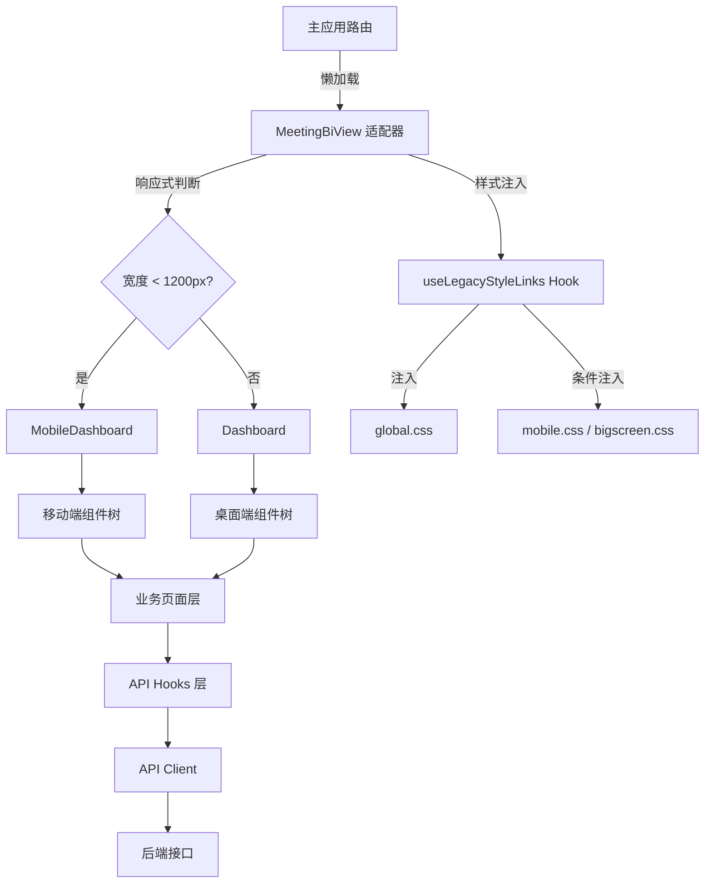
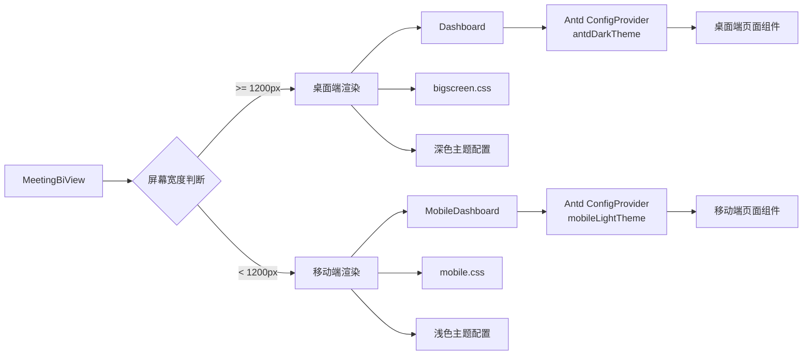
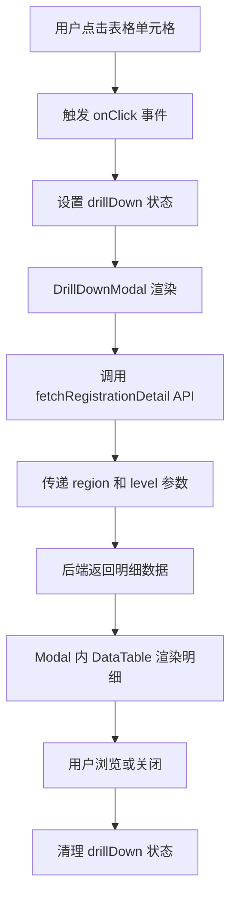

Legacy 会议 BI 是一个独立的会议业务智能分析系统，通过**适配器模式**集成到主应用架构中。该系统采用完整的**微前端隔离策略**，拥有独立的技术栈、样式系统、API 层和组件库，通过封装层实现与主应用的松耦合集成。系统核心能力包括会议数据可视化、客户画像分析、运营指标监控、目标达成追踪和 AI 智能对话，支持桌面端和移动端双端自适应布局。

## 集成架构与适配器模式

系统采用**双层封装架构**，外层 `MeetingBiView` 作为适配器组件负责环境初始化和布局切换，内层 `Dashboard` 或 `MobileDashboard` 作为业务入口承载具体功能。适配器组件通过 `useLegacyStyleLinks` Hook 动态注入 Legacy 系统的样式文件，确保样式作用域隔离；同时通过 `useIsMobileMeetingBi` Hook 实现响应式布局切换，断点设置为 1200px。这种设计模式使得 Legacy 系统可以保持原有架构不变，仅通过适配层实现与主应用的路由集成和状态隔离。



适配器组件通过 React Router 的 `useNavigate` Hook 提供返回工作台的导航功能，使用 `PAGE_PATHS.dashboard` 常量确保路径一致性。样式文件通过 Vite 的 `?url` 后缀导入为 URL 字符串，避免样式内容被打包进主 bundle。`useLegacyStyleLinks` Hook 使用 `data-legacy-meeting-bi="true"` 标记注入的 `<link>` 元素，在组件卸载时自动清理，防止样式泄露到其他页面。

Sources: [MeetingBiView.tsx](src/components/MeetingBiView.tsx#L1-L57), [useLegacyStyleLinks.ts](src/legacy-meeting-bi/hooks/useLegacyStyleLinks.ts#L1-L30), [pageRegistry.tsx](src/pageRegistry.tsx#L50-L52)

## 模块化目录结构

Legacy 系统采用**领域驱动设计**的目录组织方式，将业务逻辑按功能域划分为六大模块：`api`（接口层）、`components`（组件层）、`hooks`（数据层）、`pages`（页面层）、`styles`（样式层）和 `utils`（工具层）。组件层进一步细分为 `charts`（图表组件）、`common`（通用组件）、`mobile`（移动端组件）和 `sections`（业务区块），形成清晰的组件分类体系。页面层采用**平台分离策略**，桌面端和移动端各自维护独立的页面组件，共享业务逻辑但独立处理布局和交互。

```
src/legacy-meeting-bi/
├── api/                    # 接口层：10 个业务域 API 模块
│   ├── client.ts          # Axios 客户端配置
│   ├── kpi.ts             # 核心指标 API
│   ├── registration.ts    # 报名数据 API
│   ├── customer.ts        # 客户画像 API
│   ├── source.ts          # 来源分布 API
│   ├── operations.ts      # 运营指标 API
│   ├── achievement.ts     # 目标达成 API
│   ├── progress.ts        # 任务进展 API
│   ├── proposal.ts        # 方案数据 API
│   └── ai.ts              # AI 对话 API
├── components/            # 组件层：三层分类结构
│   ├── charts/            # 8 个 ECharts 封装组件
│   ├── common/            # 8 个通用业务组件
│   ├── mobile/            # 移动端专用组件（含 sections）
│   └── sections/          # 桌面端业务区块组件
├── hooks/                 # 数据层：React Query 集成
│   ├── useApi.ts          # 12 个数据查询 Hooks
│   └── useLegacyStyleLinks.ts
├── pages/                 # 页面层：双端分离架构
│   ├── Dashboard.tsx      # 桌面端主页面
│   ├── mobile/            # 移动端页面目录
│   └── Page*.tsx          # 业务子页面
├── styles/                # 样式层：独立样式系统
│   ├── theme.ts           # 设计令牌配置
│   ├── global.css         # 全局样式
│   ├── bigscreen.css      # 桌面端样式
│   └── mobile.css         # 移动端样式
└── utils/                 # 工具层
    ├── base-path.ts       # API 路径配置
    └── motion.ts          # 动画配置
```

这种目录结构体现了**关注点分离**原则，API 层负责数据获取和类型定义，Hooks 层负责状态管理和缓存，Components 层负责 UI 渲染和交互，Pages 层负责页面组合和业务流程。移动端组件独立目录避免与桌面端组件耦合，便于针对性优化。

Sources: [目录结构](src/legacy-meeting-bi)

## API 层设计与数据获取策略

Legacy 系统构建了**独立的 Axios 客户端实例**，与主应用的 API 客户端完全隔离，通过环境变量 `VITE_MEETING_BI_API_URL`、`VITE_BUSINESS_API_URL`、`VITE_API_BASE_URL` 的优先级链配置基础路径。开发模式下使用空字符串触发 Vite 代理，生产模式下使用配置的绝对地址或相对路径 `/api`。客户端设置 30 秒超时，统一返回 `ApiResponse<T>` 泛型接口包装的响应数据，包含 `code`、`message`、`data` 三个标准字段。

数据获取层采用 **React Query** 实现声明式数据管理，`useApi.ts` 导出 12 个自定义 Hook，每个 Hook 对应一个业务域的数据查询。React Query 自动处理缓存、重试、后台更新等逻辑，通过 `queryKey` 数组实现精确的缓存键控制。例如 `useOperationsKpi` Hook 接受 `dateFrom` 和 `dateTo` 参数，将其纳入 `queryKey` 确保日期范围变化时触发新请求。这种设计使得组件无需关心数据获取细节，只需调用 Hook 即可获得响应式数据状态。

| API 模块 | 功能域 | 主要接口 | 返回数据类型 |
|---------|--------|---------|------------|
| kpi.ts | 核心指标 | `/v1/kpi/overview` | KpiOverview |
| registration.ts | 报名数据 | `/v1/registration/chart`<br/>`/v1/registration/matrix`<br/>`/v1/registration/detail` | RegionLevelCount[]<br/>MatrixRow[]<br/>RegistrationDetail[] |
| customer.ts | 客户画像 | `/v1/customer/profile` | CustomerProfile |
| source.ts | 来源分布 | `/v1/source/distribution`<br/>`/v1/source/target-arrival` | SourceDistribution<br/>TargetArrival |
| operations.ts | 运营指标 | `/v1/operations/kpi`<br/>`/v1/operations/trend` | OperationsKpi<br/>TrendData |
| achievement.ts | 目标达成 | `/v1/achievement/chart`<br/>`/v1/achievement/table` | AchievementChart<br/>AchievementTable |
| progress.ts | 任务进展 | `/v1/progress` | Progress |
| proposal.ts | 方案数据 | `/v1/proposal/overview`<br/>`/v1/proposal/cross-table` | ProposalOverview<br/>ProposalCrossTable |
| ai.ts | AI 对话 | `/v1/ai/chat` | ChatResponse |

API 层采用**类型安全设计**，每个接口都定义了完整的 TypeScript 类型。例如 `registration.ts` 定义了 `RegionLevelCount`、`MatrixRow`、`RegistrationDetail` 三个接口，分别对应图表数据、矩阵数据和明细数据，确保前端与后端数据契约的一致性。

Sources: [client.ts](src/legacy-meeting-bi/api/client.ts#L1-L16), [useApi.ts](src/legacy-meeting-bi/hooks/useApi.ts#L1-L52), [kpi.ts](src/legacy-meeting-bi/api/kpi.ts#L1-L21), [registration.ts](src/legacy-meeting-bi/api/registration.ts#L1-L40), [base-path.ts](src/legacy-meeting-bi/utils/base-path.ts#L1-L16)

## 响应式双端架构

系统实现**完全分离的双端架构**，桌面端和移动端各自拥有独立的页面组件、样式文件和组件库，通过统一的适配器层根据屏幕宽度动态切换。桌面端采用**深色科技风格**，使用 `bigscreen.css` 样式文件，背景色为深蓝 `#050f24`，强调色为青色 `#79e7ff`，营造数据可视化的沉浸感。移动端采用**浅色简约风格**，使用 `mobile.css` 样式文件，背景色为浅灰 `#F3F6FC`，主色调为蓝色 `#2E64F6`，符合移动端使用习惯。



桌面端 `Dashboard` 页面采用**三栏布局**，顶部为筛选栏（日期选择器、区域选择器），中部为核心 KPI 卡片行，下部为左右分栏的业务区域（左侧为客户总览、运营数据、目标达成三个 Tab，右侧为任务进展和 AI 对话面板）。页面使用 Ant Design 的 `ConfigProvider` 包裹，注入 `antdDarkTheme` 主题配置，覆盖表格、选择器、骨架屏等组件的默认样式，确保与整体深色风格协调。

移动端 `MobileDashboard` 页面采用**单栏流式布局**，顶部为固定头部和 KPI 卡片列表，中部为 Tab 切换区域（客户总览、运营数据、目标达成），底部为固定 Tab Bar 和悬浮 AI 按钮。页面使用独立的 `mobileLightTheme` 配置，采用更大的圆角（12px）、更浅的背景色、更紧凑的间距，适配移动设备的触摸交互。移动端组件如 `MobileKpiCard`、`MobileDataTable`、`MobileDrillDrawer` 都针对小屏幕进行了专门优化。

Sources: [Dashboard.tsx](src/legacy-meeting-bi/pages/Dashboard.tsx#L1-L200), [MobileDashboard.tsx](src/legacy-meeting-bi/pages/mobile/MobileDashboard.tsx#L1-L80), [theme.ts](src/legacy-meeting-bi/styles/theme.ts#L1-L75)

## 组件系统与设计令牌

Legacy 系统构建了**三层组件体系**，底层为图表组件（`charts`），中层为通用组件（`common`），上层为业务区块组件（`sections`）。所有组件共享统一的设计令牌系统（`theme.ts`），包含颜色、字体、阴影、过渡动画等 34 个设计变量。主题配置导出 `theme` 常量对象供组件直接引用，同时导出 `antdDarkTheme` 和 `mobileLightTheme` 两个 Ant Design 主题配置对象，实现设计系统的统一管理。

**图表组件层**封装了 8 个 ECharts 图表类型，包括 `DistributionBarChart`（分布柱状图）、`GroupedBarChart`（分组柱状图）、`HorizontalBarChart`（横向柱状图）、`MultiLineChart`（多线图）、`PieChart`（饼图）、`StackedBarChart`（堆叠柱状图）、`RegistrationComparisonChart`（报名对比图）。所有图表共享 `echarts-config.ts` 导出的基础配置，包括透明背景、自定义提示框样式、统一字体和颜色配置，确保视觉一致性。

**通用组件层**提供 8 个可复用的业务组件，核心包括 `KpiCard`（指标卡片）、`DataTable`（数据表格）、`DrillDownModal`（钻取弹窗）、`RankingPanel`（排名面板）、`AnimatedNumber`（动画数字）、`LoadingSkeleton`（加载骨架屏）、`DashboardCard`（仪表盘卡片）、`SectionTitle`（区块标题）。`KpiCard` 组件采用 **HUD 风格设计**，四角装饰、顶部渐变色条、背景大数字装饰，通过 `AnimatedNumber` 子组件实现数字滚动动画效果。

```typescript
// 主题令牌示例
export const theme = {
  colors: {
    bgPage: '#050f24',           // 页面背景
    bgCard: 'rgba(14, 31, 73, 0.74)', // 卡片背景（半透明）
    accentCyan: '#79e7ff',       // 强调色：青色
    accentBlue: '#4f8cff',       // 强调色：蓝色
    textPrimary: '#f3f8ff',      // 主文本色
    border: 'rgba(121, 231, 255, 0.24)', // 边框色
  },
  fontFamily: "'Saira Semi Condensed', 'Noto Sans SC', ...",
  fontDisplay: "'MiSans-Heavy', 'Bebas Neue', ...",
  cardRadius: 12,
  chartPalette: ['#79e7ff', '#4f8cff', '#6fe7c8', '#ffd166', '#9cb8ff', '#ffb486', '#8ad0ff'],
  shadows: {
    card: '0 14px 36px rgba(1, 8, 26, 0.55)',
    glow: (color: string) => `0 0 12px ${color}20, 0 0 24px ${color}0a`,
  },
}
```

**业务区块组件层**将页面拆分为独立的功能区块，包括 `CoreKpiRow`（核心指标行）、`CustomerProfileSection`（客户画像）、`CustomerSourceSection`（客户来源）、`RegistrationSection`（报名分析）、`OperationsSection`（运营数据）、`AchievementSection`（目标达成）、`ProgressSection`（任务进展）、`ProposalSection`（方案分析）、`AiChatPanel`（AI 对话面板）、`HeaderBar`（头部栏）。每个区块组件封装独立的业务逻辑和数据获取，通过 React Query Hooks 获取数据，实现高内聚低耦合。

Sources: [theme.ts](src/legacy-meeting-bi/styles/theme.ts#L1-L35), [echarts-config.ts](src/legacy-meeting-bi/components/charts/echarts-config.ts#L1-L32), [KpiCard.tsx](src/legacy-meeting-bi/components/common/KpiCard.tsx#L1-L115)

## 数据可视化与交互设计

系统采用 **ECharts** 作为图表引擎，通过 `echarts-config.ts` 统一配置图表基础样式，包括透明背景、深色提示框、自定义字体和调色板。调色板定义 7 种颜色：青色 `#79e7ff`、蓝色 `#4f8cff`、绿色 `#6fe7c8`、琥珀色 `#ffd166`、紫色 `#9cb8ff`、橙色 `#ffb486`、浅蓝 `#8ad0ff`，所有图表自动循环使用这些颜色，确保视觉一致性。图表组件接收数据和配置参数，内部封装 ECharts 初始化、更新和销毁逻辑，对外提供声明式 API。

交互设计采用**渐进式披露**原则，通过钻取（Drill-down）机制实现从概览到明细的数据探索。`DataTable` 组件支持行点击事件，触发 `DrillDownModal` 弹窗展示该行的明细数据。例如报名矩阵表格点击某个区域的某等级单元格，弹窗通过 `fetchRegistrationDetail` API 获取该区域该等级的客户明细列表，包含客户姓名、签到状态、客户类别、真实身份、参会角色、门店名称、所属区域等字段。



移动端交互采用**抽屉式钻取**，通过 `MobileDrillDrawer` 组件从屏幕右侧滑入明细面板，避免弹窗遮挡整个屏幕。移动端还实现了**手势优化**，Tab 切换通过底部 Tab Bar 触发，AI 对话通过悬浮按钮触发，表格支持横向滚动，确保小屏幕下的可用性。所有交互都配置了流畅的过渡动画，使用 Framer Motion 的 `AnimatePresence` 组件实现进场和离场动画，动画曲线使用自定义的 `legacyEase` 缓动函数。

Sources: [echarts-config.ts](src/legacy-meeting-bi/components/charts/echarts-config.ts#L1-L32), [DataTable.tsx](src/legacy-meeting-bi/components/common/DataTable.tsx), [DrillDownModal.tsx](src/legacy-meeting-bi/components/common/DrillDownModal.tsx), [motion.ts](src/legacy-meeting-bi/utils/motion.ts)

## 样式隔离与主题系统

Legacy 系统实现**完全独立的样式系统**，通过 `useLegacyStyleLinks` Hook 动态注入三个 CSS 文件：`global.css`（全局样式，包含字体、重置、通用类）、`bigscreen.css`（桌面端样式，包含布局、组件、动画）、`mobile.css`（移动端样式，包含移动端布局和组件）。样式文件通过 Vite 的 `?url` 后缀导入为 URL 字符串，避免样式内容被打包进 JavaScript bundle。Hook 使用 `data-legacy-meeting-bi="true"` 自定义属性标记注入的 `<link>` 元素，组件卸载时自动移除这些元素，防止样式污染其他页面。

主题系统采用**设计令牌**模式，所有颜色、字体、间距、阴影等设计变量集中在 `theme.ts` 文件中定义，组件通过导入 `theme` 常量引用这些令牌。例如 `KpiCard` 组件使用 `theme.colors.bgCard` 作为卡片背景，使用 `theme.colors.accentCyan` 作为默认强调色，使用 `theme.fontDisplay` 作为数字字体。这种设计使得主题修改变得简单，只需修改 `theme.ts` 文件即可全局生效。

| 主题变量 | 桌面端值 | 移动端值 | 用途 |
|---------|---------|---------|------|
| bgPage | `#050f24` | `#F3F6FC` | 页面背景色 |
| bgCard | `rgba(14, 31, 73, 0.74)` | `#FFFFFF` | 卡片背景色 |
| textPrimary | `#f3f8ff` | `#162038` | 主文本色 |
| textSecondary | `#9fb7db` | `#6C7895` | 次要文本色 |
| accentCyan | `#79e7ff` | `#2E64F6` | 强调色（桌面青/移动蓝） |
| borderRadius | `12px` | `12px` | 圆角大小 |
| fontFamily | Saira, Noto Sans SC | Noto Sans SC, Saira | 字体栈（顺序不同） |

Ant Design 组件主题通过 `ConfigProvider` 的 `theme` 属性注入，桌面端使用 `antdDarkTheme` 配置，移动端使用 `mobileLightTheme` 配置。配置对象覆盖 Table、Card、Skeleton、Modal、Select、DatePicker、Drawer 等组件的默认样式，包括表头背景色、行悬浮色、边框色、圆角等。这种双层主题系统（设计令牌 + 组件主题）确保了 Legacy 系统的视觉独立性。

Sources: [useLegacyStyleLinks.ts](src/legacy-meeting-bi/hooks/useLegacyStyleLinks.ts#L1-L30), [theme.ts](src/legacy-meeting-bi/styles/theme.ts#L1-L75), [MeetingBiView.tsx](src/components/MeetingBiView.tsx#L35-L40)

## AI 对话集成

系统集成**AI 智能对话功能**，通过 `AiChatPanel` 组件提供基于会议数据的智能问答服务。对话面板采用**侧边栏设计**，桌面端固定在页面右侧，移动端通过悬浮按钮触发全屏对话界面。组件调用 `/v1/ai/chat` 接口，传递用户问题和上下文信息，后端返回结构化的对话响应。对话界面支持多轮对话历史记录，使用流式响应实现打字机效果，提升交互体验。

`AiChatPanel` 组件实现**上下文感知**，自动注入当前筛选条件（日期范围、区域选择）作为对话上下文，使得 AI 能够基于当前数据视图回答问题。例如用户在筛选了某个日期范围后提问"今天的签到情况如何"，AI 能够理解"今天"指代当前筛选的日期，返回准确的统计数据。对话历史使用本地状态管理，页面刷新后清空，确保数据隐私。

Sources: [AiChatPanel.tsx](src/legacy-meeting-bi/components/sections/AiChatPanel.tsx), [ai.ts](src/legacy-meeting-bi/api/ai.ts)

## 扩展与维护建议

Legacy 系统采用**微前端隔离架构**，未来可以平滑升级或替换。如需升级图表库，只需修改 `charts` 目录下的组件实现，不影响业务逻辑层。如需迁移到其他状态管理方案，只需重构 `hooks/useApi.ts` 文件，保持 Hook 接口不变即可。如需支持新的业务域，按照现有模式在 `api` 目录添加新的 API 模块，在 `hooks/useApi.ts` 导出新的 Hook，在 `components/sections` 添加新的业务区块组件。

**性能优化建议**：考虑将大型图表组件（如 `MultiLineChart`、`StackedBarChart`）进一步拆分为更细粒度的子组件，减少不必要的重渲染。对于钻取弹窗中的明细数据，可以添加虚拟滚动支持，处理大数据集（>1000 行）的渲染性能问题。移动端图片资源（`AI.png`、`logo.png`、`background.png`）可以添加响应式图片和懒加载，减少首屏加载时间。

**类型安全增强**：建议为所有 API 响应添加运行时类型校验（如 Zod 或 io-ts），防止后端数据结构变更导致前端运行时错误。可以为 React Query 的 `queryKey` 定义类型安全的工厂函数，避免硬编码字符串数组。可以考虑将 `theme.ts` 的类型定义提取为独立的类型文件，供其他模块引用。