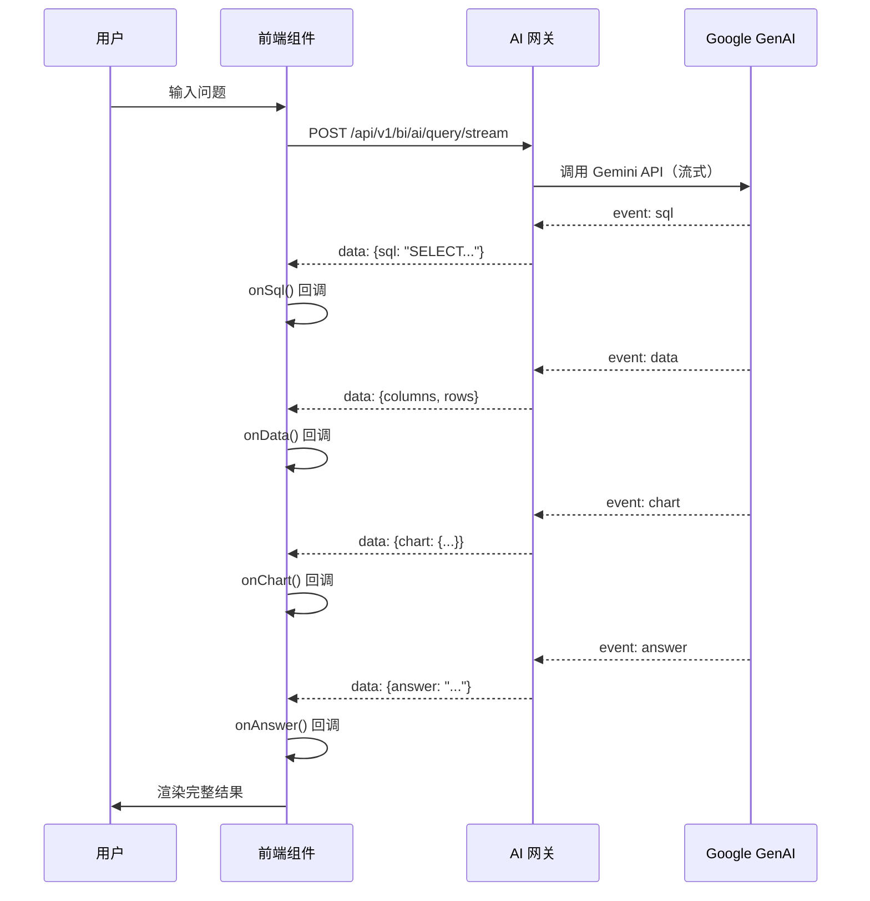

本文档详细阐述丽滋智枢平台中 Google GenAI 的集成架构、配置方式以及在前端应用中的使用模式。项目采用**前后端分离架构**，前端通过 AI 网关接口间接调用 Google GenAI 能力，而非直接在前端代码中使用 SDK，这种设计兼顾了 API 密钥安全性和请求管理的灵活性。

## 架构概览

Google GenAI 在本项目中的集成遵循**服务端优先**原则，前端应用通过统一的 AI 网关接口与后端服务通信，后端负责管理与 Google GenAI API 的交互。这种架构避免了在前端暴露敏感的 API 密钥，同时便于实现请求频率控制、缓存优化和多模型切换等高级功能。

```mermaid
graph TB
    subgraph "前端应用层"
        A[React 组件] --> B[Axios 客户端]
        C[Legacy Meeting BI] --> D[Fetch API]
    end
    
    subgraph "网络层"
        B --> E{Vite Proxy<br/>开发环境}
        E --> F[/api/v1/* 代理]
        F --> G[AI 网关服务]
        D --> G
    end
    
    subgraph "后端服务层"
        G --> H[请求路由与鉴权]
        H --> I[Google GenAI SDK]
        I --> J[ Gemini API]
    end
    
    subgraph "配置层"
        K[.env.local<br/>GEMINI_API_KEY] --> L[Vite define]
        L --> M[process.env.GEMINI_API_KEY]
        M -.-> I
    end
    
    style A fill:#e1f5ff
    style C fill:#e1f5ff
    style J fill:#4285f4,color:#fff
    style I fill:#34a853,color:#fff
```

**关键设计决策**：环境变量 `GEMINI_API_KEY` 在 Vite 构建时通过 `define` 选项注入，主要供后端服务使用（在 AI Studio 托管环境中），前端代码中不直接引用此密钥，所有 AI 能力通过内部 API 网关统一对外提供。

Sources: [vite.config.ts](vite.config.ts#L15-L17), [.env.example](.env.example#L1-L7)

## 环境配置与密钥管理

### 必需的环境变量

项目在 `.env.example` 中定义了与 Google GenAI 相关的核心环境变量，开发时需复制为 `.env.local` 并填入真实值：

```bash
# Gemini API 密钥（AI Studio 环境自动注入）
GEMINI_API_KEY="MY_GEMINI_API_KEY"

# 应用托管 URL（AI Studio 自动注入）
APP_URL="MY_APP_URL"

# AI 网关基础 URL
VITE_API_BASE_URL="http://172.23.15.59:9080/ai-platform"
```

**密钥注入机制**：Vite 配置通过 `define` 选项将环境变量编译为全局常量，使得后端代码（如 AI Studio 的 Cloud Run 服务）能够通过 `process.env.GEMINI_API_KEY` 访问密钥，而前端代码则通过 `/api/*` 代理路径调用后端封装的 AI 接口。

Sources: [.env.example](.env.example#L1-L18), [vite.config.ts](vite.config.ts#L14-L17)

### 多环境配置策略

项目支持**本地开发**、**测试环境**和**生产环境**三种配置模式，通过 Vite 的 mode 参数切换：

| 环境类型 | Base URL | API 代理 | 密钥来源 |
|---------|----------|---------|---------|
| **本地开发** | `/` | Vite proxy → `http://172.23.15.59:9080` | `.env.local` |
| **测试环境** | `/ai-platform/` | 相对路径 → 测试服务器 | 环境变量注入 |
| **生产环境** | `/ai-platform/` | 相对路径 → AI Studio Cloud Run | AI Studio Secrets |

**开发环境代理配置**：Vite 开发服务器配置了两个代理规则，分别处理业务编排层接口（`/api/v1/*`）和 AI 网关其余接口（`/api/*`），所有请求转发至 `VITE_API_BASE_URL` 指定的后端服务。

Sources: [vite.config.ts](vite.config.ts#L26-L36)

## 前端集成模式

### AI 网关接口调用

前端通过统一的 Axios 客户端与 AI 网关通信，接口层设计遵循 RESTful 规范，支持普通请求和流式响应两种模式。**核心接口**包括：

| 接口路径 | 请求方式 | 功能描述 | 响应类型 |
|---------|---------|---------|---------|
| `/api/v1/bi/ai/query` | POST | 同步 AI 查询（BI 分析） | JSON |
| `/api/v1/bi/ai/query/stream` | POST | 流式 AI 查询（实时响应） | SSE |

**同步查询示例**：会议 BI 系统使用 `postAiQuery` 函数发起同步 AI 分析请求，后端调用 Google GenAI 处理自然语言查询并返回结构化数据（SQL、图表配置、答案文本）。

```typescript
// 同步查询接口定义
export const postAiQuery = (question: string) =>
  client.post<ApiResponse<AiQueryResponse>>('/api/v1/bi/ai/query', { question })
    .then(r => r.data.data)
```

**响应数据结构**包含 AI 分析的完整结果：

```typescript
interface AiQueryResponse {
  sql: string              // 生成的 SQL 查询语句
  columns: string[]        // 数据列名
  rows: QueryRow[]         // 查询结果数据
  answer: string           // 自然语言答案
  chart: ChartConfig | null // 图表可视化配置
}
```

Sources: [src/legacy-meeting-bi/api/ai.ts](src/legacy-meeting-bi/api/ai.ts#L26-L27), [src/legacy-meeting-bi/api/ai.ts](src/legacy-meeting-bi/api/ai.ts#L17-L25)

### 流式响应处理

**SSE（Server-Sent Events）流式传输**用于需要实时反馈的 AI 交互场景，如聊天对话和长文本生成。前端通过 Fetch API 建立 SSE 连接，根据事件类型逐步处理不同阶段的数据：



**流式事件类型**定义了数据分阶段传输的协议：

| 事件类型 | 数据内容 | 处理回调 | UI 更新 |
|---------|---------|---------|---------|
| `sql` | 生成的 SQL 语句 | `onSql()` | 显示 SQL 预览 |
| `data` | 查询结果数据 | `onData()` | 渲染数据表格 |
| `chart` | 图表配置对象 | `onChart()` | 绘制 ECharts 图表 |
| `answer` | 自然语言答案 | `onAnswer()` | 展示 AI 回复 |
| `error` | 错误信息 | `onError()` | 显示错误提示 |

**实现要点**：流式处理使用 ReadableStream API 逐步解析 SSE 响应，通过缓冲区处理不完整的数据块，确保事件边界的正确识别。

Sources: [src/legacy-meeting-bi/api/ai.ts](src/legacy-meeting-bi/api/ai.ts#L38-L109), [src/legacy-meeting-bi/api/ai.ts](src/legacy-meeting-bi/api/ai.ts#L29-L36)

## 组件集成实践

### AI 聊天面板组件

会议 BI 系统（Legacy Meeting BI）中的 `AiChatPanel` 组件是**流式 AI 交互的典型实现**，集成了自然语言输入、SSE 流式响应、图表渲染和数据表格展示等完整功能链路。

**核心状态管理**包括聊天消息列表、加载状态和错误处理：

```typescript
interface ChatMessage {
  id: number
  role: 'user' | 'ai'
  content: string
  data?: AiQueryResponse  // AI 分析结果
  loading?: boolean       // 流式加载中
  error?: boolean         // 请求失败
  stage?: string          // 当前处理阶段
}
```

**交互流程**：用户输入自然语言问题 → 组件调用 `streamAiQuery` → SSE 连接建立 → 逐步接收 sql/data/chart/answer 事件 → 组件更新消息状态 → 渲染图表和表格。组件支持**示例问题快速选择**，提供 6 个预设的常见 BI 查询问题，降低用户使用门槛。

Sources: [src/legacy-meeting-bi/components/sections/AiChatPanel.tsx](src/legacy-meeting-bi/components/sections/AiChatPanel.tsx#L69-L86), [src/legacy-meeting-bi/components/sections/AiChatPanel.tsx](src/legacy-meeting-bi/components/sections/AiChatPanel.tsx#L124-L131)

### 顾问 AI 工作台集成

顾问 AI 工作台（ConsultantAIWorkbench）展示了**结构化 AI 响应的前端渲染**模式，使用 `@json-render/react` 库将 AI 返回的 JSON 规范（Spec）动态渲染为交互式 UI 组件。

**设计思路**：AI 助手的回复可能包含纯文本和结构化卡片两种形式，通过 `AiSpecExtractor` 组件解析最新 AI 消息中的 Spec 对象，提取成功后自动切换主面板到 `AI_PANEL` 模式展示交互卡片，侧边栏聊天气泡仅显示文本内容。

```typescript
// Spec 提取器组件（纯逻辑组件）
function AiSpecExtractor({ content, onSpec }: { 
  content: string
  onSpec: (spec: Spec | null) => void 
}) {
  const parts = useMemo(() => buildJsonRenderParts(content), [content])
  const { spec } = useJsonRenderMessage(parts)
  
  useMemo(() => {
    onSpec(spec ?? null)
  }, [spec])
  
  return null
}
```

**Spec 规范定义**：通过 `buildJsonRenderParts` 函数将 AI 回复文本解析为 JSON-Render 兼容的部件列表，支持按钮、表单、数据卡片等多种交互元素的声明式定义。

Sources: [src/components/ConsultantAIWorkbench.tsx](src/components/ConsultantAIWorkbench.tsx#L19-L41), [src/components/ConsultantAIWorkbench.tsx](src/components/ConsultantAIWorkbench.tsx#L64-L79)

## Mock 数据与开发模式

项目在**开发阶段**为部分 AI 功能提供了 Mock 实现，避免对后端服务的强依赖。例如，顾问 AI 工作台的 `getAiResponse` 函数通过关键词匹配返回预设的 AI 回复和视图模式：

```typescript
export function getAiResponse(input: string): {
  response: string
  viewMode?: WorkbenchViewMode
  showNewPlan?: boolean
} {
  if (input.includes('整理') || input.includes('信息')) {
    return {
      response: '✨ 已为您整理好客户【张三】的全量信息...',
      viewMode: 'FULL_INFO',
      showNewPlan: false,
    }
  }
  // ... 其他关键词匹配逻辑
}
```

**Mock 数据切换策略**：生产环境通过环境变量控制是否启用 Mock 模式，或者通过后端接口返回的标识字段动态切换真实 AI 响应和 Mock 数据，确保开发体验和生产稳定性的平衡。

Sources: [src/components/consultant-ai-workbench/chat.ts](src/components/consultant-ai-workbench/chat.ts#L11-L57)

## 安全与性能优化

### API 密钥安全

**环境隔离原则**：`GEMINI_API_KEY` 仅在后端服务（AI Studio Cloud Run）中使用，前端代码通过代理访问后端封装的 AI 接口，密钥不会暴露到客户端代码或浏览器环境。Vite 的 `define` 选项虽然将环境变量编译为全局常量，但这些常量主要供服务端代码（如 Express 中间件）使用，前端组件应避免直接引用。

**请求鉴权**：所有 AI 网关接口通过 Axios 拦截器自动注入 `CToken`（JWT Token）和设备标识，后端验证用户权限后再调用 Google GenAI API，实现细粒度的访问控制。

Sources: [vite.config.ts](vite.config.ts#L14-L17), [src/services/api.ts](src/services/api.ts#L21-L29)

### 性能优化策略

**流式响应优势**：SSE 模式允许前端在 AI 生成过程中逐步渲染结果，用户无需等待完整响应即可看到部分内容，显著改善长文本生成和复杂数据分析场景的感知性能。

**缓存与复用**：前端通过 React Query（TanStack Query）管理 API 请求缓存，相同的 AI 查询在有效期内直接返回缓存结果，减少重复请求。会议 BI 系统还实现了**聊天历史本地存储**，通过 `localStorage` 持久化用户的对话记录。

**代码分割**：AI 相关的组件（如 AIAssistant、ConsultantAIWorkbench）通过 React.lazy 实现懒加载，避免在首屏加载时引入不必要的依赖，配合 Vite 的自动代码分割优化打包体积。

Sources: [src/legacy-meeting-bi/components/sections/AiChatPanel.tsx](src/legacy-meeting-bi/components/sections/AiChatPanel.tsx#L88-L95)

## 扩展与定制

### 添加新的 AI 功能模块

在现有架构下扩展新的 AI 功能，需遵循以下步骤：

1. **定义接口规范**：在 `src/services/api.ts` 或模块专属的 API 文件中添加新的接口调用函数，使用统一的 Axios 客户端或 Fetch API。
2. **实现后端路由**：在后端服务中添加对应的路由处理器，调用 Google GenAI SDK 并返回结构化数据。
3. **创建前端组件**：参考 `AiChatPanel` 或 `AssistantSidebar` 的实现模式，集成 SSE 流式处理或同步请求逻辑。
4. **配置代理规则**：如需新的代理路径，在 `vite.config.ts` 的 `server.proxy` 中添加配置。

### 多模型切换支持

当前架构已预留**多模型切换**的扩展点，后端 AI 网关可根据请求参数动态选择不同的 GenAI 模型（如 Gemini Pro、Gemini Flash），前端无需感知具体模型实现。未来可通过在请求体中添加 `model` 字段或通过配置中心管理模型路由策略。

---

**下一步阅读建议**：如需深入了解 API 客户端的鉴权机制和自动 Token 刷新逻辑，请参阅 [Axios 客户端封装与拦截器](11-axios-ke-hu-duan-feng-zhuang-yu-lan-jie-qi)。对于会议 BI 系统的完整功能解析，请查看 [会议 BI 分析系统](21-hui-yi-bi-fen-xi-xi-tong)。若想探索顾问 AI 工作台的 JSON-Render 动态渲染机制，请参阅 [顾问 AI 工作台](15-gu-wen-ai-gong-zuo-tai)。