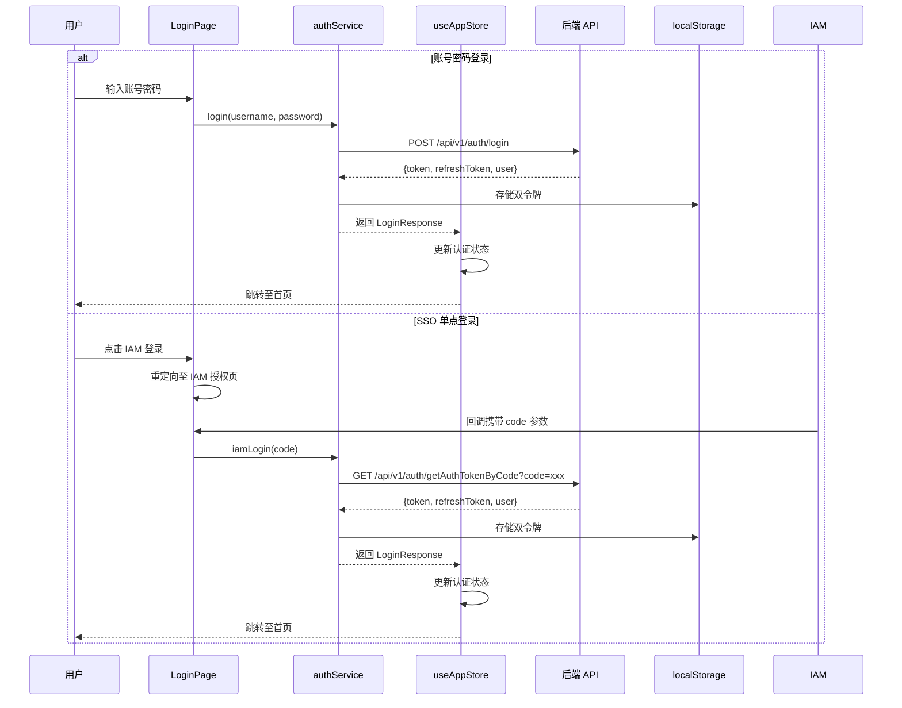
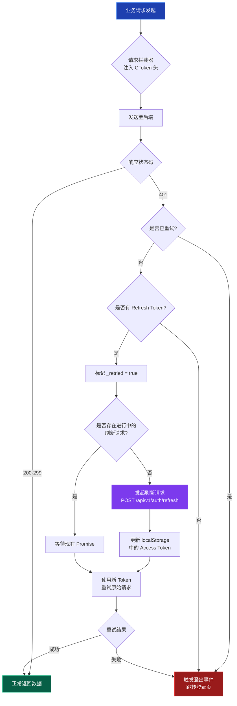

本系统采用基于 **JWT (JSON Web Token)** 的无状态认证架构，通过 **Access Token** 与 **Refresh Token** 双令牌机制实现安全的身份验证与会话持久化。整个认证体系分为三个核心层级：服务层 (`auth.ts`) 负责令牌的存储与解析、接口层 (`api.ts`) 实现自动注入与刷新拦截、状态层 (`useAppStore.ts`) 维护全局认证状态与会话恢复逻辑。这种分层设计确保了认证逻辑的可测试性、可维护性，同时通过 Axios 拦截器实现了对业务代码零侵入的自动 Token 刷新能力。

Sources: [auth.ts](src/services/auth.ts#L1-L109), [api.ts](src/services/api.ts#L1-L122), [useAppStore.ts](src/stores/useAppStore.ts#L1-L76)

## 架构概览与核心设计原则

系统的认证架构遵循 **前端无状态、后端有状态** 的设计原则：前端仅负责 Token 的安全存储与有效性预判，真实的权限验证始终由后端接口完成。这种设计避免了前端权限判断被绕过的安全风险，同时通过 `localStorage` 实现了跨页面刷新的会话持久化。整个认证生命周期包括登录获取令牌、接口自动注入、401 响应自动刷新、前端过期预判、主动登出清除等环节，形成完整的闭环管理。

```mermaid
%%{init: {'theme': 'base', 'themeVariables': {'primaryColor': '#3b82f6', 'primaryTextColor': '#fff', 'primaryBorderColor': '#2563eb', 'lineColor': '#64748b', 'secondaryColor': '#1e293b', 'tertiaryColor': '#0f172a'}}}%%
graph TB
    subgraph "认证架构层次"
        A[应用层<br/>App.tsx + LoginPage.tsx] --> B[状态管理层<br/>useAppStore]
        B --> C[服务层<br/>authService]
        C --> D[接口层<br/>Axios Interceptors]
        D --> E[后端 API<br/>认证服务]
        
        subgraph "本地存储"
            F[(localStorage<br/>Access Token)]
            G[(localStorage<br/>Refresh Token)]
        end
        
        C --> F
        C --> G
    end
    
    subgraph "认证流程"
        H[用户登录] --> I{登录方式}
        I -->|账号密码| J[/auth/login]
        I -->|SSO 授权码| K[/auth/getAuthTokenByCode]
        J --> L[获取双令牌]
        K --> L
        L --> M[存储至 localStorage]
        M --> N[更新 Zustand 状态]
        N --> O[跳转至首页]
    end
    
    subgraph "会话恢复"
        P[页面刷新/启动] --> Q{localStorage 中<br/>是否有 Token?}
        Q -->|是| R[isTokenValid 校验]
        Q -->|否| S[跳转登录页]
        R -->|未过期| T[调用 /auth/info<br/>恢复用户信息]
        R -->|已过期| U[尝试 Refresh<br/>Token 刷新]
        T --> V[更新认证状态]
        U -->|刷新成功| T
        U -->|刷新失败| S
    end
    
    style A fill:#1e40af,stroke:#3b82f6,color:#fff
    style B fill:#1e3a8a,stroke:#3b82f6,color:#fff
    style C fill:#1e3a8a,stroke:#3b82f6,color:#fff
    style D fill:#1e3a8a,stroke:#3b82f6,color:#fff
    style E fill:#7c3aed,stroke:#8b5cf6,color:#fff
    style F fill:#065f46,stroke:#10b981,color:#fff
    style G fill:#065f46,stroke:#10b981,color:#fff
```

Sources: [App.tsx](src/App.tsx#L64-L114), [LoginPage.tsx](src/LoginPage.tsx#L25-L69)

## 核心组件与职责分层

认证系统的三层架构通过明确的职责边界实现了高内聚低耦合的设计：**服务层** 封装 Token 的 CRUD 操作与 JWT 解析逻辑，提供 `isTokenValid()` 等工具方法；**接口层** 通过 Axios 拦截器实现请求前的 Token 注入 (`CToken` 头) 与响应后的 401 自动处理；**状态层** 基于 Zustand 维护全局认证状态 (`isAuthenticated`、`user`、`token`) 并提供 `restoreSession()` 方法供应用启动时调用。这种分层使得每个模块都可以独立测试和替换，例如未来可以无缝切换到 IndexedDB 存储或 OAuth 2.0 标准。

| 层级 | 核心文件 | 主要职责 | 关键方法 | 存储方式 |
|------|---------|---------|---------|---------|
| **服务层** | `auth.ts` | Token 生命周期管理、JWT 解析、用户信息获取 | `login()`, `iamLogin()`, `getMe()`, `logout()`, `isTokenValid()` | localStorage 读写 |
| **接口层** | `api.ts` | 请求拦截注入 Token、响应拦截处理 401、自动刷新令牌 | `createClient()`, `attachToken()`, `refreshAccessToken()` | 从 localStorage 读取 |
| **状态层** | `useAppStore.ts` | 全局认证状态维护、会话恢复逻辑、登录登出动作 | `login()`, `logout()`, `restoreSession()` | Zustand Store |

Sources: [auth.ts](src/services/auth.ts#L34-L108), [api.ts](src/services/api.ts#L30-L61), [useAppStore.ts](src/stores/useAppStore.ts#L15-L75)

## JWT 令牌结构与本地存储策略

系统使用 **双令牌机制** 来平衡安全性与用户体验：Access Token 负责日常接口认证（有效期较短，如 15 分钟），Refresh Token 用于获取新的 Access Token（有效期较长，如 7 天）。两个令牌分别存储在 `localStorage` 的 `ai_platform_token` 和 `ai_platform_refresh_token` 键下，这种命名约定避免了与其他应用的冲突。Access Token 采用标准 JWT 格式，包含 `sub`（用户标识）、`exp`（过期时间戳）、`iat`（签发时间）等标准声明，前端通过 `jwt-decode` 库解析这些信息进行本地有效性预判，但**始终以后端接口的实时验证为准**。

```typescript
// JWT Payload 标准结构
interface JwtPayload {
  sub: string;    // 用户唯一标识（Subject）
  exp: number;    // 过期时间（Unix 时间戳，秒级）
  iat: number;    // 签发时间（Unix 时间戳，秒级）
}

// 前端有效性判断：仅作为快速拦截，真实权限由后端校验
isTokenValid() {
  const token = this.getToken();
  if (!token) return false;
  
  try {
    const decoded = jwtDecode<JwtPayload>(token);
    return decoded.exp * 1000 > Date.now(); // 转换为毫秒级比较
  } catch {
    return false; // 解析失败视为无效
  }
}
```

Sources: [auth.ts](src/services/auth.ts#L8-L12), [auth.ts](src/services/auth.ts#L94-L107)

## 登录流程与令牌获取

系统支持两种登录方式：**传统账号密码登录** 和 **IAM SSO 单点登录**。账号密码登录通过 `/api/v1/auth/login` 接口提交凭据，成功后返回包含 `token`、`refreshToken`、`expiresIn` 和 `user` 对象的完整响应；SSO 登录则通过 IAM 系统授权后携带 `code` 参数回调到前端，前端调用 `/api/v1/auth/getAuthTokenByCode` 将授权码兑换为系统令牌。两种方式获取令牌后都会立即持久化到 `localStorage`，确保页面刷新时会话不丢失，然后更新 Zustand 全局状态触发路由跳转。



Sources: [auth.ts](src/services/auth.ts#L35-L63), [LoginPage.tsx](src/LoginPage.tsx#L26-L69), [useAppStore.ts](src/stores/useAppStore.ts#L20-L36)

## 会话恢复机制详解

**会话恢复** 是确保用户体验连续性的关键机制：当用户刷新页面或重新打开应用时，`App.tsx` 会检测 `localStorage` 中是否存在 Token，若存在则调用 `restoreSession()` 方法尝试恢复登录状态。恢复流程首先通过 `isTokenValid()` 进行前端过期预判，若 Token 已过期则直接清除并跳转登录页；若未过期则调用 `/api/v1/auth/info` 接口获取最新的用户信息（包含 `displayName`、`role`、`abilities` 等权限数据），确保前端展示的身份信息与后端实时同步。这种 **前端预判 + 后端验证** 的双重保障既避免了无效请求，又保证了数据的权威性。

```typescript
// 会话恢复核心逻辑（App.tsx 中的 useEffect）
useEffect(() => {
  // 如果本地有 token 但内存态未恢复，主动拉取用户信息
  if (!token || isAuthenticated) {
    setIsAuthBootstrapping(false);
    return;
  }
  
  setIsAuthBootstrapping(true);
  restoreSession().finally(() => {
    setIsAuthBootstrapping(false); // 恢复完成后隐藏加载状态
  });
}, [isAuthenticated, restoreSession, token]);

// restoreSession 实现（useAppStore.ts）
restoreSession: async () => {
  if (!authService.isTokenValid()) {
    authService.logout(); // Token 过期，清除本地存储
    set({ token: null, user: null, isAuthenticated: false });
    return;
  }
  
  try {
    const user = await authService.getMe(); // 从后端获取真实用户信息
    set({
      token: authService.getToken(),
      user,
      isAuthenticated: true,
    });
  } catch {
    authService.logout(); // 接口失败，清除认证状态
    set({ token: null, user: null, isAuthenticated: false });
  }
}
```

Sources: [App.tsx](src/App.tsx#L71-L90), [useAppStore.ts](src/stores/useAppStore.ts#L47-L74)

## 自动 Token 刷新机制

系统通过 **Axios 响应拦截器** 实现了透明的 Token 自动刷新：当任何业务接口返回 401 状态码时，拦截器会拦截该请求并使用 Refresh Token 调用 `/api/v1/auth/refresh` 获取新的 Access Token，然后**自动重试原始请求**。整个刷新过程对业务代码完全透明，用户无感知。为防止多个并发请求同时触发刷新（导致 Refresh Token 被多次使用而失效），系统使用 `refreshPromise` 变量实现 **Promise 共享**：第一个 401 请求发起刷新后，其他并发请求会等待同一个 Promise 完成，确保只发送一次刷新请求。



```typescript
// 自动刷新核心实现（api.ts 中的响应拦截器）
client.interceptors.response.use(
  (response) => response,
  async (error: AxiosError) => {
    const originalRequest = error.config as InternalAxiosRequestConfig & { _retried?: boolean };
    
    // 非 401 错误直接抛出
    if (!originalRequest || error.response?.status !== 401) {
      return Promise.reject(error);
    }
    
    // 已重试过或本身就是刷新请求，触发登出
    if (originalRequest._retried || originalRequest.url?.includes('/auth/refresh')) {
      notifyAuthLogout();
      return Promise.reject(error);
    }
    
    originalRequest._retried = true; // 标记为已重试
    
    try {
      if (!refreshPromise) {
        // 共享刷新 Promise，避免并发多次刷新
        refreshPromise = refreshAccessToken(baseURL).finally(() => {
          refreshPromise = null; // 完成后清空
        });
      }
      
      const newToken = await refreshPromise;
      originalRequest.headers.CToken = `${newToken}`; // 更新请求头
      return client(originalRequest); // 重试原始请求
    } catch {
      notifyAuthLogout(); // 刷新失败，触发登出
      return Promise.reject(error);
    }
  }
);
```

Sources: [api.ts](src/services/api.ts#L75-L109), [api.ts](src/services/api.ts#L41-L61)

## 认证失效与全局登出处理

当 Token 彻底失效（Refresh Token 也过期或被撤销）时，系统通过 **全局事件机制** 实现优雅的登出处理：接口层的 `notifyAuthLogout()` 函数会清除 `localStorage` 中的所有认证信息，并触发自定义事件 `auth:logout`。`App.tsx` 在组件挂载时监听该事件，一旦收到立即调用 Zustand 的 `logout()` 方法更新全局状态，触发路由跳转至登录页。这种 **事件驱动** 的设计避免了服务层直接依赖 UI 层，保持了架构的清晰分层，同时确保无论从哪个接口（包括 Axios 拦截器、手动调用 `logout()`）触发登出，都能统一执行清理逻辑。

```typescript
// 接口层：触发全局登出事件
function notifyAuthLogout() {
  clearAuthStorage(); // 清除 localStorage
  window.dispatchEvent(new CustomEvent('auth:logout')); // 广播事件
}

// 应用层：监听登出事件
useEffect(() => {
  const handleAuthLogout = () => {
    logout(); // 调用 Zustand 的 logout 方法
  };
  
  window.addEventListener('auth:logout', handleAuthLogout);
  return () => window.removeEventListener('auth:logout', handleAuthLogout);
}, [logout]);
```

Sources: [api.ts](src/services/api.ts#L24-L28), [App.tsx](src/App.tsx#L92-L102)

## 请求头规范与接口认证约定

系统使用 **自定义请求头** `CToken` 承载 Access Token，而非标准的 `Authorization: Bearer` 头，这种设计是为了兼容后端网关的特定认证中间件。每个请求除了 `CToken` 外还会携带 `DeviceId`（固定为 `pc`）和 `X-User-Id`（固定为 `2`）两个辅助头，用于后端进行设备识别和用户上下文关联。所有请求头的注入都在 `attachToken()` 拦截器中统一完成，业务代码无需手动处理，确保了认证逻辑的一致性和可维护性。

| 请求头 | 取值来源 | 用途说明 | 是否必需 |
|--------|---------|---------|---------|
| `CToken` | `localStorage.ai_platform_token` | 用户身份认证令牌 | 是（已登录时） |
| `DeviceId` | 固定值 `pc` | 设备类型标识（用于多端管理） | 是 |
| `X-User-Id` | 固定值 `2` | 用户 ID 辅助标识（兼容旧接口） | 是 |
| `Content-Type` | 固定值 `application/json` | 请求体格式声明 | 是（POST/PUT 请求） |

Sources: [api.ts](src/services/api.ts#L30-L39), [api.ts](src/services/api.ts#L66-L72)

## 安全特性与最佳实践

系统在安全性方面采用了多层防护策略：**令牌分离**（Access Token 与 Refresh Token 独立存储）限制了单令牌泄露的影响范围；**前端过期预判** 避免了发送无效请求泄露用户行为；**自动刷新的并发控制** 防止了 Refresh Token 被多次使用导致的失效；**全局事件驱动的登出** 确保了认证失效时的统一清理。然而，前端存储在 `localStorage` 中的 Token 仍面临 XSS 攻击风险，生产环境应考虑配合 **HttpOnly Cookie** 或 **Content Security Policy (CSP)** 等浏览器安全策略。

| 安全措施 | 实现方式 | 防护目标 | 潜在风险 |
|---------|---------|---------|---------|
| **双令牌机制** | Access Token (短期) + Refresh Token (长期) | 限制单令牌泄露影响范围 | Refresh Token 泄露仍可获取新 Access Token |
| **前端过期预判** | `jwt-decode` 解析 `exp` 声明 | 避免无效请求泄露行为 | 客户端时间被篡改可能导致误判 |
| **自动刷新并发控制** | `refreshPromise` 变量共享 | 防止 Refresh Token 多次使用 | 高并发场景下 Promise 链可能堆积 |
| **全局登出事件** | `window.dispatchEvent('auth:logout')` | 统一清理认证状态 | 事件可能被恶意代码监听或阻止 |
| **自定义请求头** | `CToken` 头（非标准 `Authorization`） | 兼容后端网关中间件 | 缺乏标准工具支持，调试复杂度高 |

**生产环境建议**：
1. **启用 CSP 策略**：限制脚本执行来源，防止 XSS 攻击窃取 Token
2. **考虑 HttpOnly Cookie**：将 Refresh Token 存储在 HttpOnly Cookie 中，JavaScript 无法访问
3. **Token 轮换机制**：每次刷新后生成新的 Refresh Token，旧的立即失效
4. **IP 绑定与设备指纹**：后端验证 Token 使用环境，异常时触发二次认证
5. **审计日志**：记录所有 Token 刷新和登出操作，便于安全事件追溯

Sources: [auth.ts](src/services/auth.ts#L5-L6), [api.ts](src/services/api.ts#L63-L98), [useAppStore.ts](src/stores/useAppStore.ts#L38-L45)

## 相关页面与扩展阅读

本文档聚焦于 JWT 认证与会话恢复的核心机制，如需了解完整的认证生态和状态管理，建议按以下顺序阅读：

1. **[SSO 单点登录集成](6-sso-dan-dian-deng-lu-ji-cheng)**：深入了解 IAM 系统集成、授权码流程、以及多应用统一认证的实现细节
2. **[Zustand 全局状态管理](7-zustand-quan-ju-zhuang-tai-guan-li)**：掌握 Zustand Store 的设计模式、持久化策略、以及与 React 组件的集成方式
3. **[Axios 客户端封装与拦截器](11-axios-ke-hu-duan-feng-zhuang-yu-lan-jie-qi)**：学习 Axios 拦截器的高级用法、错误处理策略、以及请求重试机制
4. **[自动 Token 刷新机制](12-zi-dong-token-shua-xin-ji-zhi)**：详细分析并发刷新控制、刷新失败降级策略、以及与后端的协同约定