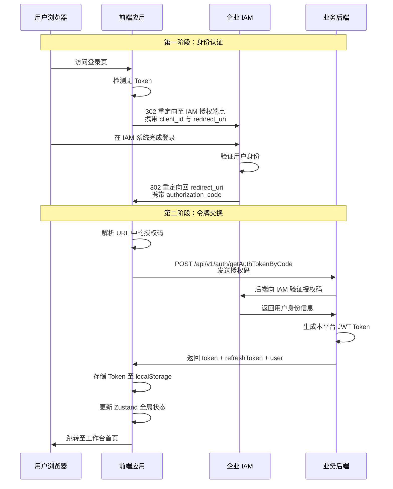

该系统通过 **OAuth 2.0 授权码流程** 集成企业 IAM 统一认证平台，实现无密码登录体验。用户访问登录页时自动跳转至企业认证中心，完成身份验证后携带授权码返回应用，前端通过授权码向后端换取 JWT Token 并建立会话。该设计将身份验证完全委托给企业级 IAM 系统，避免应用层直接处理用户密码，同时与现有的 [JWT 认证与会话恢复机制](5-jwt-ren-zheng-yu-hui-hua-hui-fu-ji-zhi) 无缝集成。

Sources: [LoginPage.tsx](src/LoginPage.tsx#L1-L212), [auth.ts](src/services/auth.ts#L1-L109)

## OAuth 2.0 授权码流程架构

系统采用标准的 OAuth 2.0 授权码授权模式，通过 **授权码换取令牌** 的两阶段流程完成身份认证。第一阶段用户在 IAM 系统完成身份验证，第二阶段应用后端用授权码向 IAM 交换访问令牌并生成本平台的 JWT Token。这种设计确保用户密码永远不经过本应用传输，同时支持企业级的单点登录与统一权限管控。



Sources: [LoginPage.tsx](src/LoginPage.tsx#L69-L88), [auth.ts](src/services/auth.ts#L46-L57)

## 环境变量配置

SSO 集成依赖三个关键环境变量，分别定义 IAM 授权服务地址、应用客户端标识和业务 API 基础路径。在生产环境中，这些配置通过容器环境变量或 Nginx 配置注入；本地开发时可在 `.env.local` 文件中覆盖默认值。

| 环境变量 | 用途 | 示例值 | 必需性 |
|---------|------|--------|--------|
| `VITE_IAM_AUTH_URL` | IAM 授权服务基础地址 | `https://beta-crm.ssss818.com/iam/` | 必需 |
| `VITE_IAM_CLIENT_ID` | 应用在 IAM 系统中注册的客户端 ID | `AI-RND-WORKFLOW` | 必需 |
| `VITE_API_BASE_URL` | 业务 API 后端地址（用于令牌交换） | `http://172.23.15.59:9080/ai-platform` | 必需 |

在登录页初始化时，系统会读取这些环境变量构造 IAM 授权 URL，若环境变量未配置则使用硬编码的默认值（适用于开发环境）。重定向地址（`redirect_uri`）由前端动态计算，确保在本地开发、测试环境和生产环境的子路径部署场景下都能正确回调。

Sources: [LoginPage.tsx](src/LoginPage.tsx#L31-L36), [.env.example](.env.example#L1-L18)

## 核心实现文件解析

### 登录页自动跳转逻辑

登录页组件在挂载时立即执行身份检测：若 localStorage 中无有效 Token，则自动构造 IAM 授权 URL 并触发页面跳转。该逻辑通过 `useEffect` 钩子在组件挂载时执行，确保未认证用户无法停留在登录页，必须通过企业认证中心完成身份验证。

```typescript
const handleIamRedirect = () => {
  setIsLoading(true);
  setErrorMsg(null);
  const IAM_AUTH_URL = import.meta.env.VITE_IAM_AUTH_URL || 'https://beta-crm.ssss818.com/iam/';
  const CLIENT_ID = import.meta.env.VITE_IAM_CLIENT_ID || 'AI-RND-WORKFLOW';
  const REDIRECT_URI = window.location.origin + '/ai-platform/login';
  const targetUrl = `${IAM_AUTH_URL}?appCode=${CLIENT_ID}&redirectUrl=${encodeURIComponent(REDIRECT_URI)}&response_type=code`;
  window.location.href = targetUrl;
};
```

当 IAM 系统完成认证后，会携带 `code` 参数重定向回登录页。登录页通过 URLSearchParams 解析授权码，并调用上层注入的 `onIamLogin` 回调函数完成令牌交换。为防止 React 严格模式下重复调用，实现中使用 `useRef` 作为请求锁，确保同一授权码只发送一次后端请求。

Sources: [LoginPage.tsx](src/LoginPage.tsx#L31-L38), [LoginPage.tsx](src/LoginPage.tsx#L44-L72)

### 授权码换取 JWT Token

认证服务层的 `iamLogin` 方法负责将授权码发送至后端接口 `/api/v1/auth/getAuthTokenByCode`，后端验证授权码后返回本平台的 JWT Token 和用户权限信息。该方法与传统的账号密码登录共享相同的返回结构（`LoginResponse`），包含 `token`、`refreshToken`、`expiresIn` 和 `user` 字段，确保 SSO 登录与普通登录在会话管理层完全一致。

```typescript
async iamLogin(code: string): Promise<LoginResponse> {
  const response = await businessClient.get<LoginResponse>('/api/v1/auth/getAuthTokenByCode', {
    params: { code },
  });
  const loginData = response.data;
  localStorage.setItem(TOKEN_KEY, loginData.token);
  if (loginData.refreshToken) {
    localStorage.setItem(REFRESH_TOKEN_KEY, loginData.refreshToken);
  }
  return loginData;
}
```

Token 存储采用 localStorage 持久化方案，确保用户刷新页面或重新打开浏览器时无需重复登录。存储的 Token 会被后续的 Axios 请求拦截器自动读取并添加到 `Authorization` 请求头，同时也会被会话恢复逻辑用于初始化全局状态。

Sources: [auth.ts](src/services/auth.ts#L46-L57), [auth.ts](src/services/auth.ts#L62-L75)

## 状态管理与会话恢复

Zustand 全局状态仓库提供 `iamLogin` action，封装了授权码交换、Token 存储和状态更新的完整流程。当登录页调用 `onIamLogin(code)` 时，实际上是触发该 action，它首先调用 `authService.iamLogin(code)` 完成网络请求，然后将返回的 token 和 user 信息写入全局状态，并将 `isAuthenticated` 标记为 `true`。

```typescript
iamLogin: async (code) => {
  const loginData = await authService.iamLogin(code);
  set({
    token: loginData.token,
    user: loginData.user,
    isAuthenticated: true,
  });
},
```

应用主入口 `App.tsx` 在渲染前会执行会话恢复逻辑：检测 localStorage 中是否存在 Token，若存在则调用 `restoreSession` 拉取最新的用户信息并验证 Token 有效性。这一机制确保 SSO 登录后的会话在页面刷新、浏览器重启等场景下依然有效，同时为 [自动 Token 刷新机制](12-zi-dong-token-shua-xin-ji-zhi) 提供基础。

Sources: [useAppStore.ts](src/stores/useAppStore.ts#L39-L46), [useAppStore.ts](src/stores/useAppStore.ts#L48-L68), [App.tsx](src/App.tsx#L68-L81)

## SSO 回调页面设计

虽然当前实现将授权码处理逻辑直接嵌入登录页，但项目仍保留了独立的 `SsoCallback` 组件作为兼容性方案。该组件设计用于处理子路径部署场景（如 `/ai-platform/sso/callback`），通过 URL 参数解析授权码或错误信息，并以卡片形式向用户展示认证状态。

```typescript
const callbackState = useMemo(() => {
  const error = searchParams.get('error');
  const errorDescription = searchParams.get('error_description');
  const code = searchParams.get('code');

  if (error) {
    return {
      status: 'error' as const,
      title: '企业 SSO 登录失败',
      description: errorDescription || error,
    };
  }

  if (code) {
    return {
      status: 'warning' as const,
      title: '已收到 SSO 回调',
      description: '当前前端已兼容子路径回调，但尚未接入授权码兑换接口...',
    };
  }
  // ...
}, [searchParams]);
```

该组件目前处于占位状态，提示用户"尚未接入授权码兑换接口"。若企业 IAM 系统要求使用独立的回调路径而非登录页路径，可通过 [类型安全的路由架构](8-lei-xing-an-quan-de-lu-you-jia-gou) 将该组件注册为独立路由，并复用 `authService.iamLogin` 方法完成令牌交换。

Sources: [SsoCallback.tsx](src/pages/SsoCallback.tsx#L8-L33), [SsoCallback.tsx](src/pages/SsoCallback.tsx#L35-L67)

## 与现有认证体系的集成

SSO 登录并非独立于传统账号密码登录，而是作为另一种认证方式与现有体系并存。在登录页的账号密码表单下方，通过分隔线和"OR"标识引入企业统一认证入口，用户可根据场景选择适合的登录方式。两种登录方式最终都会调用相同的 `authService` 方法存储 Token，并触发相同的全局状态更新，确保后续的权限校验、接口调用和会话管理逻辑完全一致。

这种设计允许系统在不同环境中灵活切换认证方式：开发环境可使用账号密码快速登录，生产环境强制走企业 SSO，而代码层面无需任何改动。后端通过 `/api/v1/auth/login` 和 `/api/v1/auth/getAuthTokenByCode` 两个端点分别处理两种认证方式，但返回相同的 JWT Token 结构，保持了 API 层的一致性。

Sources: [LoginMethodPanel.tsx](src/components/login-page/forms/LoginMethodPanel.tsx#L170-L181), [auth.ts](src/services/auth.ts#L26-L44), [auth.ts](src/services/auth.ts#L46-L57)

## 错误处理与用户体验

SSO 流程的异常场景包括 IAM 认证失败、授权码过期、网络请求失败等，系统通过三层错误处理机制确保用户获得清晰的反馈。第一层在登录页检测 IAM 返回的 `error` 和 `error_description` 参数，直接展示 IAM 系统提供的错误描述；第二层捕获 `iamLogin` 网络请求的异常，提取错误信息并通过状态变量触发 UI 更新；第三层在认证服务层处理 Token 解析失败，自动清除无效 Token 并重定向至登录页。

错误展示采用视觉强化的红色卡片设计，配合警告图标和重试按钮，引导用户重新发起 SSO 登录。重试按钮调用 `handleIamRedirect` 重新构造授权 URL，确保用户能够从临时性错误（如网络超时、会话过期）中恢复。

Sources: [LoginPage.tsx](src/LoginPage.tsx#L45-L54), [LoginPage.tsx](src/LoginPage.tsx#L162-L179), [useAppStore.ts](src/stores/useAppStore.ts#L59-L67)

## 部署与子路径兼容

应用支持在子路径下部署（如 `/ai-platform`），SSO 回调地址需与实际部署路径保持一致。Vite 配置通过 `base` 选项控制构建产物的公共基础路径，开发环境设为 `/`，生产环境设为 `/ai-platform/`。登录页构造重定向 URI 时使用 `window.location.origin + '/ai-platform/login'`，该硬编码路径需与实际部署配置一致，否则会导致 IAM 回调后出现 404 错误。

若企业要求回调至独立路径（如 `/ai-platform/sso/callback`），需同时修改登录页的 `REDIRECT_URI` 构造逻辑和路由注册表，将 `SsoCallback` 组件映射到对应路径。主入口 `main.tsx` 已通过 `import.meta.env.BASE_URL` 自动适配路由基础路径，确保 BrowserRouter 在子路径部署场景下正确解析路由。