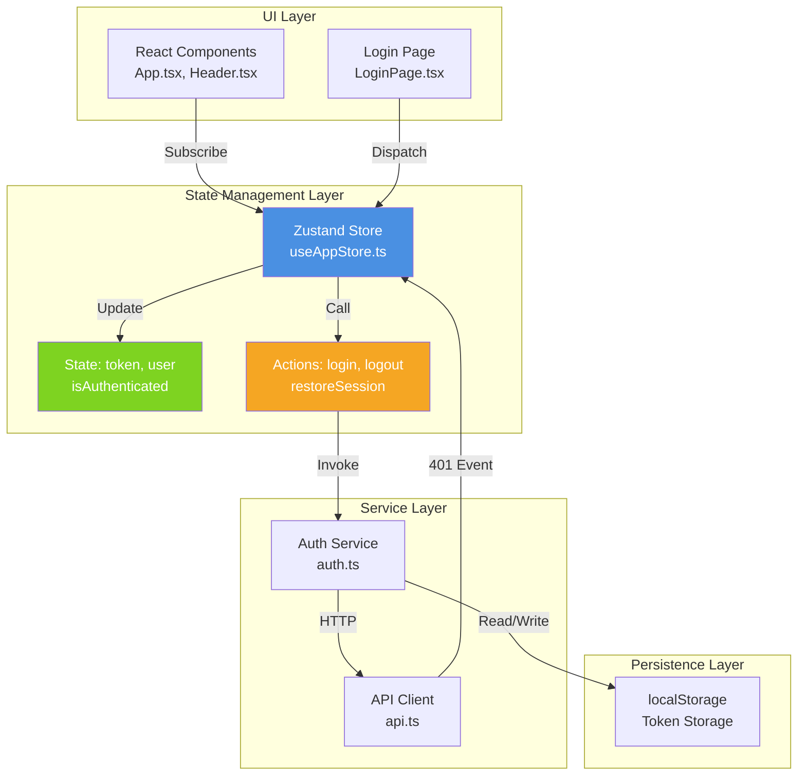
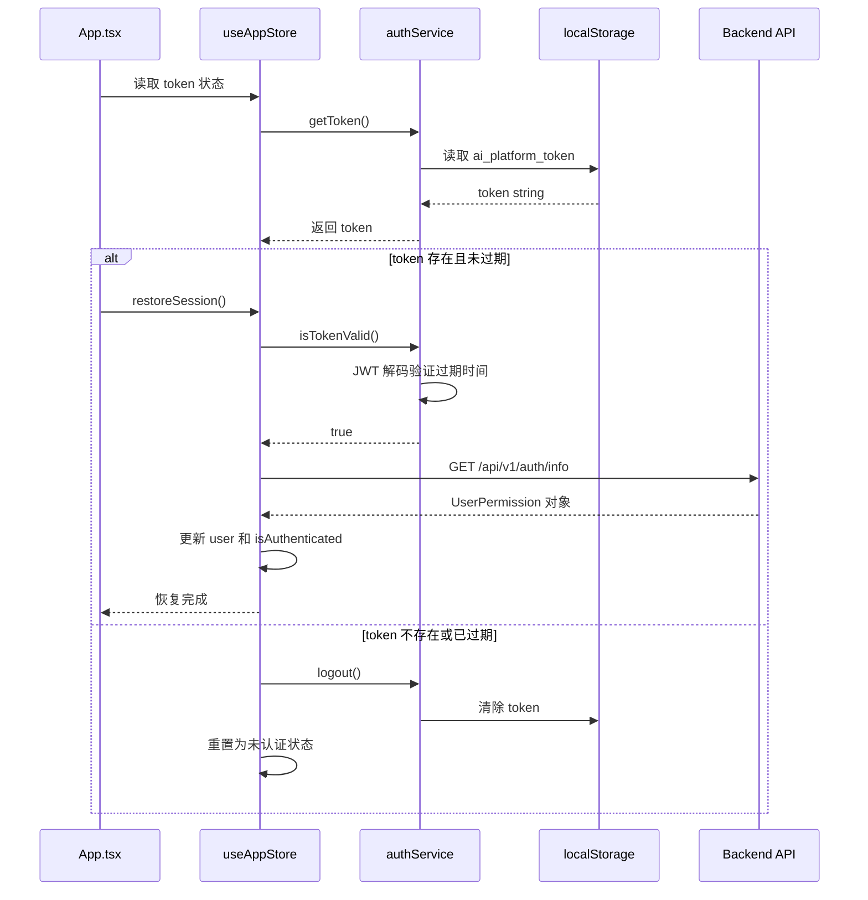
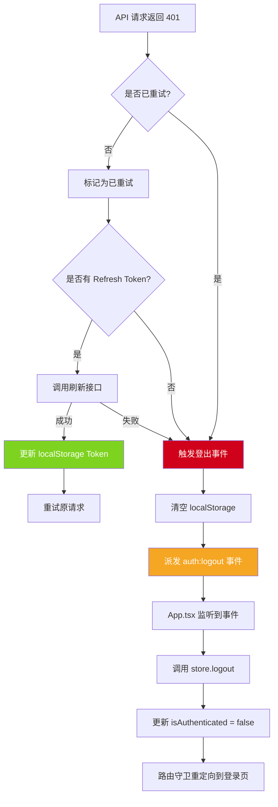

在现代 React 应用中，**状态管理**是架构设计的核心挑战之一。本项目采用 Zustand 作为全局状态管理方案，专注于**认证状态**的统一管理，与传统 Redux 方案相比，它提供了更轻量、更直观的开发体验。Zustand 在本项目中承担着**单一职责**：维护用户认证态、Token 生命周期以及会话恢复逻辑，与下层的 authService 和上层的 React 组件形成清晰的三层架构。

## 架构定位与职责边界

本项目的状态管理采用**分层设计**理念，Zustand store 位于中间层，向下封装 authService 的 API 调用能力，向上为 React 组件提供响应式状态订阅。这种设计避免了组件直接依赖服务层，也避免了服务层直接操作 UI 状态，实现了关注点分离。



上图中，**绿色模块**代表状态数据，**橙色模块**代表操作方法，**蓝色模块**是 Zustand store 的核心容器。当 API 层检测到 401 认证失败时，会通过全局事件通知 store 执行登出清理，这种**事件驱动**的解耦设计避免了循环依赖。

Sources: [useAppStore.ts](src/stores/useAppStore.ts#L1-L13), [auth.ts](src/services/auth.ts#L34-L108), [api.ts](src/services/api.ts#L24-L28)

## Store 状态结构设计

Zustand store 的状态结构遵循**最小化原则**，仅保留认证相关的核心数据。这种设计避免了状态膨胀，也降低了组件订阅时的性能开销。

### 状态字段定义

| 字段名 | 类型 | 初始值 | 用途说明 |
|--------|------|--------|----------|
| `token` | `string \| null` | `authService.getToken()` | 当前有效的 JWT Token，从 localStorage 初始化 |
| `user` | `UserPermission \| null` | `null` | 用户权限信息，包含 ID、用户名、角色和能力列表 |
| `isAuthenticated` | `boolean` | `false` | 认证状态标志，控制路由访问和 UI 展示 |

### 操作方法设计

Store 提供四个核心操作方法，每个方法都遵循**单一职责**原则：

**登录方法**：支持两种认证模式
- `login(username, password)`：传统用户名密码登录，调用 `/api/v1/auth/login` 接口
- `iamLogin(code)`：IAM SSO 单点登录，通过授权码换取 Token

**会话管理方法**：
- `logout()`：清空内存状态并触发 authService 清理 localStorage
- `restoreSession()`：应用启动时验证 Token 有效性并恢复用户信息

```typescript
// Store 的类型定义体现了清晰的契约
interface AppState {
  // 状态字段
  token: string | null;
  user: UserPermission | null;
  isAuthenticated: boolean;
  
  // 操作方法
  login: (username: string, password: string) => Promise<void>;
  iamLogin: (code: string) => Promise<void>;
  logout: () => void;
  restoreSession: () => Promise<void>;
}
```

这种类型安全的设计确保了组件调用 store 方法时能够获得完整的 TypeScript 智能提示和编译时检查。

Sources: [useAppStore.ts](src/stores/useAppStore.ts#L5-L13), [auth.ts](src/services/auth.ts#L14-L20)

## 会话恢复与自动认证机制

应用启动时的**会话恢复**是认证系统的关键环节。当用户刷新页面或重新打开应用时，Zustand store 需要从 localStorage 中恢复 Token，并验证其有效性。

### 恢复流程时序



这个流程的关键设计点在于**双重验证**：首先通过 JWT 解码在前端快速判断过期时间，避免无意义的 API 调用；然后通过 `/me` 接口获取服务端的真实用户信息，确保权限数据是最新的。

### App.tsx 中的恢复逻辑

应用主组件通过 `useEffect` 钩子在挂载时触发会话恢复：

```typescript
useEffect(() => {
  // 如果本地已经有 token，但内存态还没恢复，就主动拉取一次当前用户信息
  if (!token || isAuthenticated) {
    setIsAuthBootstrapping(false);
    return;
  }

  setIsAuthBootstrapping(true);
  restoreSession().finally(() => {
    setIsAuthBootstrapping(false);
  });
}, [isAuthenticated, restoreSession, token]);
```

这段代码展示了**防御性编程**的实践：只有当 Token 存在但认证状态为 false 时才执行恢复，避免重复调用。`isAuthBootstrapping` 状态用于在恢复期间显示加载界面，防止用户看到闪烁的登录页。

Sources: [useAppStore.ts](src/stores/useAppStore.ts#L47-L74), [App.tsx](src/App.tsx#L71-L90), [auth.ts](src/services/auth.ts#L94-L107)

## Token 自动刷新与登出事件传播

当 API 请求遇到 401 认证失败时，系统需要**自动刷新 Token** 或**强制登出**。这个机制涉及 API 层、事件系统和 Zustand store 的协作。

### 401 错误处理流程



这个流程的精妙之处在于**事件解耦**：API 层不直接调用 store 的 logout 方法，而是派发自定义事件 `auth:logout`。App.tsx 监听这个事件并触发 store 更新，这种设计避免了 API 层对 UI 层的直接依赖。

### 并发请求的刷新优化

当多个 API 请求同时遇到 401 时，系统通过**共享 Promise** 机制避免重复刷新：

```typescript
let refreshPromise: Promise<string> | null = null;

// 在拦截器中
if (!refreshPromise) {
  // 共享刷新 Promise，避免多个 401 同时触发多次 refresh 请求
  refreshPromise = refreshAccessToken(baseURL).finally(() => {
    refreshPromise = null;
  });
}

const newToken = await refreshPromise;
```

这个模式确保了无论有多少个请求同时失败，Token 刷新只会执行一次，其他请求等待同一个 Promise 完成后使用新 Token 重试。

Sources: [api.ts](src/services/api.ts#L63-L111), [App.tsx](src/App.tsx#L92-L102)

## 组件中的状态订阅模式

Zustand 的**选择器模式**允许组件只订阅需要的状态片段，避免不必要的重渲染。本项目的组件遵循这一最佳实践。

### 选择性订阅示例

在 App.tsx 中，组件通过多个选择器分别订阅不同的状态和方法：

```typescript
const isAuthenticated = useAppStore((state) => state.isAuthenticated);
const token = useAppStore((state) => state.token);
const user = useAppStore((state) => state.user);
const login = useAppStore((state) => state.login);
const iamLogin = useAppStore((state) => state.iamLogin);
const logout = useAppStore((state) => state.logout);
const restoreSession = useAppStore((state) => state.restoreSession);
```

这种写法虽然略显冗长，但具有**最优性能**：只有当订阅的特定字段变化时，组件才会重新渲染。如果使用 `const { isAuthenticated, user } = useAppStore()` 这种解构写法，任何状态变化都会触发重渲染。

### 用户信息的跨组件传递

Header 组件接收从 App.tsx 传递的 user 信息：

```typescript
// App.tsx 中传递用户信息
<Header
  currentNoticeIndex={currentNoticeIndex}
  currentPage={currentPage}
  currentUserName={user?.displayName}
/>

// Header.tsx 中展示用户名
{currentUserName ? (
  <div className="hidden rounded-full border border-slate-200/60 bg-white/60 px-4 py-2">
    当前用户：{currentUserName}
  </div>
) : null}
```

这种**属性传递**模式比直接在 Header 中订阅 store 更灵活，因为它明确了数据流向，也便于未来添加数据转换逻辑。

Sources: [App.tsx](src/App.tsx#L31-L37), [Header.tsx](src/components/Header.tsx#L63-L67)

## 路由守卫与认证状态判断

Zustand store 的 `isAuthenticated` 状态是**路由守卫**的核心依据。App.tsx 通过 `useEffect` 监听认证状态变化，自动执行路由重定向。

### 路由守卫实现

```typescript
useEffect(() => {
  // 未登录时统一落到登录页；已登录访问登录页或未知路径时回到首页
  if (!isAuthenticated && location.pathname !== PAGE_PATHS.login) {
    navigate(PAGE_PATHS.login, { replace: true });
    return;
  }

  if (isAuthenticated && (location.pathname === PAGE_PATHS.login || !isKnownRoute)) {
    navigate(PAGE_PATHS.dashboard, { replace: true });
  }
}, [isAuthenticated, isKnownRoute, location.pathname, navigate]);
```

这段代码实现了两个核心逻辑：
1. **未认证保护**：任何非登录页的路径都会被重定向到登录页
2. **已认证重定向**：已登录用户访问登录页或未知路径时，自动跳转到仪表盘

`replace: true` 选项确保重定向不会在浏览器历史记录中留下多余条目，用户点击后退按钮时不会陷入循环。

### 认证状态的视觉反馈

在会话恢复期间，应用显示专门的加载界面：

```typescript
if (isAuthBootstrapping) {
  return (
    <div className="flex min-h-screen items-center justify-center bg-[#010107]">
      <div className="rounded-2xl border border-white/10 bg-white/5 px-6 py-4">
        正在恢复登录状态...
      </div>
    </div>
  );
}
```

这种**中间状态**的处理避免了用户在刷新页面时看到短暂的登录表单闪烁，提升了用户体验的连贯性。

Sources: [App.tsx](src/App.tsx#L104-L114), [App.tsx](src/App.tsx#L139-L147)

## 技术方案对比分析

在选择 Zustand 作为状态管理方案时，项目团队对比了多种主流方案。以下表格展示了各方案在**认证场景**下的适用性：

| 特性维度 | Zustand | Redux Toolkit | Context API | MobX |
|---------|---------|---------------|-------------|------|
| **学习曲线** | 低（API 极简） | 中（需理解概念） | 低（React 原生） | 中（需理解响应式） |
| **样板代码** | 极少 | 较多 | 中等 | 较少 |
| **性能优化** | 自动（选择器） | 需手动 | 需手动 | 自动 |
| **TypeScript 支持** | 优秀 | 优秀 | 一般 | 良好 |
| **中间件生态** | 丰富 | 极丰富 | 无 | 丰富 |
| **调试工具** | Redux DevTools | Redux DevTools | React DevTools | MobX DevTools |
| **包体积** | 1.2KB | 11.7KB | 0KB（原生） | 16.3KB |
| **适用场景** | 中小型应用、特定领域状态 | 大型企业应用 | 简单状态、主题配置 | 复杂领域模型 |

### 选择 Zustand 的核心原因

1. **包体积优势**：对于仅需管理认证状态的项目，1.2KB 的体积增量几乎可以忽略不计
2. **API 简洁性**：无需定义 action、reducer、dispatch，直接在 store 中编写方法
3. **性能自动优化**：选择器模式自动避免不必要的重渲染，无需手动使用 `useMemo`
4. **TypeScript 友好**：类型推导完整，无需额外配置即可获得完整的类型安全

Sources: [package.json](package.json)

## 最佳实践总结

基于本项目的实践，以下是使用 Zustand 管理认证状态的**推荐模式**：

### 1. 状态最小化原则

Store 只保存**无法从其他来源计算**的数据。例如，`user` 对象从 API 获取后直接存储，而不是存储用户 ID 再在组件中查询。

### 2. 操作方法的错误处理

每个异步方法都应该妥善处理错误，避免未捕获的 Promise rejection：

```typescript
restoreSession: async () => {
  try {
    const user = await authService.getMe();
    set({ token: authService.getToken(), user, isAuthenticated: true });
  } catch {
    authService.logout();
    set({ token: null, user: null, isAuthenticated: false });
  }
}
```

### 3. 事件驱动的跨层通信

当服务层需要通知 UI 层时，使用**自定义事件**而非直接依赖：

```typescript
// API 层派发事件
window.dispatchEvent(new CustomEvent('auth:logout'));

// UI 层监听事件
window.addEventListener('auth:logout', handleAuthLogout);
```

### 4. 选择器模式优化性能

避免在组件中使用解构订阅，而是**按需选择**：

```typescript
// ✅ 推荐：只订阅需要的字段
const user = useAppStore((state) => state.user);

// ❌ 避免：任何状态变化都会触发重渲染
const { user, token, isAuthenticated } = useAppStore();
```

### 5. 状态持久化与内存分离

Token 等持久化数据由 authService 管理，store 只维护**内存态**。这种分离确保了刷新页面时能够从 localStorage 恢复，也避免了 store 直接操作存储 API。

Sources: [useAppStore.ts](src/stores/useAppStore.ts#L47-L74), [api.ts](src/services/api.ts#L24-L28)

## 延伸阅读

要深入理解本项目的完整认证架构，建议按以下顺序阅读相关文档：

1. **[JWT 认证与会话恢复机制](5-jwt-ren-zheng-yu-hui-hua-hui-fu-ji-zhi)**：了解 Token 的生成、验证和过期处理
2. **[SSO 单点登录集成](6-sso-dan-dian-deng-lu-ji-cheng)**：探索 IAM 系统的集成细节和授权码流程
3. **[Axios 客户端封装与拦截器](11-axios-ke-hu-duan-feng-zhuang-yu-lan-jie-qi)**：深入理解自动 Token 刷新的实现原理
4. **[自动 Token 刷新机制](12-zi-dong-token-shua-xin-ji-zhi)**：掌握并发请求下的刷新优化策略

通过这些文档的系统学习，您将全面掌握本项目从状态管理到认证安全的完整技术栈。