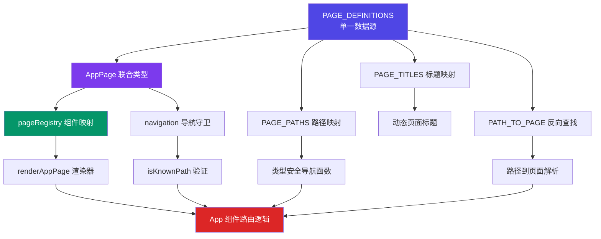

本项目的路由系统采用**类型驱动**的设计范式，通过单一数据源和 TypeScript 类型推导构建了编译时类型安全的导航体系。这一架构避免了传统字符串路径硬编码带来的运行时错误，同时实现了路由配置、类型定义和组件映射的**高内聚低耦合**设计。

## 核心设计理念

整个路由架构遵循**单一真相源**原则，所有页面元信息集中在 `PAGE_DEFINITIONS` 对象中，其他路由映射、类型约束和导航工具函数均由此派生。这种设计确保了路径、标题和实现状态的**一致性保证**——当您修改页面定义时，TypeScript 编译器会自动提示所有需要更新的引用点，而非留到运行时才发现路径不匹配。



架构分为三个核心层次：**定义层**提供类型和元数据基础，**派生层**通过工具函数和映射对象实现路由逻辑，**应用层**在 React 组件中消费这些类型安全的 API。这种分层设计使得每个模块职责清晰，便于独立测试和维护。

Sources: [navigationData.ts](src/data/navigationData.ts#L1-L190), [navigation.ts](src/navigation.ts#L1-L68)

## 类型系统架构

### 页面标识符类型

`AppPage` 类型是整个路由系统的**类型锚点**，定义为包含所有有效页面标识符的联合类型。这一设计确保了编译时就能捕获无效的页面引用——如果您尝试导航到不存在的页面，TypeScript 会立即报错而非留到运行时才发现。

```typescript
export type AppPage =
  | 'login'
  | 'dashboard'
  | 'function-square'
  | 'ui-builder'
  | 'meeting-bi'
  | 'consultant-ai'
  | 'medical-ai'
  // ... 其他页面标识符
```

这种联合类型与 `PAGE_DEFINITIONS` 的键完全对应，TypeScript 会自动确保两者同步。当您添加新页面时，只需在两处同时添加定义，类型系统会验证所有消费代码是否正确处理了新增的页面类型。

Sources: [navigationData.ts](src/data/navigationData.ts#L1-L27)

### 页面定义接口

每个页面的元信息通过 `PageDefinition` 接口描述，包含路径、标题、实现状态和可选的占位描述。`implemented` 字段是架构的**关键设计点**——它允许您先定义路由结构和导航菜单，再逐步实现具体页面逻辑，未实现的页面会自动渲染占位组件。

```typescript
export interface PageDefinition {
  path: string;              // URL 路径
  title: string;             // 页面标题
  implemented: boolean;      // 是否已实现
  placeholderDescription?: string;  // 占位页面的描述文案
}
```

`PAGE_DEFINITIONS` 对象将 `AppPage` 类型映射到对应的 `PageDefinition`，形成类型安全的字典结构。所有派生映射都从这个对象通过 `Object.entries` 和 `Object.fromEntries` 生成，确保数据源的**唯一性和一致性**。

Sources: [navigationData.ts](src/data/navigationData.ts#L29-L37), [navigationData.ts](src/data/navigationData.ts#L39-L150)

## 路由工具函数体系

### 派生映射的自动生成

`navigation.ts` 模块通过**纯函数转换**从 `PAGE_DEFINITIONS` 派生出多个实用映射对象。`PAGE_PATHS` 和 `PAGE_TITLES` 分别提供页面标识符到路径和标题的类型安全查找表，其类型签名通过 `as Record<keyof typeof PAGE_DEFINITIONS, string>` 确保编译时类型正确。

```typescript
export const PAGE_PATHS = Object.fromEntries(
  Object.entries(PAGE_DEFINITIONS).map(([page, definition]) => [page, definition.path]),
) as Record<keyof typeof PAGE_DEFINITIONS, string>;
```

这种设计模式的优势在于**零维护成本**——您永远不需要手动同步路径映射，因为它是由源数据自动生成的。如果修改了某个页面的路径，所有引用 `PAGE_PATHS['medical-ai']` 的代码都会自动使用新路径。

Sources: [navigation.ts](src/navigation.ts#L11-L19)

### 路径解析与验证

反向查找通过 `PATH_TO_PAGE` Map 实现，将 URL 路径映射回页面标识符。`getPageByPath` 函数用于从 React Router 的 `location.pathname` 解析当前页面类型，而 `isKnownPath` 则用于路由守卫中验证路径有效性。

```typescript
const PATH_TO_PAGE = new Map<string, keyof typeof PAGE_DEFINITIONS>(
  Object.entries(PAGE_DEFINITIONS).map(([page, definition]) => 
    [definition.path, page as keyof typeof PAGE_DEFINITIONS]
  )
);

export function getPageByPath(pathname: string): keyof typeof PAGE_DEFINITIONS | null {
  return PATH_TO_PAGE.get(pathname) ?? null;
}
```

这套工具函数的组合使用构成了**类型安全的导航流程**：从路径解析出页面类型，再通过页面类型查找对应的组件渲染器，整个链条都在 TypeScript 类型系统的保护之下。

Sources: [navigation.ts](src/navigation.ts#L30-L45)

### 导航激活状态判断

`isNavigationGroupActive` 函数处理导航菜单的**层级激活逻辑**，当访问子页面时父菜单项也会高亮显示。该函数通过查找导航项定义中的 `children` 数组来判断激活状态，体现了导航数据结构与路由系统的紧密集成。

```typescript
export function isNavigationGroupActive(
  currentPage: keyof typeof PAGE_DEFINITIONS,
  page: keyof typeof PAGE_DEFINITIONS,
): boolean {
  const item = NAVIGATION_GROUPS.find((navigationItem) => navigationItem.page === page);
  if (!item) {
    return currentPage === page;
  }
  return item.page === currentPage || item.children?.includes(currentPage) === true;
}
```

这种设计使得导航状态管理完全**声明式**——您只需在 `NAVIGATION_ITEMS` 中定义父子关系，激活逻辑自动处理，无需在每个组件中编写复杂的状态判断代码。

Sources: [navigation.ts](src/navigation.ts#L55-L68)

## 页面注册与组件映射

### 懒加载组件注册表

`pageRegistry.tsx` 实现了**页面到组件的解耦映射**，通过 `PAGE_RENDERERS` 对象将页面标识符关联到对应的渲染函数。所有实际页面组件都使用 React 的 `lazy` 函数动态导入，实现代码分割和按需加载，显著降低首屏包体积。

```typescript
const DashboardView = lazy(async () => {
  const module = await import('./components/DashboardView');
  return { default: module.DashboardView };
});

const PAGE_RENDERERS: Partial<Record<AppPage, PageRenderer>> = {
  dashboard: ({ dashboard }) => <DashboardView {...dashboard} />,
  'function-square': ({ navigateToPage }) => (
    <FunctionSquareView setCurrentPage={navigateToPage} />
  ),
  // ... 其他页面渲染器
};
```

`Partial<Record<AppPage, PageRenderer>>` 类型允许部分页面暂时未注册渲染器，这些页面会自动降级到占位组件。这种**渐进式实现**策略让团队可以并行开发多个页面而不阻塞路由架构的完整性。

Sources: [pageRegistry.tsx](src/pageRegistry.tsx#L29-L87)

### 渲染上下文与依赖注入

`RouteRenderContext` 接口定义了页面渲染所需的**上下文依赖**，包括导航函数和仪表盘状态。这种依赖注入模式使得页面组件不需要直接访问全局状态或路由 API，提高了组件的可测试性和复用性。

```typescript
interface RouteRenderContext {
  navigateToPage: (page: AppPage) => void;
  dashboard: DashboardRouteContext;
}
```

`renderAppPage` 函数作为**统一渲染入口**，接收页面标识符和上下文对象，返回对应的 React 元素。未注册的页面会通过 `renderFallbackPage` 渲染占位组件，显示页面标题和实现进度提示，提供了优雅的降级体验。

Sources: [pageRegistry.tsx](src/pageRegistry.tsx#L18-L37), [pageRegistry.tsx](src/pageRegistry.tsx#L119-L139)

### 加载状态与用户体验

懒加载组件需要配合 `Suspense` 提供加载中的用户体验。`PageLoadingFallback` 组件展示骨架屏动画，保持页面布局稳定，避免内容跳动带来的视觉不适。这种设计确保了**感知性能**的优化——用户立即看到反馈而非空白页面。

```typescript
function PageLoadingFallback() {
  return (
    <section className="rounded-[32px] border border-slate-200/70 bg-white/80 px-8 py-12 shadow-sm">
      <div className="space-y-6 animate-pulse">
        <div className="h-4 w-28 rounded-full bg-slate-200" />
        <div className="h-10 w-64 rounded-2xl bg-slate-200" />
        {/* ... 骨架屏元素 */}
      </div>
    </section>
  );
}
```

加载状态的设计体现了**用户体验优先**的原则，即使在网络较慢的情况下，用户也能获得流畅的交互反馈。

Sources: [pageRegistry.tsx](src/pageRegistry.tsx#L89-L104)

## 实际应用与路由集成

### 主应用组件的路由逻辑

`App.tsx` 作为应用主入口，将类型安全的路由系统与 React Router 集成。通过 `useLocation` 获取当前路径，再使用 `getPageByPath` 解析为类型安全的页面标识符，整个过程完全类型化，避免了字符串路径的拼写错误。

```typescript
const currentPage = getPageByPath(location.pathname) ?? 'dashboard';
const isKnownRoute = isKnownPath(location.pathname);
```

路由守卫通过 `useEffect` 监听认证状态和路径变化，实现**声明式导航控制**。未登录用户自动重定向到登录页，已登录用户访问未知路径时回到首页，所有导航目标都通过 `PAGE_PATHS` 常量引用，确保路径的正确性。

Sources: [App.tsx](src/App.tsx#L79-L83), [App.tsx](src/App.tsx#L104-L115)

### 类型安全的导航调用

导航操作通过 `navigateToPage` 函数执行，该函数接收 `AppPage` 类型参数，内部通过 `PAGE_PATHS` 查找实际路径再调用 React Router 的 `navigate`。这种设计在调用点提供完整的**类型提示和检查**——IDE 会自动列出所有可用页面，拼写错误会被编译器捕获。

```typescript
navigateToPage: (page: AppPage) => navigate(PAGE_PATHS[page])
```

相比直接使用字符串路径 `navigate('/medical-ai')`，类型安全的导航调用 `navigateToPage('medical-ai')` 在重构时更加安全——如果页面标识符被重命名，所有引用点都会产生编译错误，而非悄悄地导航到 404 页面。

Sources: [App.tsx](src/App.tsx#L154-L165)

### 特殊页面的布局隔离

某些页面（如 `meeting-bi`）需要完全独立的布局，不使用标准的侧边栏和头部。`App` 组件通过条件判断当前页面类型，为这些特殊页面渲染独立视图，体现了路由系统对**多样化布局需求**的支持能力。

```typescript
if (isMeetingBiPage) {
  return (
    <div id="root-app-container" className="h-screen bg-[#050f24] text-slate-100">
      {renderAppPage(currentPage, { /* ... */ })}
    </div>
  );
}
```

这种设计保持了路由架构的**灵活性**——类型系统确保所有页面都被正确处理，而组件层可以根据业务需求自由定制布局结构。

Sources: [App.tsx](src/App.tsx#L152-L165)

## 架构优势与最佳实践

### 编译时错误检测

类型安全路由的最大价值在于**将运行时错误提前到编译时**。传统字符串路径导航容易出现的拼写错误、路径不一致等问题，在类型系统的保护下都会被立即发现。这种保障在大型项目和多人协作中尤为重要，显著降低了调试成本。

Sources: [navigationData.ts](src/data/navigationData.ts#L1-L190)

### 单一数据源的一致性保证

所有路由信息从 `PAGE_DEFINITIONS` 派生，确保了路径、标题和实现状态的**全局一致性**。修改页面定义时，TypeScript 编译器会提示所有需要更新的引用点，而非依赖人工同步多个配置文件。这种模式也简化了新页面的添加流程——只需在一个位置定义，其他所有映射自动生成。

Sources: [navigation.ts](src/navigation.ts#L1-L68)

### 渐进式实现策略

通过 `implemented` 标志和占位组件机制，团队可以**先设计路由结构再逐步实现功能**。这种策略支持并行开发，不同成员可以独立实现各个页面而不阻塞整体架构。占位页面还提供了清晰的实现进度可视化，便于项目管理。

Sources: [pageRegistry.tsx](src/pageRegistry.tsx#L106-L117)

### 性能优化的自然集成

懒加载策略与路由系统**天然结合**，每个页面作为独立代码块按需加载。配合 `Suspense` 的加载状态管理，实现了首屏性能和用户体验的平衡。这种架构还便于后续实现预加载策略——在用户 hover 导航项时预加载对应页面代码。

Sources: [pageRegistry.tsx](src/pageRegistry.tsx#L29-L87), [pageRegistry.tsx](src/pageRegistry.tsx#L89-L104)

## 相关文档导航

要深入理解路由架构与其他系统的协作，建议按以下顺序阅读：

1. **[页面注册表与懒加载策略](9-ye-mian-zhu-ce-biao-yu-lan-jia-zai-ce-lue)** - 详细解析 `pageRegistry` 的实现细节和性能优化策略
2. **[动态导航数据源](10-dong-tai-dao-hang-shu-ju-yuan)** - 了解导航菜单如何与路由系统集成
3. **[JWT 认证与会话恢复机制](5-jwt-ren-zheng-yu-hui-hua-hui-fu-ji-zhi)** - 探索路由守卫与认证系统的协作
4. **[Zustand 全局状态管理](7-zustand-quan-ju-zhuang-tai-guan-li)** - 理解状态管理如何影响路由决策
5. **[Axios 客户端封装与拦截器](11-axios-ke-hu-duan-feng-zhuang-yu-lan-jie-qi)** - 学习接口层如何与路由系统集成