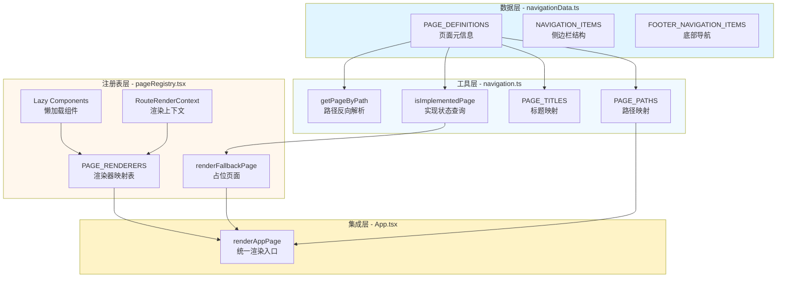

页面注册表是前端路由系统的核心枢纽，它将**导航数据源**、**路由配置**与**组件懒加载**三大能力统一封装，为应用提供类型安全、性能优化的页面渲染机制。该系统的设计目标是**首屏性能优化**（通过代码分割减小初始包体积）、**开发体验提升**（集中管理页面映射关系）以及**渐进式开发**（支持占位页面机制，允许业务模块逐步接入）。

## 架构总览

页面注册表采用**三层架构设计**：数据层负责定义页面元信息和导航结构，工具层提供类型安全的查询和路径解析能力，注册表层则负责组件映射和懒加载逻辑。这种分层设计使得页面配置、导航逻辑和渲染实现三者解耦，既保证了类型安全，又提升了可维护性。



Sources: [navigationData.ts](src/data/navigationData.ts#L46-L141) [navigation.ts](src/navigation.ts#L1-L68) [pageRegistry.tsx](src/pageRegistry.tsx#L1-L139) [App.tsx](src/App.tsx#L168-L181)

## 页面注册表核心机制

### 懒加载组件定义

页面注册表使用 React 的 `lazy` API 配合动态 `import` 实现组件懒加载，每个页面组件在首次访问时才会被加载，从而显著减小首屏包体积。懒加载组件的定义采用统一的模块解析模式，通过异步导入模块并提取 default 导出来确保命名导出的组件能够正确注册。

```typescript
const DashboardView = lazy(async () => {
  const module = await import('./components/DashboardView');
  return { default: module.DashboardView };
});

const MedicalAIWorkbench = lazy(async () => {
  const module = await import('./components/MedicalAIWorkbench');
  return { default: module.MedicalAIWorkbench };
});
```

这种模式的优势在于**构建时自动代码分割**：Vite 会识别动态 `import` 语法，自动将每个页面组件及其依赖打包成独立的 chunk 文件。从打包产物可以看到，每个页面组件都生成了独立的 JS 文件，例如 `DashboardView-BSjfn6Rk.js`（24KB）、`ConsultantAIWorkbench-CAke6bkc.js`（34KB），而体积最大的 `MeetingBiView-DAkYzgEZ.js`（2.0MB）因其包含 ECharts 等重型依赖被单独分割，不会影响其他页面的加载性能。

Sources: [pageRegistry.tsx](src/pageRegistry.tsx#L30-L62) [dist/assets](dist/assets)

### 渲染器映射表与上下文注入

`PAGE_RENDERERS` 映射表是页面注册表的核心数据结构，它将页面标识符（AppPage 类型）映射到具体的渲染函数（PageRenderer 类型）。渲染函数接受 `RouteRenderContext` 上下文参数，该参数包含页面导航函数和 Dashboard 页面专用的状态上下文，使得页面组件能够访问全局状态而无需直接依赖状态管理库。

```typescript
interface RouteRenderContext {
  navigateToPage: (page: AppPage) => void;
  dashboard: DashboardRouteContext;
}

type PageRenderer = (context: RouteRenderContext) => React.ReactNode;

const PAGE_RENDERERS: Partial<Record<AppPage, PageRenderer>> = {
  dashboard: ({ dashboard }) => <DashboardView {...dashboard} />,
  'function-square': ({ navigateToPage }) => (
    <FunctionSquareView setCurrentPage={navigateToPage} />
  ),
  'medical-ai': () => <MedicalAIWorkbench />,
};
```

这种设计实现了**依赖注入模式**：App 组件在调用 `renderAppPage` 时传入完整的上下文对象，而页面组件只需声明所需的上下文字段。例如 Dashboard 页面需要完整的 `DashboardRouteContext`（包含 activeTab、messages、chatInput 等状态），而 MedicalAIWorkbench 则不需要任何上下文参数。这种灵活性使得页面组件的依赖关系更加清晰，也便于单元测试时进行上下文模拟。

Sources: [pageRegistry.tsx](src/pageRegistry.tsx#L10-L27) [pageRegistry.tsx](src/pageRegistry.tsx#L97-L107)

### 加载状态与错误边界

懒加载组件在加载过程中需要展示占位内容，页面注册表通过 `Suspense` 组件和 `PageLoadingFallback` 骨架屏提供流畅的加载体验。骨架屏的设计采用脉冲动画（animate-pulse）和圆角卡片样式，与实际页面布局保持视觉一致性，避免加载完成后的布局跳动。

```typescript
function PageLoadingFallback() {
  return (
    <section className="rounded-[32px] border border-slate-200/70 bg-white/80 px-8 py-12 shadow-sm">
      <div className="space-y-6 animate-pulse">
        <div className="h-4 w-28 rounded-full bg-slate-200" />
        <div className="h-10 w-64 rounded-2xl bg-slate-200" />
        <div className="grid gap-4 md:grid-cols-3">
          <div className="h-40 rounded-3xl bg-slate-100" />
          <div className="h-40 rounded-3xl bg-slate-100" />
          <div className="h-40 rounded-3xl bg-slate-100" />
        </div>
      </div>
    </section>
  );
}

export function renderAppPage(page: AppPage, context: RouteRenderContext): React.ReactNode {
  const renderer = PAGE_RENDERERS[page];
  if (!renderer) {
    return renderFallbackPage(page);
  }
  return <Suspense fallback={<PageLoadingFallback />}>{renderer(context)}</Suspense>;
}
```

需要注意的是，当前实现未包含错误边界（Error Boundary），如果懒加载失败（例如网络错误或模块解析错误），错误会向上传播到最近的错误边界或导致整个应用崩溃。在生产环境中，建议在 `Suspense` 外层包裹错误边界组件，提供重试机制和友好的错误提示。

Sources: [pageRegistry.tsx](src/pageRegistry.tsx#L81-L96) [pageRegistry.tsx](src/pageRegistry.tsx#L122-L131)

### 占位页面机制

对于已规划但未实现的页面，页面注册表提供了占位页面机制，允许在导航结构中提前定义页面入口，但渲染时显示功能说明文案。这种设计支持**渐进式开发**：产品经理和设计师可以提前规划信息架构，开发团队则可以按照优先级逐步实现各个模块。

```typescript
function renderFallbackPage(page: AppPage): React.ReactNode {
  if (!isImplementedPage(page)) {
    return (
      <PlaceholderPage
        title={PAGE_TITLES[page]}
        description={
          PLACEHOLDER_PAGE_DESCRIPTIONS[page] ??
          '该页面的视觉容器和路由已就绪，后续可以直接补充真实业务逻辑。'
        }
      />
    );
  }
  
  return (
    <PlaceholderPage
      title={PAGE_TITLES.dashboard}
      description={`当前页面尚未注册到页面映射中，请检查 ${PAGE_PATHS[page]} 的页面注册配置。`}
    />
  );
}
```

占位页面的描述文案从 `PAGE_DEFINITIONS` 的 `placeholderDescription` 字段读取，例如"预约管理AI"页面的描述是"这里会承接预约排班、到院状态跟踪与自动提醒等能力"。如果某个页面标记为 `implemented: true` 但未在 `PAGE_RENDERERS` 中注册，则会显示配置错误提示，帮助开发者快速定位问题。

Sources: [pageRegistry.tsx](src/pageRegistry.tsx#L109-L121) [navigationData.ts](src/data/navigationData.ts#L67-L71)

## 懒加载策略的打包优化效果

Vite 的自动代码分割策略将懒加载组件打包成独立的 chunk 文件，配合 HTTP/2 的多路复用特性，可以显著提升首屏加载性能。以下是实际打包产物中的页面 chunk 分析：

| 页面组件 | Chunk 文件名 | 文件大小 | 包含依赖 |
|---------|-------------|---------|---------|
| DashboardView | DashboardView-BSjfn6Rk.js | 24KB | 仪表盘布局、统计组件 |
| ConsultantAIWorkbench | ConsultantAIWorkbench-CAke6bkc.js | 34KB | 顾问工作台、AI 助手 |
| HealthButlerView | HealthButlerView-Db9CYtzh.js | 32KB | 健康管理、数据可视化 |
| MeetingBiView | MeetingBiView-DAkYzgEZ.js | 2.0MB | **ECharts、会议数据分析** |
| FunctionSquareView | FunctionSquareView-Dp8HB-TN.js | 6.8KB | 功能卡片、导航入口 |
| MedicalAIWorkbench | MedicalAIWorkbench-CQH09Oq5.js | 8.0KB | 医疗工作台基础组件 |

从表格可以看出，**MeetingBiView 的 chunk 体积达到 2.0MB**，这是因为该页面依赖 ECharts 图表库和大量数据处理逻辑。如果采用传统的全量打包方式，这 2MB 的代码会包含在首屏包中，严重影响初始加载速度；而通过懒加载策略，只有访问"会议 BI"页面时才会加载该 chunk，其他页面的加载不受影响。

主入口文件 `index-b7K0gfRV.js` 的大小为 490KB，包含了 React、React Router、Zustand 等核心依赖以及同步加载的基础组件。这个体积对于现代 Web 应用来说是合理的，配合 Gzip 压缩（通常能达到 60-70% 的压缩率）和 CDN 缓存，首屏加载时间可以控制在可接受范围内。

Sources: [dist/assets](dist/assets)

## 页面注册表的集成应用

### 在路由系统中使用

App 组件作为路由系统的顶层容器，负责根据当前路径解析页面标识符，并调用 `renderAppPage` 进行渲染。路径解析通过 `getPageByPath` 工具函数实现，该函数维护了一个路径到页面标识的反向映射表（PATH_TO_PAGE），能够快速定位当前页面。

```typescript
export function App() {
  const location = useLocation();
  const navigate = useNavigate();
  
  const currentPage = getPageByPath(location.pathname) ?? 'dashboard';
  
  // 为 meeting-bi 页面提供全屏渲染环境
  if (isMeetingBiPage) {
    return (
      <div id="root-app-container" className="h-screen bg-[#050f24] text-slate-100">
        {renderAppPage(currentPage, {
          navigateToPage: (page: AppPage) => navigate(PAGE_PATHS[page]),
          dashboard: { /* Dashboard 上下文 */ },
        })}
      </div>
    );
  }
  
  return (
    <div id="root-app-container" className="flex h-screen bg-[#F4F6F8]">
      <Sidebar currentPage={currentPage} />
      <div className="flex-1 flex flex-col">
        <Header currentPage={currentPage} />
        <main className="flex-1 overflow-auto p-6">
          {renderAppPage(currentPage, { /* 上下文 */ })}
        </main>
      </div>
    </div>
  );
}
```

这种集成方式的优点是**路由逻辑与渲染逻辑分离**：App 组件只需关心路径解析和布局编排，而页面注册表负责组件加载和上下文注入。如果需要添加新页面，只需在 `PAGE_DEFINITIONS` 中添加元信息、在 `PAGE_RENDERERS` 中注册渲染器，路由系统会自动识别并正确渲染。

Sources: [App.tsx](src/App.tsx#L85-L91) [App.tsx](src/App.tsx#L163-L210)

### 与导航数据源的协作

页面注册表与导航数据源（navigationData.ts）通过类型系统紧密耦合。`AppPage` 类型定义了所有合法的页面标识符，`PAGE_DEFINITIONS` 记录了每个页面的路径、标题、实现状态和占位描述，而 `NAVIGATION_ITEMS` 和 `FOOTER_NAVIGATION_ITEMS` 则定义了侧边栏的层级结构。

```typescript
export type AppPage =
  | 'login'
  | 'dashboard'
  | 'function-square'
  | 'meeting-bi'
  | 'consultant-ai'
  | 'medical-ai'
  // ... 更多页面

export interface PageDefinition {
  path: string;
  title: string;
  implemented: boolean;
  placeholderDescription?: string;
}

export const PAGE_DEFINITIONS: Record<AppPage, PageDefinition> = {
  dashboard: { path: '/', title: 'AI业务工作台', implemented: true },
  'consultant-ai': { path: '/consultant-ai', title: '我的AI工作台', implemented: true },
  'appointment-ai': {
    path: '/appointment-ai',
    title: '预约管理AI',
    implemented: false,
    placeholderDescription: '这里会承接预约排班、到院状态跟踪与自动提醒等能力。',
  },
  // ... 更多页面定义
};
```

这种设计的核心优势是**单一数据源原则**：所有页面相关的配置都集中在 `navigationData.ts` 中，避免了路由配置、导航菜单、页面标题等信息分散在多个文件中导致的同步问题。当需要添加新页面时，只需在该文件中添加类型定义和元信息，页面注册表和导航系统会自动识别。

Sources: [navigationData.ts](src/data/navigationData.ts#L3-L25) [navigationData.ts](src/data/navigationData.ts#L46-L141)

## 开发实践指南

### 添加新页面的标准流程

添加新页面需要遵循三个步骤：定义页面元信息、创建页面组件、注册渲染器。以下以"数据分析报告"页面为例：

**步骤 1：在 navigationData.ts 中定义页面元信息**

```typescript
// 1. 添加到 AppPage 类型定义
export type AppPage =
  | 'data-report'  // 新增页面标识符
  | 'dashboard'
  // ... 其他页面

// 2. 在 PAGE_DEFINITIONS 中添加页面配置
export const PAGE_DEFINITIONS: Record<AppPage, PageDefinition> = {
  'data-report': {
    path: '/data-report',
    title: '数据分析报告',
    implemented: true,  // 设置为 true 表示已实现
  },
  // ... 其他页面定义
};

// 3. 在 NAVIGATION_ITEMS 中添加导航入口（可选）
export const NAVIGATION_ITEMS: NavigationItemDefinition[] = [
  {
    page: 'data-report',
    label: '数据报告',
    icon: 'layout-dashboard',
  },
  // ... 其他导航项
];
```

**步骤 2：创建页面组件（src/components/DataReportView.tsx）**

```typescript
export function DataReportView() {
  return (
    <section className="rounded-[32px] border border-slate-200/70 bg-white/80 p-8">
      <h1 className="text-2xl font-bold">数据分析报告</h1>
      {/* 页面内容 */}
    </section>
  );
}
```

**步骤 3：在 pageRegistry.tsx 中注册懒加载组件和渲染器**

```typescript
// 1. 定义懒加载组件
const DataReportView = lazy(async () => {
  const module = await import('./components/DataReportView');
  return { default: module.DataReportView };
});

// 2. 在 PAGE_RENDERERS 中添加渲染器
const PAGE_RENDERERS: Partial<Record<AppPage, PageRenderer>> = {
  'data-report': () => <DataReportView />,
  // ... 其他渲染器
};
```

完成以上三步后，新页面会自动出现在侧边栏导航中，路由系统会正确处理 `/data-report` 路径的访问请求，并且页面组件会被打包成独立的 chunk 文件实现懒加载。

Sources: [navigationData.ts](src/data/navigationData.ts#L3-L25) [pageRegistry.tsx](src/pageRegistry.tsx#L30-L62) [pageRegistry.tsx](src/pageRegistry.tsx#L97-L107)

### 配置占位页面的场景

占位页面适用于以下场景：**产品规划阶段提前定义信息架构**、**分阶段开发多个业务模块**、**A/B 测试不同页面结构**。配置占位页面只需在 `PAGE_DEFINITIONS` 中将 `implemented` 设置为 `false`，并提供 `placeholderDescription` 字段。

```typescript
'client-cloud': {
  path: '/client-cloud',
  title: '客户云仓',
  implemented: false,  // 标记为未实现
  placeholderDescription: '这里会承接客户云仓库存、出入库记录与库存查询等能力。',
},
```

当用户点击侧边栏的"客户云仓"导航项时，路由系统会跳转到 `/client-cloud` 路径，页面注册表检测到该页面未实现（`isImplementedPage(page) === false`），自动渲染 `PlaceholderPage` 组件并显示描述文案。这种机制允许产品团队提前验证导航结构和用户流程，而开发团队可以并行开发其他高优先级模块。

Sources: [navigationData.ts](src/data/navigationData.ts#L88-L92) [pageRegistry.tsx](src/pageRegistry.tsx#L109-L121)

### 性能优化建议

**1. 预加载关键页面组件**

对于用户可能频繁访问的页面，可以在鼠标悬停导航项时预加载组件代码，进一步减少页面切换延迟。可以在 Sidebar 组件中添加预加载逻辑：

```typescript
const preloadPage = (page: AppPage) => {
  // 触发懒加载组件的预加载
  import('./components/DashboardView');
};

<NavigationItem onMouseEnter={() => preloadPage('dashboard')}>
  首页
</NavigationItem>
```

**2. 合理拆分大型组件**

如果某个页面组件的 chunk 体积过大（例如 MeetingBiView 的 2.0MB），可以考虑进一步拆分为子组件，并使用嵌套的懒加载策略。例如将图表组件、表格组件、筛选器组件分别懒加载，只在需要时才加载对应的依赖。

**3. 使用 webpack-bundle-analyzer 分析依赖**

虽然 Vite 不使用 webpack，但可以使用 `rollup-plugin-visualizer` 插件生成打包产物分析报告，识别体积较大的依赖包，并考虑是否可以通过 CDN 外部化（external）或替换为更轻量的库。

**4. 启用 Gzip/Brotli 压缩**

在生产环境部署时，确保 Nginx 或 CDN 启用了 Gzip 或 Brotli 压缩，文本资源（JS、CSS、HTML）通常能达到 60-80% 的压缩率。对于 2.0MB 的 MeetingBiView chunk，压缩后可能只有 400-600KB，显著减少传输时间。

Sources: [vite.config.ts](vite.config.ts#L1-L39)

## 与相关系统的关系

页面注册表作为路由系统的核心组件，与多个周边系统协作完成完整的前端架构：

- **[类型安全的路由架构](8-lei-xing-an-quan-de-lu-you-jia-gou)**：页面注册表是路由架构的实现层，负责将类型安全的页面标识符映射到具体的 React 组件
- **[动态导航数据源](10-dong-tai-dao-hang-shu-ju-yuan)**：页面注册表依赖导航数据源提供的元信息（路径、标题、实现状态），两者通过类型系统紧密耦合
- **[Zustand 全局状态管理](7-zustand-quan-ju-zhuang-tai-guan-li)**：页面注册表通过 `RouteRenderContext` 将全局状态注入到页面组件，避免了页面组件直接依赖状态管理库
- **[代码分割与懒加载](30-dai-ma-fen-ge-yu-lan-jia-zai)**：页面注册表的懒加载策略是代码分割在路由层面的具体应用，每个页面组件都是独立的分割单元